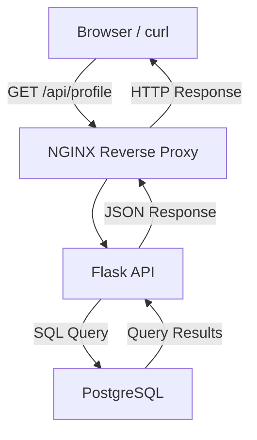
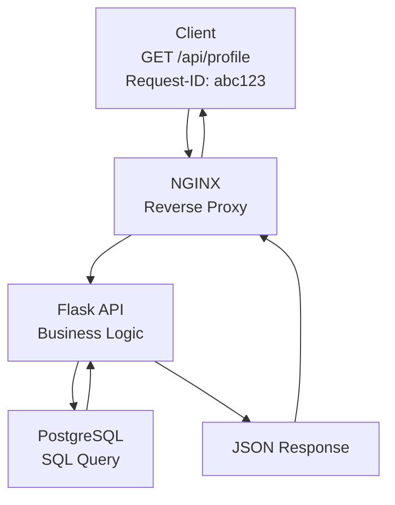

# Lab 01: Three-Tier Architecture

## Build

### 1. Component View

This view shows the major components I am about to build.

### 2. Request-Tracing View

### 3. Request Path

For a successful `GET /api/profile` request:

1. The client sends an HTTP request to the application.
2. NGINX accepts the request as the public entry point.
3. NGINX forwards the request to the Flask API.
4. Flask validates the request and runs the application logic.
5. Flask queries PostgreSQL for the required data.
6. PostgreSQL returns the query result to Flask.
7. Flask formats the result as JSON.
8. NGINX returns the HTTP response to the client.

## Prove

Write a short explanation for each layer:

**Browser or curl:**

The browser or curl acts as the client. It sends an HTTP request, such as `GET /api/profile`, to the application and displays the HTTP response, including the status code, headers, timing, and any JSON returned by the API.

**NGINX:**

NGINX acts as a reverse proxy. It accepts incoming client requests, forwards them to the Flask API, and returns the backend response to the client. NGINX also generates access logs, can forward request IDs, and provides a single public entry point to the application.

**Flask API:**

The Flask API contains the application's business logic. It receives requests from NGINX, validates authentication and authorization, processes the request, queries PostgreSQL for the required data, and returns a JSON response to the client.

**PostgreSQL:**

PostgreSQL is the application's durable data store. It stores user and application data, executes SQL queries from the Flask API, and returns the requested records. PostgreSQL is a backend service and is not directly accessible to clients.

## Break

Before building, predict symptoms:

**If NGINX cannot reach Flask:**

The user may receive a `502 Bad Gateway` response.

**What that means:**

This means NGINX accepted the client's request but could not obtain a valid response from its upstream Flask application. Possible causes include the Flask application being unavailable, listening on the wrong port, an incorrect upstream configuration, or a network connectivity issue.

**If Flask cannot reach PostgreSQL:**

The user will usually receive a `500 Internal Server Error` because Flask cannot complete the request after failing to communicate with the database.

**Possible alternate symptom:**

Depending on the application's error handling, some applications may instead return a `503 Service Unavailable` response.

**If PostgreSQL is slow:**

The user experiences slow page loads, delayed API responses, request timeouts, or possibly a `5xx` response if the application exceeds its configured timeout while waiting for the database.

**What that means:**

A `5xx` status code indicates that the server was unable to successfully complete the request.

**If request IDs are missing:**

Troubleshooting becomes significantly more difficult because it is no longer possible to correlate a single client request across NGINX logs, Flask application logs, and database-related logs.

**Why request IDs matter:**

Request IDs allow us to trace one request throughout the entire system.
