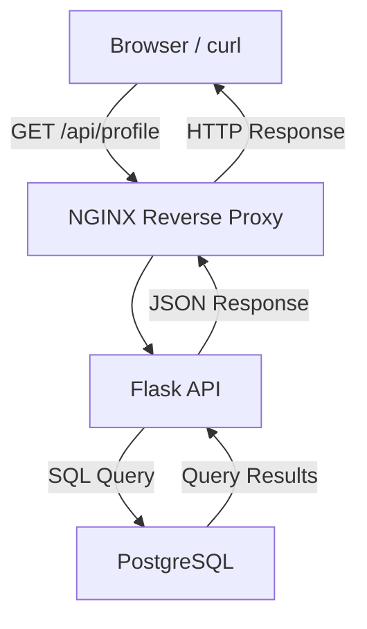
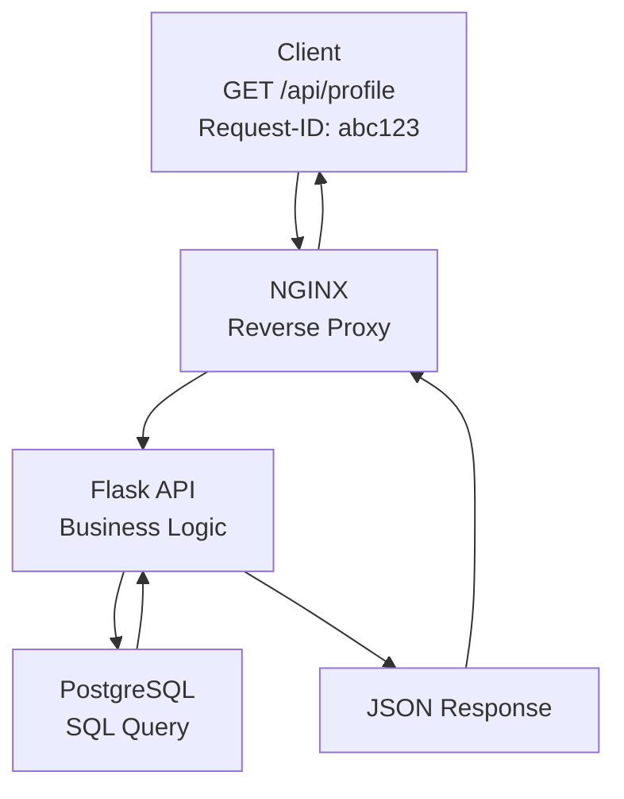

# Phase 2 Answers

This document records completed Phase 2 evidence, commands, conclusions, and retained takeaways.

## Completed Labs

| Lab | Topic |
| --- | --- |
| [Lab 01](#lab-01-three-tier-architecture) | Three-tier architecture |
| [Lab 02](#lab-02-nginx-reverse-proxy) | NGINX reverse proxy |
| [Lab 03](#lab-03-postgresql-persistence) | PostgreSQL persistence |
| [Lab 04](#lab-04-redis-cache-and-session-support) | Redis cache and session support |

## Lab 01: Three-Tier Architecture

### Build

#### 1. Component View

This view shows the major components built in this phase.



#### 2. Request-Tracing View



#### 3. Request Path

For a successful `GET /api/profile` request:

1. The client sends an HTTP request to the application.
2. NGINX accepts the request as the public entry point.
3. NGINX forwards the request to the Flask API.
4. Flask validates the request and runs the application logic.
5. Flask queries PostgreSQL for the required data.
6. PostgreSQL returns the query result to Flask.
7. Flask formats the result as JSON.
8. NGINX returns the HTTP response to the client.

### Explain Each Layer

**Browser or curl:** acts as the client. It sends an HTTP request, such as `GET /api/profile`, to the application and displays the HTTP response, including the status code, headers, timing, and any JSON returned by the API.

**NGINX:** acts as a reverse proxy. It accepts incoming client requests, forwards them to the Flask API, and returns the backend response to the client. NGINX also generates access logs, can forward request IDs, and provides a single public entry point to the application.

**Flask API:** contains the application's business logic. It receives requests from NGINX, validates authentication and authorization, processes the request, queries PostgreSQL for the required data, and returns a JSON response to the client.

**PostgreSQL:** is the application's durable data store. It stores user and application data, executes SQL queries from the Flask API, and returns the requested records. PostgreSQL is a backend service and is not directly accessible to clients.

### Break: Predicted Failure Symptoms

**If NGINX cannot reach Flask:**

The user may receive a `502 Bad Gateway` response.

**What that means:**

This means NGINX accepted the client's request but could not obtain a valid response from its upstream Flask application. Possible causes include the Flask application being unavailable, listening on the wrong port, an incorrect upstream configuration, or a network connectivity issue.

**If Flask cannot reach PostgreSQL:**

The user will usually receive a `500 Internal Server Error` because Flask cannot complete the request after failing to communicate with the database.

**Possible alternate symptom:**

Depending on the application's error handling, some applications may instead return a `503 Service Unavailable` response.

**If PostgreSQL is slow:**

The user experiences slow page loads, delayed API responses, request timeouts, or possibly a `5xx` response if the application exceeds its configured timeout while waiting for the database.

**What that means:**

A `5xx` status code indicates that the server was unable to successfully complete the request.

**If request IDs are missing:**

Troubleshooting becomes significantly more difficult because it is no longer possible to correlate a single client request across NGINX logs, Flask application logs, and database-related logs.

**Why request IDs matter:**

Request IDs allow us to trace one request throughout the entire system.

## Lab 02: NGINX Reverse Proxy

### Build

The goal of this lab was to put NGINX in front of the Flask app so the request path becomes:

```text
Browser or curl -> NGINX on port 8080 -> Flask on port 5000 -> response
```

This builds on Phase 1 by tracing one request with an added proxy layer before the application. It also turns the Lab 01 architecture from a diagram into a working request path: `Browser/curl -> NGINX -> Flask`.

#### Commands Used

```bash
brew install nginx
brew info nginx
vim /opt/homebrew/etc/nginx/nginx.conf
/opt/homebrew/opt/nginx/bin/nginx -t
brew services start nginx
brew services list
curl http://127.0.0.1:5000
curl -i --max-time 3 http://127.0.0.1:8080
lsof -nP -iTCP:8080 -sTCP:LISTEN
tail -f /opt/homebrew/var/log/nginx/access.log
tail -f /opt/homebrew/var/log/nginx/error.log
```

#### Important NGINX paths

**macOS Homebrew:**

```text
Main config: /opt/homebrew/etc/nginx/nginx.conf
Logs:        /opt/homebrew/var/log/nginx/
Access log:  /opt/homebrew/var/log/nginx/access.log
Error log:   /opt/homebrew/var/log/nginx/error.log
Web root:    /opt/homebrew/var/www/
Binary:      /opt/homebrew/opt/nginx/bin/nginx
```

**Ubuntu:**

```text
Main config:  /etc/nginx/nginx.conf
Site configs: /etc/nginx/sites-available/
Enabled site: /etc/nginx/sites-enabled/
```

**RHEL / CentOS / Fedora:**

```text
Main config: /etc/nginx/nginx.conf
App configs: /etc/nginx/conf.d/
```

The exact file locations change by operating system, but the purpose is the same: NGINX reads a config, listens on a port, receives client traffic, and forwards matching requests to an upstream service.

#### NGINX config

The Homebrew NGINX config was updated:

```bash
vim /opt/homebrew/etc/nginx/nginx.conf
```

The important server block is:

```nginx
server {
    listen 8080;
    server_name localhost;

    location / {
        proxy_pass http://127.0.0.1:5000;

        proxy_set_header Host $host;
        proxy_set_header X-Real-IP $remote_addr;
        proxy_set_header X-Forwarded-For $proxy_add_x_forwarded_for;
        proxy_set_header X-Forwarded-Proto $scheme;
        proxy_set_header X-Request-ID $request_id;
    }
}
```

#### What the config means

**`listen 8080`:** NGINX listens for browser or curl traffic on port `8080`.

**`server_name localhost`:** This server block handles local requests to `localhost`.

**`location /`:** This matches the app routes for this lab.

**`proxy_pass http://127.0.0.1:5000`:** NGINX forwards the request to Flask on port `5000`.

**`proxy_set_header Host $host`:** Preserves the original host header.

**`proxy_set_header X-Real-IP $remote_addr`:** Sends Flask the client IP address NGINX saw.

**`proxy_set_header X-Forwarded-For $proxy_add_x_forwarded_for`:** Keeps the chain of client/proxy IP addresses.

**`proxy_set_header X-Forwarded-Proto $scheme`:** Tells Flask whether the original request used `http` or `https`.

**`proxy_set_header X-Request-ID $request_id`:** Sends a request ID downstream so one request can be correlated across NGINX, Flask, and the client response.

These headers are customizable. The essence is that NGINX can forward the request and preserve useful context about the original client request.

#### NGINX functionality

NGINX is often used for more than one job:

- **Reverse proxy:** receives client traffic and forwards it to an upstream app.
- **SSL termination:** handles HTTPS/TLS at the edge before forwarding to the app.
- **Static web server:** serves files like HTML, CSS, JavaScript, and images.
- **Load balancer:** distributes traffic across multiple upstream app instances.
- **Ingress in Kubernetes:** routes external traffic into services inside a Kubernetes cluster.

In this lab, NGINX is used as a reverse proxy first. The other roles explain why NGINX commonly appears at the front of production systems.

### Proof

**Flask direct test:**

```bash
curl http://127.0.0.1:5000
```

This proved Flask was reachable directly on port `5000`.

**NGINX proxy test:**

```bash
curl -i --max-time 3 http://127.0.0.1:8080
curl -i --max-time 5 http://127.0.0.1:8080/health
```

Important response evidence:

```text
HTTP/1.1 200 OK
Server: nginx/1.31.3
Content-Type: application/json
X-Request-ID: 6e8c60f9fd7dc6e0903910c024ea0428
```

This proved the request reached NGINX first, then NGINX routed it to Flask.

**Response headers captured:**

```text
Server: nginx/1.31.3
Content-Type: application/json
Content-Length: 77
Connection: keep-alive
X-Request-ID: b407c79ce1620eefce609310ca7a5070
```

The `Server: nginx/1.31.3` header proves the client received the response through NGINX. The `X-Request-ID` header proves NGINX added a request identifier that can be used to correlate the client response with proxy and application logs.

**Service check:**

```bash
brew services list
```

Result:

```text
nginx started
```

**Port check:**

```bash
lsof -nP -iTCP:8080 -sTCP:LISTEN
```

Result:

```text
nginx TCP *:8080 (LISTEN)
```

**NGINX access log:**

```bash
tail -f /opt/homebrew/var/log/nginx/access.log
```

Example evidence:

```text
127.0.0.1 - - [30/Jul/2026:16:52:46 -0400] "GET / HTTP/1.1" 200 4141 "-" "curl/8.7.1"
```

This proves NGINX saw the request and returned a `200` response.

**NGINX error log:**

```bash
tail -f /opt/homebrew/var/log/nginx/error.log
```

This is where to check for config errors, startup problems, permission issues, or upstream failures when NGINX cannot reach Flask.

### Break

The broken-upstream test was completed by temporarily changing the upstream port in the NGINX config.

This line was changed:

```nginx
proxy_pass http://127.0.0.1:5000;
```

to this:

```nginx
proxy_pass http://127.0.0.1:5999;
```

The change belongs inside `proxy_pass` because that directive controls where NGINX forwards matching traffic after it receives the request. NGINX still listened on `8080`, but it tried to forward the request to port `5999` instead of the Flask app on `5000`.

Then reload NGINX:

```bash
/opt/homebrew/opt/nginx/bin/nginx -t
/opt/homebrew/opt/nginx/bin/nginx -s reload
```

Send the request through NGINX:

```bash
curl -i --max-time 5 http://127.0.0.1:8080/health
```

Client response:

```text
HTTP/1.1 502 Bad Gateway
Server: nginx/1.31.3
Content-Type: text/html
```

NGINX access log:

```text
127.0.0.1 - - [30/Jul/2026:17:19:25 -0400] "GET /health HTTP/1.1" 502 497 "-" "curl/8.7.1"
```

NGINX error log:

```text
connect() failed (61: Connection refused) while connecting to upstream, upstream: "http://127.0.0.1:5999/health"
```

Direct Flask test still worked:

```bash
curl -i --max-time 5 http://127.0.0.1:5000/health
```

Direct Flask response:

```text
HTTP/1.1 200 OK
Server: Werkzeug/3.1.8 Python/3.9.6
X-Request-ID: 0fd2efdc-7942-496f-a2bc-213a735a2942
```

This proved Flask itself was healthy. The failure happened because NGINX was pointed at the wrong upstream port.

After the test, restore the NGINX config back to:

```nginx
proxy_pass http://127.0.0.1:5000;
```

Then reload NGINX and confirm `http://127.0.0.1:8080/health` returned `200 OK` again.

### Key Takeaways

**NGINX became the front door:** Requests no longer need to go directly to Flask. They can go to NGINX on `8080`, and NGINX routes them to Flask on `5000`.

**The request path is now visible at the proxy layer:** The NGINX access log proves the request reached the proxy before Flask.

**Headers carry context:** `Host`, `X-Real-IP`, `X-Forwarded-For`, `X-Forwarded-Proto`, and `X-Request-ID` help Flask understand the original client request after it passes through NGINX.

**`proxy_set_header` controls what NGINX forwards downstream:** These lines add or preserve headers before NGINX sends the request to Flask. Keep `proxy_set_header X-Request-ID $request_id;` because it allows NGINX to generate a request ID. Remove the duplicate `proxy_set_header X-Request-ID $http_x_request_id;` because it only forwards a client-provided request ID and can be blank if the client did not send one.

**A reverse proxy gives production systems a control point:** NGINX can route traffic, serve static files, terminate SSL, load balance, and act as an ingress layer in Kubernetes.

**502 Bad Gateway means the proxy could not get a valid upstream response:** In this lab, the bad port made NGINX fail to connect to `127.0.0.1:5999`, so NGINX returned `502` even though Flask was still healthy on `5000`.

**An upstream is the backend service NGINX forwards traffic to:** In this lab, Flask on `127.0.0.1:5000` is the upstream. When `proxy_pass` changed to `127.0.0.1:5999`, NGINX could not connect to the upstream, so the request stopped at NGINX and headers were never forwarded to Flask.

**Request ID forwarding depends on reaching the upstream:** If the client sends `X-Request-ID`, `$http_x_request_id` can forward that client-provided value. If the client does not send one, it can be blank. In a broken-upstream failure, Flask receives neither value because NGINX cannot connect to Flask at all.

**Reverse proxy vs forward proxy:** A reverse proxy sits in front of servers and represents the server side to clients. A forward proxy sits in front of clients and represents the client side to servers.

## Lab 03: PostgreSQL Persistence


### Build

The goal of this lab is to add PostgreSQL as the durable data layer.

```text
Browser or curl -> NGINX -> Flask -> PostgreSQL
```

This builds on Lab 01 and Lab 02: NGINX routes the request to Flask, and Flask now writes to and reads from PostgreSQL instead of only returning hardcoded or in-memory data.

### What Is PostgreSQL

PostgreSQL is a relational database management system. It stores structured data in tables, rows, and columns, and SQL is the language used to inspect and change that data.

Why it matters here:

- **Durability:** data survives app restarts.
- **Source of truth:** PostgreSQL owns whether the row actually exists.
- **SQL evidence:** Query the database directly instead of only trusting app logs.
- **Production fit:** PostgreSQL supports transactions, constraints, indexes, and operational inspection.

This lab does not require deep DBA knowledge. The practical goal is to start PostgreSQL, connect with `psql`, create a simple schema, prove data was saved, and recognize what failure looks like when the app cannot reach the database.

### Why PostgreSQL

PostgreSQL fits the three-tier model:

```text
NGINX routes traffic.
Flask owns application logic.
PostgreSQL owns durable data.
```

Compared with memory, PostgreSQL keeps data after Flask restarts. Compared with Redis, PostgreSQL is the durable system of record; Redis can come later for caching or sessions.

### Commands Used

```bash
brew search postgresql
brew install postgresql
brew services start postgresql
brew services list
psql postgres
```

Inside `psql`:

```sql
SELECT version();
\l
\q
```

Create the app database:

```bash
createdb request_tracing_lab
psql request_tracing_lab
```

Create the table:

```sql
CREATE TABLE request_notes (
    id SERIAL PRIMARY KEY,
    message TEXT NOT NULL,
    created_at TIMESTAMPTZ DEFAULT NOW()
);
```

Insert and read a row manually:

```sql
INSERT INTO request_notes (message)
VALUES ('first postgres lab row');

SELECT * FROM request_notes;
```

### Table Meaning

**`request_notes`:** the simple table created for this lab.

**`id SERIAL PRIMARY KEY`:** gives each row a unique auto-incrementing ID.

**`message TEXT NOT NULL`:** stores the note text and requires a value.

**`created_at TIMESTAMPTZ DEFAULT NOW()`:** records when the row was created with timezone awareness.

The `/notes` route in Flask maps to this table. It is intentionally simple: it proves persistence, but it is not a full user-account notes feature yet.

### Essential SQL

```sql
\l
\dt
\d request_notes
SELECT * FROM request_notes;
SELECT id, message, created_at FROM request_notes ORDER BY id DESC;
```

**`\l`:** list databases.

**`\dt`:** list tables.

**`\d request_notes`:** describe the table schema.

**`SELECT`:** prove what rows actually exist in PostgreSQL.

### Proof

**Connection configuration:**

```text
DATABASE_URL=dbname=request_tracing_lab
```

Flask uses `DATABASE_URL` if it is set. Otherwise, it defaults to the local `request_tracing_lab` database.

**Schema:**

```sql
CREATE TABLE request_notes (
    id SERIAL PRIMARY KEY,
    message TEXT NOT NULL,
    created_at TIMESTAMPTZ DEFAULT NOW()
);
```

**Write through NGINX and Flask:**

```bash
curl -i --max-time 5 http://127.0.0.1:8080/notes \
  -H 'Content-Type: application/json' \
  -d '{"message":"postgres row through flask and nginx"}'
```

Response:

```text
HTTP/1.1 201 CREATED
Server: nginx/1.31.3
X-Request-ID: dd3548eaa98e3e8d7a83ab846f82b31a
```

**Read through NGINX and Flask:**

```bash
curl -i --max-time 5 http://127.0.0.1:8080/notes
```

Response:

```text
HTTP/1.1 200 OK
Server: nginx/1.31.3
X-Request-ID: cb4bd4d4906acf44db7db1a24b5d3972
```

**SQL evidence:**

```text
id | message                              | created_at
---+--------------------------------------+-------------------------------
3  | first postgres lab row from flask    | 2026-07-30 17:51:35.63169-04
2  | postgres row through flask and nginx | 2026-07-30 17:51:24.177706-04
1  | first postgres lab row               | 2026-07-30 17:33:42.778478-04
```

**Application log:**

```text
request_started request_id=dd3548eaa98e3e8d7a83ab846f82b31a method=POST path=/notes
database_write request_id=dd3548eaa98e3e8d7a83ab846f82b31a table=request_notes row_id=2
request_finished request_id=dd3548eaa98e3e8d7a83ab846f82b31a status=201
```

The proof chain is:

```text
curl through NGINX -> NGINX access log -> Flask log -> SQL SELECT from PostgreSQL
```

The SQL query is the strongest proof because it checks the database directly.

### Break

PostgreSQL was stopped while NGINX and Flask kept running:

```bash
brew services stop postgresql@18
```

Then send the same write request:

```bash
curl -i --max-time 5 http://127.0.0.1:8080/notes \
  -H 'Content-Type: application/json' \
  -d '{"message":"this should fail because postgres is stopped"}'
```

**What the user saw:**

```text
HTTP/1.1 503 SERVICE UNAVAILABLE
Server: nginx/1.31.3
X-Request-ID: fc36c1be66f5f018f435a45cb897dba5

{
  "error": "database unavailable",
  "request_id": "fc36c1be66f5f018f435a45cb897dba5"
}
```

**What Flask logged:**

```text
request_started request_id=fc36c1be66f5f018f435a45cb897dba5 method=POST path=/notes
database_error request_id=fc36c1be66f5f018f435a45cb897dba5 operation=create_note
psycopg.OperationalError: connection to server on socket "/tmp/.s.PGSQL.5432" failed: Connection refused
request_finished request_id=fc36c1be66f5f018f435a45cb897dba5 status=503
```

**NGINX access log:**

```text
127.0.0.1 - - [30/Jul/2026:17:52:55 -0400] "POST /notes HTTP/1.1" 503 90 "-" "curl/8.7.1"
```

**PostgreSQL state during failure:**

```text
postgresql@18 none
```

**SQL evidence after recovery:**

```sql
SELECT id, message, created_at
FROM request_notes
WHERE message = 'this should fail because postgres is stopped';
```

Result:

```text
0 rows
```

This proves the failed write was not saved.

### Failure Conclusion

**What did the user see?** `503 SERVICE UNAVAILABLE` with `database unavailable`.

**What did Flask log?** Flask logged `database_error` and `psycopg.OperationalError: Connection refused`.

**Did NGINX cause the failure?** No. NGINX routed the request to Flask. The failure happened after Flask tried to connect to PostgreSQL.

**What proves PostgreSQL failed?** PostgreSQL was stopped, Flask logged a PostgreSQL connection error, and the failed row did not appear in SQL after recovery.

### Key Takeaways

**PostgreSQL is the durable source of truth:** Data written to PostgreSQL survives outside the Flask process.

**Application logs are not enough:** A Flask log can prove a request ran, but SQL proves whether the row was actually saved.

**A database failure is different from an NGINX failure:** NGINX can route successfully while Flask fails because PostgreSQL is unavailable.

**The `/notes` route is a persistence test:** It is a simple write/read API for proving Flask can use PostgreSQL. A real authenticated notes feature can come later if the project needs it.

**At this stage, operational fluency is enough:** Know how to start PostgreSQL, connect with `psql`, create a table, insert a row, read it back, break the database dependency, and explain the evidence.

## Lab 04: Redis Cache And Session Support


### Build

The goal of this lab is to add Redis as temporary support state.

```text
Browser or curl -> NGINX -> Flask -> Redis cache
                              |
                              -> PostgreSQL on cache miss
```

This lab uses one Redis responsibility:

```text
Cache the GET /notes response.
```

PostgreSQL remains the durable source of truth. Redis stores a temporary copy of the latest notes response so repeated reads can be served faster.

### What Is Redis

Redis is an in-memory key/value store. It is commonly used for fast temporary data such as cache entries, sessions, counters, locks, and queue-related state.

For this lab, Redis is a cache. It is not the system of record. If Redis loses the cached value, Flask can still read from PostgreSQL and rebuild the cache.

### Redis Core vs Redis Stack Modules

For Lab 04, you only need Redis core:

```text
SET
GET
EXPIRE
TTL
DEL
```

Redis Stack modules are optional extensions for specialized features such as search, JSON documents, bloom filters, and time-series data. They are not needed for this cache lab.

### Commands Used

Start and verify Redis:

```bash
brew search redis
brew install redis
brew services start redis
brew services list
redis-cli ping
```

Connection evidence:

```text
PONG
```

Manual Redis basics:

```redis
SET lab:test "hello redis"
GET lab:test
TTL lab:test
EXPIRE lab:test 30
TTL lab:test
DEL lab:test
GET lab:test
```

Evidence:

```text
SET lab:test "hello redis" -> OK
GET lab:test -> "hello redis"
TTL lab:test -> -1
EXPIRE lab:test 30 -> 1
TTL lab:test -> 30
DEL lab:test -> 1
GET lab:test -> nil
```

`TTL -1` means the key exists but has no expiration. After `EXPIRE`, Redis shows a countdown. `nil` means the key no longer exists.

### Runtime Configuration

Flask connects to Redis through runtime configuration:

```text
REDIS_URL=redis://127.0.0.1:6379/0
NOTES_CACHE_KEY=notes:latest
NOTES_CACHE_TTL_SECONDS=30
```

Local Redis runs on `127.0.0.1:6379`. In AWS, the same idea would point to an ElastiCache endpoint. In containers later, it may point to a service name such as `redis:6379`.

### Cache Behavior

The `GET /notes` path now works like this:

```text
1. Check Redis for notes:latest.
2. If the key exists, return cache: hit.
3. If the key is missing, read PostgreSQL, store the result in Redis, return cache: miss.
4. If Redis is unavailable, read PostgreSQL anyway, return cache: unavailable.
```

The `POST /notes` path writes to PostgreSQL and deletes `notes:latest` from Redis so the next read refreshes the cache.

### Proof

**Clear the cache:**

```bash
redis-cli DEL notes:latest
```

**Cache miss:**

```bash
curl -i http://127.0.0.1:8080/notes
```

Expected evidence:

```text
HTTP/1.1 200 OK
"cache": "miss"
```

Flask log evidence:

```text
cache_miss request_id=<id> key=notes:latest
database_read request_id=<id> table=request_notes rows=3
cache_store request_id=<id> key=notes:latest ttl_seconds=30 rows=3
```

**Cache hit:**

```bash
curl -i http://127.0.0.1:8080/notes
```

Expected evidence:

```text
HTTP/1.1 200 OK
"cache": "hit"
```

Flask log evidence:

```text
cache_hit request_id=<id> key=notes:latest rows=3
```

**TTL evidence:**

```bash
redis-cli TTL notes:latest
```

Observed evidence:

```text
18
```

This proves Redis stored the cached notes with an expiration.

### Break

Redis-unavailable behavior was tested by pointing Flask at the wrong Redis port:

```bash
REDIS_URL=redis://127.0.0.1:6390/0
```

Observed result:

```text
status 200
cache unavailable
rows 3
```

Flask log evidence:

```text
cache_error request_id=<id> key=notes:latest
redis.exceptions.ConnectionError: Error 61 connecting to 127.0.0.1:6390. Connection refused.
database_read request_id=<id> table=request_notes rows=3
request_finished request_id=<id> status=200
```

### Failure Conclusion

**What did the user see?** The user still received `200 OK` with notes.

**Did the app fail closed, fail open, or fall back?** The app fell back to PostgreSQL.

**Did PostgreSQL still work?** Yes. PostgreSQL returned the notes when Redis was unavailable.

**What proved Redis was the failed dependency?** Flask logged a Redis connection error to `127.0.0.1:6390`.

**What was the impact?** Redis failure disabled cache behavior, but it did not block the whole request.

### Evidence Checklist

**Redis responsibility:** Cache the `GET /notes` response using the `notes:latest` key.

**Connection configuration:** `REDIS_URL=redis://127.0.0.1:6379/0`, `NOTES_CACHE_KEY=notes:latest`, and `NOTES_CACHE_TTL_SECONDS=30`.

**Cache miss evidence:** After `redis-cli DEL notes:latest`, the next `GET /notes` returned `"cache": "miss"` and Flask logged `cache_miss`, `database_read`, and `cache_store`.

**Cache hit evidence:** The following `GET /notes` returned `"cache": "hit"` and Flask logged `cache_hit`.

**Expiry evidence:** `redis-cli TTL notes:latest` returned a countdown value, which proved the cache key had an expiration.

**Fallback behavior:** When Flask pointed to the wrong Redis port, the request still returned `200 OK` by reading from PostgreSQL.

**Failure symptom:** Flask logged a Redis connection error to the bad Redis port, but the client still received notes.

**Cache vs queue explanation:** In this lab, Redis is a cache inside the synchronous request path. A queue or worker was not implemented yet. The only queue/worker takeaway is the boundary: queue/worker Redis belongs later when asynchronous processing is built in Lab 09.

**Interview explanation:** Redis is fast temporary state. For this endpoint, Redis improves repeated reads, but PostgreSQL remains the durable source of truth. A cache miss or Redis outage should not erase data, and the app should fall back to PostgreSQL when that is safe.

**Retained takeaway:** Cache failure should degrade the experience instead of destroying the request when the database can still serve the source-of-truth data.

### Cache vs Queue

This lab uses Redis as cache, not as a queue.

```text
Cache: helps a synchronous request read faster.
Queue: stores work for a worker to process later.
Worker: runs outside the request/response path.
```

Async does not automatically mean real-time. Async means work can happen after the user request returns. Real-time means users receive live or near-live updates.

### Cloud Connection

**AWS:** Redis maps to Amazon ElastiCache for Redis or Valkey. PostgreSQL maps to Amazon RDS PostgreSQL.

**Cloudflare:** Cloudflare can cache at the edge, terminate TLS, and proxy traffic before it reaches the app. Redis is different because it is an application-side cache that Flask controls directly.

### Key Takeaways

**Redis is fast temporary state:** It is useful for cache/session behavior, but it is not the durable source of truth.

**PostgreSQL remains source of truth:** SQL still proves what data actually exists.

**Cache miss reads PostgreSQL:** Redis being empty should not break the request.

**Cache hit reads Redis:** Repeated reads can avoid hitting PostgreSQL for a short time.

**Redis failure should degrade gracefully:** For this endpoint, Redis unavailable means slower reads, not a failed user request.

**Cache/session Redis belongs in Phase 2:** Queue/worker Redis is only a boundary preview here. It was not built yet; it belongs later when the architecture adds asynchronous processing in Lab 09.
