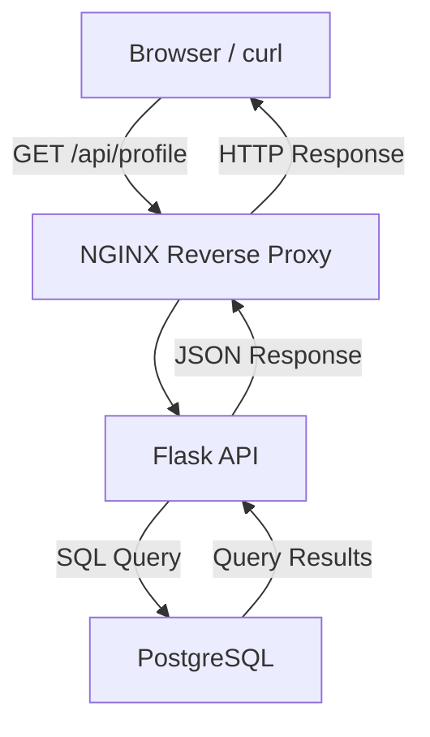
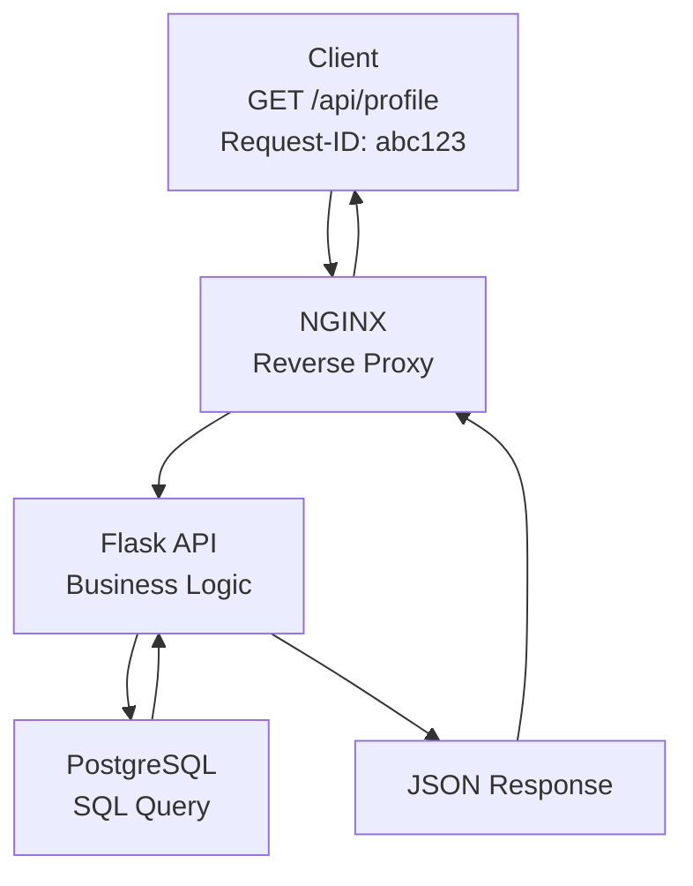

# Phase 2 Answers

This document records completed Phase 2 evidence, commands, conclusions, and retained takeaways.

`phases/phase-02-tracing-service-boundaries/LABS.md` is the exercise specification. This file is its execution companion. Lab numbers, requirement numbers, evidence sections, and troubleshooting sections intentionally map to the canonical Phase 2 labs so the two files can be followed side-by-side.

## Completed Labs

| Lab | Topic |
| --- | --- |
| [Lab 01](#lab-01-starting-request-path-architecture) | Starting request path architecture |
| [Lab 02](#lab-02-nginx-reverse-proxy) | NGINX reverse proxy |
| [Lab 03](#lab-03-postgresql-persistence) | PostgreSQL persistence |
| [Lab 04](#lab-04-redis-cache-and-session-support) | Redis cache and session support |
| [Lab 05](#lab-05-support-ticket-data-model) | Support-ticket data model |
| [Lab 06](#lab-06-database-operations-performance-and-resilience) | Database operations, performance, and resilience |
| [Lab 07](#lab-07-api-design-and-authentication) | API design and authentication |
| [Lab 08](#lab-08-webhooks-and-asynchronous-delivery) | Webhooks and asynchronous delivery |
| [Lab 09](#lab-09-workers-and-queues) | Workers and queues |
| [Lab 10](#lab-10-websockets-and-real-time-updates) | WebSockets and real-time updates |
| [Lab 11](#lab-11-health-and-readiness) | Health and readiness |
| [Lab 12](#lab-12-logs-metrics-traces-and-request-ids) | Logs, metrics, traces, and request IDs |
| [Lab 13](#lab-13-container-foundation) | Container foundation |
| [Lab 14](#lab-14-phase-2-architecture-and-operations-review) | Phase 2 architecture and operations review |

## Lab 01: Starting Request Path Architecture

### Build

#### 1. Component View

This view shows the major components built in this phase.



#### 2. Request-Tracing View



#### 3. Request Path

For a successful `GET /api/profile` request:

1. The client sends an HTTP request to the application.
2. NGINX accepts the request as the public entry point.
3. NGINX forwards the request to the Flask API.
4. Flask validates the request and runs the application logic.
5. Flask queries PostgreSQL for the required data.
6. PostgreSQL returns the query result to Flask.
7. Flask formats the result as JSON.
8. NGINX returns the HTTP response to the client.

### Explain Each Layer

**Browser or curl:** acts as the client. It sends an HTTP request, such as `GET /api/profile`, to the application and displays the HTTP response, including the status code, headers, timing, and any JSON returned by the API.

**NGINX:** acts as a reverse proxy. It accepts incoming client requests, forwards them to the Flask API, and returns the backend response to the client. NGINX also generates access logs, can forward request IDs, and provides a single public entry point to the application.

**Flask API:** contains the application's business logic. It receives requests from NGINX, validates authentication and authorization, processes the request, queries PostgreSQL for the required data, and returns a JSON response to the client.

**PostgreSQL:** is the application's durable data store. It stores user and application data, executes SQL queries from the Flask API, and returns the requested records. PostgreSQL is a backend service and is not directly accessible to clients.

### Break: Predicted Failure Symptoms

**If NGINX cannot reach Flask:**

The user may receive a `502 Bad Gateway` response.

**What that means:**

This means NGINX accepted the client's request but could not obtain a valid response from its upstream Flask application. Possible causes include the Flask application being unavailable, listening on the wrong port, an incorrect upstream configuration, or a network connectivity issue.

**If Flask cannot reach PostgreSQL:**

The user will usually receive a `500 Internal Server Error` because Flask cannot complete the request after failing to communicate with the database.

**Possible alternate symptom:**

Depending on the application's error handling, some applications may instead return a `503 Service Unavailable` response.

**If PostgreSQL is slow:**

The user experiences slow page loads, delayed API responses, request timeouts, or possibly a `5xx` response if the application exceeds its configured timeout while waiting for the database.

**What that means:**

A `5xx` status code indicates that the server was unable to successfully complete the request.

**If request IDs are missing:**

Troubleshooting becomes significantly more difficult because it is no longer possible to correlate a single client request across NGINX logs, Flask application logs, and database-related logs.

**Why request IDs matter:**

Request IDs allow us to trace one request throughout the entire system.

## Lab 02: NGINX Reverse Proxy

### Build

The goal of this lab was to put NGINX in front of the Flask app so the request path becomes:

```text
Browser or curl -> NGINX on port 8080 -> Flask on port 5000 -> response
```

This builds on Phase 1 by tracing one request with an added proxy layer before the application. It also turns the Lab 01 architecture from a diagram into a working request path: `Browser/curl -> NGINX -> Flask`.

#### Commands Used

```bash
brew install nginx
brew info nginx
vim /opt/homebrew/etc/nginx/nginx.conf
/opt/homebrew/opt/nginx/bin/nginx -t
brew services start nginx
brew services list
curl http://127.0.0.1:5000
curl -i --max-time 3 http://127.0.0.1:8080
lsof -nP -iTCP:8080 -sTCP:LISTEN
tail -f /opt/homebrew/var/log/nginx/access.log
tail -f /opt/homebrew/var/log/nginx/error.log
```

#### Important NGINX paths

**macOS Homebrew:**

```text
Main config: /opt/homebrew/etc/nginx/nginx.conf
Logs:        /opt/homebrew/var/log/nginx/
Access log:  /opt/homebrew/var/log/nginx/access.log
Error log:   /opt/homebrew/var/log/nginx/error.log
Web root:    /opt/homebrew/var/www/
Binary:      /opt/homebrew/opt/nginx/bin/nginx
```

**Ubuntu:**

```text
Main config:  /etc/nginx/nginx.conf
Site configs: /etc/nginx/sites-available/
Enabled site: /etc/nginx/sites-enabled/
```

**RHEL / CentOS / Fedora:**

```text
Main config: /etc/nginx/nginx.conf
App configs: /etc/nginx/conf.d/
```

The exact file locations change by operating system, but the purpose is the same: NGINX reads a config, listens on a port, receives client traffic, and forwards matching requests to an upstream service.

#### NGINX config

The Homebrew NGINX config was updated:

```bash
vim /opt/homebrew/etc/nginx/nginx.conf
```

The important server block is:

```nginx
server {
    listen 8080;
    server_name localhost;

    location / {
        proxy_pass http://127.0.0.1:5000;

        proxy_set_header Host $host;
        proxy_set_header X-Real-IP $remote_addr;
        proxy_set_header X-Forwarded-For $proxy_add_x_forwarded_for;
        proxy_set_header X-Forwarded-Proto $scheme;
        proxy_set_header X-Request-ID $request_id;
    }
}
```

#### What the config means

**`listen 8080`:** NGINX listens for browser or curl traffic on port `8080`.

**`server_name localhost`:** This server block handles local requests to `localhost`.

**`location /`:** This matches the app routes for this lab.

**`proxy_pass http://127.0.0.1:5000`:** NGINX forwards the request to Flask on port `5000`.

**`proxy_set_header Host $host`:** Preserves the original host header.

**`proxy_set_header X-Real-IP $remote_addr`:** Sends Flask the client IP address NGINX saw.

**`proxy_set_header X-Forwarded-For $proxy_add_x_forwarded_for`:** Keeps the chain of client/proxy IP addresses.

**`proxy_set_header X-Forwarded-Proto $scheme`:** Tells Flask whether the original request used `http` or `https`.

**`proxy_set_header X-Request-ID $request_id`:** Sends a request ID downstream so one request can be correlated across NGINX, Flask, and the client response.

These headers are customizable. The essence is that NGINX can forward the request and preserve useful context about the original client request.

#### NGINX functionality

NGINX is often used for more than one job:

- **Reverse proxy:** receives client traffic and forwards it to an upstream app.
- **SSL termination:** handles HTTPS/TLS at the edge before forwarding to the app.
- **Static web server:** serves files like HTML, CSS, JavaScript, and images.
- **Load balancer:** distributes traffic across multiple upstream app instances.
- **Ingress in Kubernetes:** routes external traffic into services inside a Kubernetes cluster.

In this lab, NGINX is used as a reverse proxy first. The other roles explain why NGINX commonly appears at the front of production systems.

### Proof

**Flask direct test:**

```bash
curl http://127.0.0.1:5000
```

This proved Flask was reachable directly on port `5000`.

**NGINX proxy test:**

```bash
curl -i --max-time 3 http://127.0.0.1:8080
curl -i --max-time 5 http://127.0.0.1:8080/health
```

Important response evidence:

```text
HTTP/1.1 200 OK
Server: nginx/1.31.3
Content-Type: application/json
X-Request-ID: 6e8c60f9fd7dc6e0903910c024ea0428
```

This proved the request reached NGINX first, then NGINX routed it to Flask.

**Response headers captured:**

```text
Server: nginx/1.31.3
Content-Type: application/json
Content-Length: 77
Connection: keep-alive
X-Request-ID: b407c79ce1620eefce609310ca7a5070
```

The `Server: nginx/1.31.3` header proves the client received the response through NGINX. The `X-Request-ID` header proves NGINX added a request identifier that can be used to correlate the client response with proxy and application logs.

**Service check:**

```bash
brew services list
```

Result:

```text
nginx started
```

**Port check:**

```bash
lsof -nP -iTCP:8080 -sTCP:LISTEN
```

Result:

```text
nginx TCP *:8080 (LISTEN)
```

**NGINX access log:**

```bash
tail -f /opt/homebrew/var/log/nginx/access.log
```

Example evidence:

```text
127.0.0.1 - - [30/Jul/2026:16:52:46 -0400] "GET / HTTP/1.1" 200 4141 "-" "curl/8.7.1"
```

This proves NGINX saw the request and returned a `200` response.

**NGINX error log:**

```bash
tail -f /opt/homebrew/var/log/nginx/error.log
```

This is where to check for config errors, startup problems, permission issues, or upstream failures when NGINX cannot reach Flask.

### Break

The broken-upstream test was completed by temporarily changing the upstream port in the NGINX config.

This line was changed:

```nginx
proxy_pass http://127.0.0.1:5000;
```

to this:

```nginx
proxy_pass http://127.0.0.1:5999;
```

The change belongs inside `proxy_pass` because that directive controls where NGINX forwards matching traffic after it receives the request. NGINX still listened on `8080`, but it tried to forward the request to port `5999` instead of the Flask app on `5000`.

Then reload NGINX:

```bash
/opt/homebrew/opt/nginx/bin/nginx -t
/opt/homebrew/opt/nginx/bin/nginx -s reload
```

Send the request through NGINX:

```bash
curl -i --max-time 5 http://127.0.0.1:8080/health
```

Client response:

```text
HTTP/1.1 502 Bad Gateway
Server: nginx/1.31.3
Content-Type: text/html
```

NGINX access log:

```text
127.0.0.1 - - [30/Jul/2026:17:19:25 -0400] "GET /health HTTP/1.1" 502 497 "-" "curl/8.7.1"
```

NGINX error log:

```text
connect() failed (61: Connection refused) while connecting to upstream, upstream: "http://127.0.0.1:5999/health"
```

Direct Flask test still worked:

```bash
curl -i --max-time 5 http://127.0.0.1:5000/health
```

Direct Flask response:

```text
HTTP/1.1 200 OK
Server: Werkzeug/3.1.8 Python/3.9.6
X-Request-ID: 0fd2efdc-7942-496f-a2bc-213a735a2942
```

This proved Flask itself was healthy. The failure happened because NGINX was pointed at the wrong upstream port.

After the test, restore the NGINX config back to:

```nginx
proxy_pass http://127.0.0.1:5000;
```

Then reload NGINX and confirm `http://127.0.0.1:8080/health` returned `200 OK` again.

### Key Takeaways

**NGINX became the front door:** Requests no longer need to go directly to Flask. They can go to NGINX on `8080`, and NGINX routes them to Flask on `5000`.

**The request path is now visible at the proxy layer:** The NGINX access log proves the request reached the proxy before Flask.

**Headers carry context:** `Host`, `X-Real-IP`, `X-Forwarded-For`, `X-Forwarded-Proto`, and `X-Request-ID` help Flask understand the original client request after it passes through NGINX.

**`proxy_set_header` controls what NGINX forwards downstream:** These lines add or preserve headers before NGINX sends the request to Flask. Keep `proxy_set_header X-Request-ID $request_id;` because it allows NGINX to generate a request ID. Remove the duplicate `proxy_set_header X-Request-ID $http_x_request_id;` because it only forwards a client-provided request ID and can be blank if the client did not send one.

**A reverse proxy gives production systems a control point:** NGINX can route traffic, serve static files, terminate SSL, load balance, and act as an ingress layer in Kubernetes.

**502 Bad Gateway means the proxy could not get a valid upstream response:** In this lab, the bad port made NGINX fail to connect to `127.0.0.1:5999`, so NGINX returned `502` even though Flask was still healthy on `5000`.

**An upstream is the backend service NGINX forwards traffic to:** In this lab, Flask on `127.0.0.1:5000` is the upstream. When `proxy_pass` changed to `127.0.0.1:5999`, NGINX could not connect to the upstream, so the request stopped at NGINX and headers were never forwarded to Flask.

**Request ID forwarding depends on reaching the upstream:** If the client sends `X-Request-ID`, `$http_x_request_id` can forward that client-provided value. If the client does not send one, it can be blank. In a broken-upstream failure, Flask receives neither value because NGINX cannot connect to Flask at all.

**Reverse proxy vs forward proxy:** A reverse proxy sits in front of servers and represents the server side to clients. A forward proxy sits in front of clients and represents the client side to servers.

## Lab 03: PostgreSQL Persistence


### Build

The goal of this lab is to add PostgreSQL as the durable data layer.

```text
Browser or curl -> NGINX -> Flask -> PostgreSQL
```

This builds on Lab 01 and Lab 02: NGINX routes the request to Flask, and Flask now writes to and reads from PostgreSQL instead of only returning hardcoded or in-memory data.

### What Is PostgreSQL

PostgreSQL is a relational database management system. It stores structured data in tables, rows, and columns, and SQL is the language used to inspect and change that data.

Why it matters here:

- **Durability:** data survives app restarts.
- **Source of truth:** PostgreSQL owns whether the row actually exists.
- **SQL evidence:** Query the database directly instead of only trusting app logs.
- **Production fit:** PostgreSQL supports transactions, constraints, indexes, and operational inspection.

This lab does not require deep DBA knowledge. The practical goal is to start PostgreSQL, connect with `psql`, create a simple schema, prove data was saved, and recognize what failure looks like when the app cannot reach the database.

### Why PostgreSQL

PostgreSQL fits the starting service-boundary model:

```text
NGINX routes traffic.
Flask owns application logic.
PostgreSQL owns durable data.
```

Compared with memory, PostgreSQL keeps data after Flask restarts. Compared with Redis, PostgreSQL is the durable system of record; Redis can come later for caching or sessions.

### Commands Used

```bash
brew search postgresql
brew install postgresql
brew services start postgresql
brew services list
psql postgres
```

Inside `psql`:

```sql
SELECT version();
\l
\q
```

Create the app database:

```bash
createdb request_tracing_lab
psql request_tracing_lab
```

Create the table:

```sql
CREATE TABLE request_notes (
    id SERIAL PRIMARY KEY,
    message TEXT NOT NULL,
    created_at TIMESTAMPTZ DEFAULT NOW()
);
```

Insert and read a row manually:

```sql
INSERT INTO request_notes (message)
VALUES ('first postgres lab row');

SELECT * FROM request_notes;
```

### Table Meaning

**`request_notes`:** the simple table created for this lab.

**`id SERIAL PRIMARY KEY`:** gives each row a unique auto-incrementing ID.

**`message TEXT NOT NULL`:** stores the note text and requires a value.

**`created_at TIMESTAMPTZ DEFAULT NOW()`:** records when the row was created with timezone awareness.

The `/notes` route in Flask maps to this table. It is intentionally simple: it proves persistence, but it is not a full user-account notes feature yet.

### Essential SQL

```sql
\l
\dt
\d request_notes
SELECT * FROM request_notes;
SELECT id, message, created_at FROM request_notes ORDER BY id DESC;
```

**`\l`:** list databases.

**`\dt`:** list tables.

**`\d request_notes`:** describe the table schema.

**`SELECT`:** prove what rows actually exist in PostgreSQL.

### Proof

**Connection configuration:**

```text
DATABASE_URL=dbname=request_tracing_lab
```

Flask uses `DATABASE_URL` if it is set. Otherwise, it defaults to the local `request_tracing_lab` database.

**Schema:**

```sql
CREATE TABLE request_notes (
    id SERIAL PRIMARY KEY,
    message TEXT NOT NULL,
    created_at TIMESTAMPTZ DEFAULT NOW()
);
```

**Write through NGINX and Flask:**

```bash
curl -i --max-time 5 http://127.0.0.1:8080/notes \
  -H 'Content-Type: application/json' \
  -d '{"message":"postgres row through flask and nginx"}'
```

Response:

```text
HTTP/1.1 201 CREATED
Server: nginx/1.31.3
X-Request-ID: dd3548eaa98e3e8d7a83ab846f82b31a
```

**Read through NGINX and Flask:**

```bash
curl -i --max-time 5 http://127.0.0.1:8080/notes
```

Response:

```text
HTTP/1.1 200 OK
Server: nginx/1.31.3
X-Request-ID: cb4bd4d4906acf44db7db1a24b5d3972
```

**SQL evidence:**

```text
id | message                              | created_at
---+--------------------------------------+-------------------------------
3  | first postgres lab row from flask    | 2026-07-30 17:51:35.63169-04
2  | postgres row through flask and nginx | 2026-07-30 17:51:24.177706-04
1  | first postgres lab row               | 2026-07-30 17:33:42.778478-04
```

**Application log:**

```text
request_started request_id=dd3548eaa98e3e8d7a83ab846f82b31a method=POST path=/notes
database_write request_id=dd3548eaa98e3e8d7a83ab846f82b31a table=request_notes row_id=2
request_finished request_id=dd3548eaa98e3e8d7a83ab846f82b31a status=201
```

The proof chain is:

```text
curl through NGINX -> NGINX access log -> Flask log -> SQL SELECT from PostgreSQL
```

The SQL query is the strongest proof because it checks the database directly.

### Break

PostgreSQL was stopped while NGINX and Flask kept running:

```bash
brew services stop postgresql@18
```

Then send the same write request:

```bash
curl -i --max-time 5 http://127.0.0.1:8080/notes \
  -H 'Content-Type: application/json' \
  -d '{"message":"this should fail because postgres is stopped"}'
```

**What the user saw:**

```text
HTTP/1.1 503 SERVICE UNAVAILABLE
Server: nginx/1.31.3
X-Request-ID: fc36c1be66f5f018f435a45cb897dba5

{
  "error": "database unavailable",
  "request_id": "fc36c1be66f5f018f435a45cb897dba5"
}
```

**What Flask logged:**

```text
request_started request_id=fc36c1be66f5f018f435a45cb897dba5 method=POST path=/notes
database_error request_id=fc36c1be66f5f018f435a45cb897dba5 operation=create_note
psycopg.OperationalError: connection to server on socket "/tmp/.s.PGSQL.5432" failed: Connection refused
request_finished request_id=fc36c1be66f5f018f435a45cb897dba5 status=503
```

**NGINX access log:**

```text
127.0.0.1 - - [30/Jul/2026:17:52:55 -0400] "POST /notes HTTP/1.1" 503 90 "-" "curl/8.7.1"
```

**PostgreSQL state during failure:**

```text
postgresql@18 none
```

**SQL evidence after recovery:**

```sql
SELECT id, message, created_at
FROM request_notes
WHERE message = 'this should fail because postgres is stopped';
```

Result:

```text
0 rows
```

This proves the failed write was not saved.

### Failure Conclusion

**What did the user see?** `503 SERVICE UNAVAILABLE` with `database unavailable`.

**What did Flask log?** Flask logged `database_error` and `psycopg.OperationalError: Connection refused`.

**Did NGINX cause the failure?** No. NGINX routed the request to Flask. The failure happened after Flask tried to connect to PostgreSQL.

**What proves PostgreSQL failed?** PostgreSQL was stopped, Flask logged a PostgreSQL connection error, and the failed row did not appear in SQL after recovery.

### Key Takeaways

**PostgreSQL is the durable source of truth:** Data written to PostgreSQL survives outside the Flask process.

**Application logs are not enough:** A Flask log can prove a request ran, but SQL proves whether the row was actually saved.

**A database failure is different from an NGINX failure:** NGINX can route successfully while Flask fails because PostgreSQL is unavailable.

**The `/notes` route is a persistence test:** It is a simple write/read API for proving Flask can use PostgreSQL. A real authenticated notes feature can come later if the project needs it.

**At this stage, operational fluency is enough:** Know how to start PostgreSQL, connect with `psql`, create a table, insert a row, read it back, break the database dependency, and explain the evidence.

## Lab 04: Redis Cache And Session Support


### Build

The goal of this lab is to add Redis as temporary support state.

```text
Browser or curl -> NGINX -> Flask -> Redis cache
                              |
                              -> PostgreSQL on cache miss
```

This lab uses one Redis responsibility:

```text
Cache the GET /notes response.
```

PostgreSQL remains the durable source of truth. Redis stores a temporary copy of the latest notes response so repeated reads can be served faster.

### What Is Redis

Redis is an in-memory key/value store. It is commonly used for fast temporary data such as cache entries, sessions, counters, locks, and queue-related state.

For this lab, Redis is a cache. It is not the system of record. If Redis loses the cached value, Flask can still read from PostgreSQL and rebuild the cache.

### Redis Core vs Redis Stack Modules

For Lab 04, you only need Redis core:

```text
SET
GET
EXPIRE
TTL
DEL
```

Redis Stack modules are optional extensions for specialized features such as search, JSON documents, bloom filters, and time-series data. They are not needed for this cache lab.

### Commands Used

Start and verify Redis:

```bash
brew search redis
brew install redis
brew services start redis
brew services list
redis-cli ping
```

Connection evidence:

```text
PONG
```

Manual Redis basics:

```redis
SET lab:test "hello redis"
GET lab:test
TTL lab:test
EXPIRE lab:test 30
TTL lab:test
DEL lab:test
GET lab:test
```

Evidence:

```text
SET lab:test "hello redis" -> OK
GET lab:test -> "hello redis"
TTL lab:test -> -1
EXPIRE lab:test 30 -> 1
TTL lab:test -> 30
DEL lab:test -> 1
GET lab:test -> nil
```

`TTL -1` means the key exists but has no expiration. After `EXPIRE`, Redis shows a countdown. `nil` means the key no longer exists.

### Runtime Configuration

Flask connects to Redis through runtime configuration:

```text
REDIS_URL=redis://127.0.0.1:6379/0
NOTES_CACHE_KEY=notes:latest
NOTES_CACHE_TTL_SECONDS=30
```

Local Redis runs on `127.0.0.1:6379`. In AWS, the same idea would point to an ElastiCache endpoint. In containers later, it may point to a service name such as `redis:6379`.

### Cache Behavior

The `GET /notes` path now works like this:

```text
1. Check Redis for notes:latest.
2. If the key exists, return cache: hit.
3. If the key is missing, read PostgreSQL, store the result in Redis, return cache: miss.
4. If Redis is unavailable, read PostgreSQL anyway, return cache: unavailable.
```

The `POST /notes` path writes to PostgreSQL and deletes `notes:latest` from Redis so the next read refreshes the cache.

### Proof

**Redis connection evidence:**

```bash
redis-cli ping
```

Captured result:

```text
PONG
```

This proves the Redis server accepted a client connection on `127.0.0.1:6379`.

**Connection configuration:**

```text
REDIS_URL=redis://127.0.0.1:6379/0
NOTES_CACHE_KEY=notes:latest
NOTES_CACHE_TTL_SECONDS=30
```

This tells Flask where Redis is, which key stores the cached notes response, and how long the cache entry should live.

**Cache miss evidence:**

```bash
redis-cli DEL notes:latest
curl -s -i --max-time 5 http://127.0.0.1:8080/notes
```

Captured response evidence:

```text
HTTP/1.1 200 OK
X-Request-ID: 757a81ebffa29d9f58e636f6ab37f377
"cache": "miss"
"request_id": "757a81ebffa29d9f58e636f6ab37f377"
```

This proves Redis was empty for `notes:latest`, so Flask read from PostgreSQL and returned the notes through NGINX.

**Cache hit evidence:**

```bash
curl -s -i --max-time 5 http://127.0.0.1:8080/notes
```

Captured response evidence:

```text
HTTP/1.1 200 OK
X-Request-ID: b12b5df54c43b8b9f41efe6874c20141
"cache": "hit"
"request_id": "b12b5df54c43b8b9f41efe6874c20141"
```

This proves the follow-up read came from Redis instead of rebuilding the response from PostgreSQL again.

**Cached value evidence:**

```bash
redis-cli GET notes:latest
```

Captured result:

```text
[{"id": 3, "message": "first postgres lab row from flask", ...},
 {"id": 2, "message": "postgres row through flask and nginx", ...},
 {"id": 1, "message": "first postgres lab row", ...}]
```

This proves Redis stored a serialized copy of the latest notes response.

**TTL or expiry evidence:**

```bash
redis-cli TTL notes:latest
```

Captured result:

```text
28
```

This proves Redis stored `notes:latest` with an expiration countdown. The cache is temporary by design.

**PostgreSQL remains source of truth:**

```bash
psql request_tracing_lab -c "SELECT id, message, created_at FROM request_notes ORDER BY id DESC;"
```

Captured SQL evidence:

```text
 id |               message                |          created_at
----+--------------------------------------+-------------------------------
  3 | first postgres lab row from flask    | 2026-07-30 17:51:35.63169-04
  2 | postgres row through flask and nginx | 2026-07-30 17:51:24.177706-04
  1 | first postgres lab row               | 2026-07-30 17:33:42.778478-04
(3 rows)
```

Redis can speed up reads, but PostgreSQL is the durable proof that the notes actually exist. If the Redis key is deleted or expires, Flask can rebuild the cache from PostgreSQL.

### Break

Redis-unavailable behavior was tested by starting a temporary Flask process on port `5002` with Redis pointed at the wrong port:

```bash
REDIS_URL=redis://127.0.0.1:6390/0 \
FLASK_RUN_HOST=127.0.0.1 \
FLASK_RUN_PORT=5002 \
FLASK_DEBUG=false \
venv/bin/python app.py
```

Then send the request directly to that temporary Flask process:

```bash
curl -s -i --max-time 5 http://127.0.0.1:5002/notes
```

Captured response evidence:

```text
HTTP/1.1 200 OK
X-Request-ID: 097509d9-d8af-4728-a36e-e20604cccc46
"cache":"unavailable"
"request_id":"097509d9-d8af-4728-a36e-e20604cccc46"
```

Captured Flask log evidence for the same request ID:

```text
request_started request_id=097509d9-d8af-4728-a36e-e20604cccc46 method=GET path=/notes
cache_error request_id=097509d9-d8af-4728-a36e-e20604cccc46 key=notes:latest
redis.exceptions.ConnectionError: Error 61 connecting to 127.0.0.1:6390. Connection refused.
database_read request_id=097509d9-d8af-4728-a36e-e20604cccc46 table=request_notes rows=3
request_finished request_id=097509d9-d8af-4728-a36e-e20604cccc46 status=200
```

### Failure Conclusion

**What did the user see?** The user still received `200 OK` with notes and `"cache":"unavailable"`.

**Did the app fail closed, fail open, or fall back?** The app fell back to PostgreSQL. This is a graceful fallback, not a full request failure.

**Did PostgreSQL still work?** Yes. The same failed-Redis request logged `database_read` with `rows=3`.

**What evidence proves Redis was the failed dependency?** The Flask log shows `cache_error` and `redis.exceptions.ConnectionError` for `127.0.0.1:6390`, while the same request ID also shows a successful PostgreSQL `database_read` and `request_finished status=200`.

**Would this block the whole request, degrade performance, or only disable cache/session behavior?** For `GET /notes`, Redis failure only disables cache behavior and may make reads slower because Flask must query PostgreSQL. It does not block the whole request as long as PostgreSQL is healthy.

### Evidence Checklist

**Redis responsibility:** Cache the `GET /notes` response using the `notes:latest` key.

**Connection configuration:** `REDIS_URL=redis://127.0.0.1:6379/0`, `NOTES_CACHE_KEY=notes:latest`, and `NOTES_CACHE_TTL_SECONDS=30`.

**Cache miss evidence:** After `redis-cli DEL notes:latest`, `GET /notes` returned `"cache": "miss"` with request ID `757a81ebffa29d9f58e636f6ab37f377`.

**Cache hit evidence:** The following `GET /notes` returned `"cache": "hit"` with request ID `b12b5df54c43b8b9f41efe6874c20141`.

**Expiry evidence:** `redis-cli TTL notes:latest` returned `28`, proving the cache key had an expiration countdown.

**Fallback behavior:** When Redis was pointed to bad port `6390`, `GET /notes` returned `"cache":"unavailable"` and still returned the notes from PostgreSQL.

**Failure symptom:** Flask logged `cache_error` and `redis.exceptions.ConnectionError`, but the client still received notes if PostgreSQL was healthy.

**PostgreSQL source-of-truth proof:** A direct SQL query against `request_notes` returned the same three rows, independent of Redis.

**Cache vs queue explanation:** In this lab, Redis is a cache inside the synchronous request path. It stores a temporary copy of data that PostgreSQL already owns. A queue is different: it stores work for a worker to process later outside the request/response path.

**Explanation standard:** Redis is fast temporary state. It can improve repeated reads and support sessions, but it should not be treated as durable storage for this lab. PostgreSQL remains the source of truth. If Redis is empty, Flask rebuilds the cache from PostgreSQL. If Redis is unavailable, the endpoint should degrade gracefully when PostgreSQL can still serve the data.

**Retained takeaway:** Cache failure should degrade the experience instead of destroying the request when the durable database can still answer.

### Cache vs Queue

This lab uses Redis as cache, not as a queue.

```text
Cache: helps a synchronous request read faster.
Queue: stores work for a worker to process later.
Worker: runs outside the request/response path.
```

Async does not automatically mean real-time. Async means work can happen after the user request returns. Real-time means users receive live or near-live updates.

### Cloud Connection

**AWS:** Redis maps to Amazon ElastiCache for Redis or Valkey. PostgreSQL maps to Amazon RDS PostgreSQL.

**Cloudflare:** Cloudflare can cache at the edge, terminate TLS, and proxy traffic before it reaches the app. Redis is different because it is an application-side cache that Flask controls directly.

### Key Takeaways

**Redis is fast temporary state:** It is useful for cache/session behavior, but it is not the durable source of truth.

**PostgreSQL remains source of truth:** SQL still proves what data actually exists.

**Cache miss reads PostgreSQL:** Redis being empty should not break the request.

**Cache hit reads Redis:** Repeated reads can avoid hitting PostgreSQL for a short time.

**Redis failure should degrade gracefully:** For this endpoint, Redis unavailable means slower reads, not a failed user request.

**Cache/session Redis belongs in Phase 2:** Queue/worker Redis is only a boundary preview here. It was not built yet; it belongs later when the architecture adds asynchronous processing in Lab 09.

## Lab 05: Support-Ticket Data Model

### Exercise Summary

This lab turns the request-tracing app into a durable support-ticket workflow.

```text
Browser or curl -> NGINX -> Flask support-ticket API -> PostgreSQL
```

PostgreSQL owns the durable records: `users`, `tickets`, `ticket_messages`, and `ticket_events`. Redis can support temporary cache, sessions, or queues later, but support tickets belong in PostgreSQL because they are business records that must survive app restarts and cache expiration.

### Architecture Reference

```text
Flask support-ticket API -> PostgreSQL
                           |-- users
                           |-- tickets
                           |-- ticket_messages
                           `-- ticket_events
```

### Must Implement Or Inspect

#### 1. Read [sql/001_support_tickets.sql](../phases/phase-02-tracing-service-boundaries/sql/001_support_tickets.sql)

Captured evidence:

```text
Migration file:
phases/phase-02-tracing-service-boundaries/sql/001_support_tickets.sql

Tables created:
users
tickets
ticket_messages
ticket_events
```

Important relationship rules:

```text
tickets.created_by -> users.id
tickets.assigned_to -> users.id
ticket_messages.ticket_id -> tickets.id
ticket_messages.author_id -> users.id
ticket_events.ticket_id -> tickets.id
ticket_events.actor_id -> users.id
```

Important constraints:

```text
users_role_check
tickets_category_check
tickets_priority_check
tickets_status_check
ticket_messages_type_check
```

Important indexes:

```text
idx_users_username_lower
idx_users_email_lower
idx_tickets_created_by_created_at
idx_tickets_status_priority
idx_ticket_messages_ticket_id_created_at
idx_ticket_events_ticket_id_created_at
```

What the evidence proves:

The schema defines ownership, valid values, lookup paths, and audit evidence before the app writes ticket data.

#### 2. Apply The Migration To The Local PostgreSQL Database

Command:

```bash
psql request_tracing_lab -f phases/phase-02-tracing-service-boundaries/sql/001_support_tickets.sql
```

Captured evidence:

```text
Support-ticket tables verified:
users
tickets
ticket_messages
ticket_events
```

Result:

The local database contained the support-ticket schema needed by the Flask API.

#### 3. Register A Customer User

Command:

```bash
curl -i -c /tmp/rtl-customer.cookie \
  -H "Content-Type: application/json" \
  -d '{"username":"customer1","email":"customer1@example.com","password":"customerpass"}' \
  http://127.0.0.1:8080/api/auth/register
```

Captured evidence:

```text
HTTP/1.1 201 CREATED
X-Request-ID: 0b84cac18d2655b76148b32d77862fd9
Set-Cookie: session=...
user.id: 1
user.username: customer1
user.role: customer
```

What the evidence proves:

The API created a durable customer identity and returned a session cookie for authenticated follow-up requests.

#### 4. Log In Using A Flask Session

Command:

```bash
curl -i -c /tmp/rtl-customer.cookie \
  -H "Content-Type: application/json" \
  -d '{"username":"customer1","password":"customerpass"}' \
  http://127.0.0.1:8080/api/auth/login
```

Captured evidence:

```text
HTTP/1.1 200 OK
X-Request-ID: b0f1399932f4fef4512222b40ca6aa4b
Set-Cookie: session=...
user.id: 1
user.role: customer
```

What the evidence proves:

The session cookie represents logged-in customer state for later ticket requests.

#### 5. Create A Support Ticket

Captured SQL evidence:

```text
 id | ticket_number | created_by | status | priority
----+---------------+------------+--------+----------
  1 | TCK-96645C93  |          1 | open   | medium
  2 | TCK-DE75C223  |          1 | open   | medium
  3 | TCK-C1151726  |          2 | open   | medium
```

What the evidence proves:

Support tickets are durable PostgreSQL rows owned by users through `tickets.created_by`.

#### 6. Add A Customer Reply

Command:

```bash
curl -i -b /tmp/rtl-customer.cookie \
  -H "Content-Type: application/json" \
  -d '{"body":"Adding more evidence from the request log for Lab 05."}' \
  http://127.0.0.1:8080/api/tickets/1/messages
```

Captured evidence:

```text
HTTP/1.1 201 CREATED
X-Request-ID: 603b5f0c73c0cea5f9e153fb5a73f125
message.id: 7
message.ticket_id: 1
message.author_id: 1
message.message_type: customer_reply
```

What the evidence proves:

A reply is stored as a `ticket_messages` row tied to the ticket and author.

#### 7. Register Or Log In As Admin User `getty`

Command:

```bash
curl -i -c /tmp/rtl-admin.cookie \
  -H "Content-Type: application/json" \
  -d '{"username":"getty","password":"cloudpass"}' \
  http://127.0.0.1:8080/api/auth/login
```

Captured evidence:

```text
HTTP/1.1 200 OK
X-Request-ID: 14b60a523e4db3066cf453e984235991
Set-Cookie: session=...
user.id: 3
user.role: admin
```

What the evidence proves:

The `getty` account has the admin role and can use admin-only support-ticket routes.

#### 8. View All Tickets As Admin

Captured evidence:

```text
Admin view of ticket 1:
HTTP/1.1 200 OK
X-Request-ID: 71c7dcea9f8a9a623ecde600bbd89dfe
Visible message types: customer_reply, internal_note
```

What the evidence proves:

Admins can see ticket information and internal-note message types that regular customers cannot see.

#### 9. Add An Internal Note As Admin

Command:

```bash
curl -i -b /tmp/rtl-admin.cookie \
  -H "Content-Type: application/json" \
  -d '{"body":"Internal note: reviewed support evidence for Lab 05."}' \
  http://127.0.0.1:8080/api/admin/tickets/1/internal-notes
```

Captured evidence:

```text
HTTP/1.1 201 CREATED
X-Request-ID: 82923023031cc3fd7a0a7007414a5b04
message.id: 8
message.ticket_id: 1
message.author_id: 3
message.message_type: internal_note
```

Database evidence:

```text
 id | ticket_id | actor_id |    action     |   new_value    |              request_id
----+-----------+----------+---------------+----------------+----------------------------------
  7 |         1 |        1 | message_added | customer_reply | 603b5f0c73c0cea5f9e153fb5a73f125
  8 |         1 |        3 | message_added | internal_note  | 82923023031cc3fd7a0a7007414a5b04
```

What the evidence proves:

The admin note is stored as a message and the audit table ties the change to a request ID.

#### 10. Confirm Regular Users Cannot See Internal Notes

Captured evidence:

```text
Customer view of ticket 1:
HTTP/1.1 200 OK
X-Request-ID: c1b34bde49a70983a1fd7473e1669bbf
Visible message types: customer_reply
Hidden message types: internal_note

Admin view of ticket 1:
HTTP/1.1 200 OK
X-Request-ID: 71c7dcea9f8a9a623ecde600bbd89dfe
Visible message types: customer_reply, internal_note
```

What the evidence proves:

The app filters internal notes out of the customer-facing ticket response while allowing admins to inspect them.

### Healthy-Path Verification

```text
Client request: customer registration, login, ticket message, admin internal note
Client response: 201 and 200 responses captured
Flask log: request IDs returned in API responses
PostgreSQL users row: customer1 and getty users exist
PostgreSQL tickets row: ticket rows exist with created_by owners
PostgreSQL ticket_messages row: customer_reply and internal_note rows exist
PostgreSQL ticket_events row: message_added events exist
Request ID: ticket_events.request_id matches API response request IDs
```

### Controlled Failures

```text
Duplicate username:
HTTP/1.1 409 CONFLICT
category: duplicate_account
error: username or email already exists

Unauthenticated ticket creation:
HTTP/1.1 401 UNAUTHORIZED
category: unauthenticated
error: authentication required

Customer tries admin endpoint:
HTTP/1.1 403 FORBIDDEN
category: unauthorized
error: administrator access required

Customer tries another customer's ticket:
HTTP/1.1 403 FORBIDDEN
category: unauthorized
error: ticket access denied
```

### Evidence To Capture

```text
Schema: users, tickets, ticket_messages, ticket_events
Connection configuration: request_tracing_lab PostgreSQL database
Register request: captured
Login request: captured
Create ticket request: ticket SQL evidence captured
Read ticket request: customer and admin views captured
Admin update request: internal note request captured
SQL evidence: users, tickets, messages, events
Application log: request IDs returned in responses
Database failure symptom: covered in later database lab
Authorization failure symptom: 403 customer/admin and cross-customer failures
Request ID in ticket_events: captured
```

### Troubleshooting Checklist

```text
Which table owns each kind of data?
users owns identities, tickets owns support issues, ticket_messages owns conversation history, and ticket_events owns audit evidence.

Which foreign keys describe ownership and relationships?
tickets.created_by -> users.id, ticket_messages.ticket_id -> tickets.id, ticket_messages.author_id -> users.id, ticket_events.ticket_id -> tickets.id, ticket_events.actor_id -> users.id.

Which constraint prevented bad data?
Unique indexes prevented duplicate usernames/emails. Check constraints prevent invalid roles, categories, priorities, statuses, and message types.

Which index supports listing one customer's tickets?
idx_tickets_created_by_created_at.

Why can customers only see their own tickets?
Flask loads the session user and checks tickets.created_by.

Why can admins see all tickets and internal notes?
Admin users have role=admin and can use admin endpoints.

Why do ticket records belong in PostgreSQL instead of Redis?
Tickets are durable business records that must survive restarts and cache loss.

Which SQL query proves the ticket exists?
SELECT id, ticket_number, created_by, status, priority FROM tickets ORDER BY id;

Which logs prove the request path?
NGINX logs prove proxy entry, Flask logs prove app handling, and ticket_events.request_id proves the database change ties to a request.
```

### Explanation Standard

```text
When a customer creates a ticket, Flask authenticates the user from the server-managed session, validates the request body, inserts the ticket into PostgreSQL, inserts the initial message, and records a ticket event with the request ID. PostgreSQL is the source of truth because tickets must survive app restarts and cache expiration. Redis can support temporary sessions, cache, or queues, but it should not be the durable store for customer support history.
```

### Completion Standard

```text
The learner can explain how one submitted support issue becomes related PostgreSQL records and why specific indexes and constraints exist.
```

### Retained Takeaway

```text
The database is not just storage. It enforces relationships, protects ownership rules with data structure, and gives evidence that the application actually saved the customer's support request.
```

## Lab 06: Database Operations, Performance, And Resilience

### Exercise Summary

This lab used the existing support-ticket architecture from Labs 01-05 and inspected PostgreSQL as an operational dependency.

Reference model:

[Phase 2 current architecture](../phases/phase-02-tracing-service-boundaries/architecture/current-architecture.md)

Request path under test:

```text
Browser or curl -> NGINX -> Flask support-ticket API -> PostgreSQL
```

### Exercise 1: Confirm Database Connectivity

Command:

```bash
psql request_tracing_lab -c "SELECT current_database(), current_user, inet_server_addr(), inet_server_port();"
```

Verification command:

```bash
psql request_tracing_lab -c "\conninfo"
```

Captured result:

```text
 current_database   | current_user  | inet_server_addr | inet_server_port
--------------------+---------------+------------------+-----------------
 request_tracing_lab | heavenlygetty |                  |
```

Answered fields:

```text
Database name:
request_tracing_lab

Database user:
heavenlygetty

Connection method or endpoint:
Local Unix socket connection.

How this was verified:
The SQL output showed blank `inet_server_addr` and `inet_server_port`, so PostgreSQL did not report a TCP server address or port for this session. The command also used `psql request_tracing_lab` without `host=` or `port=`, so local `psql` used its default local connection behavior. To confirm this directly, run `psql request_tracing_lab -c "\conninfo"` and look for a socket path such as `/tmp` or `/var/run/postgresql` instead of a TCP host and port.

Conclusion:
The local PostgreSQL database was reachable. The blank server address and port are expected because this local psql connection used a Unix socket instead of an explicit TCP host and port.
```

### Exercise 2: Measure A Healthy Ticket Lookup

Command:

```bash
psql request_tracing_lab \
  -c "\timing on" \
  -c "SELECT id, ticket_number, created_by, status, priority
      FROM tickets
      WHERE created_by = 1
      ORDER BY created_at DESC;"
```

Captured result:

```text
 id | ticket_number | created_by | status | priority
----+---------------+------------+--------+----------
  2 | TCK-DE75C223  |          1 | open   | medium
  1 | TCK-96645C93  |          1 | open   | medium

Time: 2.678 ms
```

Answered fields:

```text
Rows returned:
2 rows. The output shows ticket IDs 2 and 1.

Query time:
2.678 ms. This came from the `Time:` line printed by `\timing on`.

What customer workflow this supports:
Listing one customer's tickets in newest-first order. The evidence is the query filter `WHERE created_by = 1` and sort `ORDER BY created_at DESC`.

Conclusion:
PostgreSQL returned one customer's tickets quickly in the local lab. This supports the customer ticket-list workflow.
```

### Exercise 3: Inspect The Customer Lookup Plan

Command:

```bash
psql request_tracing_lab -c "EXPLAIN
SELECT id, ticket_number, created_by, status, priority
FROM tickets
WHERE created_by = 1
ORDER BY created_at DESC;"
```

Captured result:

```text
Index Scan using idx_tickets_created_by_created_at on tickets
  Index Cond: (created_by = 1)
```

`EXPLAIN ANALYZE` evidence:

```text
Index Scan using idx_tickets_created_by_created_at on tickets
  actual time=0.059..0.063 rows=2 loops=1
Execution Time: 0.170 ms
```

Answered fields:

```text
Plan type:
Index Scan. The first line of the plan starts with `Index Scan`.

Index used, if any:
idx_tickets_created_by_created_at. The plan says `using idx_tickets_created_by_created_at on tickets`.

Actual timing, if measured:
Execution Time: 0.170 ms. The actual row-read timing was 0.059..0.063 ms for 2 rows.

Conclusion:
The customer-ticket lookup used the intended index for `created_by = 1` and newest-first ordering.
```

Clarity note:

```text
The plan line tells what PostgreSQL decided to do. `Index Scan` is the access method, and `idx_tickets_created_by_created_at` is the specific index PostgreSQL used.
```

### Exercise 4: Compare Supported Lookup And Unsupported Search

Admin triage query:

```bash
psql request_tracing_lab -c "EXPLAIN
SELECT id, ticket_number, status, priority
FROM tickets
WHERE status = 'open' AND priority = 'medium'
ORDER BY id;"
```

Captured result:

```text
Index Scan using idx_tickets_status_priority on tickets
  Index Cond: ((status = 'open') AND (priority = 'medium'))
```

Title search:

```bash
psql request_tracing_lab -c "EXPLAIN
SELECT id, ticket_number, title
FROM tickets
WHERE title ILIKE '%trace%';"
```

Captured result:

```text
Seq Scan on tickets
  Filter: (title ~~* '%trace%'::text)
```

Answered fields:

```text
Supported lookup plan:
Index Scan using idx_tickets_status_priority. The plan shows PostgreSQL can use the status/priority index for `status = 'open' AND priority = 'medium'`.

Unsupported search plan:
Seq Scan on tickets. The title search scans the table and applies a filter because the current schema does not have an index suited to `ILIKE '%trace%'`.

Why the difference matters:
An indexed lookup can jump to likely matching rows. A sequential scan reads through the table and filters rows. On a tiny lab table that is fine; on a large production table it could become expensive.

Conclusion:
The admin triage query has a supporting index, while the wildcard title search does not. The title search would need more evidence before changing indexing or search design.
```

Clarity note:

```text
`Seq Scan` is not automatically bad. It means PostgreSQL chose to read through the table. Whether that is a problem depends on table size, frequency, timing, and customer impact.
```

### Exercise 5: Simulate Database Latency

Command:

```bash
psql request_tracing_lab -c "\timing on" -c "SELECT pg_sleep(1);"
```

Captured result:

```text
Time: 1004.019 ms (00:01.004)
```

Answered fields:

```text
Measured time:
1004.019 ms, or about 1.004 seconds. This came from the `Time:` line.

Layer where the delay happened:
PostgreSQL. The SQL command intentionally ran `SELECT pg_sleep(1)` inside the database.

What this does and does not prove:
It proves database-side waiting appears as query latency. It does not prove that any real customer issue is caused by PostgreSQL without request timing, SQL timing, lock evidence, connection evidence, and resource metrics.
```

Clarity note:

```text
The `pg_sleep(1)` function is artificial. It is useful because it creates a known database delay, making it easier to recognize database-side latency in evidence.
```

### Exercise 6: Prove Rollback Behavior

Command:

```sql
BEGIN;

INSERT INTO tickets (
  ticket_number,
  created_by,
  title,
  description,
  category,
  priority
)
VALUES (
  'TCK-ROLLBACK-LAB',
  1,
  'Rollback lab ticket',
  'This row should not remain after rollback.',
  'technical_question',
  'low'
);

SELECT id, ticket_number, title
FROM tickets
WHERE ticket_number = 'TCK-ROLLBACK-LAB';

ROLLBACK;

SELECT id, ticket_number, title
FROM tickets
WHERE ticket_number = 'TCK-ROLLBACK-LAB';
```

Captured result:

```text
BEGIN
INSERT 0 1
 id |  ticket_number   |        title
----+------------------+---------------------
  4 | TCK-ROLLBACK-LAB | Rollback lab ticket

ROLLBACK
 id | ticket_number | title
----+---------------+-------
(0 rows)
```

Answered fields:

```text
Row visible before rollback:
Yes. The first SELECT returned one row: id=4, ticket_number=TCK-ROLLBACK-LAB, title=Rollback lab ticket.

Row visible after rollback:
No. The second SELECT returned `(0 rows)`.

What this proves about partial writes:
The inserted test ticket did not become durable after `ROLLBACK`. PostgreSQL removed the uncommitted work, which protects against partial writes remaining after a failed transaction.
```

Clarity note:

```text
`INSERT 0 1` means one row was inserted inside the transaction. `(0 rows)` after rollback means the later query found no durable row with that ticket number.
```

### Exercise 7: Prove Constraint Protection

Command:

```sql
BEGIN;

INSERT INTO tickets (
  ticket_number,
  created_by,
  title,
  description,
  category,
  priority
)
VALUES (
  'TCK-BAD-CATEGORY-LAB',
  1,
  'Bad category lab ticket',
  'This insert should fail because category is invalid.',
  'not_a_category',
  'low'
);

COMMIT;
```

Captured result:

```text
ERROR: new row for relation "tickets" violates check constraint "tickets_category_check"
DETAIL: Failing row contains (..., not_a_category, low, open, ...).
```

Answered fields:

```text
Database error:
ERROR: new row for relation "tickets" violates check constraint "tickets_category_check".

Constraint name:
tickets_category_check.

What invalid data was rejected:
The category value `not_a_category` was rejected.

Conclusion:
PostgreSQL protected the table from invalid ticket category data even though the insert command reached the database.
```

Clarity note:

```text
The important evidence is the named constraint. It tells you this was not a network, connection, or syntax failure; PostgreSQL rejected the row because it violated a data rule.
```

### Exercise 8: Break The Database Connection

Command:

```bash
DATABASE_URL='host=127.0.0.1 port=5999 dbname=request_tracing_lab' \
venv/bin/python - <<'PY'
import os
import psycopg

try:
    psycopg.connect(os.environ["DATABASE_URL"])
except Exception as exc:
    print(type(exc).__name__)
    print(str(exc).split("\n")[0])
PY
```

Captured result:

```text
OperationalError
connection failed: connection to server at "127.0.0.1", port 5999 failed: Connection refused
```

Answered fields:

```text
Error type:
OperationalError.

First error line:
connection failed: connection to server at "127.0.0.1", port 5999 failed: Connection refused.

Failed layer:
Database connection path. The client attempted to connect to PostgreSQL on the wrong port before any SQL ran.

What this rules out:
This rules out query logic, indexes, locks, transaction behavior, and bad table data for this test because the connection failed before PostgreSQL accepted SQL work.
```

Clarity note:

```text
`Connection refused` means nothing accepted the TCP connection on that host/port. That is different from a SQL error returned after a successful database connection.
```

### Exercise 9: Inspect Connections And Pooling Risk

Command:

```bash
psql request_tracing_lab -c "SELECT count(*) AS active_connections
FROM pg_stat_activity
WHERE datname = 'request_tracing_lab';"
```

Captured result:

```text
 active_connections
--------------------
                  2
```

Answered fields:

```text
Active connection count:
2. The output value under `active_connections` is `2`.

Pool-risk explanation:
The current local app does not use an application-side connection pool. If a future app pool allowed 5 connections and 6 long database requests arrived, the sixth request would wait for a free connection.

Customer symptom if waiting times out:
The customer could see a slow request, timeout, or safe 5xx response even if PostgreSQL itself was still running.
```

Clarity note:

```text
A connection count is only a starting signal. Pool exhaustion requires pool-specific evidence such as checked-out connections, wait time, and timeout count.
```

### Exercise 10: Capture Backup And Recovery Evidence

Commands:

```bash
pg_dump --version
pg_dump --schema-only request_tracing_lab \
  -f /private/tmp/request_tracing_lab_schema_lab06.sql
```

Captured result:

```text
pg_dump (PostgreSQL) 18.4 (Homebrew)
/private/tmp/request_tracing_lab_schema_lab06.sql
size: 15051 bytes
```

First lines of the dump:

```text
-- PostgreSQL database dump
-- Dumped from database version 18.4 (Homebrew)
-- Dumped by pg_dump version 18.4 (Homebrew)
```

Answered fields:

```text
pg_dump version:
PostgreSQL 18.4 (Homebrew). This came from the `pg_dump --version` output.

Backup file path:
/private/tmp/request_tracing_lab_schema_lab06.sql.

Backup file size:
15051 bytes.

First lines of dump:
The dump starts with PostgreSQL database dump metadata and records both the database version and pg_dump version as 18.4.

RPO/RTO note for support-ticket data:
Support tickets are customer records, so production should define low data-loss tolerance and a recovery-time target for restoring ticket creation and ticket history.

Failover/reconnect note:
A local schema-only dump proves backup tooling exists, but it does not prove full restore readiness or application reconnect behavior during failover. Production would still need restore testing, backup retention, and a failover/reconnect plan.
```

Clarity note:

```text
A backup file is evidence that a dump was created. It is not evidence that recovery works until a restore test proves the backup can be used.
```

### Lab Conclusion

```text
PostgreSQL was reachable, returned ticket data quickly, used expected indexes for common lookups, rejected invalid data, preserved rollback behavior, and produced clear errors when the connection path was broken. The lab also identified where production evidence would need to go deeper: pool wait time, restore testing, failover behavior, replica lag, and database resource metrics.
```

### Retained Takeaway

```text
Database operations are about protecting customer records and proving where database-backed requests connect, wait, commit, roll back, or fail.
```

## Lab 07: API Design And Authentication

### Exercise Summary

This lab validates the support-ticket API boundary through Flask, session authentication, authorization checks, status codes, request IDs, and PostgreSQL evidence.

```text
curl -> Flask REST API -> session auth / authorization -> PostgreSQL
```

Local note: ports `5000` and `8080` were occupied by Apple/AirTunes responses during this walkthrough, so Flask was run on `127.0.0.1:5055`. The API, auth, and database evidence remains valid; the NGINX hop should be rerun later after freeing the expected ports.

### Architecture Reference

```text
Client -> REST API -> session auth, validation, ownership checks -> PostgreSQL
```

### Must Implement Or Inspect

#### 1. List The Support-Ticket API Resources

Commands:

```bash
rg -n "@app\.(get|post|patch|delete)" app.py
```

Captured evidence:

```text
POST /api/auth/register
POST /api/auth/login
POST /api/auth/logout
GET  /api/auth/me
POST /api/tickets
GET  /api/tickets
GET  /api/tickets/<ticket_id>
POST /api/tickets/<ticket_id>/messages
GET  /api/admin/tickets
PATCH /api/admin/tickets/<ticket_id>
POST /api/admin/tickets/<ticket_id>/messages
POST /api/admin/tickets/<ticket_id>/internal-notes
```

What the evidence proves:

The support-ticket API has separate auth, customer ticket, message, and admin resource boundaries.

#### 2. Identify Which Routes Require A Session

Captured evidence:

```text
Protected by @require_login:
POST /api/tickets
GET /api/tickets
GET /api/tickets/<ticket_id>
POST /api/tickets/<ticket_id>/messages

Protected by @require_admin:
GET /api/admin/tickets
PATCH /api/admin/tickets/<ticket_id>
POST /api/admin/tickets/<ticket_id>/messages
POST /api/admin/tickets/<ticket_id>/internal-notes
```

Missing-session command:

```bash
curl -i \
  -H "X-Request-ID: lab07-missing-session-20260808090730" \
  http://127.0.0.1:5055/api/tickets
```

Captured evidence:

```text
HTTP/1.1 401 UNAUTHORIZED
X-Request-ID: lab07-missing-session-20260808090730

category: unauthenticated
error: authentication required
```

What the evidence proves:

The request reached Flask, but Flask rejected it at the session-authentication boundary before ticket data was returned.

#### 3. Compare Session Routes With The Existing JWT Learning Routes

Captured evidence:

```text
Session examples:
POST /session/login
GET /session/profile

JWT examples:
POST /jwt/login
GET /jwt/profile

Support-ticket session routes:
POST /api/auth/register
POST /api/auth/login
GET /api/auth/me
```

What the evidence proves:

The support-ticket API uses Flask session cookies for the browser-style workflow. The JWT routes remain useful learning examples, but they are not the support-ticket authorization mechanism.

#### 4. Validate Request Bodies And Content Type Behavior

Commands:

```bash
curl -i -b /tmp/rtl-customer.cookie \
  -X POST \
  -H "X-Request-ID: lab07-missing-json-body-20260808090730" \
  http://127.0.0.1:5055/api/tickets

curl -i -b /tmp/rtl-customer.cookie \
  -H "Content-Type: text/plain" \
  -H "X-Request-ID: lab07-wrong-content-type-20260808090730" \
  -d 'not json' \
  http://127.0.0.1:5055/api/tickets
```

Captured evidence:

```text
Missing JSON body:
HTTP/1.1 400 BAD REQUEST
category: invalid_input
error: missing required field: title, description, category

Wrong content type:
HTTP/1.1 400 BAD REQUEST
category: invalid_input
error: missing required field: title, description, category
```

What the evidence proves:

Bad input is rejected before a valid ticket write is completed. The app returns controlled `400` responses for missing required fields.

#### 5. Confirm Ownership Checks For Customer Tickets

Commands:

```bash
curl -i -c /tmp/rtl-other.cookie \
  -H "Content-Type: application/json" \
  -H "X-Request-ID: lab07-register-other-customer-20260808090730" \
  -d '{"username":"lab07_other_20260808090730","email":"lab07_other_20260808090730@example.com","password":"cloudpass"}' \
  http://127.0.0.1:5055/api/auth/register

curl -i -b /tmp/rtl-other.cookie \
  -H "X-Request-ID: lab07-cross-customer-ticket-read-20260808090730" \
  http://127.0.0.1:5055/api/tickets/7

psql request_tracing_lab -c "SELECT t.id AS ticket_id, t.created_by AS owner_id, owner.username AS owner_username, other_user.id AS requester_id, other_user.username AS requester_username FROM tickets t JOIN users owner ON owner.id = t.created_by CROSS JOIN users other_user WHERE t.id = 7 AND other_user.username = 'lab07_other_20260808090730';"
```

Captured evidence:

```text
HTTP/1.1 403 FORBIDDEN
category: unauthorized
error: ticket access denied

 ticket_id | owner_id |        owner_username         | requester_id |     requester_username
-----------+----------+-------------------------------+--------------+----------------------------
         7 |        7 | lab07_customer_20260808090730 |            8 | lab07_other_20260808090730
```

What the evidence proves:

The second customer was authenticated but did not own ticket `7`, so authorization rejected access with `403 Forbidden`.

#### 6. Confirm Admin-Only Routes Require The `admin` Role

Commands:

```bash
curl -i -c /tmp/rtl-getty-admin.cookie \
  -H "Content-Type: application/json" \
  -H "X-Request-ID: lab07-login-admin-existing" \
  -d '{"username":"getty","password":"cloudpass"}' \
  http://127.0.0.1:5055/api/auth/login

curl -i -b /tmp/rtl-getty-admin.cookie \
  -H "X-Request-ID: lab07-admin-list-tickets-existing" \
  http://127.0.0.1:5055/api/admin/tickets

curl -i -b /tmp/rtl-getty-admin.cookie \
  -X PATCH \
  -H "Content-Type: application/json" \
  -H "X-Request-ID: lab07-admin-status-change-existing" \
  -d '{"status":"resolved"}' \
  http://127.0.0.1:5055/api/admin/tickets/7
```

Captured evidence:

```text
Admin login:
HTTP/1.1 200 OK
user.id: 3
user.username: getty
user.role: admin

Admin ticket list:
HTTP/1.1 200 OK
The response included tickets created by multiple customers.

Admin status update:
HTTP/1.1 200 OK
ticket.id: 7
ticket.status: resolved
```

Database verification:

```text
 id | ticket_id |     action     | old_value | new_value | actor_id |             request_id
----+-----------+----------------+-----------+-----------+----------+------------------------------------
 10 |         7 | ticket_created |           |           |        7 | lab07-create-ticket-20260808090730
 13 |         7 | status_changed | open      | resolved  |        3 | lab07-admin-status-change-existing
```

What the evidence proves:

The admin route checks role, not only login state. The admin status update produced durable audit evidence.

#### 7. Add Or Document Pagination, Filtering, And Sorting Expectations

Captured evidence:

```text
GET /api/tickets:
SELECT * FROM tickets WHERE created_by = %s ORDER BY created_at DESC;

GET /api/admin/tickets:
SELECT * FROM tickets ORDER BY created_at DESC;
```

Result:

The app sorts ticket lists by newest first. Pagination and filtering are not implemented yet, so those remain design gaps for larger datasets.

#### 8. Explain API Versioning Conceptually

Result:

The current API is unversioned, for example `/api/tickets`. If public clients depended on this API, a future stable version could use a path such as `/api/v1/tickets` so breaking changes do not silently change existing client behavior.

#### 9. Design An Idempotency-Key Approach For Duplicate Ticket Submissions

Commands:

```bash
curl -i -b /tmp/rtl-customer.cookie \
  -H "Content-Type: application/json" \
  -H "Idempotency-Key: lab07-duplicate-ticket-demo-20260808090730" \
  -H "X-Request-ID: lab07-duplicate-ticket-1-20260808090730" \
  -d '{"title":"Duplicate submission demo","description":"Same client request retried.","category":"technical_question","priority":"low"}' \
  http://127.0.0.1:5055/api/tickets

curl -i -b /tmp/rtl-customer.cookie \
  -H "Content-Type: application/json" \
  -H "Idempotency-Key: lab07-duplicate-ticket-demo-20260808090730" \
  -H "X-Request-ID: lab07-duplicate-ticket-2-20260808090730" \
  -d '{"title":"Duplicate submission demo","description":"Same client request retried.","category":"technical_question","priority":"low"}' \
  http://127.0.0.1:5055/api/tickets

psql request_tracing_lab -c "SELECT title, COUNT(*) FROM tickets WHERE created_by = 7 AND title = 'Duplicate submission demo' GROUP BY title;"
```

Captured evidence:

```text
Both ticket submissions returned 201 CREATED.

           title           | count
---------------------------+-------
 Duplicate submission demo |     2
```

What the evidence proves:

The app accepts the `Idempotency-Key` header but does not enforce idempotency yet. A safe design would store `(user_id, idempotency_key, response_reference)` and return the original result for retries.

### Healthy-Path Verification

Captured evidence:

```text
Register customer: 201 CREATED, user.id=7, Set-Cookie present
Create ticket: 201 CREATED, ticket.id=7, ticket_number=TCK-DD7052B0
List tickets: 200 OK, ticket.id=7 returned for the same customer
Admin update: 200 OK, status changed from open to resolved
PostgreSQL event: status_changed, actor_id=3, request_id=lab07-admin-status-change-existing
```

### Controlled Failures

Captured evidence:

```text
Missing session: 401 unauthenticated
Cross-customer ticket read: 403 unauthorized
Customer calls admin route: 403 administrator access required
Missing JSON body: 400 invalid_input
Duplicate account registration: 409 duplicate_account
Duplicate ticket retry: two 201 responses; idempotency not enforced
```

### Evidence To Capture

```text
API route: captured in commands above
HTTP method: GET, POST, PATCH
Request body: captured for register, login, ticket create, status update
Response body: summarized by status/category/result
Status code: 200, 201, 400, 401, 403, 409
Request ID: captured in X-Request-ID headers and database events
curl evidence: captured
Flask log: request_started/request_finished produced for each request during execution
PostgreSQL evidence: users, tickets, ticket_messages, ticket_events
Ownership decision: ticket owner id 7 versus requester id 8
Retained takeaway: API boundaries need method, body, status, owner, and evidence
```

### Troubleshooting Checklist

```text
Unauthenticated or unauthorized:
401 meant no valid login state. 403 meant login succeeded but the object or route was not allowed.

Validation before database write:
Missing JSON and wrong content type returned 400 before a valid ticket could be created.

Status code fit:
400, 401, 403, and 409 separated request shape, login state, authorization, and conflict.

Duplicate side effects:
The duplicate ticket test proved retries can create duplicate tickets until idempotency is implemented.

Ownership evidence:
The PostgreSQL owner/requester query proved why the cross-customer read returned 403.
```

### Explanation Standard

```text
The support-ticket API uses nouns for resources, sessions for the browser workflow, and explicit ownership checks before returning ticket data. Authentication proves who the user is; authorization proves whether that user can access the ticket. Status codes and request IDs make failures easier to triage.
```

### Completion Standard

```text
The learner can explain the support-ticket API boundary, how login state is represented, and why ownership checks are separate from authentication.
```

### Retained Takeaway

```text
A clear API makes support easier because each request has an expected method, body, status code, owner, and evidence trail.
```

## Lab 08: Webhooks And Asynchronous Delivery

### Exercise Summary

This lab uses a durable `ticket_events` database row as the source for a webhook-shaped outbound event.

The current Flask app records ticket events in PostgreSQL but does not yet contain built-in outbound webhook delivery code. This walkthrough validates the webhook boundary with a local receiver and a signed payload built from real database evidence.

### Architecture Reference

```text
Flask support-ticket API -> PostgreSQL ticket/event rows -> local webhook receiver
```

### Must Implement Or Inspect

#### 1. Inspect The Existing Ticket Audit Actions In PostgreSQL

Commands:

```bash
psql request_tracing_lab -c "SELECT DISTINCT action FROM ticket_events ORDER BY action;"
psql request_tracing_lab -c "SELECT id, ticket_id, action, old_value, new_value, actor_id, request_id, created_at FROM ticket_events ORDER BY created_at DESC LIMIT 5;"
```

Captured evidence:

```text
Database action names:
message_added
status_changed
ticket_created

Selected database event row:
id=13, ticket_id=7, action=status_changed, old_value=open, new_value=resolved, actor_id=3, request_id=lab07-admin-status-change-existing, created_at=2026-08-08 09:07:51.591908-04.
```

What the evidence proves:

The app stores internal audit actions in `ticket_events.action`, not `event_type`.

#### 2. Pick One Outbound Webhook Event: `ticket.created` Or `ticket.status_changed`

Captured evidence:

```text
Database action:
status_changed

Outbound webhook event type:
ticket.status_changed
```

What the evidence proves:

A durable internal `status_changed` event can be represented externally as `ticket.status_changed`.

#### 3. Define A Simple Event Payload

Captured payload:

```json
{
  "event_id": "evt-7-1786194517",
  "event_type": "ticket.status_changed",
  "created_at": "2026-08-08T13:08:37Z",
  "request_id": "lab07-admin-status-change-existing",
  "ticket": {
    "id": 7
  },
  "source": {
    "database_action": "status_changed"
  }
}
```

What the evidence proves:

The payload is based on durable database evidence and carries both the public event type and internal source action.

#### 4. Start A Local Webhook Receiver

Command:

```bash
WEBHOOK_SECRET=lab08-local-secret venv/bin/python - <<'PY'
from http.server import BaseHTTPRequestHandler, HTTPServer
import hashlib
import hmac
import os

SECRET = os.environ.get("WEBHOOK_SECRET", "lab08-local-secret").encode("utf-8")
SEEN_EVENT_IDS = set()

class Handler(BaseHTTPRequestHandler):
    def do_POST(self):
        length = int(self.headers.get("Content-Length", "0"))
        body = self.rfile.read(length)
        event_id = self.headers.get("X-Webhook-ID")
        provided_signature = self.headers.get("X-Webhook-Signature", "")
        expected_signature = "sha256=" + hmac.new(SECRET, body, hashlib.sha256).hexdigest()
        print("path:", self.path)
        print("event:", self.headers.get("X-Webhook-Event"))
        print("event_id:", event_id)
        print("signature:", provided_signature)
        print("body:", body.decode("utf-8"))
        if not hmac.compare_digest(provided_signature, expected_signature):
            print("decision: rejected bad signature")
            self.send_response(401)
            self.end_headers()
            self.wfile.write(b"bad signature")
            return
        if event_id in SEEN_EVENT_IDS:
            print("decision: duplicate event")
            self.send_response(409)
            self.end_headers()
            self.wfile.write(b"duplicate event")
            return
        SEEN_EVENT_IDS.add(event_id)
        print("decision: accepted")
        self.send_response(200)
        self.end_headers()
        self.wfile.write(b"ok")

HTTPServer(("127.0.0.1", 9000), Handler).serve_forever()
PY
```

Captured evidence:

```text
Receiver URL: http://127.0.0.1:9000/webhook
Valid signature: 200 OK
Duplicate event ID: 409 Conflict
Bad signature: 401 Unauthorized
```

#### 5. Send An Event After The Ticket Change Is Saved

Command:

```bash
curl -i -X POST http://127.0.0.1:9000/webhook \
  -H "Content-Type: application/json" \
  -H "X-Webhook-Event: ticket.status_changed" \
  -H "X-Webhook-ID: evt-7-1786194517" \
  -H "X-Webhook-Timestamp: 2026-08-08T13:08:37Z" \
  -H "X-Webhook-Signature: sha256=620936cb6be21c81acd84a27cfc63eda912d601da1e65d5858f747114162bb30" \
  --data-binary @/tmp/lab08-ticket-event.json
```

Captured evidence:

```text
HTTP/1.0 200 OK

ok
```

What the evidence proves:

The receiver accepted the event after the status-change row already existed in PostgreSQL.

#### 6. Include Event ID, Event Type, Timestamp, Ticket ID, And Request ID

Captured receiver log:

```text
path: /webhook
event: ticket.status_changed
event_id: evt-7-1786194517
timestamp: 2026-08-08T13:08:37Z
request_id in body: lab07-admin-status-change-existing
ticket.id in body: 7
decision: accepted
```

What the evidence proves:

The event carried the required correlation fields needed for delivery debugging and duplicate handling.

#### 7. Add A Shared-Secret Signature Concept

Command:

```bash
WEBHOOK_SECRET="lab08-local-secret"
SIGNATURE=$(WEBHOOK_SECRET="${WEBHOOK_SECRET}" venv/bin/python - <<'PY'
import hashlib
import hmac
import os
secret = os.environ["WEBHOOK_SECRET"].encode("utf-8")
with open("/tmp/lab08-ticket-event.json", "rb") as payload:
    body = payload.read()
print(hmac.new(secret, body, hashlib.sha256).hexdigest())
PY
)
```

Captured evidence:

```text
Signature algorithm: HMAC SHA-256
Signature header: sha256=620936cb6be21c81acd84a27cfc63eda912d601da1e65d5858f747114162bb30
```

What the evidence proves:

The receiver can verify that the sender knew the shared secret. The signature does not prove the event was processed only once.

#### 8. Store Or Log Delivery Status

Captured evidence:

```text
Successful delivery:
HTTP/1.0 200 OK
Receiver decision: accepted

Duplicate delivery:
HTTP/1.0 409 Conflict
Receiver decision: duplicate event

Bad signature:
HTTP/1.0 401 Unauthorized
Receiver decision: rejected bad signature
```

Result:

Delivery status was logged by the local receiver. The Flask app does not yet persist webhook delivery attempts in its own database.

#### 9. Define Retry Behavior And When To Stop Retrying

Captured failure evidence:

```text
Receiver unavailable:
curl: (7) Failed to connect to 127.0.0.1 port 9999: Couldn't connect to server
```

Retry decision:

```text
Retry temporary delivery failures such as connection refused, timeout, or 5xx responses.
Do not blindly retry permanent validation failures such as bad signatures.
Use event ID to make receiver-side processing idempotent.
Stop retrying after a defined attempt limit and preserve failed-delivery evidence for review.
```

### Healthy-Path Verification

```text
Ticket action: status_changed
Database action: status_changed
Outbound event type: ticket.status_changed
Webhook payload: captured JSON payload
Receiver log: decision accepted
Delivery status: 200 OK
Event ID: evt-7-1786194517
Request ID: lab07-admin-status-change-existing
```

### Controlled Failures

```text
Wrong shared secret: 401 Unauthorized, decision rejected bad signature
Duplicate delivery: 409 Conflict, decision duplicate event
Network connection refused: curl error 7 against port 9999
```

### Evidence To Capture

```text
Webhook URL: http://127.0.0.1:9000/webhook
Event type: ticket.status_changed
Event ID: evt-7-1786194517
Payload: captured JSON payload
Signature header: sha256=620936cb6be21c81acd84a27cfc63eda912d601da1e65d5858f747114162bb30
Receiver response: 200 OK / 409 Conflict / 401 Unauthorized
Delivery status: receiver log decision
Retry behavior: retry temporary failures, stop after defined limit
Duplicate handling: event ID deduplication
Failure symptom: connection refused, duplicate event, bad signature
```

### Troubleshooting Checklist

```text
Was the ticket saved before webhook delivery failed?
Yes. The status_changed event existed in PostgreSQL before webhook delivery.

Did the receiver receive the request?
Yes for 200, 409, and 401 cases. No for the port 9999 connection-refused case.

Was the signature valid?
Valid delivery returned 200. Bad signature returned 401.

Was this a new event or a duplicate delivery?
The repeated event ID returned 409 duplicate event.

Should the customer request fail because the webhook failed?
No for this design. The durable ticket change should remain saved; delivery failure should be logged/retried.

Where is the failed delivery recorded?
In this lab, the local receiver logs it. A future app implementation should persist delivery attempts.
```

### Explanation Standard

```text
Webhook delivery allows the support-ticket app to notify another system after a durable ticket event is saved. The receiver must verify signatures, handle retries, and process duplicate events safely because webhooks are commonly delivered at least once.
```

### Completion Standard

```text
The learner can explain the difference between an API request and a webhook event, and why webhook consumers must be idempotent.
```

### Retained Takeaway

```text
Webhooks are outbound event delivery. They connect systems, but they introduce retries, duplicates, signatures, and delivery evidence.
```

## Lab 09: Workers And Queues

### Exercise Summary

This lab models a queue and worker path with Redis using the real ticket and request ID from Lab 07.

The current Flask app does not yet enqueue jobs automatically after ticket creation. This walkthrough validates the queue mechanics that a later producer/worker implementation should preserve.

### Architecture Reference

```text
Flask ticket request commits durable PostgreSQL data -> Redis queue -> worker
```

### Must Implement Or Inspect

#### 1. Pick One Background Workflow: Notification Or Diagnostic Summary

Selected workflow:

```text
ticket.notification
```

Why:

A notification is a slow follow-up task that should not block durable ticket creation.

#### 2. Ensure Ticket Creation Commits To PostgreSQL First

Captured evidence from Lab 07:

```text
ticket.id: 7
ticket.ticket_number: TCK-DD7052B0
ticket_events.id: 13
ticket_events.action: status_changed
ticket_events.request_id: lab07-admin-status-change-existing
```

What the evidence proves:

The async job references already-committed durable ticket data.

#### 3. Enqueue A Small Job After The Ticket Is Saved

Commands:

```bash
redis-cli DEL lab09:ticket-notifications lab09:failed
redis-cli RPUSH lab09:ticket-notifications \
  '{"job_id":"job-7-1786194556","job_type":"ticket.notification","ticket_id":7,"request_id":"lab07-admin-status-change-existing","attempt":1}'
```

Captured evidence:

```text
1
```

What the evidence proves:

Redis accepted one waiting job.

#### 4. Run One Worker Process Manually

Simulated worker command:

```bash
redis-cli LPOP lab09:ticket-notifications
```

Captured evidence:

```text
{"job_id":"job-7-1786194556","job_type":"ticket.notification","ticket_id":7,"request_id":"lab07-admin-status-change-existing","attempt":1}
```

Result:

This simulates one manual worker consuming one queued job. A real worker process is not implemented in the Flask app yet.

#### 5. Complete One Job

Captured evidence:

```bash
redis-cli LLEN lab09:ticket-notifications
```

```text
0
```

What the evidence proves:

The job was removed from the queue. A future worker should also log or persist side-effect success.

#### 6. Record Queue Depth And Processing Duration

Captured evidence:

```text
Queue depth before enqueue: 0
Queue depth after enqueue: 1
Queue depth after worker pop: 0
Processing duration: not captured; no real worker timing exists yet.
```

#### 7. Stop The Worker And Observe Backlog

Remaining manual validation:

```text
A real long-running worker is not implemented yet. To validate backlog later, enqueue jobs while the worker is stopped and measure queue depth plus oldest job age.
```

Reproducible check:

```bash
redis-cli LLEN lab09:ticket-notifications
redis-cli LRANGE lab09:ticket-notifications 0 -1
```

#### 8. Fail One Job And Retry It

Commands:

```bash
redis-cli RPUSH lab09:failed \
  '{"job_id":"job-7-1786194556","job_type":"ticket.notification","ticket_id":7,"request_id":"lab07-admin-status-change-existing","attempt":2,"error":"simulated receiver timeout"}'
redis-cli LLEN lab09:failed
redis-cli LRANGE lab09:failed 0 -1
```

Captured evidence:

```text
1

{"job_id":"job-7-1786194556","job_type":"ticket.notification","ticket_id":7,"request_id":"lab07-admin-status-change-existing","attempt":2,"error":"simulated receiver timeout"}
```

What the evidence proves:

Failed jobs need visible inspection evidence and retry metadata.

#### 9. Explain Duplicate Processing And Idempotency

Result:

Queues commonly provide at-least-once processing. The worker must prevent duplicate side effects by checking `job_id`, `event_id`, or a durable sent-record table before sending the same notification twice.

### Healthy-Path Verification

```text
Ticket created: ticket.id=7 exists in PostgreSQL
Job enqueued: Redis RPUSH returned 1
Worker started: simulated with redis-cli LPOP
Job completed: queue depth returned to 0
Queue depth before: 0
Queue depth after: 0 after pop
Processing duration: not captured because no real worker exists yet
Request ID or linked event ID: lab07-admin-status-change-existing
```

### Controlled Failures

```text
Worker stopped: remaining manual validation; real worker not implemented
Queue backlog: can be observed with LLEN once worker exists or jobs are left queued
Job failure: simulated failed job in lab09:failed
Retry: represented by attempt=2 in failed-job payload
Failed job: lab09:failed contains one failed job
Duplicate delivery: design risk documented; no real side effect exists yet
Poison message: remaining manual validation after real worker exists
```

### Evidence To Capture

```text
Producer code path: not implemented yet
Queue name: lab09:ticket-notifications
Job payload: captured JSON payload
Worker command: redis-cli LPOP simulation
Queue depth: 0 -> 1 -> 0
Worker log: not available; no real worker exists yet
Retry evidence: attempt=2 failed-job payload
Failed job evidence: lab09:failed Redis list
Duplicate-processing prevention: design requirement, not implemented yet
```

### Troubleshooting Checklist

```text
Was the ticket saved even if the worker failed?
Yes. The job references ticket data already saved in PostgreSQL.

Is the queue growing?
Use redis-cli LLEN lab09:ticket-notifications.

Are workers processing jobs?
No real worker exists yet; the manual LPOP only simulates processing.

Which job failed?
job-7-1786194556.

Can the same job produce duplicate side effects?
Yes, unless the worker records job or event completion idempotently.

How would you avoid duplicate email or duplicate notifications?
Store a durable sent-record keyed by job ID or event ID before or with the side effect.
```

### Explanation Standard

```text
The ticket request should save durable data first and return quickly. Background workers handle slower follow-up work from a queue. Queues improve responsiveness, but they introduce backlog, retries, failed jobs, and duplicate-processing risks.
```

### Completion Standard

```text
The learner can explain producer, queue, worker, retries, queue depth, and why async work must be idempotent.
```

### Retained Takeaway

```text
Async means the user request can finish before all work is complete. It is useful, but it creates a second system path that needs its own evidence.
```

## Lab 10: WebSockets And Real-Time Updates

### Exercise Summary

This lab evaluates the real-time update boundary for ticket activity.

The repository does not currently implement a WebSocket server, Socket.IO dependency, browser WebSocket client, or `/ws` route. This section is therefore a design and implementation-readiness walkthrough, with concrete checks showing what exists today.

### Architecture Reference

```text
Browser -> persistent real-time connection -> Flask ticket room/channel
```

### Must Implement Or Inspect

#### 1. Choose One Ticket Update Event: Support Reply Or Status Change

Selected event:

```text
ticket.status_changed
```

Why:

The `status_changed` event already exists in `ticket_events` and was produced by the Lab 07 admin status update.

#### 2. Sketch How The Browser Subscribes To One Ticket

Expected design:

```text
Browser has valid session cookie
  -> opens real-time connection for ticket 7
  -> server verifies session identity
  -> server verifies ticket ownership or admin role
  -> server joins connection to ticket room/channel
```

#### 3. Verify The User Is Authenticated

Current implementation evidence:

```text
No WebSocket route exists yet. Session authentication exists for HTTP routes through current_user(), @require_login, and @require_admin.
```

#### 4. Verify The User Is Authorized For That Ticket

Current implementation evidence:

```text
HTTP ticket authorization is implemented by load_ticket_for_user().
Cross-customer read of ticket 7 returned 403 Forbidden.
```

Future real-time requirement:

The same ownership/admin check must run before joining a ticket room.

#### 5. Send One Server Event To The Connected Browser

Remaining manual validation:

```text
The repository does not currently implement a WebSocket/SSE server event path, so no server event was sent to a browser.
```

#### 6. Test Disconnect And Reconnect Behavior

Remaining manual validation:

```text
No persistent connection exists yet, so disconnect/reconnect behavior cannot be validated without implementing the real-time path first.
```

#### 7. Document Proxy Timeout Considerations

Result:

A future WebSocket or SSE path must account for NGINX/load-balancer read timeouts, idle connection handling, and reconnect behavior.

#### 8. Explain How Multiple Replicas Would Need Shared Pub/Sub

Result:

```text
Client A may be connected to replica 1.
Admin update may hit replica 2.
Replica 2 must publish through shared pub/sub.
Replica 1 must receive the message and emit it to Client A.
```

### Healthy-Path Verification

```text
Connection opened: not validated; no real-time route exists yet
Authenticated user: validated for HTTP session routes, not WebSocket route
Authorized ticket: validated for HTTP ticket access with 403 cross-customer denial
Support reply or status update: status_changed event exists in PostgreSQL
Browser receives update: not validated; no client implementation exists yet
Server log: no emit log exists yet
Request ID or event ID: lab07-admin-status-change-existing / ticket_events.id=13
```

### Controlled Failures

```text
Unauthenticated connection: remaining manual validation
Unauthorized ticket room: remaining manual validation
Client disconnect: remaining manual validation
Server restart: remaining manual validation
Proxy timeout: design consideration only
Multiple clients viewing different tickets: remaining manual validation
```

### Evidence To Capture

```text
Connection path: design only
Auth evidence: HTTP session auth exists
Authorization evidence: HTTP cross-customer 403 exists
Update event: ticket.status_changed exists
Client received update: not captured; not implemented
Disconnect behavior: not captured; not implemented
Reconnect behavior: not captured; not implemented
Proxy timeout note: documented as future requirement
Scaling note: shared pub/sub or sticky routing required across replicas
```

### Troubleshooting Checklist

```text
Connection evidence:
Not available yet because no WebSocket/SSE route exists.

Authorization evidence:
HTTP authorization exists and must be reused for real-time room joins.

Server emit evidence:
Not available yet because no emit path exists.

Client receive evidence:
Not available yet because no browser real-time client exists.

Proxy close evidence:
Not available yet; future NGINX/load-balancer logs should be captured.

Replica-awareness evidence:
No shared pub/sub exists yet.

Pattern decision:
Use WebSockets only if bidirectional live updates are required; polling or SSE may fit simpler ticket updates.
```

### Explanation Standard

```text
WebSockets keep a connection open so the server can push ticket updates to the browser. They are different from webhooks, which are server-to-server callbacks. WebSockets need authentication, authorization, reconnect handling, proxy timeouts, and a shared pub/sub design when the app scales beyond one replica.
```

### Completion Standard

```text
The learner can explain request/response HTTP versus persistent WebSocket connections and why real-time updates require different operational evidence.
```

### Retained Takeaway

```text
Real-time means live client updates. It adds connection state, authorization boundaries, and scaling concerns that normal HTTP requests do not have.
```

## Lab 11: Health And Readiness

### Exercise Summary

This lab introduces application-level health and readiness. It does not turn Phase 2 into a Kubernetes probe lesson.

### Architecture Reference

```text
/health -> process-level check
/ready  -> required dependency readiness check
```

### Must Implement Or Inspect

#### 1. Add A Lightweight `/health` Endpoint

Repository evidence:

```text
app.py contains @app.get("/health").
```

Captured response from local validation:

```text
HTTP/1.1 200 OK
X-Request-ID: lab11-health-check

{
  "status": "healthy",
  "timestamp": "2026-08-08T13:09:44.888362+00:00"
}
```

#### 2. Add A `/ready` Endpoint

Captured response from local validation:

```text
HTTP/1.1 404 NOT FOUND
X-Request-ID: lab11-ready-check
```

Result:

`/ready` is not implemented yet.

#### 3. Make `/ready` Check PostgreSQL

Remaining manual implementation:

```text
Add /ready and make it run a cheap PostgreSQL check such as SELECT 1.
Return 503 when PostgreSQL is unavailable for core ticket workflows.
```

#### 4. Decide Whether Redis Is Required For Readiness Or Allowed To Fall Back

Decision:

Redis cache behavior can be degradable for `/notes` as long as PostgreSQL remains healthy. Redis should only fail readiness if the specific user workflow depends on Redis for required state.

#### 5. Return Clear Status Codes And JSON Bodies

Current evidence:

```text
/health returns 200 JSON.
/ready returns 404 because it is not implemented.
```

Expected readiness behavior to implement:

```text
/ready -> 200 when required dependencies are reachable
/ready -> 503 when PostgreSQL is unavailable
```

### Healthy-Path Verification

```text
Healthy /health response: 200 OK captured
Healthy /ready response: not captured; endpoint missing
Flask log: request_started/request_finished for /health and /ready checks
Database check evidence: remaining manual implementation
Redis check or fallback decision: Redis is degradable unless a core workflow requires it
```

### Controlled Failures

```text
PostgreSQL stopped: remaining manual validation after /ready exists
Redis stopped: remaining manual validation after /ready decision is implemented
```

### Evidence To Capture

```text
/health healthy response: captured
/ready healthy response: not captured; endpoint missing
/ready failed response: not captured; endpoint missing
Dependency checked: PostgreSQL should be required
Redis readiness decision: degradable unless required by workflow
Status codes: current /health 200, current /ready 404
```

### Troubleshooting Checklist

```text
Process evidence:
/health proves the Flask process is alive.

Traffic-readiness evidence:
/ready is missing, so the app cannot yet prove dependency readiness through an endpoint.

Critical dependency evidence:
PostgreSQL should gate readiness for durable ticket creation.

Degradable dependency evidence:
Redis can be treated as degraded cache behavior unless required for core state.

Async dependency evidence:
Webhook or worker failure should usually degrade follow-up work, not block ticket creation.

Status-code evidence:
Use 200 for ready and 503 when a required dependency prevents useful request handling.
```

### Explanation Standard

```text
/health should be cheap and prove the process is alive. /ready should prove whether this instance can safely accept traffic for core operations. PostgreSQL is critical for ticket creation because it owns durable data. Redis, webhook delivery, or workers may cause degraded behavior without requiring the whole API to go offline.
```

### Completion Standard

```text
The learner can explain liveness versus readiness and decide which dependencies should block customer traffic.
```

### Retained Takeaway

```text
Health checks are operational contracts. They protect customers only when they reflect what the service can safely do right now.
```

## Lab 12: Logs, Metrics, Traces, And Request IDs

### Exercise Summary

This lab maps request IDs and observability concepts to the Phase 2 request path. Full metrics and tracing systems are not implemented yet.

### Must Implement Or Inspect

#### 1. Ensure Every Request Has An `X-Request-ID`

Repository evidence:

```text
app.py begin_request() reads X-Request-ID or creates a UUID.
```

#### 2. Make NGINX Pass The Request ID To Flask

Evidence status:

Configured in earlier NGINX lab notes. Needs rerun through NGINX after local port conflict is resolved.

#### 3. Make Flask Include The Request ID In Responses

Repository evidence:

```text
finish_request() sets response.headers["X-Request-ID"] = request.request_id.
```

#### 4. Log Method, Path, Status Code, Request ID, And Duration

Repository evidence:

```text
request_started logs request_id, method, path, remote_ip, user_agent.
request_finished logs request_id and status.
ticket_operation logs operation, user_id, ticket_id, result, error_category, elapsed_ms.
```

#### 5. Log Ticket ID, User ID, Job ID, Or Webhook Event ID When Relevant

Repository evidence:

```text
ticket_operation logs user_id and ticket_id.
ticket_events stores request_id.
Job ID and webhook event ID logging are not implemented in Flask yet.
```

#### 6. Identify Metrics For Request Rate, Error Rate, Latency, Saturation, Database Connections, Query Duration, Cache Hit Rate, Queue Depth, Worker Failures, Webhook Failures, And Active WebSocket Connections

Evidence status:

Metrics are identified conceptually in `LABS.md`; no metrics backend is implemented yet.

#### 7. Describe Traces And Spans Conceptually

Result:

A trace would represent the full request path. Spans would represent work such as Flask handler execution, database query, Redis lookup, queue enqueue, worker processing, or webhook delivery.

#### 8. Avoid Logging Passwords, Session Cookies, Access Tokens, Or Sensitive Ticket Content

Repository evidence:

The request logs capture method, path, remote IP, user agent, request ID, and status. They do not log password values or session cookies.

### Healthy-Path Verification

```text
Client response header: captured in Labs 07 and 11
NGINX access log: earlier NGINX lab evidence; rerun needed after port conflict is resolved
Flask log: request_started/request_finished captured during Labs 07, 10, and 11
Request ID match: request IDs appeared in response headers and ticket_events rows
Request duration: ticket_operation elapsed_ms captured for ticket operations
PostgreSQL evidence: ticket_events.request_id links database row to request
Redis evidence: Lab 09 queue simulation used Redis lists
```

### Controlled Failures

```text
Slow request: not rerun in this mapping pass
Database unavailable: earlier database lab evidence exists
Redis unavailable: earlier Redis lab evidence exists
Worker backlog: simulated queue depth only
Webhook delivery failure: connection refused / duplicate / bad signature captured in Lab 08
WebSocket disconnect: not implemented
Application exception: Phase 1 failure path exists; not rerun here
```

### Evidence To Capture

```text
Request ID: captured
Trace ID: not implemented
Client evidence: captured through curl
Proxy evidence: rerun needed after local port conflict is resolved
API evidence: captured through Flask responses and logs
PostgreSQL evidence: captured through ticket_events rows
Redis evidence: captured through queue simulation
Worker or queue evidence: Redis list evidence only
Webhook evidence: local receiver evidence
WebSocket evidence: not implemented
Latency: elapsed_ms in ticket_operation logs
Error rate: metrics backend not implemented
Mitigation: documented per incident, not centralized
RCA conclusion: use one earlier incident for Lab 14 review
```

### Troubleshooting Checklist

```text
Where did the request enter?
For local validation, directly at Flask on 5055. Through NGINX evidence should be rerun after port conflict is resolved.

Which request ID or trace ID connects the evidence?
X-Request-ID connects responses, Flask logs, and ticket_events rows.

Did NGINX forward the request?
Not validated in the latest run due local port conflict.

Did Flask handle it?
Yes; Flask returned controlled statuses and logs.

Did PostgreSQL commit data?
Yes; users, tickets, messages, and events were visible in PostgreSQL.

Was Redis a cache miss, cache hit, or unavailable?
Covered in earlier Redis lab and Lab 09 queue simulation.

Is the queue growing?
Use Redis LLEN.

Did the webhook receiver respond?
Yes: 200, 409, and 401 cases were captured.

Did the browser keep a real-time connection open?
No real-time path exists yet.
```

### Explanation Standard

```text
Request IDs connect client evidence to proxy and application logs. Metrics show patterns such as rate, errors, latency, saturation, queue depth, and cache behavior. Traces describe parent-child timing across HTTP, database, async jobs, and webhook delivery. Good observability supports moving from symptom to evidence to mitigation without guessing.
```

### Completion Standard

```text
The learner can trace one customer symptom across client, NGINX, Flask, PostgreSQL, Redis, and any async or real-time path using request IDs, logs, metrics, and trace concepts.
```

### Retained Takeaway

```text
Evidence is useful when it is correlated. A log line without a request ID is just a clue; a correlated path can become an RCA.
```

## Lab 13: Container Foundation

### Exercise Summary

This lab inspects the existing Dockerfile so Phase 3 can operate the same Flask application in containers.

### Must Implement Or Inspect

#### 1. Inspect [Dockerfile](../Dockerfile)

Repository evidence:

```text
Dockerfile exists at repository root.
```

#### 2. Explain Image Versus Container

Result:

An image is the packaged filesystem and startup definition. A container is a running instance of that image with runtime configuration.

#### 3. Identify The Base Image

Captured evidence:

```dockerfile
FROM python:3.12-slim
```

#### 4. Identify Dependency Installation

Captured evidence:

```dockerfile
COPY requirements.txt .
RUN python -m pip install --no-cache-dir --upgrade pip \
    && python -m pip install --no-cache-dir -r requirements.txt
```

#### 5. Identify Which Files Are Copied

Captured evidence:

```dockerfile
COPY requirements.txt .
COPY app.py .
```

#### 6. Identify The Listening Port

Captured evidence:

```dockerfile
ENV FLASK_RUN_PORT=5001
EXPOSE 5001
```

#### 7. Confirm Logs Go To stdout/stderr

Captured evidence:

```dockerfile
ENV PYTHONUNBUFFERED=1
CMD ["python", "app.py"]
```

Result:

The Flask process runs in the foreground and Python output is unbuffered.

#### 8. Confirm The Container Does Not Require Secrets Baked Into The Image

Captured evidence:

```dockerfile
ENV FLASK_RUN_HOST=0.0.0.0 \
    FLASK_RUN_PORT=5001 \
    FLASK_DEBUG=false
```

Result:

The image sets local runtime defaults. Secrets such as `FLASK_SECRET_KEY`, `JWT_SECRET`, `DATABASE_URL`, and `REDIS_URL` are read by `app.py` from environment variables and should be injected at runtime.

#### 9. Document Required Environment Variables

Repository evidence:

```text
FLASK_SECRET_KEY
JWT_SECRET
DATABASE_URL
REDIS_URL
FLASK_RUN_HOST
FLASK_RUN_PORT
FLASK_DEBUG
```

#### 10. Note What Phase 3 Will Add With Compose And Kubernetes

Result:

Phase 3 should add multi-container operation, Docker networking, service discovery, Kubernetes Services/Deployments, readiness behavior, rollouts, and platform troubleshooting.

### Healthy-Path Verification

```text
Build command: remaining manual validation
Image tag: remaining manual validation
Run command: remaining manual validation
Port mapping: remaining manual validation
Health endpoint response: Dockerfile healthcheck targets /health inside the container
Container logs: remaining manual validation
Environment variables: identified from Dockerfile and app.py
```

### Controlled Failures

```text
Missing environment variable: remaining manual validation
Wrong port mapping: remaining manual validation
Missing dependency: remaining manual validation
Container starts but app cannot reach PostgreSQL: remaining manual validation
Health check failure: healthcheck exists, failure not injected here
```

### Evidence To Capture

```text
Dockerfile path: Dockerfile
Base image: python:3.12-slim
Build context: repository root
Dependencies: requirements.txt
Runtime command: python app.py
Listening port: 5001
Non-root user: app
Health check: /health on FLASK_RUN_PORT
Logs: stdout/stderr through foreground Python process
Failure symptom: remaining manual validation
```

### Troubleshooting Checklist

```text
Did the image build?
Remaining manual validation.

Did the container start?
Remaining manual validation.

Is the app listening inside the container?
Expected on FLASK_RUN_PORT=5001.

Is the host port mapped correctly?
Remaining manual validation.

Are secrets injected at runtime instead of baked into the image?
Yes by design; app.py reads secrets from environment variables.

What data would disappear if the container were deleted?
Any container-local filesystem data. PostgreSQL and Redis state must be external or persisted.
```

### Explanation Standard

```text
A Docker image packages the Flask API and dependencies. A container runs that image with runtime configuration. The image should not contain secrets, should run as a non-root user, should log to stdout/stderr, and should expose health behavior. Full multi-service orchestration is saved for Phase 3.
```

### Completion Standard

```text
The learner can explain each Dockerfile line and run the Flask API container without turning Phase 2 into a full orchestration lab.
```

### Retained Takeaway

```text
Containers package the service; orchestration operates the service. Learn the package before the platform.
```

## Lab 14: Phase 2 Architecture And Operations Review

### Exercise Summary

This lab is a Phase 2 checkpoint. It consolidates the architecture, evidence, known gaps, and concepts that should carry into Phase 3.

### Why This Lab Exists

The review confirms what changed from Phase 1 to Phase 2 and whether the same application is ready to become the basis for containerized operation. It is not a deployment approval decision.

### Architecture Before

```text
Client -> Flask
```

### Architecture After

```text
Client -> NGINX -> Flask support-ticket API -> PostgreSQL
                                      `-> Redis
```

Optional or simulated service-boundary paths:

```text
Flask API -> webhook receiver
Flask API -> Redis queue -> worker simulation
Browser -> real-time update path, not implemented yet
```

### Architecture Evolution

```text
Phase 1 end: Client -> Flask
Early Phase 2: Client -> NGINX -> Flask
Then: Client -> NGINX -> Flask -> PostgreSQL
Then: Flask -> Redis temporary state
Later optional studies: webhook delivery, queue/worker behavior, real-time update design
```

### Review Areas

```text
Core user workflows: register, login, create ticket, list tickets, update ticket
NGINX/reverse-proxy path: earlier evidence exists; rerun needed after local port conflict
PostgreSQL durable state: users, tickets, messages, ticket_events
Redis temporary state: cache/session concepts and queue simulation
Authentication/authorization: session auth, ownership checks, admin role checks
Webhook behavior: local signed receiver simulation
Worker/queue behavior: Redis queue simulation; no real worker yet
Real-time behavior: not implemented yet
Application health/readiness: /health exists, /ready missing
Logs/request IDs: Flask request IDs and ticket_events.request_id
Configuration/secrets: app reads secrets/config from environment variables
Runbook/documentation gaps: /ready, real worker, real-time path, NGINX rerun, container run validation
```

### Evidence Review

```text
Phase 2 starting architecture: Client -> Flask
Phase 2 final architecture: Client -> NGINX -> Flask -> PostgreSQL plus Redis temporary state
Core request path: support-ticket API request to Flask and PostgreSQL
Durable dependency: PostgreSQL
Temporary dependency: Redis
One synchronous failure boundary: missing session 401 or cross-customer 403
One asynchronous failure boundary, if implemented: webhook duplicate/bad-signature/connection-refused simulation
One readiness/dependency example: /health 200, /ready 404 gap
Most useful evidence source: request IDs in responses, Flask logs, and ticket_events rows
Known operational limitation: worker, real-time path, /ready, and full NGINX rerun are incomplete
Runbook/documentation gap: containerized operation and dependency readiness need Phase 3 validation
What should be carried into Phase 3: same app, same request IDs, same state boundaries, same failure-evidence habits
Retained takeaway: boundaries need responsibility, evidence, and known failure modes
```

### One RCA Review

Example reused from Phase 2:

```text
Observed symptom:
Second authenticated customer received 403 when reading ticket 7.

Expected request path:
Client -> Flask API -> session identity -> ticket ownership check -> PostgreSQL.

First failed boundary:
Authorization boundary.

Evidence:
HTTP 403 ticket access denied. PostgreSQL showed ticket owner id 7 and requester id 8.

Root cause:
The requester was authenticated but did not own the ticket and was not admin.

Fix:
No code fix needed for this scenario; behavior was correct.

Validation:
Admin account getty could list and update the ticket, and the owner could list their own ticket.

What would make this easier to detect next time:
Structured authorization-denied logs with user_id, ticket_id, role, and request_id.
```

### Phase 3 Readiness Check

```text
Ready with known limitations:
- Use the same Flask support-ticket app as the containerization target.
- Preserve PostgreSQL as durable state and Redis as temporary state.
- Add /ready before relying on dependency readiness.
- Validate NGINX again after resolving local port conflicts.
- Build real worker or real-time paths only when those become Phase 3 or later objectives.
```

### Explanation Standard

```text
Do not finish Phase 2 by memorizing individual components in isolation. Be able to explain how the final Phase 2 architecture evolved, how requests move through it, where state lives, which boundaries can fail, what evidence proves those failures, and which operational concerns should carry into containerized operation.
```

### Completion Standard

```text
The learner can explain the Phase 2 architecture end to end, compare it with the Phase 1 starting point, trace the main request path, explain several important failure boundaries using existing evidence, identify current limitations, and describe what must be preserved when the application moves into containers.
```

### Retained Takeaway

```text
Architecture becomes easier to troubleshoot when every boundary has a clear responsibility, observable evidence, and a known failure mode.
```
