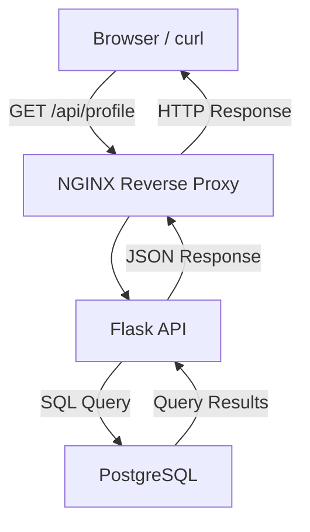
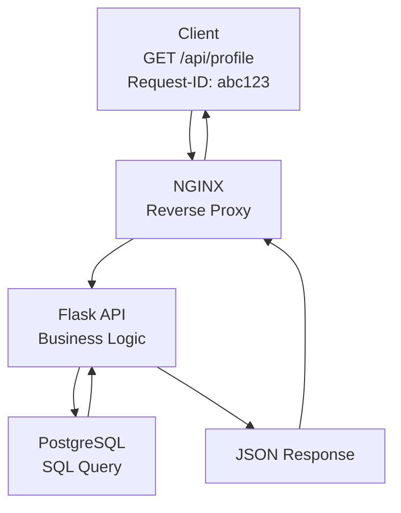

# Phase 2 Answers

This document records completed Phase 2 evidence, commands, conclusions, and retained takeaways.

## Completed Labs

| Lab | Topic |
| --- | --- |
| [Lab 01](#lab-01-three-tier-architecture) | Three-tier architecture |
| [Lab 02](#lab-02-nginx-reverse-proxy) | NGINX reverse proxy |
| [Lab 03](#lab-03-postgresql-persistence) | PostgreSQL persistence |
| [Lab 04](#lab-04-redis-cache-and-session-support) | Redis cache and session support |
| [Lab 05](#lab-05-support-ticket-data-model) | Support-ticket data model |
| [Lab 06](#lab-06-database-operations-performance-and-resilience) | Database operations, performance, and resilience |
| [Lab 07](#lab-07-api-design-and-authentication) | API design and authentication |
| [Lab 08](#lab-08-webhooks-and-asynchronous-delivery) | Webhooks and asynchronous delivery |
| [Lab 09](#lab-09-workers-and-queues) | Workers and queues |
| [Lab 10](#lab-10-websockets-and-real-time-updates) | WebSockets and real-time updates |

## Lab 01: Three-Tier Architecture

### Build

#### 1. Component View

This view shows the major components built in this phase.



#### 2. Request-Tracing View



#### 3. Request Path

For a successful `GET /api/profile` request:

1. The client sends an HTTP request to the application.
2. NGINX accepts the request as the public entry point.
3. NGINX forwards the request to the Flask API.
4. Flask validates the request and runs the application logic.
5. Flask queries PostgreSQL for the required data.
6. PostgreSQL returns the query result to Flask.
7. Flask formats the result as JSON.
8. NGINX returns the HTTP response to the client.

### Explain Each Layer

**Browser or curl:** acts as the client. It sends an HTTP request, such as `GET /api/profile`, to the application and displays the HTTP response, including the status code, headers, timing, and any JSON returned by the API.

**NGINX:** acts as a reverse proxy. It accepts incoming client requests, forwards them to the Flask API, and returns the backend response to the client. NGINX also generates access logs, can forward request IDs, and provides a single public entry point to the application.

**Flask API:** contains the application's business logic. It receives requests from NGINX, validates authentication and authorization, processes the request, queries PostgreSQL for the required data, and returns a JSON response to the client.

**PostgreSQL:** is the application's durable data store. It stores user and application data, executes SQL queries from the Flask API, and returns the requested records. PostgreSQL is a backend service and is not directly accessible to clients.

### Break: Predicted Failure Symptoms

**If NGINX cannot reach Flask:**

The user may receive a `502 Bad Gateway` response.

**What that means:**

This means NGINX accepted the client's request but could not obtain a valid response from its upstream Flask application. Possible causes include the Flask application being unavailable, listening on the wrong port, an incorrect upstream configuration, or a network connectivity issue.

**If Flask cannot reach PostgreSQL:**

The user will usually receive a `500 Internal Server Error` because Flask cannot complete the request after failing to communicate with the database.

**Possible alternate symptom:**

Depending on the application's error handling, some applications may instead return a `503 Service Unavailable` response.

**If PostgreSQL is slow:**

The user experiences slow page loads, delayed API responses, request timeouts, or possibly a `5xx` response if the application exceeds its configured timeout while waiting for the database.

**What that means:**

A `5xx` status code indicates that the server was unable to successfully complete the request.

**If request IDs are missing:**

Troubleshooting becomes significantly more difficult because it is no longer possible to correlate a single client request across NGINX logs, Flask application logs, and database-related logs.

**Why request IDs matter:**

Request IDs allow us to trace one request throughout the entire system.

## Lab 02: NGINX Reverse Proxy

### Build

The goal of this lab was to put NGINX in front of the Flask app so the request path becomes:

```text
Browser or curl -> NGINX on port 8080 -> Flask on port 5000 -> response
```

This builds on Phase 1 by tracing one request with an added proxy layer before the application. It also turns the Lab 01 architecture from a diagram into a working request path: `Browser/curl -> NGINX -> Flask`.

#### Commands Used

```bash
brew install nginx
brew info nginx
vim /opt/homebrew/etc/nginx/nginx.conf
/opt/homebrew/opt/nginx/bin/nginx -t
brew services start nginx
brew services list
curl http://127.0.0.1:5000
curl -i --max-time 3 http://127.0.0.1:8080
lsof -nP -iTCP:8080 -sTCP:LISTEN
tail -f /opt/homebrew/var/log/nginx/access.log
tail -f /opt/homebrew/var/log/nginx/error.log
```

#### Important NGINX paths

**macOS Homebrew:**

```text
Main config: /opt/homebrew/etc/nginx/nginx.conf
Logs:        /opt/homebrew/var/log/nginx/
Access log:  /opt/homebrew/var/log/nginx/access.log
Error log:   /opt/homebrew/var/log/nginx/error.log
Web root:    /opt/homebrew/var/www/
Binary:      /opt/homebrew/opt/nginx/bin/nginx
```

**Ubuntu:**

```text
Main config:  /etc/nginx/nginx.conf
Site configs: /etc/nginx/sites-available/
Enabled site: /etc/nginx/sites-enabled/
```

**RHEL / CentOS / Fedora:**

```text
Main config: /etc/nginx/nginx.conf
App configs: /etc/nginx/conf.d/
```

The exact file locations change by operating system, but the purpose is the same: NGINX reads a config, listens on a port, receives client traffic, and forwards matching requests to an upstream service.

#### NGINX config

The Homebrew NGINX config was updated:

```bash
vim /opt/homebrew/etc/nginx/nginx.conf
```

The important server block is:

```nginx
server {
    listen 8080;
    server_name localhost;

    location / {
        proxy_pass http://127.0.0.1:5000;

        proxy_set_header Host $host;
        proxy_set_header X-Real-IP $remote_addr;
        proxy_set_header X-Forwarded-For $proxy_add_x_forwarded_for;
        proxy_set_header X-Forwarded-Proto $scheme;
        proxy_set_header X-Request-ID $request_id;
    }
}
```

#### What the config means

**`listen 8080`:** NGINX listens for browser or curl traffic on port `8080`.

**`server_name localhost`:** This server block handles local requests to `localhost`.

**`location /`:** This matches the app routes for this lab.

**`proxy_pass http://127.0.0.1:5000`:** NGINX forwards the request to Flask on port `5000`.

**`proxy_set_header Host $host`:** Preserves the original host header.

**`proxy_set_header X-Real-IP $remote_addr`:** Sends Flask the client IP address NGINX saw.

**`proxy_set_header X-Forwarded-For $proxy_add_x_forwarded_for`:** Keeps the chain of client/proxy IP addresses.

**`proxy_set_header X-Forwarded-Proto $scheme`:** Tells Flask whether the original request used `http` or `https`.

**`proxy_set_header X-Request-ID $request_id`:** Sends a request ID downstream so one request can be correlated across NGINX, Flask, and the client response.

These headers are customizable. The essence is that NGINX can forward the request and preserve useful context about the original client request.

#### NGINX functionality

NGINX is often used for more than one job:

- **Reverse proxy:** receives client traffic and forwards it to an upstream app.
- **SSL termination:** handles HTTPS/TLS at the edge before forwarding to the app.
- **Static web server:** serves files like HTML, CSS, JavaScript, and images.
- **Load balancer:** distributes traffic across multiple upstream app instances.
- **Ingress in Kubernetes:** routes external traffic into services inside a Kubernetes cluster.

In this lab, NGINX is used as a reverse proxy first. The other roles explain why NGINX commonly appears at the front of production systems.

### Proof

**Flask direct test:**

```bash
curl http://127.0.0.1:5000
```

This proved Flask was reachable directly on port `5000`.

**NGINX proxy test:**

```bash
curl -i --max-time 3 http://127.0.0.1:8080
curl -i --max-time 5 http://127.0.0.1:8080/health
```

Important response evidence:

```text
HTTP/1.1 200 OK
Server: nginx/1.31.3
Content-Type: application/json
X-Request-ID: 6e8c60f9fd7dc6e0903910c024ea0428
```

This proved the request reached NGINX first, then NGINX routed it to Flask.

**Response headers captured:**

```text
Server: nginx/1.31.3
Content-Type: application/json
Content-Length: 77
Connection: keep-alive
X-Request-ID: b407c79ce1620eefce609310ca7a5070
```

The `Server: nginx/1.31.3` header proves the client received the response through NGINX. The `X-Request-ID` header proves NGINX added a request identifier that can be used to correlate the client response with proxy and application logs.

**Service check:**

```bash
brew services list
```

Result:

```text
nginx started
```

**Port check:**

```bash
lsof -nP -iTCP:8080 -sTCP:LISTEN
```

Result:

```text
nginx TCP *:8080 (LISTEN)
```

**NGINX access log:**

```bash
tail -f /opt/homebrew/var/log/nginx/access.log
```

Example evidence:

```text
127.0.0.1 - - [30/Jul/2026:16:52:46 -0400] "GET / HTTP/1.1" 200 4141 "-" "curl/8.7.1"
```

This proves NGINX saw the request and returned a `200` response.

**NGINX error log:**

```bash
tail -f /opt/homebrew/var/log/nginx/error.log
```

This is where to check for config errors, startup problems, permission issues, or upstream failures when NGINX cannot reach Flask.

### Break

The broken-upstream test was completed by temporarily changing the upstream port in the NGINX config.

This line was changed:

```nginx
proxy_pass http://127.0.0.1:5000;
```

to this:

```nginx
proxy_pass http://127.0.0.1:5999;
```

The change belongs inside `proxy_pass` because that directive controls where NGINX forwards matching traffic after it receives the request. NGINX still listened on `8080`, but it tried to forward the request to port `5999` instead of the Flask app on `5000`.

Then reload NGINX:

```bash
/opt/homebrew/opt/nginx/bin/nginx -t
/opt/homebrew/opt/nginx/bin/nginx -s reload
```

Send the request through NGINX:

```bash
curl -i --max-time 5 http://127.0.0.1:8080/health
```

Client response:

```text
HTTP/1.1 502 Bad Gateway
Server: nginx/1.31.3
Content-Type: text/html
```

NGINX access log:

```text
127.0.0.1 - - [30/Jul/2026:17:19:25 -0400] "GET /health HTTP/1.1" 502 497 "-" "curl/8.7.1"
```

NGINX error log:

```text
connect() failed (61: Connection refused) while connecting to upstream, upstream: "http://127.0.0.1:5999/health"
```

Direct Flask test still worked:

```bash
curl -i --max-time 5 http://127.0.0.1:5000/health
```

Direct Flask response:

```text
HTTP/1.1 200 OK
Server: Werkzeug/3.1.8 Python/3.9.6
X-Request-ID: 0fd2efdc-7942-496f-a2bc-213a735a2942
```

This proved Flask itself was healthy. The failure happened because NGINX was pointed at the wrong upstream port.

After the test, restore the NGINX config back to:

```nginx
proxy_pass http://127.0.0.1:5000;
```

Then reload NGINX and confirm `http://127.0.0.1:8080/health` returned `200 OK` again.

### Key Takeaways

**NGINX became the front door:** Requests no longer need to go directly to Flask. They can go to NGINX on `8080`, and NGINX routes them to Flask on `5000`.

**The request path is now visible at the proxy layer:** The NGINX access log proves the request reached the proxy before Flask.

**Headers carry context:** `Host`, `X-Real-IP`, `X-Forwarded-For`, `X-Forwarded-Proto`, and `X-Request-ID` help Flask understand the original client request after it passes through NGINX.

**`proxy_set_header` controls what NGINX forwards downstream:** These lines add or preserve headers before NGINX sends the request to Flask. Keep `proxy_set_header X-Request-ID $request_id;` because it allows NGINX to generate a request ID. Remove the duplicate `proxy_set_header X-Request-ID $http_x_request_id;` because it only forwards a client-provided request ID and can be blank if the client did not send one.

**A reverse proxy gives production systems a control point:** NGINX can route traffic, serve static files, terminate SSL, load balance, and act as an ingress layer in Kubernetes.

**502 Bad Gateway means the proxy could not get a valid upstream response:** In this lab, the bad port made NGINX fail to connect to `127.0.0.1:5999`, so NGINX returned `502` even though Flask was still healthy on `5000`.

**An upstream is the backend service NGINX forwards traffic to:** In this lab, Flask on `127.0.0.1:5000` is the upstream. When `proxy_pass` changed to `127.0.0.1:5999`, NGINX could not connect to the upstream, so the request stopped at NGINX and headers were never forwarded to Flask.

**Request ID forwarding depends on reaching the upstream:** If the client sends `X-Request-ID`, `$http_x_request_id` can forward that client-provided value. If the client does not send one, it can be blank. In a broken-upstream failure, Flask receives neither value because NGINX cannot connect to Flask at all.

**Reverse proxy vs forward proxy:** A reverse proxy sits in front of servers and represents the server side to clients. A forward proxy sits in front of clients and represents the client side to servers.

## Lab 03: PostgreSQL Persistence


### Build

The goal of this lab is to add PostgreSQL as the durable data layer.

```text
Browser or curl -> NGINX -> Flask -> PostgreSQL
```

This builds on Lab 01 and Lab 02: NGINX routes the request to Flask, and Flask now writes to and reads from PostgreSQL instead of only returning hardcoded or in-memory data.

### What Is PostgreSQL

PostgreSQL is a relational database management system. It stores structured data in tables, rows, and columns, and SQL is the language used to inspect and change that data.

Why it matters here:

- **Durability:** data survives app restarts.
- **Source of truth:** PostgreSQL owns whether the row actually exists.
- **SQL evidence:** Query the database directly instead of only trusting app logs.
- **Production fit:** PostgreSQL supports transactions, constraints, indexes, and operational inspection.

This lab does not require deep DBA knowledge. The practical goal is to start PostgreSQL, connect with `psql`, create a simple schema, prove data was saved, and recognize what failure looks like when the app cannot reach the database.

### Why PostgreSQL

PostgreSQL fits the three-tier model:

```text
NGINX routes traffic.
Flask owns application logic.
PostgreSQL owns durable data.
```

Compared with memory, PostgreSQL keeps data after Flask restarts. Compared with Redis, PostgreSQL is the durable system of record; Redis can come later for caching or sessions.

### Commands Used

```bash
brew search postgresql
brew install postgresql
brew services start postgresql
brew services list
psql postgres
```

Inside `psql`:

```sql
SELECT version();
\l
\q
```

Create the app database:

```bash
createdb request_tracing_lab
psql request_tracing_lab
```

Create the table:

```sql
CREATE TABLE request_notes (
    id SERIAL PRIMARY KEY,
    message TEXT NOT NULL,
    created_at TIMESTAMPTZ DEFAULT NOW()
);
```

Insert and read a row manually:

```sql
INSERT INTO request_notes (message)
VALUES ('first postgres lab row');

SELECT * FROM request_notes;
```

### Table Meaning

**`request_notes`:** the simple table created for this lab.

**`id SERIAL PRIMARY KEY`:** gives each row a unique auto-incrementing ID.

**`message TEXT NOT NULL`:** stores the note text and requires a value.

**`created_at TIMESTAMPTZ DEFAULT NOW()`:** records when the row was created with timezone awareness.

The `/notes` route in Flask maps to this table. It is intentionally simple: it proves persistence, but it is not a full user-account notes feature yet.

### Essential SQL

```sql
\l
\dt
\d request_notes
SELECT * FROM request_notes;
SELECT id, message, created_at FROM request_notes ORDER BY id DESC;
```

**`\l`:** list databases.

**`\dt`:** list tables.

**`\d request_notes`:** describe the table schema.

**`SELECT`:** prove what rows actually exist in PostgreSQL.

### Proof

**Connection configuration:**

```text
DATABASE_URL=dbname=request_tracing_lab
```

Flask uses `DATABASE_URL` if it is set. Otherwise, it defaults to the local `request_tracing_lab` database.

**Schema:**

```sql
CREATE TABLE request_notes (
    id SERIAL PRIMARY KEY,
    message TEXT NOT NULL,
    created_at TIMESTAMPTZ DEFAULT NOW()
);
```

**Write through NGINX and Flask:**

```bash
curl -i --max-time 5 http://127.0.0.1:8080/notes \
  -H 'Content-Type: application/json' \
  -d '{"message":"postgres row through flask and nginx"}'
```

Response:

```text
HTTP/1.1 201 CREATED
Server: nginx/1.31.3
X-Request-ID: dd3548eaa98e3e8d7a83ab846f82b31a
```

**Read through NGINX and Flask:**

```bash
curl -i --max-time 5 http://127.0.0.1:8080/notes
```

Response:

```text
HTTP/1.1 200 OK
Server: nginx/1.31.3
X-Request-ID: cb4bd4d4906acf44db7db1a24b5d3972
```

**SQL evidence:**

```text
id | message                              | created_at
---+--------------------------------------+-------------------------------
3  | first postgres lab row from flask    | 2026-07-30 17:51:35.63169-04
2  | postgres row through flask and nginx | 2026-07-30 17:51:24.177706-04
1  | first postgres lab row               | 2026-07-30 17:33:42.778478-04
```

**Application log:**

```text
request_started request_id=dd3548eaa98e3e8d7a83ab846f82b31a method=POST path=/notes
database_write request_id=dd3548eaa98e3e8d7a83ab846f82b31a table=request_notes row_id=2
request_finished request_id=dd3548eaa98e3e8d7a83ab846f82b31a status=201
```

The proof chain is:

```text
curl through NGINX -> NGINX access log -> Flask log -> SQL SELECT from PostgreSQL
```

The SQL query is the strongest proof because it checks the database directly.

### Break

PostgreSQL was stopped while NGINX and Flask kept running:

```bash
brew services stop postgresql@18
```

Then send the same write request:

```bash
curl -i --max-time 5 http://127.0.0.1:8080/notes \
  -H 'Content-Type: application/json' \
  -d '{"message":"this should fail because postgres is stopped"}'
```

**What the user saw:**

```text
HTTP/1.1 503 SERVICE UNAVAILABLE
Server: nginx/1.31.3
X-Request-ID: fc36c1be66f5f018f435a45cb897dba5

{
  "error": "database unavailable",
  "request_id": "fc36c1be66f5f018f435a45cb897dba5"
}
```

**What Flask logged:**

```text
request_started request_id=fc36c1be66f5f018f435a45cb897dba5 method=POST path=/notes
database_error request_id=fc36c1be66f5f018f435a45cb897dba5 operation=create_note
psycopg.OperationalError: connection to server on socket "/tmp/.s.PGSQL.5432" failed: Connection refused
request_finished request_id=fc36c1be66f5f018f435a45cb897dba5 status=503
```

**NGINX access log:**

```text
127.0.0.1 - - [30/Jul/2026:17:52:55 -0400] "POST /notes HTTP/1.1" 503 90 "-" "curl/8.7.1"
```

**PostgreSQL state during failure:**

```text
postgresql@18 none
```

**SQL evidence after recovery:**

```sql
SELECT id, message, created_at
FROM request_notes
WHERE message = 'this should fail because postgres is stopped';
```

Result:

```text
0 rows
```

This proves the failed write was not saved.

### Failure Conclusion

**What did the user see?** `503 SERVICE UNAVAILABLE` with `database unavailable`.

**What did Flask log?** Flask logged `database_error` and `psycopg.OperationalError: Connection refused`.

**Did NGINX cause the failure?** No. NGINX routed the request to Flask. The failure happened after Flask tried to connect to PostgreSQL.

**What proves PostgreSQL failed?** PostgreSQL was stopped, Flask logged a PostgreSQL connection error, and the failed row did not appear in SQL after recovery.

### Key Takeaways

**PostgreSQL is the durable source of truth:** Data written to PostgreSQL survives outside the Flask process.

**Application logs are not enough:** A Flask log can prove a request ran, but SQL proves whether the row was actually saved.

**A database failure is different from an NGINX failure:** NGINX can route successfully while Flask fails because PostgreSQL is unavailable.

**The `/notes` route is a persistence test:** It is a simple write/read API for proving Flask can use PostgreSQL. A real authenticated notes feature can come later if the project needs it.

**At this stage, operational fluency is enough:** Know how to start PostgreSQL, connect with `psql`, create a table, insert a row, read it back, break the database dependency, and explain the evidence.

## Lab 04: Redis Cache And Session Support


### Build

The goal of this lab is to add Redis as temporary support state.

```text
Browser or curl -> NGINX -> Flask -> Redis cache
                              |
                              -> PostgreSQL on cache miss
```

This lab uses one Redis responsibility:

```text
Cache the GET /notes response.
```

PostgreSQL remains the durable source of truth. Redis stores a temporary copy of the latest notes response so repeated reads can be served faster.

### What Is Redis

Redis is an in-memory key/value store. It is commonly used for fast temporary data such as cache entries, sessions, counters, locks, and queue-related state.

For this lab, Redis is a cache. It is not the system of record. If Redis loses the cached value, Flask can still read from PostgreSQL and rebuild the cache.

### Redis Core vs Redis Stack Modules

For Lab 04, you only need Redis core:

```text
SET
GET
EXPIRE
TTL
DEL
```

Redis Stack modules are optional extensions for specialized features such as search, JSON documents, bloom filters, and time-series data. They are not needed for this cache lab.

### Commands Used

Start and verify Redis:

```bash
brew search redis
brew install redis
brew services start redis
brew services list
redis-cli ping
```

Connection evidence:

```text
PONG
```

Manual Redis basics:

```redis
SET lab:test "hello redis"
GET lab:test
TTL lab:test
EXPIRE lab:test 30
TTL lab:test
DEL lab:test
GET lab:test
```

Evidence:

```text
SET lab:test "hello redis" -> OK
GET lab:test -> "hello redis"
TTL lab:test -> -1
EXPIRE lab:test 30 -> 1
TTL lab:test -> 30
DEL lab:test -> 1
GET lab:test -> nil
```

`TTL -1` means the key exists but has no expiration. After `EXPIRE`, Redis shows a countdown. `nil` means the key no longer exists.

### Runtime Configuration

Flask connects to Redis through runtime configuration:

```text
REDIS_URL=redis://127.0.0.1:6379/0
NOTES_CACHE_KEY=notes:latest
NOTES_CACHE_TTL_SECONDS=30
```

Local Redis runs on `127.0.0.1:6379`. In AWS, the same idea would point to an ElastiCache endpoint. In containers later, it may point to a service name such as `redis:6379`.

### Cache Behavior

The `GET /notes` path now works like this:

```text
1. Check Redis for notes:latest.
2. If the key exists, return cache: hit.
3. If the key is missing, read PostgreSQL, store the result in Redis, return cache: miss.
4. If Redis is unavailable, read PostgreSQL anyway, return cache: unavailable.
```

The `POST /notes` path writes to PostgreSQL and deletes `notes:latest` from Redis so the next read refreshes the cache.

### Proof

**Redis connection evidence:**

```bash
redis-cli ping
```

Captured result:

```text
PONG
```

This proves the Redis server accepted a client connection on `127.0.0.1:6379`.

**Connection configuration:**

```text
REDIS_URL=redis://127.0.0.1:6379/0
NOTES_CACHE_KEY=notes:latest
NOTES_CACHE_TTL_SECONDS=30
```

This tells Flask where Redis is, which key stores the cached notes response, and how long the cache entry should live.

**Cache miss evidence:**

```bash
redis-cli DEL notes:latest
curl -s -i --max-time 5 http://127.0.0.1:8080/notes
```

Captured response evidence:

```text
HTTP/1.1 200 OK
X-Request-ID: 757a81ebffa29d9f58e636f6ab37f377
"cache": "miss"
"request_id": "757a81ebffa29d9f58e636f6ab37f377"
```

This proves Redis was empty for `notes:latest`, so Flask read from PostgreSQL and returned the notes through NGINX.

**Cache hit evidence:**

```bash
curl -s -i --max-time 5 http://127.0.0.1:8080/notes
```

Captured response evidence:

```text
HTTP/1.1 200 OK
X-Request-ID: b12b5df54c43b8b9f41efe6874c20141
"cache": "hit"
"request_id": "b12b5df54c43b8b9f41efe6874c20141"
```

This proves the follow-up read came from Redis instead of rebuilding the response from PostgreSQL again.

**Cached value evidence:**

```bash
redis-cli GET notes:latest
```

Captured result:

```text
[{"id": 3, "message": "first postgres lab row from flask", ...},
 {"id": 2, "message": "postgres row through flask and nginx", ...},
 {"id": 1, "message": "first postgres lab row", ...}]
```

This proves Redis stored a serialized copy of the latest notes response.

**TTL or expiry evidence:**

```bash
redis-cli TTL notes:latest
```

Captured result:

```text
28
```

This proves Redis stored `notes:latest` with an expiration countdown. The cache is temporary by design.

**PostgreSQL remains source of truth:**

```bash
psql request_tracing_lab -c "SELECT id, message, created_at FROM request_notes ORDER BY id DESC;"
```

Captured SQL evidence:

```text
 id |               message                |          created_at
----+--------------------------------------+-------------------------------
  3 | first postgres lab row from flask    | 2026-07-30 17:51:35.63169-04
  2 | postgres row through flask and nginx | 2026-07-30 17:51:24.177706-04
  1 | first postgres lab row               | 2026-07-30 17:33:42.778478-04
(3 rows)
```

Redis can speed up reads, but PostgreSQL is the durable proof that the notes actually exist. If the Redis key is deleted or expires, Flask can rebuild the cache from PostgreSQL.

### Break

Redis-unavailable behavior was tested by starting a temporary Flask process on port `5002` with Redis pointed at the wrong port:

```bash
REDIS_URL=redis://127.0.0.1:6390/0 \
FLASK_RUN_HOST=127.0.0.1 \
FLASK_RUN_PORT=5002 \
FLASK_DEBUG=false \
venv/bin/python app.py
```

Then send the request directly to that temporary Flask process:

```bash
curl -s -i --max-time 5 http://127.0.0.1:5002/notes
```

Captured response evidence:

```text
HTTP/1.1 200 OK
X-Request-ID: 097509d9-d8af-4728-a36e-e20604cccc46
"cache":"unavailable"
"request_id":"097509d9-d8af-4728-a36e-e20604cccc46"
```

Captured Flask log evidence for the same request ID:

```text
request_started request_id=097509d9-d8af-4728-a36e-e20604cccc46 method=GET path=/notes
cache_error request_id=097509d9-d8af-4728-a36e-e20604cccc46 key=notes:latest
redis.exceptions.ConnectionError: Error 61 connecting to 127.0.0.1:6390. Connection refused.
database_read request_id=097509d9-d8af-4728-a36e-e20604cccc46 table=request_notes rows=3
request_finished request_id=097509d9-d8af-4728-a36e-e20604cccc46 status=200
```

### Failure Conclusion

**What did the user see?** The user still received `200 OK` with notes and `"cache":"unavailable"`.

**Did the app fail closed, fail open, or fall back?** The app fell back to PostgreSQL. This is a graceful fallback, not a full request failure.

**Did PostgreSQL still work?** Yes. The same failed-Redis request logged `database_read` with `rows=3`.

**What evidence proves Redis was the failed dependency?** The Flask log shows `cache_error` and `redis.exceptions.ConnectionError` for `127.0.0.1:6390`, while the same request ID also shows a successful PostgreSQL `database_read` and `request_finished status=200`.

**Would this block the whole request, degrade performance, or only disable cache/session behavior?** For `GET /notes`, Redis failure only disables cache behavior and may make reads slower because Flask must query PostgreSQL. It does not block the whole request as long as PostgreSQL is healthy.

### Evidence Checklist

**Redis responsibility:** Cache the `GET /notes` response using the `notes:latest` key.

**Connection configuration:** `REDIS_URL=redis://127.0.0.1:6379/0`, `NOTES_CACHE_KEY=notes:latest`, and `NOTES_CACHE_TTL_SECONDS=30`.

**Cache miss evidence:** After `redis-cli DEL notes:latest`, `GET /notes` returned `"cache": "miss"` with request ID `757a81ebffa29d9f58e636f6ab37f377`.

**Cache hit evidence:** The following `GET /notes` returned `"cache": "hit"` with request ID `b12b5df54c43b8b9f41efe6874c20141`.

**Expiry evidence:** `redis-cli TTL notes:latest` returned `28`, proving the cache key had an expiration countdown.

**Fallback behavior:** When Redis was pointed to bad port `6390`, `GET /notes` returned `"cache":"unavailable"` and still returned the notes from PostgreSQL.

**Failure symptom:** Flask logged `cache_error` and `redis.exceptions.ConnectionError`, but the client still received notes if PostgreSQL was healthy.

**PostgreSQL source-of-truth proof:** A direct SQL query against `request_notes` returned the same three rows, independent of Redis.

**Cache vs queue explanation:** In this lab, Redis is a cache inside the synchronous request path. It stores a temporary copy of data that PostgreSQL already owns. A queue is different: it stores work for a worker to process later outside the request/response path.

**Explanation standard:** Redis is fast temporary state. It can improve repeated reads and support sessions, but it should not be treated as durable storage for this lab. PostgreSQL remains the source of truth. If Redis is empty, Flask rebuilds the cache from PostgreSQL. If Redis is unavailable, the endpoint should degrade gracefully when PostgreSQL can still serve the data.

**Retained takeaway:** Cache failure should degrade the experience instead of destroying the request when the durable database can still answer.

### Cache vs Queue

This lab uses Redis as cache, not as a queue.

```text
Cache: helps a synchronous request read faster.
Queue: stores work for a worker to process later.
Worker: runs outside the request/response path.
```

Async does not automatically mean real-time. Async means work can happen after the user request returns. Real-time means users receive live or near-live updates.

### Cloud Connection

**AWS:** Redis maps to Amazon ElastiCache for Redis or Valkey. PostgreSQL maps to Amazon RDS PostgreSQL.

**Cloudflare:** Cloudflare can cache at the edge, terminate TLS, and proxy traffic before it reaches the app. Redis is different because it is an application-side cache that Flask controls directly.

### Key Takeaways

**Redis is fast temporary state:** It is useful for cache/session behavior, but it is not the durable source of truth.

**PostgreSQL remains source of truth:** SQL still proves what data actually exists.

**Cache miss reads PostgreSQL:** Redis being empty should not break the request.

**Cache hit reads Redis:** Repeated reads can avoid hitting PostgreSQL for a short time.

**Redis failure should degrade gracefully:** For this endpoint, Redis unavailable means slower reads, not a failed user request.

**Cache/session Redis belongs in Phase 2:** Queue/worker Redis is only a boundary preview here. It was not built yet; it belongs later when the architecture adds asynchronous processing in Lab 09.

## Lab 05: Support-Ticket Data Model

### Build

The goal of this lab is to turn the request-tracing app into a durable support-ticket workflow.

```text
Browser or curl -> NGINX -> Flask support-ticket API -> PostgreSQL
```

PostgreSQL owns the durable records:

```text
users
tickets
ticket_messages
ticket_events
```

Redis can support temporary cache, sessions, or queues later, but support tickets belong in PostgreSQL because they are business records that must survive app restarts and cache expiration.

### Schema

The migration file is:

```text
phases/phase-02-tracing-service-boundaries/sql/001_support_tickets.sql
```

It creates:

**`users`:** identities that can log in. Customers create tickets; admins support tickets.

**`tickets`:** durable support issues created by users.

**`ticket_messages`:** customer replies, support replies, internal notes, and system messages connected to a ticket.

**`ticket_events`:** audit trail records with `request_id` so database changes can be traced back to one request.

Important relationship rules:

```text
tickets.created_by -> users.id
tickets.assigned_to -> users.id
ticket_messages.ticket_id -> tickets.id
ticket_messages.author_id -> users.id
ticket_events.ticket_id -> tickets.id
ticket_events.actor_id -> users.id
```

Important constraints:

```text
users_role_check
tickets_category_check
tickets_priority_check
tickets_status_check
ticket_messages_type_check
```

Important indexes:

```text
idx_users_username_lower
idx_users_email_lower
idx_tickets_created_by_created_at
idx_tickets_status_priority
idx_ticket_messages_ticket_id_created_at
idx_ticket_events_ticket_id_created_at
```

Indexes are not cache. An index is a database lookup structure that helps PostgreSQL find or order rows efficiently. A cache stores reusable data or query results.

### Proof

**Schema applied:**

```bash
psql request_tracing_lab -f phases/phase-02-tracing-service-boundaries/sql/001_support_tickets.sql
```

**Tables verified:**

```text
request_notes
ticket_events
ticket_messages
tickets
users
```

`request_notes` came from Lab 03. The support-ticket tables are `users`, `tickets`, `ticket_messages`, and `ticket_events`.

**Customer registration:**

```bash
curl -i -c /tmp/rtl-customer.cookie \
  -H "Content-Type: application/json" \
  -d '{"username":"customer1","email":"customer1@example.com","password":"customerpass"}' \
  http://127.0.0.1:8080/api/auth/register
```

Captured evidence:

```text
HTTP/1.1 201 CREATED
X-Request-ID: 0b84cac18d2655b76148b32d77862fd9
Set-Cookie: session=...
user.id: 1
user.username: customer1
user.role: customer
```

**Customer login:**

```bash
curl -i -c /tmp/rtl-customer.cookie \
  -H "Content-Type: application/json" \
  -d '{"username":"customer1","password":"customerpass"}' \
  http://127.0.0.1:8080/api/auth/login
```

Captured evidence:

```text
HTTP/1.1 200 OK
X-Request-ID: b0f1399932f4fef4512222b40ca6aa4b
Set-Cookie: session=...
user.id: 1
user.role: customer
```

**Admin login:**

```bash
curl -i -c /tmp/rtl-admin.cookie \
  -H "Content-Type: application/json" \
  -d '{"username":"getty","password":"cloudpass"}' \
  http://127.0.0.1:8080/api/auth/login
```

Captured evidence:

```text
HTTP/1.1 200 OK
X-Request-ID: 14b60a523e4db3066cf453e984235991
Set-Cookie: session=...
user.id: 3
user.role: admin
```

`/tmp/rtl-customer.cookie` and `/tmp/rtl-admin.cookie` are temporary curl cookie files. Browser login cookies and curl login cookies are separate.

**Customer reply added to ticket `1`:**

```bash
curl -i -b /tmp/rtl-customer.cookie \
  -H "Content-Type: application/json" \
  -d '{"body":"Adding more evidence from the request log for Lab 05."}' \
  http://127.0.0.1:8080/api/tickets/1/messages
```

Captured evidence:

```text
HTTP/1.1 201 CREATED
X-Request-ID: 603b5f0c73c0cea5f9e153fb5a73f125
message.id: 7
message.ticket_id: 1
message.author_id: 1
message.message_type: customer_reply
```

**Admin internal note added to ticket `1`:**

```bash
curl -i -b /tmp/rtl-admin.cookie \
  -H "Content-Type: application/json" \
  -d '{"body":"Internal note: reviewed support evidence for Lab 05."}' \
  http://127.0.0.1:8080/api/admin/tickets/1/internal-notes
```

Captured evidence:

```text
HTTP/1.1 201 CREATED
X-Request-ID: 82923023031cc3fd7a0a7007414a5b04
message.id: 8
message.ticket_id: 1
message.author_id: 3
message.message_type: internal_note
```

**Customer view of ticket `1`:**

```text
HTTP/1.1 200 OK
X-Request-ID: c1b34bde49a70983a1fd7473e1669bbf
Visible message types: customer_reply
Hidden message types: internal_note
```

**Admin view of ticket `1`:**

```text
HTTP/1.1 200 OK
X-Request-ID: 71c7dcea9f8a9a623ecde600bbd89dfe
Visible message types: customer_reply, internal_note
```

This proves the app hides internal notes from regular customers and exposes them to admins.

### SQL Evidence

**Users:**

```text
 id | username  |   role
----+-----------+----------
  1 | customer1 | customer
  2 | getty2    | customer
  3 | getty     | admin
```

**Tickets:**

```text
 id | ticket_number | created_by | status | priority
----+---------------+------------+--------+----------
  1 | TCK-96645C93  |          1 | open   | medium
  2 | TCK-DE75C223  |          1 | open   | medium
  3 | TCK-C1151726  |          2 | open   | medium
```

**Ticket messages:**

```text
 id | ticket_id | author_id |  message_type  | body
----+-----------+-----------+----------------+-------------------------------------------------------
  7 |         1 |         1 | customer_reply | Adding more evidence from the request log for Lab 05.
  8 |         1 |         3 | internal_note  | Internal note: reviewed support evidence for Lab 05.
```

**Ticket events:**

```text
 id | ticket_id | actor_id |    action     |   new_value    |              request_id
----+-----------+----------+---------------+----------------+----------------------------------
  7 |         1 |        1 | message_added | customer_reply | 603b5f0c73c0cea5f9e153fb5a73f125
  8 |         1 |        3 | message_added | internal_note  | 82923023031cc3fd7a0a7007414a5b04
```

The `ticket_events.request_id` values match the API responses for the customer reply and admin internal note.

### Controlled Failures

**Duplicate username:**

```bash
curl -i -H "Content-Type: application/json" \
  -d '{"username":"customer1","email":"customer1-again@example.com","password":"customerpass"}' \
  http://127.0.0.1:8080/api/auth/register
```

Captured evidence:

```text
HTTP/1.1 409 CONFLICT
X-Request-ID: d0f364454a13b4a80c2de81de47d52ec
category: duplicate_account
error: username or email already exists
```

This proves the database uniqueness rule prevents duplicate account identity.

**Unauthenticated ticket creation:**

```bash
curl -i -H "Content-Type: application/json" \
  -d '{"title":"Unauth test","description":"No cookie sent.","category":"technical_question","priority":"medium"}' \
  http://127.0.0.1:8080/api/tickets
```

Captured evidence:

```text
HTTP/1.1 401 UNAUTHORIZED
X-Request-ID: f48a55b59384fe87f76f236ad6f8fad5
category: unauthenticated
error: authentication required
```

This proves ticket creation requires a logged-in Flask session.

**Customer tries admin endpoint:**

```bash
curl -i -b /tmp/rtl-customer.cookie \
  http://127.0.0.1:8080/api/admin/tickets
```

Captured evidence:

```text
HTTP/1.1 403 FORBIDDEN
X-Request-ID: c9827e82904a16c311e269cd7059b02b
category: unauthorized
error: administrator access required
```

This proves a logged-in customer is authenticated but not authorized for admin actions.

**Customer tries another customer's ticket:**

```bash
curl -i -b /tmp/rtl-customer.cookie \
  http://127.0.0.1:8080/api/tickets/3
```

Captured evidence:

```text
HTTP/1.1 403 FORBIDDEN
X-Request-ID: 4fd4085caa17e190dc0eb0e2e4e3b664
category: unauthorized
error: ticket access denied
```

This proves customers can only access tickets they own.

### Troubleshooting Checklist

**Which table owns each kind of data?** `users` owns identities, `tickets` owns support issues, `ticket_messages` owns conversation history, and `ticket_events` owns audit evidence.

**Which foreign keys describe ownership and relationships?** `tickets.created_by -> users.id`, `ticket_messages.ticket_id -> tickets.id`, `ticket_messages.author_id -> users.id`, `ticket_events.ticket_id -> tickets.id`, and `ticket_events.actor_id -> users.id`.

**Which constraint prevented bad data?** Unique indexes prevented duplicate usernames and emails. Check constraints prevent invalid roles, categories, priorities, statuses, and message types.

**Which index supports listing one customer's tickets?** `idx_tickets_created_by_created_at` supports finding one customer's tickets in newest-first order.

**Why can customers only see their own tickets?** Flask loads the session user and checks `tickets.created_by`. If the user is not an admin and did not create the ticket, the app returns `403`.

**Why can admins see all tickets and internal notes?** Admin users have `role=admin`, so they can use admin endpoints and bypass the customer-only ownership filter.

**Why do ticket records belong in PostgreSQL instead of Redis?** Tickets are durable business records. They must survive app restarts, Redis loss, and cache expiration.

**Which SQL query proves the ticket exists?** `SELECT id, ticket_number, created_by, status, priority FROM tickets ORDER BY id;`

**Which logs prove the request path?** NGINX access logs prove the request entered through the proxy. Flask logs prove the application handled the request. `ticket_events.request_id` proves the database change is tied to a specific request.

### Overall Summary

This lab shows how one support-ticket action becomes durable database evidence. When a customer creates or updates a ticket, Flask authenticates the user from the session cookie, validates the request body, writes records to PostgreSQL, and records an audit event with the request ID. The `tickets` table owns the support issue, `ticket_messages` owns the conversation, and `ticket_events` owns traceable audit history. PostgreSQL is the source of truth because support history must survive restarts and cache loss. Redis can support temporary cache, sessions, or queues, but it should not be the durable store for customer support history.

### Retained Takeaway

The database is not just storage. It enforces relationships, protects ownership rules with constraints and foreign keys, speeds common lookups with indexes, and gives durable evidence that the application saved the customer's support request.

## Lab 06: Database Operations, Performance, And Resilience

### Exercise Summary

This lab used the existing support-ticket architecture from Labs 01-05 and inspected PostgreSQL as an operational dependency.

Reference model:

[Phase 2 Labs 01-06 Request Path And Database Model](../phases/phase-02-tracing-service-boundaries/assets/lab-06-current-architecture.md)

Request path under test:

```text
Browser or curl -> NGINX -> Flask support-ticket API -> PostgreSQL
```

### Exercise 1: Confirm Database Connectivity

Command:

```bash
psql request_tracing_lab -c "SELECT current_database(), current_user, inet_server_addr(), inet_server_port();"
```

Verification command:

```bash
psql request_tracing_lab -c "\conninfo"
```

Captured result:

```text
 current_database   | current_user  | inet_server_addr | inet_server_port
--------------------+---------------+------------------+-----------------
 request_tracing_lab | heavenlygetty |                  |
```

Answered fields:

```text
Database name:
request_tracing_lab

Database user:
heavenlygetty

Connection method or endpoint:
Local Unix socket connection.

How this was verified:
The SQL output showed blank `inet_server_addr` and `inet_server_port`, so PostgreSQL did not report a TCP server address or port for this session. The command also used `psql request_tracing_lab` without `host=` or `port=`, so local `psql` used its default local connection behavior. To confirm this directly, run `psql request_tracing_lab -c "\conninfo"` and look for a socket path such as `/tmp` or `/var/run/postgresql` instead of a TCP host and port.

Conclusion:
The local PostgreSQL database was reachable. The blank server address and port are expected because this local psql connection used a Unix socket instead of an explicit TCP host and port.
```

### Exercise 2: Measure A Healthy Ticket Lookup

Command:

```bash
psql request_tracing_lab \
  -c "\timing on" \
  -c "SELECT id, ticket_number, created_by, status, priority
      FROM tickets
      WHERE created_by = 1
      ORDER BY created_at DESC;"
```

Captured result:

```text
 id | ticket_number | created_by | status | priority
----+---------------+------------+--------+----------
  2 | TCK-DE75C223  |          1 | open   | medium
  1 | TCK-96645C93  |          1 | open   | medium

Time: 2.678 ms
```

Answered fields:

```text
Rows returned:
2 rows. The output shows ticket IDs 2 and 1.

Query time:
2.678 ms. This came from the `Time:` line printed by `\timing on`.

What customer workflow this supports:
Listing one customer's tickets in newest-first order. The evidence is the query filter `WHERE created_by = 1` and sort `ORDER BY created_at DESC`.

Conclusion:
PostgreSQL returned one customer's tickets quickly in the local lab. This supports the customer ticket-list workflow.
```

### Exercise 3: Inspect The Customer Lookup Plan

Command:

```bash
psql request_tracing_lab -c "EXPLAIN
SELECT id, ticket_number, created_by, status, priority
FROM tickets
WHERE created_by = 1
ORDER BY created_at DESC;"
```

Captured result:

```text
Index Scan using idx_tickets_created_by_created_at on tickets
  Index Cond: (created_by = 1)
```

`EXPLAIN ANALYZE` evidence:

```text
Index Scan using idx_tickets_created_by_created_at on tickets
  actual time=0.059..0.063 rows=2 loops=1
Execution Time: 0.170 ms
```

Answered fields:

```text
Plan type:
Index Scan. The first line of the plan starts with `Index Scan`.

Index used, if any:
idx_tickets_created_by_created_at. The plan says `using idx_tickets_created_by_created_at on tickets`.

Actual timing, if measured:
Execution Time: 0.170 ms. The actual row-read timing was 0.059..0.063 ms for 2 rows.

Conclusion:
The customer-ticket lookup used the intended index for `created_by = 1` and newest-first ordering.
```

Clarity note:

```text
The plan line tells what PostgreSQL decided to do. `Index Scan` is the access method, and `idx_tickets_created_by_created_at` is the specific index PostgreSQL used.
```

### Exercise 4: Compare Supported Lookup And Unsupported Search

Admin triage query:

```bash
psql request_tracing_lab -c "EXPLAIN
SELECT id, ticket_number, status, priority
FROM tickets
WHERE status = 'open' AND priority = 'medium'
ORDER BY id;"
```

Captured result:

```text
Index Scan using idx_tickets_status_priority on tickets
  Index Cond: ((status = 'open') AND (priority = 'medium'))
```

Title search:

```bash
psql request_tracing_lab -c "EXPLAIN
SELECT id, ticket_number, title
FROM tickets
WHERE title ILIKE '%trace%';"
```

Captured result:

```text
Seq Scan on tickets
  Filter: (title ~~* '%trace%'::text)
```

Answered fields:

```text
Supported lookup plan:
Index Scan using idx_tickets_status_priority. The plan shows PostgreSQL can use the status/priority index for `status = 'open' AND priority = 'medium'`.

Unsupported search plan:
Seq Scan on tickets. The title search scans the table and applies a filter because the current schema does not have an index suited to `ILIKE '%trace%'`.

Why the difference matters:
An indexed lookup can jump to likely matching rows. A sequential scan reads through the table and filters rows. On a tiny lab table that is fine; on a large production table it could become expensive.

Conclusion:
The admin triage query has a supporting index, while the wildcard title search does not. The title search would need more evidence before changing indexing or search design.
```

Clarity note:

```text
`Seq Scan` is not automatically bad. It means PostgreSQL chose to read through the table. Whether that is a problem depends on table size, frequency, timing, and customer impact.
```

### Exercise 5: Simulate Database Latency

Command:

```bash
psql request_tracing_lab -c "\timing on" -c "SELECT pg_sleep(1);"
```

Captured result:

```text
Time: 1004.019 ms (00:01.004)
```

Answered fields:

```text
Measured time:
1004.019 ms, or about 1.004 seconds. This came from the `Time:` line.

Layer where the delay happened:
PostgreSQL. The SQL command intentionally ran `SELECT pg_sleep(1)` inside the database.

What this does and does not prove:
It proves database-side waiting appears as query latency. It does not prove that any real customer issue is caused by PostgreSQL without request timing, SQL timing, lock evidence, connection evidence, and resource metrics.
```

Clarity note:

```text
The `pg_sleep(1)` function is artificial. It is useful because it creates a known database delay, making it easier to recognize database-side latency in evidence.
```

### Exercise 6: Prove Rollback Behavior

Command:

```sql
BEGIN;

INSERT INTO tickets (
  ticket_number,
  created_by,
  title,
  description,
  category,
  priority
)
VALUES (
  'TCK-ROLLBACK-LAB',
  1,
  'Rollback lab ticket',
  'This row should not remain after rollback.',
  'technical_question',
  'low'
);

SELECT id, ticket_number, title
FROM tickets
WHERE ticket_number = 'TCK-ROLLBACK-LAB';

ROLLBACK;

SELECT id, ticket_number, title
FROM tickets
WHERE ticket_number = 'TCK-ROLLBACK-LAB';
```

Captured result:

```text
BEGIN
INSERT 0 1
 id |  ticket_number   |        title
----+------------------+---------------------
  4 | TCK-ROLLBACK-LAB | Rollback lab ticket

ROLLBACK
 id | ticket_number | title
----+---------------+-------
(0 rows)
```

Answered fields:

```text
Row visible before rollback:
Yes. The first SELECT returned one row: id=4, ticket_number=TCK-ROLLBACK-LAB, title=Rollback lab ticket.

Row visible after rollback:
No. The second SELECT returned `(0 rows)`.

What this proves about partial writes:
The inserted test ticket did not become durable after `ROLLBACK`. PostgreSQL removed the uncommitted work, which protects against partial writes remaining after a failed transaction.
```

Clarity note:

```text
`INSERT 0 1` means one row was inserted inside the transaction. `(0 rows)` after rollback means the later query found no durable row with that ticket number.
```

### Exercise 7: Prove Constraint Protection

Command:

```sql
BEGIN;

INSERT INTO tickets (
  ticket_number,
  created_by,
  title,
  description,
  category,
  priority
)
VALUES (
  'TCK-BAD-CATEGORY-LAB',
  1,
  'Bad category lab ticket',
  'This insert should fail because category is invalid.',
  'not_a_category',
  'low'
);

COMMIT;
```

Captured result:

```text
ERROR: new row for relation "tickets" violates check constraint "tickets_category_check"
DETAIL: Failing row contains (..., not_a_category, low, open, ...).
```

Answered fields:

```text
Database error:
ERROR: new row for relation "tickets" violates check constraint "tickets_category_check".

Constraint name:
tickets_category_check.

What invalid data was rejected:
The category value `not_a_category` was rejected.

Conclusion:
PostgreSQL protected the table from invalid ticket category data even though the insert command reached the database.
```

Clarity note:

```text
The important evidence is the named constraint. It tells you this was not a network, connection, or syntax failure; PostgreSQL rejected the row because it violated a data rule.
```

### Exercise 8: Break The Database Connection

Command:

```bash
DATABASE_URL='host=127.0.0.1 port=5999 dbname=request_tracing_lab' \
venv/bin/python - <<'PY'
import os
import psycopg

try:
    psycopg.connect(os.environ["DATABASE_URL"])
except Exception as exc:
    print(type(exc).__name__)
    print(str(exc).split("\n")[0])
PY
```

Captured result:

```text
OperationalError
connection failed: connection to server at "127.0.0.1", port 5999 failed: Connection refused
```

Answered fields:

```text
Error type:
OperationalError.

First error line:
connection failed: connection to server at "127.0.0.1", port 5999 failed: Connection refused.

Failed layer:
Database connection path. The client attempted to connect to PostgreSQL on the wrong port before any SQL ran.

What this rules out:
This rules out query logic, indexes, locks, transaction behavior, and bad table data for this test because the connection failed before PostgreSQL accepted SQL work.
```

Clarity note:

```text
`Connection refused` means nothing accepted the TCP connection on that host/port. That is different from a SQL error returned after a successful database connection.
```

### Exercise 9: Inspect Connections And Pooling Risk

Command:

```bash
psql request_tracing_lab -c "SELECT count(*) AS active_connections
FROM pg_stat_activity
WHERE datname = 'request_tracing_lab';"
```

Captured result:

```text
 active_connections
--------------------
                  2
```

Answered fields:

```text
Active connection count:
2. The output value under `active_connections` is `2`.

Pool-risk explanation:
The current local app does not use an application-side connection pool. If a future app pool allowed 5 connections and 6 long database requests arrived, the sixth request would wait for a free connection.

Customer symptom if waiting times out:
The customer could see a slow request, timeout, or safe 5xx response even if PostgreSQL itself was still running.
```

Clarity note:

```text
A connection count is only a starting signal. Pool exhaustion requires pool-specific evidence such as checked-out connections, wait time, and timeout count.
```

### Exercise 10: Capture Backup And Recovery Evidence

Commands:

```bash
pg_dump --version
pg_dump --schema-only request_tracing_lab \
  -f /private/tmp/request_tracing_lab_schema_lab06.sql
```

Captured result:

```text
pg_dump (PostgreSQL) 18.4 (Homebrew)
/private/tmp/request_tracing_lab_schema_lab06.sql
size: 15051 bytes
```

First lines of the dump:

```text
-- PostgreSQL database dump
-- Dumped from database version 18.4 (Homebrew)
-- Dumped by pg_dump version 18.4 (Homebrew)
```

Answered fields:

```text
pg_dump version:
PostgreSQL 18.4 (Homebrew). This came from the `pg_dump --version` output.

Backup file path:
/private/tmp/request_tracing_lab_schema_lab06.sql.

Backup file size:
15051 bytes.

First lines of dump:
The dump starts with PostgreSQL database dump metadata and records both the database version and pg_dump version as 18.4.

RPO/RTO note for support-ticket data:
Support tickets are customer records, so production should define low data-loss tolerance and a recovery-time target for restoring ticket creation and ticket history.

Failover/reconnect note:
A local schema-only dump proves backup tooling exists, but it does not prove full restore readiness or application reconnect behavior during failover. Production would still need restore testing, backup retention, and a failover/reconnect plan.
```

Clarity note:

```text
A backup file is evidence that a dump was created. It is not evidence that recovery works until a restore test proves the backup can be used.
```

### Lab Conclusion

```text
PostgreSQL was reachable, returned ticket data quickly, used expected indexes for common lookups, rejected invalid data, preserved rollback behavior, and produced clear errors when the connection path was broken. The lab also identified where production evidence would need to go deeper: pool wait time, restore testing, failover behavior, replica lag, and database resource metrics.
```

### Retained Takeaway

```text
Database operations are about protecting customer records and proving where database-backed requests connect, wait, commit, roll back, or fail.
```

## Lab 07: API Design And Authentication

### Exercise Summary

This lab validates the support-ticket API boundary through NGINX, Flask, session authentication, authorization checks, and PostgreSQL evidence.

```text
curl -> NGINX :8080 -> Flask REST API -> session auth / authorization -> PostgreSQL
```

Evidence status:

```text
Steps 1-4 are captured. Steps 5-7 still need hands-on evidence.
```

### Step 1: Register A Customer Session

I did this:

```text
Created a new customer account through the public API and stored the session cookie for later authenticated requests.
```

I ran:

```bash
curl -i -c /tmp/rtl-customer.cookie \
  -H "Content-Type: application/json" \
  -H "X-Request-ID: lab07-register-customer" \
  -d '{"username":"lab07_customer","email":"lab07_customer@example.com","password":"cloudpass"}' \
  http://127.0.0.1:8080/api/auth/register
```

I captured:

```text
Status code:
201 Created.

Set-Cookie header:
`Set-Cookie: session=...; HttpOnly; Path=/`

Response request_id:
07fdf1e4b464d8bd2bce4e46e67c0ace.

PostgreSQL user row:
The API response created user id 6 with username `lab07_customer`, email `lab07_customer@example.com`, role `customer`, and `is_active=true`.
```

Result:

```text
The request reached NGINX, was proxied to Flask, created the customer user, and returned a server-managed session cookie.
```

### Step 2: Create A Ticket As The Customer

I did this:

```text
Used the customer session cookie to create a support ticket through NGINX.
```

I ran:

```bash
curl -i -b /tmp/rtl-customer.cookie \
  -H "Content-Type: application/json" \
  -H "X-Request-ID: lab07-create-ticket" \
  -d '{"title":"Cannot trace request","description":"Need help reading request logs.","category":"technical_question","priority":"medium"}' \
  http://127.0.0.1:8080/api/tickets
```

I captured:

```text
Status code:
201 Created.

Response body:
The response returned ticket id 6, ticket number TCK-22248145, created_by 6, category technical_question, priority medium, and status open.

Ticket ID or ticket number:
id=6, ticket_number=TCK-22248145.

Request ID:
5e5e6097c45b68a15433284a15f63994.
```

I verified in PostgreSQL:

```bash
psql request_tracing_lab -c "SELECT id, ticket_number, created_by, status, priority FROM tickets ORDER BY id DESC LIMIT 1;"
psql request_tracing_lab -c "SELECT id, ticket_id, author_id, message_type FROM ticket_messages ORDER BY id DESC LIMIT 5;"
psql request_tracing_lab -c "SELECT id, ticket_id, action, request_id FROM ticket_events ORDER BY id DESC LIMIT 5;"
```

Result:

```text
The API created the ticket, the first customer message, and the ticket audit event. The `ticket_events.request_id` matched the ticket creation response request ID.
```

Database evidence:

```text
tickets:
id=6, ticket_number=TCK-22248145, created_by=6, status=open, priority=medium

ticket_messages:
id=9, ticket_id=6, author_id=6, message_type=customer_reply

ticket_events:
id=9, ticket_id=6, action=ticket_created, request_id=5e5e6097c45b68a15433284a15f63994
```

### Step 3: List Tickets With A Valid Session

I did this:

```text
Used the same customer session cookie to confirm the API returns that customer's ticket list.
```

I ran:

```bash
curl -i -b /tmp/rtl-customer.cookie \
  -H "X-Request-ID: lab07-list-customer-tickets" \
  http://127.0.0.1:8080/api/tickets
```

I captured:

```text
Status code:
200 OK.

Ticket count or ticket number returned:
The response returned one ticket: TCK-22248145.

Request ID:
24d79b63643ee0dbf14579418d18e666.
```

Result:

```text
The same customer session cookie authorized the ticket list request, and the API returned only that customer's ticket.
```

### Step 4: Prove Missing Session Fails

I did this:

```text
Called a protected ticket route without sending the session cookie.
```

I ran:

```bash
curl -i \
  -H "X-Request-ID: lab07-missing-session" \
  http://127.0.0.1:8080/api/tickets
```

I captured:

```text
Status code:
401 Unauthorized.

Response body:
`authentication required` with category `unauthenticated`.

Failed layer:
Application authentication/session boundary.
```

Result:

```text
The request reached NGINX and Flask, but Flask rejected it because no valid session cookie was present. This rules out proxy routing and application availability for this failure.
```

### Step 5: Prove Authorization Is Separate From Authentication

I did this:

```text
Used a second authenticated customer session to attempt access to the first customer's ticket.
```

I ran:

```bash
curl -i -b /tmp/rtl-other.cookie \
  -H "X-Request-ID: lab07-cross-customer-ticket-read" \
  http://127.0.0.1:8080/api/tickets/<ticket_id>
```

I captured:

```text
Authenticated user:
Not captured yet.

Ticket owner:
Not captured yet.

Status code:
Not captured yet.

Response body:
Not captured yet.

Ownership decision:
Not captured yet.
```

Result:

```text
Not captured yet.
```

### Step 6: Prove Admin Role Changes Access

I did this:

```text
Used the `getty` admin account to list tickets and update ticket status.
```

I ran:

```bash
curl -i -b /tmp/rtl-admin.cookie \
  -H "X-Request-ID: lab07-admin-list-tickets" \
  http://127.0.0.1:8080/api/admin/tickets

curl -i -b /tmp/rtl-admin.cookie \
  -X PATCH \
  -H "Content-Type: application/json" \
  -H "X-Request-ID: lab07-admin-status-change" \
  -d '{"status":"resolved"}' \
  http://127.0.0.1:8080/api/admin/tickets/<ticket_id>
```

I captured:

```text
Admin role evidence:
Not captured yet.

Admin list status code:
Not captured yet.

Status update code:
Not captured yet.

Database event:
Not captured yet.
```

I verified in PostgreSQL:

```bash
psql request_tracing_lab -c "SELECT id, ticket_id, action, old_value, new_value, actor_id, request_id FROM ticket_events WHERE ticket_id = <ticket_id> ORDER BY id;"
```

Result:

```text
Not captured yet.
```

### Step 7: Run API Failure Checks

I did this:

```text
Tested API validation, missing session behavior, customer/admin authorization, duplicate account handling, and duplicate ticket submission risk.
```

I captured:

```text
Missing JSON body:
Not captured yet.

Wrong content type:
Not captured yet.

Missing session:
Not captured yet.

Customer reads another customer's ticket:
Not captured yet.

Customer calls admin route:
Not captured yet.

Duplicate account registration:
Not captured yet.

Duplicate ticket submission scenario:
Not captured yet.
```

Result:

```text
Not captured yet.
```

### API Boundary Notes

| Resource | Method | Route | Purpose | Auth Needed |
| --- | --- | --- | --- | --- |
| Auth | `POST` | `/api/auth/register` | Create user and log in | No |
| Auth | `POST` | `/api/auth/login` | Log in existing user | No |
| Auth | `POST` | `/api/auth/logout` | Clear session | No, but uses current session if present |
| Auth | `GET` | `/api/auth/me` | Show current logged-in user | Yes |
| Tickets | `POST` | `/api/tickets` | Create a support ticket | Yes |
| Tickets | `GET` | `/api/tickets` | List current customer's tickets | Yes |
| Tickets | `GET` | `/api/tickets/<ticket_id>` | Read one allowed ticket and its messages | Yes |
| Messages | `POST` | `/api/tickets/<ticket_id>/messages` | Add customer reply or support reply | Yes |
| Admin tickets | `GET` | `/api/admin/tickets` | Admin can list all tickets | Admin |
| Admin tickets | `PATCH` | `/api/admin/tickets/<ticket_id>` | Admin can update status, priority, or assignment | Admin |
| Admin messages | `POST` | `/api/admin/tickets/<ticket_id>/messages` | Admin support reply | Admin |
| Admin notes | `POST` | `/api/admin/tickets/<ticket_id>/internal-notes` | Admin-only internal note | Admin |

### Retained Takeaway

```text
A clear API makes support easier because each request has an expected method, request body, status code, owner, and evidence trail. Authentication proves who the user is; authorization proves what that user can access.
```

## Lab 08: Webhooks And Asynchronous Delivery

### Exercise Summary

This lab uses a durable `ticket_events` database row as the source for a webhook-shaped outbound event.

Evidence status:

```text
Step 1 is captured from PostgreSQL. Later webhook delivery steps still need hands-on evidence.
```

### Step 1: Choose A Durable Ticket Event

I did this:

```text
Inspected the existing audit actions in `ticket_events` and chose one durable database event to represent as an outbound webhook event.
```

I ran:

```bash
psql request_tracing_lab -c "SELECT DISTINCT action FROM ticket_events ORDER BY action;"
psql request_tracing_lab -c "SELECT id, ticket_id, action, old_value, new_value, actor_id, request_id, created_at FROM ticket_events ORDER BY created_at DESC LIMIT 5;"
```

I captured:

```text
Database action names:
message_added
ticket_created

Selected database event row:
Latest captured row: id=9, ticket_id=6, action=ticket_created, actor_id=6, request_id=5e5e6097c45b68a15433284a15f63994, created_at=2026-08-05 03:08:45.955718-04.

Chosen outbound event type:
ticket.created.

Ticket ID:
6.

Request ID:
5e5e6097c45b68a15433284a15f63994.
```

Result:

```text
The app records durable audit actions in `ticket_events.action`, not `event_type`. The internal `ticket_created` action can be represented externally as webhook event type `ticket.created`.
```

### Step 2: Start A Local Webhook Receiver

I did this:

```text
Started a local HTTP receiver on port 9000 to act like the external system receiving the webhook.
```

I ran:

```bash
venv/bin/python - <<'PY'
from http.server import BaseHTTPRequestHandler, HTTPServer
import hashlib
import hmac
import os

SECRET = os.environ.get("WEBHOOK_SECRET", "lab08-local-secret").encode("utf-8")
SEEN_EVENT_IDS = set()

class Handler(BaseHTTPRequestHandler):
    def do_POST(self):
        length = int(self.headers.get("Content-Length", "0"))
        body = self.rfile.read(length)
        event_id = self.headers.get("X-Webhook-ID")
        provided_signature = self.headers.get("X-Webhook-Signature", "")
        expected_signature = "sha256=" + hmac.new(SECRET, body, hashlib.sha256).hexdigest()

        print("event:", self.headers.get("X-Webhook-Event"))
        print("event_id:", event_id)
        print("signature:", provided_signature)
        print("body:", body.decode("utf-8"))

        if not hmac.compare_digest(provided_signature, expected_signature):
            self.send_response(401)
            self.end_headers()
            self.wfile.write(b"bad signature")
            return

        if event_id in SEEN_EVENT_IDS:
            self.send_response(409)
            self.end_headers()
            self.wfile.write(b"duplicate event")
            return

        SEEN_EVENT_IDS.add(event_id)
        self.send_response(200)
        self.end_headers()
        self.wfile.write(b"ok")

HTTPServer(("127.0.0.1", 9000), Handler).serve_forever()
PY
```

I captured:

```text
Receiver URL:
Not captured yet.

Receiver behavior:
Not captured yet.

Receiver log:
Not captured yet.
```

Result:

```text
Not captured yet.
```

### Step 3: Build The Webhook Payload

I did this:

```text
Built a webhook JSON payload from the selected database event.
```

I ran:

```bash
EVENT_ID="evt-<ticket_id>-$(date +%s)"
EVENT_TYPE="ticket.created"
TIMESTAMP=$(date -u +"%Y-%m-%dT%H:%M:%SZ")
```

Payload shape:

```json
{
  "event_id": "evt-<ticket_id>-<timestamp>",
  "event_type": "ticket.created",
  "created_at": "<timestamp>",
  "request_id": "request-id-from-flask",
  "ticket": {
    "id": 1
  },
  "source": {
    "database_action": "ticket_created"
  }
}
```

I captured:

```text
Payload file:
Not captured yet.

Event ID:
Not captured yet.

Event type:
Not captured yet.

Database action:
Not captured yet.

Request ID:
Not captured yet.
```

Result:

```text
Not captured yet.
```

### Step 4: Add A Shared-Secret Signature

I did this:

```text
Generated an HMAC SHA-256 signature for the webhook payload using a local shared secret.
```

I ran:

```bash
WEBHOOK_SECRET="lab08-local-secret"
SIGNATURE="<generated-hmac-sha256-signature>"
```

I captured:

```text
Signature algorithm:
HMAC SHA-256.

Signature header value:
Not captured yet.

Shared secret location:
Local environment variable for this lab.

What the signature proves:
The sender knew the shared secret used to sign the payload.

What the signature does not prove:
It does not prove delivery succeeded, the receiver processed the event, or the event was not a duplicate.
```

Result:

```text
Not captured yet.
```

### Step 5: Send The Webhook

I did this:

```text
Sent the signed webhook payload to the local receiver.
```

I ran:

```bash
curl -i -X POST http://127.0.0.1:9000/webhook \
  -H "Content-Type: application/json" \
  -H "X-Webhook-Event: ${EVENT_TYPE}" \
  -H "X-Webhook-ID: ${EVENT_ID}" \
  -H "X-Webhook-Timestamp: ${TIMESTAMP}" \
  -H "X-Webhook-Signature: sha256=${SIGNATURE}" \
  --data-binary @/tmp/lab08-ticket-event.json
```

I captured:

```text
Webhook URL:
Not captured yet.

HTTP status:
Not captured yet.

Receiver response:
Not captured yet.

Receiver log:
Not captured yet.

Delivery status:
Not captured yet.

Event ID:
Not captured yet.

Request ID:
Not captured yet.
```

Result:

```text
Not captured yet.
```

### Step 6: Test Delivery Failure Modes

I did this:

```text
Tested receiver-unavailable, duplicate-delivery, and bad-signature behavior.
```

I captured:

```text
Unavailable receiver symptom:
Not captured yet.

Duplicate delivery evidence:
Not captured yet.

Bad signature evidence:
Not captured yet.

Retry decision:
Not captured yet.

Duplicate-handling decision:
Not captured yet.

Customer impact:
Not captured yet.
```

Result:

```text
Not captured yet.
```

### Retained Takeaway

```text
An API is client-to-app. A webhook is app-to-system after something happens. Webhook failure should be visible, retryable, and separate from the durable ticket write.
```


## Lab 09: Workers And Queues

### Build

This lab moves slow follow-up work out of the customer ticket request by using a queue and worker path.

Queue mental model:

```text
Producer:
Flask code that puts work onto a queue.

Queue:
Temporary place where jobs wait.

Worker:
Separate process that reads jobs and performs the work.
```

The workflow used for this lab is:

```text
After ticket creation, enqueue a notification or diagnostic-summary job.
```

### Request Path With Queue

```text
Client submits ticket
  -> Flask validates request
  -> Flask writes ticket/message/event to PostgreSQL
  -> PostgreSQL transaction commits
  -> Flask enqueues background job
  -> Flask returns 201 to customer
  -> Worker processes job later
```

The customer should not wait for the worker to finish.

### Job Payload

```json
{
  "job_id": "job_20260803_001",
  "job_type": "ticket.notification",
  "ticket_id": 1,
  "ticket_number": "TCK-20260803-ABC123",
  "request_id": "request-id-from-flask",
  "attempt": 1
}
```

Important fields:

```text
job_id: identifies the background work
job_type: tells worker what to do
ticket_id: lets worker load durable data from PostgreSQL
request_id: links job back to the customer request
attempt: supports retry tracking
```

### Healthy-Path Evidence

Capture:

```text
Ticket created: HTTP 201 and PostgreSQL ticket row
Job enqueued: queue contains job payload
Worker started: worker process log
Job completed: worker log or job status
Queue depth before: number of waiting jobs before worker
Queue depth after: number of waiting jobs after worker
Processing duration: worker start-to-finish time
Request ID or event ID: links async work to original request
```

### Controlled Failures

| Failure | Expected Behavior | What It Proves |
| --- | --- | --- |
| Worker stopped | Ticket still saves, queue depth grows | Async path is separate from customer request |
| Queue backlog | Jobs wait longer before processing | Need queue depth and worker capacity metrics |
| Job failure | Job records failure and retry attempt | Worker failure is visible |
| Retry | Same job may run again | Side effects must be duplicate-safe |
| Failed job | Job moves to failed/dead-letter state after limit | Operators have evidence to inspect |
| Poison message | Same bad job fails repeatedly | Need retry limit and dead-letter behavior |

### Troubleshooting Checklist

**Was the ticket saved even if the worker failed?** It should be. PostgreSQL ticket data should commit before async work.

**Is the queue growing?** Check queue depth and age of oldest job.

**Are workers processing jobs?** Check worker logs, job completion count, error count, and processing duration.

**Which job failed?** Use `job_id`, `job_type`, ticket ID, and request ID.

**Can the same job produce duplicate side effects?** Yes, because async systems often use at-least-once delivery. The worker must avoid duplicate email or duplicate notification by checking job ID, event ID, or a sent-record table.

### Queue Metrics

```text
queue depth
oldest job age
job processing duration
worker count
success count
failure count
retry count
dead-letter count
```

### Overall Summary

Queues move slow follow-up work out of the customer request. They improve responsiveness, but they add a second operational path with its own backlog, retries, failed jobs, and duplicate-processing risk.

### Retained Takeaway

Async means the customer request can finish before all work is complete. It is useful only if the async path has evidence: queue depth, worker logs, retries, and failed-job visibility.

## Lab 10: WebSockets And Real-Time Updates

### Build

This lab adds a real-time update path for ticket activity so the browser can receive updates without manual refresh.

WebSocket mental model:

```text
HTTP:
Client asks, server responds, connection can close.

WebSocket:
Client opens a persistent connection, then the server can push updates.
```

The real-time event used for this lab is:

```text
ticket.message_added
```

because customers and admins care when a new support reply appears.

### Real-Time Request Path

```text
Browser opens ticket page
  -> Browser authenticates with session cookie
  -> Browser opens WebSocket connection
  -> Server verifies user can access ticket
  -> Browser joins ticket room/channel
  -> Admin adds support reply
  -> Flask saves message to PostgreSQL
  -> Server emits ticket.message_added to that ticket room
  -> Browser receives update without manual refresh
```

### Polling, SSE, WebSockets, And Webhooks

| Pattern | Best For | Tradeoff |
| --- | --- | --- |
| Polling | Simple periodic checks | Extra requests and delay |
| Server-sent events | One-way server-to-browser updates | Simpler than WebSockets, less flexible |
| WebSockets | Interactive live browser updates | Persistent connections and scaling concerns |
| Webhooks | Server-to-server event delivery | Not for browser live UI updates |

### Healthy-Path Evidence

Capture:

```text
Connection opened: browser WebSocket connected
Authenticated user: session user is known
Authorized ticket: user can access ticket room
Update event: ticket.message_added or ticket.status_changed
Client received update: browser log/UI changed
Server log: emit recorded
Request ID or event ID: links update to saved ticket event
```

### Controlled Failures

| Failure | Expected Behavior | What It Proves |
| --- | --- | --- |
| Unauthenticated connection | Connection rejected | Login required |
| Unauthorized ticket room | Connection or room join rejected | Ownership still matters |
| Client disconnect | Server notices disconnect or stops sending | Connection state is operational evidence |
| Server restart | Client loses connection and must reconnect | Real-time path needs reconnect behavior |
| Proxy timeout | Connection closes unexpectedly | NGINX/load balancer timeouts matter |
| Multiple clients on different tickets | Only authorized room receives update | Room/channel isolation works |

### Scaling Note

One Flask process can emit to clients connected to that same process.

At multiple replicas:

```text
Client A may be connected to replica 1.
Admin update may hit replica 2.
Replica 2 must publish the update through shared pub/sub.
Replica 1 must receive it and emit to Client A.
```

That is why production WebSockets often need Redis pub/sub, a message broker, sticky sessions, or a managed real-time service.

### Troubleshooting Checklist

**Is the user connected?** Check active WebSocket connections and server connection logs.

**Is the user authorized for this ticket?** Check session identity and ticket ownership before joining the room.

**Did the server emit an update?** Check server log or event ID.

**Did the proxy close the connection?** Check NGINX/load balancer timeout and close logs.

**Would another app replica know about this update?** Only if shared pub/sub or sticky routing is designed.

**Should this feature use polling, SSE, or WebSockets?** Use WebSockets only when live bidirectional updates justify connection-state complexity. For simple updates, polling or SSE may be enough.

### Overall Summary

WebSockets are for live browser updates, not server-to-server notifications. They require authentication, authorization, persistent connection handling, reconnect behavior, proxy timeout awareness, and a scaling plan across replicas.

### Retained Takeaway

Real-time means live client updates. It adds connection state, room authorization, disconnect/reconnect behavior, proxy timeouts, and replica coordination that normal HTTP requests do not have.
