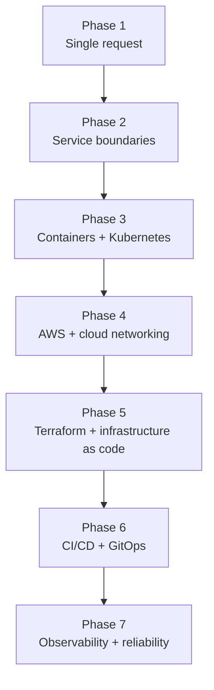

# Production Systems Troubleshooting & Request Tracing Lab

A hands-on systems learning lab for tracing requests, understanding service boundaries, diagnosing failures from evidence, and explaining what happened clearly.

The application in this repository is not the product. It is the laboratory.

The real subject is systems reasoning: how a request moves through connected components, why each component exists, what evidence each boundary produces, where behavior changed, and how to prove the root cause without guessing.

**Core principle:** The application is the practice environment. The real lesson is how to follow a request through the system, prove what happened, and explain the result clearly.

## Why I Built This

I originally broke into technology by learning tools individually. That helped me become familiar with many technologies: I could read documentation, operate a component, follow a runbook, and troubleshoot a specific tool in isolation.

But connected systems ask a different kind of question.

It is one thing to know what Docker, Kubernetes, NGINX, Redis, APIs, databases, and cloud services are. It is another thing to understand how a request travels through them, which component owns which responsibility, what evidence each layer leaves behind, and how one failure changes the behavior of the whole system.

Over time, I noticed that I retain technical concepts best through organization, diagrams, repetition, request tracing, deliberate failure, and explaining systems in my own words. I learn by drawing the architecture, predicting what should happen, breaking one piece, observing symptoms, collecting evidence, and walking the request path until the failed boundary becomes clear.

This project brings those habits into one place.

A controlled lab gives space to experience both healthy behavior and failure without the pressure of a real incident. The goal is to build reasoning habits before those habits are needed under ambiguity or pressure.

## The Problem This Lab Tries To Solve

Modern systems are made of layers: proxies, APIs, containers, caches, databases, queues, Kubernetes networking, cloud infrastructure, automation, deployment systems, and observability.

Learning each component individually is useful, but it is not enough.

This lab is built around the central problem:

```text
Knowing individual technologies is not the same as understanding how a system works when those technologies are connected.
```

The project is meant to help a learner move from:

```text
I know what these tools are.
```

to:

```text
I can trace the request, identify the failed boundary, prove what happened,
fix it, validate recovery, and explain what should improve next.
```

## The Troubleshooting Method

The same reasoning loop repeats across every phase:

```text
Understand
   ↓
Visualize
   ↓
Predict
   ↓
Observe
   ↓
Trace
   ↓
Diagnose
   ↓
Fix
   ↓
Validate
   ↓
Improve
```

For incidents and failure exercises, the evidence path is:

```text
Symptom
   ↓
Expected request path
   ↓
Known-good boundaries
   ↓
First unknown boundary
   ↓
Evidence
   ↓
Hypothesis
   ↓
Test
   ↓
Root cause
   ↓
Fix
   ↓
Validation
   ↓
Prevention / automation / monitoring
```

The repetition is intentional. Troubleshooting should become a routine way of thinking, not a collection of memorized answers.

## How The Lab Works

Each phase adds a new boundary to the same learning system. The app evolves gradually so the learner can see what changes when a component is introduced.

Every lab should read like a technical story:

```text
Here is the system.
Here is what should happen.
Here is what actually happened.
Here is the evidence.
Here is where behavior changed.
Here is why.
Here is the fix.
Here is how recovery was verified.
Here is what could make this easier to operate next time.
```

Mermaid diagrams are used heavily because architecture becomes easier to reason about when the request path is visible. The learner should practice drawing the system, identifying boundaries, naming protocols, tracing healthy requests, and tracing failed requests.

## Architecture Evolves One Boundary At A Time

The repository intentionally does not begin with a large cloud-native architecture.

Complex systems are easier to understand when each boundary is introduced deliberately. Every new component solves a problem, but every new component also creates another place where a request can fail.

The goal is not to reach Kubernetes, AWS, Terraform, or observability as quickly as possible. The goal is to understand what changes when each layer is introduced.



The system becomes more complex. The troubleshooting method stays recognizable.

## What Every New Component Must Answer

For each new service, tool, or infrastructure layer, ask:

1. Why does this component exist?
2. What problem does it solve?
3. Who communicates with it?
4. What does it communicate with?
5. Which protocol is used?
6. Which host, port, or address is involved?
7. What does healthy behavior look like?
8. What evidence does this component produce?
9. What does failure look like?
10. How does its failure affect the rest of the request path?
11. How would the failure be detected?
12. How would the system recover?
13. Could repetitive diagnosis be automated?

## Project Roadmap

### Phase 1 — Understanding A Request

Learn to follow one request and identify the evidence produced along the way.

Conceptually:

```text
Client
  ↓
Application
```

Phase 1 establishes the smallest useful system and the basic troubleshooting method: HTTP requests, headers, status codes, request IDs, sessions, JWT examples, logs, latency, and controlled application failures.

### Phase 2 — Tracing Service Boundaries

Expand the system with a reverse proxy, application dependencies, durable and temporary state, asynchronous paths, health/readiness, and failure evidence.

Conceptually:

```text
Client
  ↓
NGINX
  ↓
Application
  ├── PostgreSQL
  ├── Redis
  ├── asynchronous worker path
  └── external/service boundaries
```

Phase 2 represents the transition from one process to multiple meaningful service boundaries. The focus is not simply building an application. The focus is request paths, service boundaries, evidence, and failure isolation.

This is the current completed checkpoint before the project moves deeper into containerized operation.

### Phase 3 — Containerized Systems & Kubernetes Troubleshooting

Take the same application into Docker and Kubernetes, then learn how deployment state, networking, Services, EndpointSlices, probes, configuration, rollouts, Helm, and dependencies affect the request path.

Management path:

```text
Deployment
  ↓
ReplicaSet
  ↓
Pod
```

Traffic path:

```text
Client
  ↓
Ingress
  ↓
Service
  ↓
EndpointSlice
  ↓
Ready Pod
  ↓
Application
  ↓
Dependency
```

Phase 3 takes the same reasoning model into a more complex operating environment.

### Phase 4 — Cloud Networking & AWS Infrastructure

Planned future direction: move the containerized system into AWS and trace requests across cloud-network boundaries.

Future topics may include VPCs, public and private subnets, route tables, security groups, NACL concepts, DNS, Route 53, load balancers, internal versus external load balancing, EKS, private workloads, cross-VPC communication, VPC peering, Lambda-to-private-service connectivity, ElastiCache concepts, RDS, and request tracing across AWS and Kubernetes boundaries.

Key learning question:

```text
What changes when the request path leaves the local/Kubernetes-only environment
and crosses cloud networking boundaries?
```

### Phase 5 — Infrastructure As Code & Consistent State

Planned future direction: rebuild and manage cloud infrastructure declaratively with Terraform so the environment can be reproduced consistently instead of relying on manual configuration.

Future topics may include providers, resources, variables, outputs, modules, state, remote state, state locking, drift, imports, plans, applies, lifecycle behavior, dependencies, reusable modules, environment separation, and safe infrastructure changes.

The progression is:

```text
Phase 4:
Understand and operate the infrastructure manually.

Phase 5:
Represent that infrastructure as code.
```

Understand the system before automating its creation.

### Phase 6 — CI/CD, Deployment Automation & GitOps

Planned future direction: automate how application and infrastructure changes are tested, delivered, reviewed, deployed, and reconciled.

Future topics may include Git workflow, CI fundamentals, automated testing, image builds, container registries, image tagging, deployment pipelines, environment promotion, deployment validation, rollback automation, GitHub Actions, GitOps principles, desired state, reconciliation, declarative Kubernetes deployment, Argo CD or Flux, configuration drift, deployment history, controlled releases, secrets/configuration handling, and automated smoke tests.

Beginner-friendly mental model:

```text
Terraform:
What infrastructure should exist?

GitOps / deployment automation:
What application or platform configuration should be running,
and how do we continuously reconcile the environment toward that desired state?
```

There is overlap, but the distinction helps keep the learning path organized.

### Phase 7 — Observability, Monitoring & Reliability

Planned future direction: observe the complete system, detect degradation before users report it, correlate evidence across layers, and improve reliability based on what the system is actually doing.

Future topics may include CloudWatch, New Relic, logs, metrics, traces, distributed tracing, request IDs, dashboards, alerts, dependency monitoring, latency, error rates, throughput, saturation, health/readiness monitoring, Kubernetes observability, infrastructure observability, application observability, SLI/SLO concepts, error budgets, incident detection, incident response, runbooks, RCA/postmortems, MTTD, MTTR, toil, automation, recurring failure analysis, reliability improvements, capacity/scaling concepts, and load testing when the curriculum can support meaningful capacity reasoning.

The progression is:

```text
First understand the request.
Then understand the boundaries.
Then operate the system.
Then move it into cloud infrastructure.
Then codify the infrastructure.
Then automate how changes reach it.
Then deeply observe and improve the entire system.
```

## How To Navigate The Repository

| Phase | Status | Focus | Start Here | Evidence |
| --- | --- | --- | --- | --- |
| Phase 1 | Established foundation | Understanding a request | [Phase 1 README](phases/phase-01-understanding-a-request/README.md) | [phase-01.md](AnswersByGetty/phase-01.md) |
| Phase 2 | Completed checkpoint | Tracing service boundaries | [Phase 2 README](phases/phase-02-tracing-service-boundaries/README.md) | [phase-02.md](AnswersByGetty/phase-02.md) |
| Phase 3 | Current / next operating layer | Containers and Kubernetes troubleshooting | [Phase 3 README](phases/phase-03-kubernetes-operations-troubleshooting/README.md) | [phase-03.md](AnswersByGetty/phase-03.md) |
| Phase 4 | Planned | AWS networking and infrastructure | Planned | Planned |
| Phase 5 | Planned | Terraform and infrastructure state | Planned | Planned |
| Phase 6 | Planned | CI/CD, deployment automation, and GitOps | Planned | Planned |
| Phase 7 | Planned | Observability, monitoring, and reliability | Planned | Planned |

The `phases/` directory contains reusable lab instructions. `AnswersByGetty/` contains execution notes, captured evidence, commands, interpretations, conclusions, and retained takeaways.

## Learning Evidence

The evidence pattern is:

```text
command
  ↓
actual output
  ↓
observation
  ↓
interpretation
  ↓
conclusion
```

This is different from memorizing answers. Troubleshooting conclusions should be connected to observations.

Use [AnswersByGetty/README.md](AnswersByGetty/README.md) for the evidence-writing standard, and use each phase README as the starting point for that phase.

## Running The Local Application

Create a virtual environment:

```bash
python3 -m venv venv
source venv/bin/activate
```

Install dependencies:

```bash
python -m pip install -r requirements.txt
```

Start the app:

```bash
python app.py
```

Open:

```text
http://127.0.0.1:5000
```

Default Phase 1 lab credentials:

```text
username: getty
password: cloud
```

## Start Here

Start with [Phase 1](phases/phase-01-understanding-a-request/README.md) if you want the full learning path.

Start with [Phase 2](phases/phase-02-tracing-service-boundaries/README.md) if you already understand the single-request basics and want to study service boundaries, state, dependencies, and failure evidence.

Phase 3 and later phases should build on the same application and the same troubleshooting method.
