# Phase 2 Labs

## Table Of Contents

1. [Lab 01: Three-Tier Architecture](#lab-01-three-tier-architecture)
2. [Lab 02: NGINX Reverse Proxy](#lab-02-nginx-reverse-proxy)
3. [Lab 03: PostgreSQL Persistence](#lab-03-postgresql-persistence)
4. [Lab 04: Redis Cache And Session Support](#lab-04-redis-cache-and-session-support)
5. [Lab 05: Support-Ticket Data Model](#lab-05-support-ticket-data-model)
6. [Lab 06: Database Operations, Performance, And Resilience](#lab-06-database-operations-performance-and-resilience)
7. [Lab 07: API Design And Authentication](#lab-07-api-design-and-authentication)
8. [Lab 08: Webhooks And Asynchronous Delivery](#lab-08-webhooks-and-asynchronous-delivery)
9. [Lab 09: Workers And Queues](#lab-09-workers-and-queues)
10. [Lab 10: WebSockets And Real-Time Updates](#lab-10-websockets-and-real-time-updates)
11. [Lab 11: Health And Readiness](#lab-11-health-and-readiness)
12. [Lab 12: Logs, Metrics, Traces, And Request IDs](#lab-12-logs-metrics-traces-and-request-ids)
13. [Lab 13: Container Foundation](#lab-13-container-foundation)
14. [Lab 14: Production-Readiness Review](#lab-14-production-readiness-review)
- [Lab 05 Setup Reference](#lab-05-setup-reference)
- [Production Review Scenarios](#production-review-scenarios)

## Lab 01: Three-Tier Architecture

Start with the mental model before writing code.

You are designing the first production-style version of the app:

```text
Browser or curl -> NGINX -> Flask API -> PostgreSQL
```

### Build

Do not install anything new yet. Create the design you are about to build.

1. Draw the architecture in two views:
   - Component view: Browser or curl, NGINX, Flask API, and PostgreSQL.
   - Request-tracing view: the path one request takes through those components and the evidence each component should leave behind.
2. Label each layer's job.
3. Define the request path for one successful login or API request.
4. Define where request IDs should appear.
5. Define what evidence each layer should produce.

### Prove

Write a short explanation for each layer:

```text
Browser or curl:
NGINX:
Flask API:
PostgreSQL:
```

### Break

Before building, predict symptoms:

```text
If NGINX cannot reach Flask, the user sees:
If Flask cannot reach PostgreSQL, the user sees:
If PostgreSQL is slow, the user sees:
If request IDs are missing, the investigation is harder because:
```

### Done When

You can explain the architecture without reading the diagram.

### Evidence To Capture

```text
Architecture diagram:
Component view:
Request path:
Layer responsibilities:
Expected logs:
Expected metrics:
Expected failure symptoms:
Interview explanation:
Retained takeaway:
```

## Lab 02: NGINX Reverse Proxy

Put NGINX in front of Flask.

The point is not just to make NGINX work. The point is to understand why a production service usually has an edge or proxy layer before the application.

### Build

1. Run Flask on an internal app port.
2. Add an NGINX config that forwards traffic to Flask.
3. Preserve useful headers:
   ```text
   Host
   X-Forwarded-For
   X-Forwarded-Proto
   X-Request-ID
   ```
4. Send traffic through NGINX instead of directly to Flask.

### Prove

Capture:

```text
curl through NGINX:
curl directly to Flask:
NGINX access log:
NGINX error log:
Flask log:
Response headers:
```

### Break

Break the upstream Flask port or stop Flask.

Answer:

```text
What status did the client receive?
Did NGINX see the request?
Did Flask see the request?
What proves where the request stopped?
```

### Done When

You can explain why `502 Bad Gateway` usually means the proxy could not get a valid response from the upstream service.

### Evidence To Capture

```text
NGINX config:
Healthy request:
NGINX access log:
Flask log:
Broken upstream symptom:
Layer that failed:
Interview explanation:
Retained takeaway:
```

## Lab 03: PostgreSQL Persistence

Add PostgreSQL as the durable data layer.

The goal is to understand what the database owns and how application behavior changes when data is no longer only in memory.

### Build

1. Start PostgreSQL locally.
2. Create a database for the app.
3. Create one simple table that supports the app.
4. Add Flask configuration for the database connection.
5. Add one read path and one write path through the app.

Keep the data model simple. This lab is about the request path and evidence, not fancy schema design.

### Prove

Capture:

```text
Database created:
Table created:
App writes data:
App reads data:
SQL query proves the stored row:
Flask log shows the request:
```

### Break

Use the wrong database password or stop PostgreSQL.

Answer:

```text
What did the user see?
What did Flask log?
Did NGINX cause the failure?
What proves PostgreSQL was the failed dependency?
```

### Done When

You can explain why PostgreSQL is the source of truth and why application logs alone are not enough to prove data was saved.

### Evidence To Capture

```text
Schema:
Connection configuration:
Write request:
Read request:
SQL evidence:
Application log:
Database failure symptom:
Interview explanation:
Retained takeaway:
```

## Lab 04: Redis Cache And Session Support

Add Redis as a supporting cache or session layer.

Redis is not the durable source of truth. In this project, PostgreSQL owns durable data. Redis should own one temporary responsibility that makes the service faster or easier to operate.

Redis can also be used as a queue backend in some architectures, but that is a different job. In this lab, Redis supports the synchronous request path as cache or session state. Workers and queues come later when the system starts doing asynchronous work outside the request/response path.

Good options:

```text
Cache one read-heavy response.
Store temporary session-like state.
Track simple rate-limit counters.
```

Pick one. Do not try to use Redis for everything.

### Mental Model

Use this comparison:

| Pattern | What it means | Example | Belongs here? |
| --- | --- | --- | --- |
| Cache | Store temporary data so future reads are faster | Cache a profile or project list | Yes |
| Session state | Store temporary user/session data | Login/session lookup | Yes |
| Queue | Store work to be processed later | Generate report, send email, process video | Later |
| Worker | Process queued work outside the web request | Background job pod | Later |
| Real-time | Push updates with very low delay | WebSocket progress updates | Later |

Async does not automatically mean real-time. Async usually means the user request can return before the work is finished. Real-time means the user receives live or near-live updates.

### Build

1. Start Redis locally.
2. Connect Flask to Redis through runtime configuration.
3. Choose one Redis responsibility.
4. Add a code path that reads from Redis.
5. Add a fallback path when Redis is empty or unavailable.

### Prove

Capture:

```text
Redis connection evidence:
Cache miss:
Cache hit:
TTL or expiry:
Fallback behavior:
PostgreSQL remains source of truth:
Why this is cache/session, not queue/worker:
```

### Break

Stop Redis or point Flask at the wrong Redis port.

Answer:

```text
What did the user see?
Did the app fail closed, fail open, or fall back?
Did PostgreSQL still work?
What evidence proves Redis was the failed dependency?
Would this failure block the whole request, degrade performance, or only disable cache/session behavior?
```

### Done When

You can explain:

```text
Redis is fast temporary state.
PostgreSQL is durable state.
The app should know what behavior is safe when Redis is unavailable.
Cache/session Redis belongs beside the app/data path.
Queue/worker Redis is only a boundary preview here; it is implemented later in Lab 09 when the architecture adds asynchronous processing.
```

### Evidence To Capture

```text
Redis responsibility:
Connection configuration:
Cache miss evidence:
Cache hit evidence:
Expiry evidence:
Fallback behavior:
Failure symptom:
Cache vs queue explanation:
Interview explanation:
Retained takeaway:
```

## Lab 05: Support-Ticket Data Model

Build the data model behind the support-ticket application.

### Why This Lab Exists

The app is no longer just a request-tracing demo. It is becoming a public-facing support-ticket system where users can register, submit technical issues or project feedback, review ticket history, and receive support responses.

This lab teaches how one submitted support issue becomes related PostgreSQL records.

### Architecture Before

```text
Browser or curl -> NGINX -> Flask -> PostgreSQL
```

The app already has a simple request path and basic PostgreSQL persistence.

### Architecture After

```text
Browser or curl
  |
  v
NGINX
  |
  v
Flask support-ticket API
  |
  v
PostgreSQL
  |-- users
  |-- tickets
  |-- ticket_messages
  `-- ticket_events
```

Redis may support sessions, cache, or queue behavior later, but tickets belong in PostgreSQL because they are durable business records.

### Key Terms

| Term | Meaning In This Lab |
| --- | --- |
| Primary key | Unique ID for one row |
| Foreign key | Relationship from one table to another |
| Constraint | Database rule that prevents invalid data |
| Index | Data structure that helps common queries run faster |
| Ownership | Rule that decides which user is allowed to access a ticket |
| Audit event | Record of an important change and the request ID that caused it |

### Relationship Model

```text
users
  |-- tickets.created_by
  |-- tickets.assigned_to
  |-- ticket_messages.author_id
  `-- ticket_events.actor_id

tickets
  |-- ticket_messages.ticket_id
  `-- ticket_events.ticket_id
```

### Must Implement Or Inspect

1. Read [sql/001_support_tickets.sql](sql/001_support_tickets.sql).
2. Apply the migration to the local PostgreSQL database.
3. Register a customer user.
4. Log in using a Flask session.
5. Create a support ticket.
6. Add a customer reply.
7. Register or log in as admin user `getty`.
8. View all tickets as admin.
9. Add an internal note as admin.
10. Confirm regular users cannot see internal notes.

### Healthy-Path Verification

Capture one successful ticket creation:

```text
Client request:
Client response:
Flask log:
PostgreSQL users row:
PostgreSQL tickets row:
PostgreSQL ticket_messages row:
PostgreSQL ticket_events row:
Request ID:
```

**Users:** who can log in and what role they have.

**Tickets:** durable support records created by customers.

**Messages:** visible conversation history for a ticket.

**Internal notes:** admin-only messages hidden from regular users.

**Events:** audit records that connect database changes to a request ID.

**Indexes:** query helpers for common lookups, such as one customer's tickets or admin triage by status and priority.

### Controlled Failures

Test at least two:

```text
Duplicate username:
Unauthenticated ticket creation:
Customer tries to view another customer's ticket:
Customer tries to use an admin endpoint:
PostgreSQL stopped or wrong DATABASE_URL:
```

### Evidence To Capture

```text
Schema:
Connection configuration:
Register request:
Login request:
Create ticket request:
Read ticket request:
Admin update request:
SQL evidence:
Application log:
Database failure symptom:
Authorization failure symptom:
Request ID in ticket_events:
Interview explanation:
Retained takeaway:
```

### Troubleshooting Questions

```text
Which table owns each kind of data?
Which foreign keys describe ownership and relationships?
Which constraint prevented bad data?
Which index supports listing one customer's tickets?
Why can customers only see their own tickets?
Why can admins see all tickets and internal notes?
Why do ticket records belong in PostgreSQL instead of Redis?
Which SQL query proves the ticket exists?
Which logs prove the request path?
```

### Interview Explanation

Use this shape:

```text
When a customer creates a ticket, Flask authenticates the user from the server-managed session, validates the request body, inserts the ticket into PostgreSQL, inserts the initial message, and records a ticket event with the request ID. PostgreSQL is the source of truth because tickets must survive app restarts and cache expiration. Redis can support temporary sessions, cache, or queues, but it should not be the durable store for customer support history.
```

### Completion Standard

```text
The learner can explain how one submitted support issue becomes related PostgreSQL records and why specific indexes and constraints exist.
```

### Retained Takeaway

```text
The database is not just storage. It enforces relationships, protects ownership rules with data structure, and gives evidence that the application actually saved the customer's support request.
```

## Lab 06: Database Operations, Performance, And Resilience

Learn how to determine whether a customer-visible symptom belongs to PostgreSQL, the database connection path, or another application layer.

### 1. Why This Lab Exists

Customers report symptoms, not database mechanisms:

```text
The ticket page takes ten seconds.
Saving a ticket hangs.
Everyone is receiving timeouts.
My ticket disappeared.
The application says the database is unavailable.
```

Those symptoms may come from Flask application logic, Redis, connection-pool waiting, network latency, PostgreSQL query execution, lock contention, disk/storage latency, failed transactions, or database unavailability.

The goal is to use evidence to prove the failed layer instead of automatically blaming PostgreSQL or adding an index.

Use this investigation path:

```text
Customer symptom
    ↓
Confirm request reached Flask
    ↓
Confirm Flask attempted database work
    ↓
Measure pool wait time
    ↓
Measure query or transaction time
    ↓
Inspect locks, query plan, CPU, memory, and storage
    ↓
Determine database cause
    ↓
Mitigation, recovery, and prevention
```

### 2. Architecture Through Lab 06

```mermaid
flowchart LR
    Start(("1. START<br/>Browser or curl<br/>sends HTTP request"))
    NGINX["2. NGINX reverse proxy<br/>Port 8080<br/>adds/forwards X-Request-ID"]
    Flask["3. Flask support-ticket API<br/>request tracing middleware<br/>session auth + authorization"]
    Routes{"4. Route decision<br/>Which endpoint?"}

    Notes["5a. Notes path<br/>GET /notes"]
    Tickets["5b. Support-ticket path<br/>register, login, create ticket,<br/>reply, admin note, list ticket"]
    Errors["5c. Safe error path<br/>401, 403, 409, 503<br/>with request_id"]

    Redis{"6a. Redis cache<br/>temporary notes:latest"}
    Pool["6b. Database connection boundary<br/>current app: psycopg.connect per operation"]
    Postgres["7. PostgreSQL primary<br/>durable source of truth"]

    Tables["7a. Database tables<br/>users<br/>tickets<br/>ticket_messages<br/>ticket_events<br/>request_notes"]
    Events["7b. Audit evidence<br/>ticket_events.request_id"]

    DbChecks["7c. Lab 06 inspection<br/>connections and pool concept<br/>transactions and locks<br/>query timing and EXPLAIN<br/>backup, replica, failover concepts"]

    Finish(("8. FINISH<br/>Client receives HTTP response<br/>status + body + X-Request-ID"))

    Start -->|"HTTP request enters app"| NGINX
    NGINX -->|"proxy_pass to Flask"| Flask
    Flask -->|"choose route"| Routes

    Routes -->|"notes read"| Notes
    Routes -->|"support-ticket workflow"| Tickets
    Routes -->|"auth, validation, or DB failure"| Errors

    Notes -->|"check cache"| Redis
    Redis -->|"cache hit returns temporary data"| Notes
    Redis -->|"cache miss or unavailable"| Pool
    Notes -->|"read/write durable notes"| Pool

    Tickets -->|"SQL transaction"| Pool
    Pool -->|"database call"| Postgres
    Postgres -.->|"stores rows in"| Tables
    Tables -.->|"request_id proves change"| Events

    Postgres -.->|"inspected by Lab 06"| DbChecks

    Notes -->|"JSON result"| Flask
    Tickets -->|"JSON result"| Flask
    Errors -->|"safe error JSON"| Flask
    Flask -->|"HTTP response"| NGINX
    NGINX -->|"response returns to client"| Finish
```



#### How To Read The Diagram

Follow the numbered boxes for the request path. Solid arrows show request/response movement. Dashed arrows show evidence or inspection paths, not separate user traffic.

| Step | What happens | Evidence to look for |
| --- | --- | --- |
| 1 | Browser or `curl` sends the HTTP request. | URL, method, request body, client timing |
| 2 | NGINX accepts the request and proxies it to Flask. | NGINX access log, upstream status, upstream time, `X-Request-ID` |
| 3 | Flask receives the request and starts route handling. | Flask log, route name, request ID, status code |
| 4 | Flask chooses the route path. | Route decision, auth/validation result, error category if it fails early |
| 5a | The notes path may check Redis before PostgreSQL. | Redis hit/miss, TTL, fallback behavior |
| 5b | The support-ticket path uses PostgreSQL for durable ticket work. | SQL transaction, ticket/message/event rows |
| 5c | Safe errors return with a request ID instead of hiding the failed layer. | `401`, `403`, `409`, or `503` response with request ID |
| 6a | Redis may serve temporary cached data, or the request may fall back toward PostgreSQL. | Redis hit/miss, TTL, Redis availability, fallback behavior |
| 6b | The database connection boundary is where Lab 06 starts asking connection questions. | connection configuration, connection acquisition time, active/idle/waiting connections |
| 7 | PostgreSQL executes the query or transaction against durable data. | query timing, locks, rollback, `EXPLAIN`, CPU, memory, I/O |
| 7a/7b | PostgreSQL stores durable rows and audit evidence. | `users`, `tickets`, `ticket_messages`, `ticket_events`, `request_id` |
| 7c | Lab 06 inspection explains whether the DB layer caused the symptom. | pool wait, query duration, lock wait, disk wait, replica lag, failover evidence |
| Response arrows | Flask builds a JSON result or safe error and sends it back through NGINX. | response body, final status, response headers, `X-Request-ID` |
| 8 | The client receives the final HTTP response. | browser/curl output, final status, total request latency |

The request is synchronous because the client waits for Flask to finish the work before receiving the response. If PostgreSQL is slow during ticket creation, the client waits too.

The implemented local app has Flask, Redis, and PostgreSQL. The production concepts in the inspection path are studied here so the learner can reason about operations without building a multi-node database system on a laptop.

### 3. Database Connections

A database connection is an active communication channel between the application and PostgreSQL. Creating connections has CPU, memory, authentication, and network overhead. PostgreSQL has finite connection capacity, so a connection should be opened, used safely, and released.

This app reads the connection string from runtime configuration:

```python
DATABASE_URL = os.environ.get("DATABASE_URL", "dbname=request_tracing_lab")
```

The current helper is:

```python
def get_db_connection():
    return psycopg.connect(DATABASE_URL, row_factory=dict_row)
```

This means the current app opens a PostgreSQL connection when a route calls `get_db_connection()`. It does not currently use a real application-side connection pool. That is acceptable for the lab, but the operational concept matters because production services often use a pool to avoid creating a new database connection for every request.

Inspect the current connection evidence:

```bash
psql request_tracing_lab -c "SELECT current_database(), current_user, inet_server_addr(), inet_server_port();"
```

### 4. Connection Pooling

A pool maintains reusable open database connections. Flask borrows a connection, executes SQL, and returns it. Pooling reduces setup overhead and limits simultaneous database use, but a pool does not increase database capacity by itself.

| Pool metric | Question it answers |
| --- | --- |
| Pool size | How many reusable connections are allowed? |
| Active or checked-out | How many are currently being used? |
| Idle | How many are immediately available? |
| Waiting requests | How many requests cannot get a connection? |
| Acquisition time | How long does a request wait for a connection? |
| Timeouts | How often does waiting exceed the configured limit? |

Connection exhaustion looks like:

```text
Pool size = 10
10 connections are busy
Additional requests wait
Waiting exceeds timeout
Application returns timeout or 503/500
```

Distinguish:

```text
database maximum connections
application pool size
active database connections
requests waiting for the pool
```

Current-app exercise:

```bash
psql request_tracing_lab -c "SELECT count(*) AS active_connections
FROM pg_stat_activity
WHERE datname = 'request_tracing_lab';"
```

Conceptual exercise:

```text
If the app later uses a pool of 5 and six long ticket queries run at once,
the sixth request waits. If it waits longer than the timeout, the customer
may see a timeout even if PostgreSQL is still running.
```

### 5. Transactions

Ticket creation is a multi-table write:

```text
Insert ticket
Insert initial ticket message
Insert audit event
Commit
```

The app executes this inside a database connection context:

```text
with get_db_connection() as conn:
    with conn.cursor() as cur:
        INSERT INTO tickets ...
        INSERT INTO ticket_messages ...
        INSERT INTO ticket_events ...
```

Key terms:

| Term | Meaning |
| --- | --- |
| `BEGIN` | Start a transaction |
| SQL operations | Work performed inside the transaction |
| `COMMIT` | Make the work durable |
| `ROLLBACK` | Undo uncommitted work |
| Atomicity | All related changes happen together or none remain |

Partial ticket creation is dangerous because a customer may see a ticket without a first message, or an operator may lose the audit event that explains how the ticket was created.

Required rollback question:

```text
Did the customer action partially save, fully save, or fully roll back?
```

### 6. Locks And Blocking

Locks protect data from conflicting concurrent changes.

```text
Transaction A updates Ticket 1001 and does not commit.
Transaction B tries to update Ticket 1001.
Transaction B waits for the lock.
```

Useful terms:

| Term | Meaning |
| --- | --- |
| Row lock | A lock on one row being changed |
| Lock holder | The transaction that currently owns the lock |
| Lock waiter | The transaction waiting for the lock |
| Long-running transaction | A transaction that stays open longer than expected |
| Blocking | One transaction makes another wait |
| Deadlock | Two transactions wait on each other; PostgreSQL aborts one so the system can continue |

Symptoms may include a save operation hanging, an update timing out, low CPU with high latency, or one ticket ID being affected while other tickets still work.

Beginner-friendly inspection commands:

```sql
SELECT pid, state, wait_event_type, wait_event, query
FROM pg_stat_activity
WHERE datname = 'request_tracing_lab';
```

This shows active sessions and whether they are waiting.

```sql
SELECT pid, now() - xact_start AS transaction_age, state, query
FROM pg_stat_activity
WHERE xact_start IS NOT NULL
ORDER BY transaction_age DESC;
```

This shows long-running transactions.

```sql
SELECT blocked_locks.pid AS waiting_pid,
       blocking_locks.pid AS blocking_pid
FROM pg_locks blocked_locks
JOIN pg_locks blocking_locks
  ON blocking_locks.locktype = blocked_locks.locktype
 AND blocking_locks.database IS NOT DISTINCT FROM blocked_locks.database
 AND blocking_locks.relation IS NOT DISTINCT FROM blocked_locks.relation
 AND blocking_locks.page IS NOT DISTINCT FROM blocked_locks.page
 AND blocking_locks.tuple IS NOT DISTINCT FROM blocked_locks.tuple
 AND blocking_locks.transactionid IS NOT DISTINCT FROM blocked_locks.transactionid
 AND blocking_locks.classid IS NOT DISTINCT FROM blocked_locks.classid
 AND blocking_locks.objid IS NOT DISTINCT FROM blocked_locks.objid
 AND blocking_locks.objsubid IS NOT DISTINCT FROM blocked_locks.objsubid
 AND blocking_locks.pid != blocked_locks.pid
WHERE NOT blocked_locks.granted
  AND blocking_locks.granted;
```

This shows which session is waiting and which session is blocking it. Do not memorize it; know what question it answers.

### 7. Slow-Query Investigation

Use this sequence:

```text
Customer symptom
    |
    v
Reproduce and capture request ID
    |
    v
Measure total request latency
    |
    v
Confirm whether Flask waited on PostgreSQL
    |
    v
Identify the exact SQL
    |
    v
Measure query duration
    |
    v
Inspect connections and locks
    |
    v
Run EXPLAIN or EXPLAIN ANALYZE safely
    |
    v
Review table size, query frequency, and query plan
    |
    v
Choose the correct fix
```

Evidence sources:

```text
application logs with request IDs
APM or trace spans, if available
PostgreSQL logs
slow-query logging
pg_stat_activity
pg_stat_statements, optionally/conceptually
query timing
EXPLAIN
EXPLAIN ANALYZE
```

`EXPLAIN` shows PostgreSQL's planned execution path without executing the query.

`EXPLAIN ANALYZE` executes the query and shows actual timing and row counts. Use it carefully, preferably with safe `SELECT` queries in a lab environment.

### 8. Query Plans And Indexes

Useful plan terms:

| Plan term | Beginner meaning |
| --- | --- |
| Sequential Scan | PostgreSQL reads through the table |
| Index Scan | PostgreSQL uses an index to find rows |
| Bitmap Index Scan | PostgreSQL uses an index to build a set of matching row locations before fetching rows |
| Estimated rows | PostgreSQL's prediction before running |
| Estimated cost | PostgreSQL's relative planning cost, not dollars or milliseconds |
| Actual rows/time | Measured result from `EXPLAIN ANALYZE` |

Example lookup:

```sql
SELECT *
FROM tickets
WHERE created_by = 27
ORDER BY created_at DESC;
```

Useful index shape:

```sql
CREATE INDEX idx_tickets_created_by_created_at
ON tickets (created_by, created_at DESC);
```

Explanation:

```text
CREATE INDEX: create a lookup structure.
idx_tickets_created_by_created_at: descriptive index name.
ON tickets: attach it to the tickets table.
created_by: supports filtering one user's tickets.
created_at DESC: supports newest-first ordering.
```

Misconceptions to correct:

```text
A Sequential Scan does not automatically mean an index is missing.
PostgreSQL may choose a Sequential Scan for a small table.
PostgreSQL may avoid an index if most rows match.
An index does not automatically fix a slow query.
An existing index may still be unsuitable for the query shape.
```

An index is a reasonable candidate when:

```text
Large table
+
frequently executed query
+
selective filtering or sorting
+
query plan shows expensive scanning or sorting
+
measured customer impact
```

Index trade-offs:

```text
extra disk storage
extra memory/cache pressure
slower inserts
slower updates
slower deletes
maintenance overhead
too many indexes can hurt write-heavy workloads
```

Before-and-after exercise:

```text
1. Measure query.
2. Inspect plan.
3. Add appropriate index.
4. Inspect new plan.
5. Measure again.
6. State whether performance actually improved.
```

### 9. CPU, Memory, Disk I/O, And Throughput

| Area | What to ask | Common clues |
| --- | --- | --- |
| CPU | Is PostgreSQL actively consuming compute? | Expensive queries, too many concurrent queries, large scans, joins, sorts, aggregates, inefficient plans |
| Memory | Is RAM helping cache work or being exhausted? | Cache misses, temp files, sorting/hashing spills, too many concurrent queries, swapping, OOM events |
| Disk I/O | Is PostgreSQL waiting on storage? | High disk latency, high IOPS, slow reads/writes, checkpoints, storage queueing |
| Throughput | How much work completes over time? | Queries/sec, transactions/sec, rows read/written, bytes read/written |

Low CPU with high latency may indicate waiting rather than compute saturation.

Memory is layered:

```text
PostgreSQL shared buffers/cache
per-query working memory
operating-system page cache
Redis memory as a separate cache-layer responsibility
```

Latency is time one operation takes. Throughput is the number or volume of operations completed over time. High throughput is not automatically bad; compare it with baseline, capacity, and customer impact.

### 10. Required Metrics Cheat Sheet

| Metric | What it tells you | What it does not prove | Next evidence |
| --- | --- | --- | --- |
| CPU | Compute activity | Which query is responsible | Slow queries, query plan |
| Memory | RAM usage and cache/workspace pressure | That memory is exhausted | Swap, cache hit, temp files |
| Query latency | Time SQL took | Why it took that long | Plan, locks, I/O |
| Active connections | Connected clients | That the pool is exhausted | Pool usage and waiting |
| Pool utilization | Borrowed pool capacity | Database health by itself | Wait time, timeouts |
| Lock waits | Transactions are blocking | Which application action caused it | Blocking session and request ID |
| Disk IOPS | Number of storage operations | Whether operations are efficient | I/O latency and throughput |
| Disk throughput | Amount of data moving | Whether users are impacted | Latency and baseline |
| Slow-query count | Queries exceeded a threshold | Root cause | Exact query and plan |
| Replication lag | Replica delay | Why replication is behind | Write load, network, replica health |

### 11. Database Boundary Cheat Sheet

Use this table only to decide whether the investigation should enter the database layer. Labs 07-10 own API design, authentication, authorization, webhooks, queues, workers, and real-time behavior.

| Customer symptom | Before database call? | Waiting for connection? | Inside PostgreSQL? | First evidence |
| --- | --- | --- | --- | --- |
| Ticket list takes ten seconds | Possible if Flask never attempts SQL | Possible if pool wait is high | Slow query, scan, sort, lock, or I/O wait | Request ID, Flask timing, SQL timing, `EXPLAIN` |
| Saving a ticket hangs | Possible if request never reaches DB code | Possible if no connection is available | Transaction wait, row lock, disk write latency, unavailable primary | Flask log, connection timing, `pg_stat_activity`, locks |
| Everyone gets timeouts | Possible app/proxy saturation before database work | Possible pool exhaustion | PostgreSQL unavailable, overloaded, or storage-bound | NGINX status, Flask DB errors, connection count |
| One ticket update hangs | Less likely if other DB-backed routes work | Possible but usually broader | Row lock or long transaction on that ticket | Lock inspection and active transaction query |
| Ticket appears missing | Possible if app did not query the expected database path | Not likely | Transaction rolled back, read replica stale, wrong database target | SQL query on primary, request ID, connection config |
| Database CPU is high | No, symptom is already DB-side | Possible if many queries are active | Expensive scans, joins, sorts, aggregates | CPU metric, slow queries, query plans |
| Database CPU is low but request latency is high | Possible if delay happened before DB work | Possible pool wait | Locks, disk I/O wait, connection wait, network latency | Wait events, pool metrics, I/O latency |
| Connection refused | Flask cannot open DB connection | No connection acquired | PostgreSQL down, wrong host, wrong port, firewall/network issue | Flask exception and direct connection test |
| Cache failure increases database load | Redis failed before DB query | More DB requests may consume pool slots | PostgreSQL sees more reads after cache fallback | Redis error plus DB query volume |
| Replica returns stale data | App chose a replica/read path | Not usually | Replication lag | Replica lag metric, compare primary and replica |

### 12. Database Availability And Resilience

Backups, replicas, and failover solve different problems.

| Concept | What it helps with | What it does not replace |
| --- | --- | --- |
| Backup | Recover from deletion, corruption, or bad release | Live availability by itself |
| WAL / transaction log | Point-in-time recovery and replaying changes | Query tuning or app retry logic |
| Point-in-time recovery | Restore close to a chosen time | Avoiding all data loss without an RPO |
| Retention | How long backups are kept | Proof that restore works |
| Off-host encrypted backup | Survives local disk/instance loss | Regular restore testing |
| Primary database | Handles writes | Protection from every failure |
| Read replica | Read capacity and availability for read workloads | Durable backup or write scaling |
| Synchronous replication | Stronger durability before commit returns | Lower latency or infinite scale |
| Asynchronous replication | Lower write latency than sync replication | Zero lag |
| Replication lag | Delay between primary and replica | Root cause by itself |
| Multi-AZ placement | Survives some zone/instance failures | Every outage or app reconnect issue |
| Automatic failover | Promotes/repoints to a healthy instance | No customer impact |
| RPO | How much data loss is acceptable | How fast service returns |
| RTO | How long recovery can take | How much data may be lost |

Clarifications:

```text
Replicas provide availability and read capacity, not a replacement for backups.
Backups protect against deletion and corruption.
Multi-AZ does not eliminate every failure mode.
Failover can cause temporary connection errors.
The application must reconnect to the database safely after failover.
Read replicas may return stale data because of replication lag.
Sharding is conceptual only and not needed for this application.
```

### 13. Managed Database Perspective

Managed PostgreSQL services such as AWS RDS or Aurora can handle or assist with:

```text
provisioning
backups
patching
monitoring
Multi-AZ replication
failover
storage management
maintenance windows
```

Managed does not mean:

```text
no schema responsibility
no query tuning
no connection-pool planning
no capacity management
no monitoring
no restore testing
no application database-reconnect planning
```

This matters for Cloud Operations, DevOps, SRE, and customer-facing infrastructure roles because the service may be managed, but the application and operating model still need evidence, ownership, and recovery expectations.

### 14. Controlled Exercises

| Exercise | Level | Evidence |
| --- | --- | --- |
| Healthy connection and query | Required hands-on | `psql` connection query and ticket lookup |
| Wrong database credentials | Required hands-on | Connection error before SQL runs |
| Wrong database hostname or port | Required hands-on | Connection refused or timeout |
| Database unavailable | Required hands-on | App returns safe dependency error |
| Failed transaction and rollback | Required hands-on | Row visible before rollback, gone after rollback |
| Lock wait using two database sessions | Optional hands-on | Waiting session in `pg_stat_activity` |
| Slow query or simulated slow query | Required hands-on | `pg_sleep` timing or measured slow query |
| `EXPLAIN` on a ticket lookup | Required hands-on | Query plan output |
| Sequential Scan on a small table | Required hands-on | Plan shows `Seq Scan` and explanation says why small scans may be fine |
| Add an index and compare the plan | Optional hands-on | Before/after plan and timing |
| Connection exhaustion simulation | Conceptual or optional hands-on | Pool-size scenario or active connection count |
| Backup and restore verification | Required hands-on for local backup file; optional hands-on for full restore | `pg_dump` file and restore-test notes |
| Replica lag or failover scenario | Conceptual only | Written explanation of impact and evidence |

Do not force complex HA infrastructure into the local laptop lab.

### 15. Evidence Worksheet

```text
Customer symptom:
Request ID:
Total request latency:
Proxy/upstream latency:
Flask application latency:
Connection acquisition time:
Database query latency:
SQL query:
Query frequency:
Table size:
EXPLAIN result:
EXPLAIN ANALYZE result, if safely used:
Index Scan or Sequential Scan:
Active connections:
Pool usage:
Waiting connections:
Active transactions:
Lock waits:
CPU:
Memory:
Disk IOPS:
Disk throughput:
Replication lag:
Application logs:
Database logs:
Hypotheses considered:
Evidence that ruled causes out:
Failed layer:
Mitigation:
Root cause:
Prevention:
Backup or recovery implication:
Customer explanation:
Engineering escalation:
Retained takeaway:
```

### 16. Explanation Templates

Use this shape:

```text
symptom -> scope -> evidence -> hypothesis -> validation -> mitigation -> root cause -> prevention
```

| Prompt | Concise answer template |
| --- | --- |
| How would you investigate a slow database? | Start from the customer symptom and request ID, confirm Flask attempted database work, measure connection wait and SQL timing, inspect locks/connections, run `EXPLAIN` safely, then choose a fix based on evidence. |
| What is a connection pool? | A reusable set of database connections. The app borrows one, runs SQL, and returns it. It reduces setup overhead and caps database concurrency. |
| What happens when connections are exhausted? | Requests wait for a free connection. If waiting exceeds the timeout, users may see timeouts or safe 5xx responses even if PostgreSQL is still running. |
| Why can latency be high while CPU is low? | The database or app may be waiting on locks, disk I/O, network, pool slots, or long transactions instead of using CPU. |
| What causes locks? | Transactions that read or change data can hold locks so conflicting changes do not corrupt data. Long transactions make lock waits more visible. |
| How do you determine whether an index is needed? | Confirm customer impact, find the exact query, check table size/frequency, inspect the plan, and add an index only if it supports the filter/sort pattern. |
| What does `EXPLAIN` show? | The planned execution path, such as scan type, estimated rows, and cost. `EXPLAIN ANALYZE` also runs the query and reports actual timing. |
| Why not index every column? | Indexes cost storage and maintenance and can slow writes. Too many indexes can hurt write-heavy workloads. |
| Backup vs replica vs failover? | Backup restores data after loss/corruption. Replica helps read capacity or standby availability. Failover moves service to a healthy primary or standby. |
| What are RPO and RTO? | RPO is acceptable data-loss window. RTO is acceptable recovery-time window. |
| Why use RDS or Aurora? | Managed services reduce operational burden for provisioning, backups, patching, monitoring, Multi-AZ, failover, and storage, but the team still owns schema, queries, pooling, monitoring, restore testing, and database reconnect planning. |
| How do you prove the database caused customer impact? | Show the request reached Flask, Flask waited on the database path, database evidence shows query/lock/connection/unavailability impact, and other layers were ruled out. |

### Completion Standard

```text
The learner can determine whether a database-backed customer symptom was caused by connectivity, pool exhaustion, transaction behavior, lock contention, query execution, indexing, storage pressure, or database availability.
```

## Lab 07: API Design And Authentication

Use the support-ticket API to learn clear REST boundaries, validation, authentication, and authorization.

### Why This Lab Exists

APIs are where customers, browsers, scripts, and integrations touch the application. A production support-ticket app needs predictable endpoints, clear status codes, safe authentication, and ownership checks.

### Architecture Before

```text
Browser or curl -> NGINX -> Flask -> PostgreSQL
```

The app has ticket tables and basic support-ticket routes.

### Architecture After

```text
Client
  |
  v
REST API
  |-- /api/auth/*
  |-- /api/tickets
  |-- /api/tickets/<ticket_id>
  `-- /api/admin/tickets/*
        |
        v
Session auth, validation, ownership checks, PostgreSQL
```

### Key Terms

| Term | Meaning |
| --- | --- |
| Resource | Thing the API exposes, such as tickets or messages |
| GET | Read a resource |
| POST | Create a resource or trigger a create-style action |
| PATCH | Partially update a resource |
| DELETE | Remove a resource |
| Session authentication | Server-managed login state represented by a browser cookie |
| JWT | Signed token commonly used for stateless API auth examples |
| OAuth/OIDC | Standards for delegated login and identity |
| Authentication | Proving who the user is |
| Authorization | Deciding what the user can access |
| Idempotency key | Client-provided key that prevents duplicate side effects |

### Must Implement Or Inspect

1. List the support-ticket API resources.
2. Identify which routes require a session.
3. Compare session routes with the existing JWT learning routes.
4. Validate request bodies and content type behavior.
5. Confirm ownership checks for customer tickets.
6. Confirm admin-only routes require the `admin` role.
7. Add or document pagination, filtering, and sorting expectations.
8. Explain API versioning conceptually.
9. Design an idempotency-key approach for duplicate ticket submissions.

### HTTP Status Codes To Explain

| Code | Meaning In This App |
| --- | --- |
| 200 | Successful read or update |
| 201 | Created user, ticket, or message |
| 202 | Accepted for async processing |
| 204 | Success with no response body |
| 400 | Invalid request shape |
| 401 | Not logged in |
| 403 | Logged in but not allowed |
| 404 | Ticket or route not found |
| 409 | Duplicate account or conflicting request |
| 422 | Valid JSON but semantically invalid data |
| 429 | Too many requests |
| 500 | Unexpected application failure |
| 502 | Proxy could not get a valid upstream response |
| 503 | Dependency unavailable |
| 504 | Timeout waiting for upstream work |

### Healthy-Path Verification

Capture with browser DevTools and `curl`:

```text
Register request:
Login request:
Session cookie evidence:
Create ticket request:
List ticket response:
Admin list response:
Request ID:
PostgreSQL records:
```

### Controlled Failures

Test:

```text
Missing JSON body:
Wrong content type:
Missing session:
Customer reads another customer's ticket:
Customer calls admin route:
Duplicate account registration:
Duplicate ticket submission scenario:
```

### Evidence To Capture

```text
API route:
HTTP method:
Request body:
Response body:
Status code:
Request ID:
Browser DevTools evidence:
curl evidence:
Flask log:
PostgreSQL evidence:
Ownership decision:
Interview explanation:
Retained takeaway:
```

### Troubleshooting Questions

```text
Was the user unauthenticated or unauthorized?
Did the API reject the request before touching the database?
Did the API return the right status code for support triage?
Can the same client request create duplicate tickets?
Which evidence proves object ownership was enforced?
```

### Interview Explanation

```text
The support-ticket API uses nouns for resources, sessions for the browser workflow, and explicit ownership checks before returning ticket data. Authentication proves who the user is; authorization proves whether that user can access the ticket. Status codes and request IDs make failures easier to triage.
```

### Completion Standard

```text
The learner can explain the support-ticket API boundary, how login state is represented, and why ownership checks are separate from authentication.
```

### Retained Takeaway

```text
A clear API makes support easier because each request has an expected method, body, status code, owner, and evidence trail.
```

## Lab 08: Webhooks And Asynchronous Delivery

Send support-ticket events to another system when something important happens.

### Why This Lab Exists

An API is when a client asks your app for something. A webhook is when your app tells another system that something happened.

Support-ticket systems often notify external tools when tickets are created, updated, or resolved.

### Architecture Before

```text
Client -> Flask support-ticket API -> PostgreSQL
```

The ticket request commits durable data synchronously.

### Architecture After

```text
Client
  |
  v
Flask support-ticket API
  |-- PostgreSQL ticket/event rows
  `-- webhook delivery attempt
        |
        v
Local webhook receiver
```

### Key Terms

| Term | Meaning |
| --- | --- |
| Webhook producer | The app sending the event |
| Webhook consumer | The receiver handling the callback |
| HTTP callback | Outbound HTTP request triggered by an event |
| Event payload | JSON body describing what happened |
| Event type | Name such as `ticket.created` |
| Event ID | Unique ID for deduplication |
| Signature | Proof the event came from your app |
| Shared secret | Secret used to create and verify a signature |
| Replay protection | Rejecting old or repeated events |
| Retry | Another delivery attempt after failure |
| Dead-letter thinking | Keeping failed events for later inspection |

### API Versus Webhook

```text
API:
A client requests something from the application.

Webhook:
The application sends an event to another system when something happens.
```

### Must Implement Or Inspect

1. Pick one event: `ticket.created` or `ticket.status_changed`.
2. Define a simple event payload.
3. Start a local webhook receiver.
4. Send an event after the ticket change is saved.
5. Include event ID, event type, timestamp, ticket ID, and request ID.
6. Add a shared-secret signature concept.
7. Store or log delivery status.
8. Define retry behavior and when to stop retrying.

### Healthy-Path Verification

Capture:

```text
Ticket action:
Webhook payload:
Receiver log:
Delivery status:
Event ID:
Request ID:
```

### Controlled Failures

Test:

```text
Receiver returns 500:
Receiver times out:
Wrong shared secret:
Duplicate delivery:
Old timestamp replay:
Network connection refused:
```

### Evidence To Capture

```text
Webhook URL:
Event type:
Event ID:
Payload:
Signature header:
Receiver response:
Delivery status:
Retry behavior:
Duplicate handling:
Failure symptom:
Interview explanation:
Retained takeaway:
```

### Troubleshooting Questions

```text
Was the ticket saved before webhook delivery failed?
Did the receiver receive the request?
Was the signature valid?
Was this a new event or a duplicate delivery?
Should the customer request fail because the webhook failed?
Where is the failed delivery recorded?
```

### Interview Explanation

```text
Webhook delivery allows the support-ticket app to notify another system after a durable ticket event is saved. The receiver must verify signatures, handle retries, and process duplicate events safely because webhooks are commonly delivered at least once.
```

### Completion Standard

```text
The learner can explain the difference between an API request and a webhook event, and why webhook consumers must be idempotent.
```

### Retained Takeaway

```text
Webhooks are outbound event delivery. They connect systems, but they introduce retries, duplicates, signatures, and delivery evidence.
```

## Lab 09: Workers And Queues

Move slow follow-up work out of the main ticket request.

### Why This Lab Exists

The customer should not wait for long-running notification or diagnostic-summary work before the ticket is saved. The app should commit the ticket synchronously, then queue background work that can finish later.

### Architecture Before

```text
Client -> Flask support-ticket API -> PostgreSQL
```

The user waits for the request response.

### Architecture After

```text
Client
  |
  v
Flask support-ticket API
  |-- PostgreSQL ticket rows
  `-- Redis queue
        |
        v
Background worker
  |
  v
Notification or diagnostic-summary job
```

### Key Terms

| Term | Meaning |
| --- | --- |
| Producer | Code that enqueues work |
| Queue | Temporary holding place for jobs |
| Job/message | Unit of background work |
| Consumer | Code that reads from the queue |
| Worker | Process that performs queued work |
| Acknowledgement | Signal that a job completed |
| Retry limit | Maximum attempts before giving up |
| Failed job | Job that could not complete |
| Dead-letter queue | Place to inspect failed jobs later |
| Queue depth | Number of jobs waiting |
| Backlog | Work piling up faster than workers process it |
| Poison message | Job that always fails |
| At-least-once delivery | Job may run more than once |

### Must Implement Or Inspect

1. Pick one background workflow: notification or diagnostic summary.
2. Ensure ticket creation commits to PostgreSQL first.
3. Enqueue a small job after the ticket is saved.
4. Run one worker process manually.
5. Complete one job.
6. Record queue depth and processing duration.
7. Stop the worker and observe backlog.
8. Fail one job and retry it.
9. Explain duplicate processing and idempotency.

Use Redis Queue or another simple Redis-backed Python worker if no queue exists yet. Do not introduce Kafka.

### Healthy-Path Verification

Capture:

```text
Ticket created:
Job enqueued:
Worker started:
Job completed:
Queue depth before:
Queue depth after:
Processing duration:
Request ID or linked event ID:
```

### Controlled Failures

Test:

```text
Worker stopped:
Queue backlog:
Job failure:
Retry:
Failed job:
Duplicate delivery:
Poison message:
```

### Evidence To Capture

```text
Producer code path:
Queue name:
Job payload:
Worker command:
Queue depth:
Worker log:
Retry evidence:
Failed job evidence:
Duplicate-processing prevention:
Interview explanation:
Retained takeaway:
```

### Troubleshooting Questions

```text
Was the ticket saved even if the worker failed?
Is the queue growing?
Are workers processing jobs?
Which job failed?
Can the same job produce duplicate side effects?
How would you avoid duplicate email or duplicate notifications?
```

### Interview Explanation

```text
The ticket request should save durable data first and return quickly. Background workers handle slower follow-up work from a queue. Queues improve responsiveness, but they introduce backlog, retries, failed jobs, and duplicate-processing risks.
```

### Completion Standard

```text
The learner can explain producer, queue, worker, retries, queue depth, and why async work must be idempotent.
```

### Retained Takeaway

```text
Async means the user request can finish before all work is complete. It is useful, but it creates a second system path that needs its own evidence.
```

## Lab 10: WebSockets And Real-Time Updates

Let a customer viewing a ticket receive a support reply or status update without manually refreshing.

### Why This Lab Exists

Asynchronous work and real-time updates are related but not the same. A worker can process work in the background without showing live progress. A WebSocket keeps a connection open so the server can push updates to the client.

### Architecture Before

```text
Browser -> HTTP request -> Flask -> HTTP response
```

The browser asks for updates by refreshing or polling.

### Architecture After

```text
Browser
  |
  v
Persistent WebSocket connection
  |
  v
Flask real-time update path
  |
  v
Ticket room or channel
```

At larger scale, multiple Flask replicas need shared pub/sub so any replica can broadcast the update.

### Key Terms

| Term | Meaning |
| --- | --- |
| HTTP request/response | Client asks, server responds, connection can close |
| HTTP Upgrade | Switch from HTTP to WebSocket protocol |
| WebSocket | Persistent two-way connection |
| Server event | Update pushed from server to client |
| Disconnect | Client or server connection closes |
| Reconnect | Client opens a new connection after disconnect |
| Heartbeat/ping | Small signal proving connection is still alive |
| Room/channel | Group of clients authorized for the same ticket |
| Sticky session | Load balancer keeps a client on the same backend |
| Pub/sub | Shared message path across replicas |

### Must Implement Or Inspect

1. Choose one ticket update event: support reply or status change.
2. Sketch how the browser subscribes to one ticket.
3. Verify the user is authenticated.
4. Verify the user is authorized for that ticket.
5. Send one server event to the connected browser.
6. Test disconnect and reconnect behavior.
7. Document proxy timeout considerations.
8. Explain how multiple replicas would need shared pub/sub.

A minimal demonstration is enough. Do not build a complex chat system.

### Comparison

| Pattern | Best For | Tradeoff |
| --- | --- | --- |
| Polling | Simple periodic checks | Extra requests and delay |
| Server-sent events | One-way server updates | Less flexible than WebSockets |
| WebSockets | Interactive live updates | Persistent connections and scaling concerns |
| Webhooks | Server-to-server event delivery | Not for browser live UI updates |

### Healthy-Path Verification

Capture:

```text
Connection opened:
Authenticated user:
Authorized ticket:
Support reply or status update:
Browser receives update:
Server log:
Request ID or event ID:
```

### Controlled Failures

Test:

```text
Unauthenticated connection:
Unauthorized ticket room:
Client disconnect:
Server restart:
Proxy timeout:
Multiple clients viewing different tickets:
```

### Evidence To Capture

```text
Connection path:
Auth evidence:
Authorization evidence:
Update event:
Client received update:
Disconnect behavior:
Reconnect behavior:
Proxy timeout note:
Scaling note:
Interview explanation:
Retained takeaway:
```

### Troubleshooting Questions

```text
Is the user connected?
Is the user authorized for this ticket?
Did the server emit an update?
Did the proxy close the connection?
Would another app replica know about this update?
Should this feature use polling, SSE, or WebSockets?
```

### Interview Explanation

```text
WebSockets keep a connection open so the server can push ticket updates to the browser. They are different from webhooks, which are server-to-server callbacks. WebSockets need authentication, authorization, reconnect handling, proxy timeouts, and a shared pub/sub design when the app scales beyond one replica.
```

### Completion Standard

```text
The learner can explain request/response HTTP versus persistent WebSocket connections and why real-time updates require different operational evidence.
```

### Retained Takeaway

```text
Real-time means live client updates. It adds connection state, authorization boundaries, and scaling concerns that normal HTTP requests do not have.
```

## Lab 11: Health And Readiness

Design health and readiness checks for the support-ticket application.

### Why This Lab Exists

Health checks help operators and platforms decide whether an application process is alive and whether it is safe to receive traffic. A support-ticket app can be partially available: Redis or a worker may fail while read-only ticket history still works, but PostgreSQL failure may make ticket creation unsafe.

### Architecture Before

```text
Client -> NGINX -> Flask support-ticket API -> PostgreSQL / Redis / worker
```

### Architecture After

```text
/health
  `-- process-level check

/ready
  |-- required dependency checks
  |-- degraded optional dependency checks
  `-- clear JSON response
```

### Key Terms

Health answers:

```text
Is the process alive?
```

Readiness answers:

```text
Can this instance safely receive customer traffic right now?
```

| Term | Meaning |
| --- | --- |
| Liveness | Process is alive |
| Readiness | Instance can safely receive traffic |
| Startup health | App has finished initial startup |
| Dependency health | Required dependencies are reachable |
| Critical dependency | Outage makes core operation unsafe |
| Noncritical dependency | Outage degrades behavior but may not block all traffic |
| Degraded operation | Service works with reduced capability |

### Must Implement Or Inspect

1. Add a lightweight `/health` endpoint.
2. Add a `/ready` endpoint.
3. Make `/ready` check PostgreSQL.
4. Decide whether Redis is required for readiness or allowed to fall back.
5. Return clear status codes and JSON bodies.

Example behavior:

```text
/health -> 200 when Flask is running
/ready  -> 200 when Flask can reach required dependencies
/ready  -> 503 when PostgreSQL is unavailable
```

### Healthy-Path Verification

Capture:

```text
Healthy /health response:
Healthy /ready response:
Flask log:
Database check evidence:
Redis check or fallback decision:
```

### Controlled Failures

Stop PostgreSQL and call both endpoints. Then stop Redis and repeat.

Answer:

```text
Should /health still pass?
Should /ready fail?
Should Redis failure make /ready fail, or should the app stay ready with degraded cache behavior?
Why?
```

### Evidence To Capture

```text
/health healthy response:
/ready healthy response:
/ready failed response:
Dependency checked:
Redis readiness decision:
Status codes:
Interview explanation:
Retained takeaway:
```

### Troubleshooting Questions

```text
Is the process alive?
Can the application safely accept traffic?
Which dependencies are required for ticket creation?
Which dependencies are optional or degradable?
Should Redis outage make the whole ticket API unavailable?
Should worker outage block ticket creation?
```

### Interview Explanation

```text
/health should be cheap and prove the process is alive. /ready should prove whether this instance can safely accept traffic for core operations. PostgreSQL is critical for ticket creation because it owns durable data. Redis, webhook delivery, or workers may cause degraded behavior without requiring the whole API to go offline.
```

### Completion Standard

```text
The learner can explain liveness versus readiness and decide which dependencies should block customer traffic.
```

### Retained Takeaway

```text
Health checks are operational contracts. They protect customers only when they reflect what the service can safely do right now.
```

## Lab 12: Logs, Metrics, Traces, And Request IDs

Correlate evidence across the support-ticket request path.

### Why This Lab Exists

Observability is not a dashboard collection. It is the ability to answer questions from evidence.

When a customer reports that a ticket submission failed or support replies are not updating, the investigation needs a path from symptom to request ID, logs, database rows, cache behavior, queue/worker state, webhook delivery, and real-time update evidence.

### Architecture Before

```text
Client -> NGINX -> Flask -> PostgreSQL / Redis
```

### Architecture After

```text
Customer symptom
  |
  v
Request ID or trace ID
  |
  v
NGINX or edge log
  |
  v
Flask API log
  |
  v
PostgreSQL or Redis evidence
  |
  v
Queue/worker, webhook, or WebSocket evidence
  |
  v
Conclusion
```

### Key Terms

| Term | Meaning |
| --- | --- |
| Structured log | Log with consistent fields |
| Log level | Severity such as info, warning, error |
| Request ID | Identifier for one request |
| Trace ID | Identifier for a request path across multiple spans |
| Span | One timed operation inside a trace |
| Context propagation | Passing IDs across services or async work |
| Metric | Numeric measurement over time |
| p50/p95/p99 | Latency percentiles |
| Saturation | Resource near its limit |
| Safe logging | Avoiding passwords, cookies, tokens, and sensitive content |

### Must Implement Or Inspect

1. Ensure every request has an `X-Request-ID`.
2. Make NGINX pass the request ID to Flask.
3. Make Flask include the request ID in responses.
4. Log method, path, status code, request ID, and duration.
5. Log ticket ID, user ID, job ID, or webhook event ID when relevant.
6. Identify metrics for request rate, error rate, latency, saturation, database connections, query duration, cache hit rate, queue depth, worker failures, webhook failures, and active WebSocket connections.
7. Describe traces and spans conceptually.
8. Avoid logging passwords, session cookies, access tokens, or sensitive ticket content.

### Healthy-Path Verification

Send one request and capture:

```text
Client response header:
NGINX access log:
Flask log:
Request ID match:
Request duration:
PostgreSQL evidence:
Redis evidence, if relevant:
```

### Controlled Failures

Test at least two:

```text
Slow request:
Database unavailable:
Redis unavailable:
Worker backlog:
Webhook delivery failure:
WebSocket disconnect:
Application exception:
```

### Evidence To Capture

```text
Request ID:
Trace ID:
Client evidence:
Proxy evidence:
API evidence:
PostgreSQL evidence:
Redis evidence:
Worker or queue evidence:
Webhook evidence:
WebSocket evidence:
Latency:
Error rate:
Mitigation:
RCA conclusion:
Interview explanation:
Retained takeaway:
```

### Metrics To Know

```text
Request rate:
Error rate:
Latency:
p50:
p95:
p99:
Database connections:
Query duration:
Cache hit rate:
Queue depth:
Worker failures:
Webhook delivery failures:
Active WebSocket connections:
```

### Troubleshooting Questions

```text
Where did the request enter?
Which request ID or trace ID connects the evidence?
Did NGINX forward the request?
Did Flask handle it?
Did PostgreSQL commit data?
Was Redis a cache miss, cache hit, or unavailable?
Is the queue growing?
Did the webhook receiver respond?
Did the browser keep a real-time connection open?
What did you rule out?
What is the first mitigation?
```

### Interview Explanation

```text
Request IDs connect client evidence to proxy and application logs. Metrics show patterns such as rate, errors, latency, saturation, queue depth, and cache behavior. Traces describe parent-child timing across HTTP, database, async jobs, and webhook delivery. Good observability supports moving from symptom to evidence to mitigation without guessing.
```

### Completion Standard

```text
The learner can trace one customer symptom across client, NGINX, Flask, PostgreSQL, Redis, and any async or real-time path using request IDs, logs, metrics, and trace concepts.
```

### Retained Takeaway

```text
Evidence is useful when it is correlated. A log line without a request ID is just a clue; a correlated path can become an RCA.
```

## Lab 13: Container Foundation

Manually containerize one service so the Phase 3 platform work has a solid foundation.

### Why This Lab Exists

Phase 3 is where Docker Compose and Kubernetes become the main subject. This lab only introduces the container basics needed to understand what will be operated later.

### Architecture Before

```text
Flask runs directly on your machine.
PostgreSQL, Redis, and NGINX may also run locally.
```

### Architecture After

```text
Flask API image
  |
  v
Flask API container
  |
  v
Runtime environment variables
```

NGINX, PostgreSQL, Redis, workers, and Compose preparation can be documented here, but the complete multi-container platform belongs in Phase 3.

### Key Terms

| Term | Meaning |
| --- | --- |
| Image | Packaged filesystem and startup command |
| Container | Running instance of an image |
| Dockerfile | Instructions for building an image |
| Base image | Starting image, such as Python slim |
| Layer | Cached filesystem change in an image |
| Build context | Files sent to Docker during build |
| `.dockerignore` | File that keeps unwanted files out of context |
| `COPY` | Add files into the image |
| `RUN` | Execute build-time command |
| `CMD` | Default runtime command |
| Non-root user | Safer runtime user inside the container |

### Must Implement Or Inspect

1. Inspect [Dockerfile](../../Dockerfile).
2. Explain image versus container.
3. Identify the base image.
4. Identify dependency installation.
5. Identify which files are copied.
6. Identify the listening port.
7. Confirm logs go to stdout/stderr.
8. Confirm the container does not require secrets baked into the image.
9. Document required environment variables.
10. Note what Phase 3 will add with Compose and Kubernetes.

### Optional Codex-Assisted Improvements

Codex may help with:

```text
Improving the Dockerfile:
Adding an NGINX image/config:
Preparing PostgreSQL, Redis, and worker services for later Compose:
Documenting environment variables:
Documenting persistent data:
```

Do not build the complete Docker Compose or Kubernetes platform in this lab.

### Healthy-Path Verification

Capture:

```text
Build command:
Image tag:
Run command:
Port mapping:
Health endpoint response:
Container logs:
Environment variables:
```

### Controlled Failures

Test:

```text
Missing environment variable:
Wrong port mapping:
Missing dependency:
Container starts but app cannot reach PostgreSQL:
Health check failure:
```

### Evidence To Capture

```text
Dockerfile path:
Base image:
Build context:
Dependencies:
Runtime command:
Listening port:
Non-root user:
Health check:
Logs:
Failure symptom:
Interview explanation:
Retained takeaway:
```

### Troubleshooting Questions

```text
Did the image build?
Did the container start?
Is the app listening inside the container?
Is the host port mapped correctly?
Are secrets injected at runtime instead of baked into the image?
What data would disappear if the container were deleted?
```

### Interview Explanation

```text
A Docker image packages the Flask API and dependencies. A container runs that image with runtime configuration. The image should not contain secrets, should run as a non-root user, should log to stdout/stderr, and should expose health behavior. Full multi-service orchestration is saved for Phase 3.
```

### Completion Standard

```text
The learner can explain each Dockerfile line and run the Flask API container without turning Phase 2 into a full orchestration lab.
```

### Retained Takeaway

```text
Containers package the service; orchestration operates the service. Learn the package before the platform.
```

## Lab 14: Production-Readiness Review

Review whether the Phase 2 support-ticket application is ready to move into containerized operations.

### Why This Lab Exists

This lab pulls the Phase 2 learning together: support-ticket behavior, database durability, Redis temporary state, API boundaries, webhooks, queues, real-time updates, health/readiness, observability, basic load testing, and failure evidence.

It maps directly to interview prompts like:

```text
Management wants this app in production next week. What do you need before saying yes?
```

### Architecture Before

```text
Browser -> NGINX -> Flask support-ticket API
  |-- PostgreSQL
  |-- Redis
  |-- worker/queue path
  |-- webhook delivery
  `-- WebSocket/SSE/polling path
```

### Architecture After

No major new component is required. This lab produces a launch review and RCA evidence.

### Key Terms

| Term | Meaning |
| --- | --- |
| Functional readiness | Core user workflows work |
| Database readiness | Durable data, backups, and recovery are understood |
| RPO/RTO | Data-loss and recovery-time targets |
| Capacity assumption | Current belief about traffic, CPU, memory, DB, and replicas |
| Rollback plan | How to return to a known-good version |
| Incident communication | Clear update for customers, support, and engineering |
| RCA | Evidence-backed root-cause analysis |

### Must Review

```text
Functional readiness:
Database readiness:
Backup and restore strategy:
RPO/RTO:
Queue and worker behavior:
Webhook delivery:
WebSocket behavior:
Authentication and authorization:
Logs, metrics, and traces:
Security and secret handling:
Capacity assumptions:
Basic load testing:
Rollback considerations:
Incident communication:
RCA:
```

### Basic k6 Scenarios

Use k6 only for focused scenarios after the behavior exists:

```text
Login:
List tickets:
Create ticket:
Add reply:
API latency under concurrency:
```

Capture:

```text
k6 command:
Virtual users:
Duration:
Request rate:
p95 latency:
Error rate:
CPU evidence:
Memory evidence:
Database connection evidence:
Redis evidence:
Replica sizing reasoning:
```

### Controlled Failures

Inject at least four failures:

```text
Database unavailable:
Slow query:
Redis unavailable:
Worker stopped:
Queue backlog:
Webhook receiver returns 500:
Webhook receiver times out:
Duplicate webhook delivery:
WebSocket disconnect:
Application exception:
Reverse-proxy routing error:
```

For each failure, answer:

```text
What did the user see?
Which layer saw the request?
Which layer did not see the request?
What log or metric proves the failed layer?
What did you rule out?
What is the first mitigation?
What would prevent this next time?
```

### Evidence To Capture

```text
Launch decision:
Known risks:
Customer-impacting failure modes:
Monitoring required:
Backup and recovery strategy:
Rollback plan:
Runbook gaps:
Evidence collected:
RCA for one injected incident:
Request ID:
Trace ID:
Mitigation:
Retained takeaway:
```

### Troubleshooting Questions

```text
Can users register, log in, create tickets, list tickets, and receive support replies?
Can admins view and update tickets without exposing internal notes?
Can PostgreSQL data be backed up and restored?
What happens when Redis is unavailable?
What happens when the worker is stopped?
Are webhook failures visible?
Are real-time disconnects understandable?
What would alert before customers report the issue?
What is the first mitigation?
What must be fixed before Phase 3?
```

### Launch Decision

Choose one:

```text
Ready to operate locally.
Ready for a production-like environment.
Not ready because these blockers remain:
```

### Interview Explanation

```text
Do not call the support-ticket app ready just because the happy path works. Verify core workflows, authorization, database durability, backup and restore expectations, health/readiness behavior, observability, async delivery, real-time update behavior, and a rollback plan. Then use focused load tests and injected failures to prove where the service breaks and what evidence supports mitigation.
```

### Completion Standard

```text
The learner can give a two-minute production-readiness review, name known risks, and support one RCA with evidence.
```

### Retained Takeaway

```text
Readiness is a decision backed by evidence, not a feeling that the app seems to work.
```

## Lab 05 Setup Reference

Use this reference when you are ready to run the support-ticket data model locally. It explains the commands to apply the schema, start the app, send API requests, inspect PostgreSQL, and test one database failure.

### Initialize The Database

Apply the migration:

```bash
psql request_tracing_lab -f phases/phase-02-building-a-production-service/sql/001_support_tickets.sql
```

Inspect the schema:

```bash
psql request_tracing_lab
\dt
\d users
\d tickets
\d ticket_messages
\d ticket_events
```

### Run The Application

Start dependencies:

```bash
brew services start postgresql@18
brew services start redis
brew services start nginx
```

Start Flask:

```bash
venv/bin/python app.py
```

### Sample Curl Commands

Register a customer:

```bash
curl -i -c /tmp/rtl-customer.cookie \
  -H 'Content-Type: application/json' \
  -d '{"username":"alice","email":"alice@example.com","password":"cloudpass"}' \
  http://127.0.0.1:8080/api/auth/register
```

Create a ticket:

```bash
curl -i -b /tmp/rtl-customer.cookie \
  -H 'Content-Type: application/json' \
  -d '{"title":"Cannot trace request","description":"Need help reading request logs.","category":"technical_question","priority":"medium"}' \
  http://127.0.0.1:8080/api/tickets
```

List your tickets:

```bash
curl -i -b /tmp/rtl-customer.cookie \
  http://127.0.0.1:8080/api/tickets
```

Register admin `getty`:

```bash
curl -i -c /tmp/rtl-admin.cookie \
  -H 'Content-Type: application/json' \
  -d '{"username":"getty","email":"getty@example.com","password":"cloudpass"}' \
  http://127.0.0.1:8080/api/auth/register
```

Admin list all tickets:

```bash
curl -i -b /tmp/rtl-admin.cookie \
  http://127.0.0.1:8080/api/admin/tickets
```

Admin add internal note:

```bash
curl -i -b /tmp/rtl-admin.cookie \
  -H 'Content-Type: application/json' \
  -d '{"body":"Internal note: customer included enough request evidence."}' \
  http://127.0.0.1:8080/api/admin/tickets/1/internal-notes
```

### Expected Responses

Successful registration returns `201`.

Successful login returns `200`.

Successful ticket creation returns `201`.

Unauthorized customer access returns `403`.

Duplicate account registration returns `409`.

Database unavailable returns `503`.

### Inspect PostgreSQL Records

```sql
SELECT id, username, role, created_at FROM users ORDER BY id;
SELECT id, ticket_number, created_by, status, priority FROM tickets ORDER BY id;
SELECT id, ticket_id, author_id, message_type FROM ticket_messages ORDER BY id;
SELECT id, ticket_id, action, request_id FROM ticket_events ORDER BY id;
```

### Reset Local Test Data

This deletes support-ticket lab data while keeping the schema.

```sql
TRUNCATE ticket_events, ticket_messages, tickets, users
RESTART IDENTITY CASCADE;
```

### Break The Database Dependency

Stop PostgreSQL:

```bash
brew services stop postgresql@18
```

Send a ticket request through NGINX. The expected response is `503 database unavailable`.

Restart PostgreSQL:

```bash
brew services start postgresql@18
```

## Production Review Scenarios

## 01: Production Launch Review

Scenario: management wants the service in production next week.

Review whether the system is safe to launch.

```text
Architecture:
Public traffic:
Authenticated traffic:
Data dependencies:
Cache or queue dependencies:
Health and readiness:
Security boundaries:
Capacity assumptions:
Load-test plan:
Observability plan:
Rollback plan:
Launch blockers:
Decision:
```

## 02: Slow Login Investigation

Scenario: users report that login is intermittently slow.

Investigate without assuming the failed layer.

```text
Customer symptom:
Request path:
Client evidence:
Proxy evidence:
Application evidence:
Database evidence:
Redis or session evidence:
Metrics:
Hypotheses:
What was ruled out:
Mitigation:
Customer update:
Retained takeaway:
```

## 03: Database Latency

Scenario: autoscaling works, but latency still rises and the issue correlates with the database.

Prove which database behavior is responsible.

```text
Customer symptom:
Queries involved:
Connection pool evidence:
Slow query evidence:
Lock evidence:
Index or query-plan evidence:
Replication or stale-read evidence:
What was ruled out:
Mitigation:
Prevention:
Retained takeaway:
```

## 04: 502 Bad Gateway

Scenario: the browser receives `502 Bad Gateway`.

Separate edge, proxy, upstream, container, and app failures.

```text
Customer symptom:
Request path:
Proxy access log:
Proxy error log:
Upstream target:
Application log:
Container or process health:
Last layer that saw the request:
Mitigation:
Prevention:
Retained takeaway:
```

## 05: Resource Sizing

Scenario: you need to justify replicas, CPU, memory, and database connection settings.

Use evidence rather than guessing.

```text
Traffic assumption:
User journeys:
Load-test tool:
Latency target:
Error-rate target:
CPU evidence:
Memory evidence:
Database connection evidence:
Replica decision:
What would change the decision:
Retained takeaway:
```

## Production Reviews

Production reviews are interview-style architecture and troubleshooting exercises.

They are generic, NDA-safe scenarios that practice the judgment behind production engineering: request paths, dependencies, evidence, launch blockers, mitigation, rollback, and communication.

### Reviews

| Review | Focus |
| --- | --- |
| [01](#01-production-launch-review) | Decide whether a service is safe to launch |
| [02](#02-slow-login-investigation) | Investigate slow login from symptom to evidence |
| [03](#03-database-latency) | Prove or disprove database latency as the bottleneck |
| [04](#04-502-bad-gateway) | Diagnose proxy, upstream, and app availability failures |
| [05](#05-resource-sizing) | Reason about replicas, CPU, memory, and load testing |

### Review Format

```text
Scenario:
Customer symptom:
Architecture:
Request path:
Dependencies:
Healthy behavior:
Evidence to collect:
Likely causes:
What to rule out:
Mitigation:
Rollback or roll-forward:
Customer update:
Engineering follow-up:
Retained takeaway:
```

Do not start with a list of tools. Start with the customer, the request path, the data, and the evidence.
