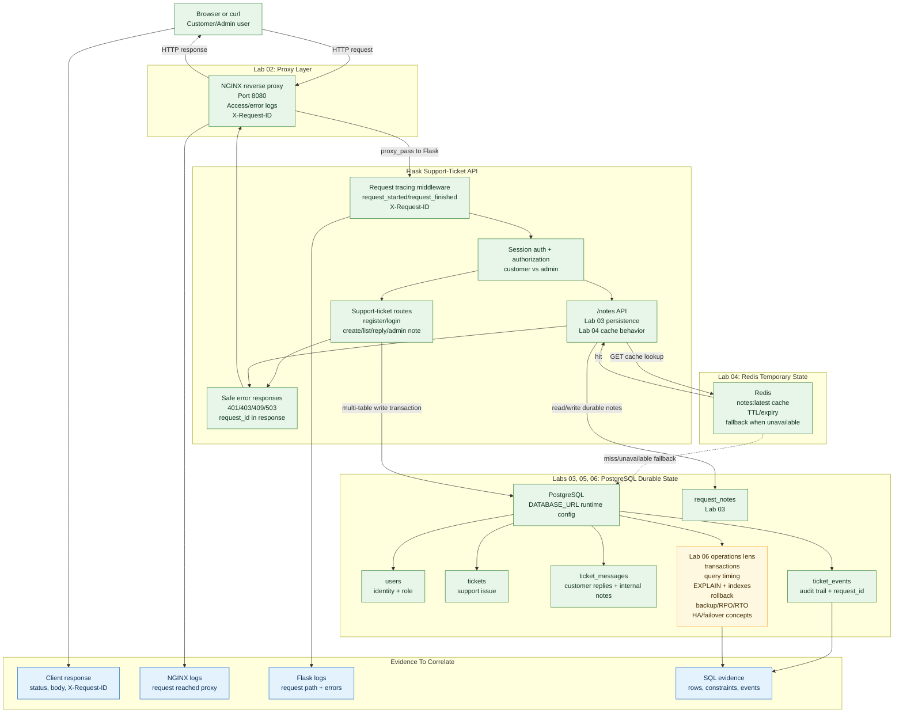

# Phase 2 Labs 01-06 Architecture

This diagram shows the current Phase 2 system after Labs 01-05 and the database-operations lens introduced in Lab 06.



## How To Read It

Green areas are already implemented or exercised in Labs 01-05.

Yellow is the Lab 06 focus: not a new app feature, but the database operations lens for the same support-ticket request path.

Blue is the evidence layer. The goal is to connect a client symptom to proxy logs, Flask logs, SQL rows, and `ticket_events.request_id`.

## What Lab 06 Adds

Lab 06 does not replace the architecture from Labs 01-05. It asks better database questions about it:

```text
Can Flask connect to PostgreSQL?
Did a multi-table ticket write commit fully?
Can a rollback prevent partial records?
Which query is slow?
Which index supports the lookup?
What does EXPLAIN show?
What happens when PostgreSQL is unavailable?
What backup, RPO, RTO, and failover expectations protect ticket data?
```

## Not Yet In Scope

The following concepts are intentionally not shown as implemented runtime components yet:

```text
Background workers
Redis queue processing
Webhook delivery
WebSockets/SSE
Kubernetes deployment
Managed cloud database HA
```

Those belong to later Phase 2 labs or Phase 3 operations work.
