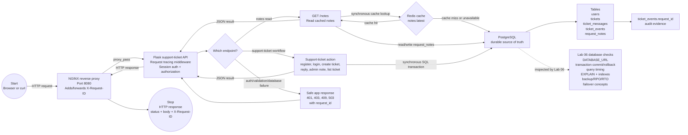

# Phase 2 Labs 01-06 Request Path

This diagram shows the current synchronous request path through Labs 01-06.

The request starts when a browser or `curl` sends an HTTP request to NGINX. The request stops when NGINX returns the HTTP response to the client. Lab 06 does not add a new runtime component; it adds the database-operations questions used to troubleshoot the PostgreSQL part of the same request.



## How To Read It

Follow the solid arrows for one synchronous request.

```text
Start:
Browser or curl sends an HTTP request.

Main path:
Client -> NGINX -> Flask -> Redis and/or PostgreSQL -> Flask -> NGINX

Stop:
The client receives an HTTP response with status, body, and X-Request-ID.
```

The request is synchronous because the client waits for Flask to finish the work before receiving the response.

## What Is Synchronous Here

These actions are in the current request/response path:

```text
NGINX routing the request to Flask
Flask assigning or forwarding X-Request-ID
Flask checking the session cookie
Flask enforcing customer/admin authorization
Flask reading Redis for /notes cache
Flask falling back to PostgreSQL when Redis misses or fails
Flask writing users, tickets, messages, and ticket_events to PostgreSQL
Flask returning JSON to the client
```

If PostgreSQL is slow during ticket creation, the client waits. That is why Lab 06 focuses on database latency, transactions, indexes, rollback, and failure evidence.

## What Lab 06 Adds

Lab 06 is not a new service. It is the operational lens on PostgreSQL:

```text
Can Flask connect to PostgreSQL?
Did a multi-table write commit fully?
Could a rollback prevent partial records?
Which query is slow?
Which index should support the lookup?
What does EXPLAIN show?
What happens when PostgreSQL is unavailable?
What backup, RPO, RTO, and failover expectations protect ticket data?
```

## What Is Not In This Request Yet

These are not part of the current Lab 06 request path:

```text
Async worker:
Work accepted now and processed later by a separate worker.

Queue:
Temporary job backlog for async work.

Webhook:
Server-to-server notification sent after an event.

Real-time update:
Browser receives live progress through WebSocket, SSE, or polling.

Kubernetes:
Container orchestration and production deployment platform.
```

Short version:

```text
Synchronous = user waits for the response.
Asynchronous = work can continue after the response.
Real-time = user receives live or near-live updates.
```
