# Phase 2 Labs 01-06 Request Path And Database Model

This note shows the current synchronous request path through Labs 01-06 and explains the database concepts used by the support-ticket app.

The request starts when a browser or `curl` sends an HTTP request to NGINX. The request stops when NGINX returns the HTTP response to the client. Lab 06 does not add a new runtime component; it adds the database-operations lens used to inspect the PostgreSQL part of the same request.

## Current Architecture

```mermaid
flowchart LR
    Start(("START<br/>Browser or curl<br/>sends HTTP request"))
    NGINX["NGINX reverse proxy<br/>Port 8080<br/>adds/forwards X-Request-ID"]
    Flask["Flask support-ticket API<br/>request tracing middleware<br/>session auth + authorization"]
    Routes{"Route decision<br/>Which endpoint?"}

    Notes["Notes path<br/>GET /notes"]
    Tickets["Support-ticket path<br/>register, login, create ticket,<br/>reply, admin note, list ticket"]
    Errors["Safe error path<br/>401, 403, 409, 503<br/>with request_id"]

    Redis{"Redis cache<br/>temporary notes:latest"}
    Postgres["PostgreSQL<br/>durable source of truth"]

    Tables["Database tables<br/>users<br/>tickets<br/>ticket_messages<br/>ticket_events<br/>request_notes"]
    Events["Audit evidence<br/>ticket_events.request_id"]

    DbChecks["Lab 06 inspection<br/>DATABASE_URL<br/>transaction commit/rollback<br/>query timing<br/>EXPLAIN + indexes<br/>failure evidence"]

    Finish(("FINISH<br/>Client receives HTTP response<br/>status + body + X-Request-ID"))

    Start -->|"1. HTTP request enters app"| NGINX
    NGINX -->|"2. proxy_pass to Flask"| Flask
    Flask -->|"3. choose route"| Routes

    Routes -->|"4a. notes read"| Notes
    Routes -->|"4b. support-ticket workflow"| Tickets
    Routes -->|"4c. auth, validation, or DB failure"| Errors

    Notes -->|"5a. check cache"| Redis
    Redis -->|"cache hit returns temporary data"| Notes
    Redis -->|"cache miss or unavailable"| Postgres
    Notes -->|"read/write durable notes"| Postgres

    Tickets -->|"5b. SQL transaction"| Postgres
    Postgres -.->|"stores rows in"| Tables
    Tables -.->|"request_id proves change"| Events

    Postgres -.->|"inspected by Lab 06"| DbChecks

    Notes -->|"6a. JSON result"| Flask
    Tickets -->|"6b. JSON result"| Flask
    Errors -->|"6c. safe error JSON"| Flask
    Flask -->|"7. HTTP response"| NGINX
    NGINX -->|"8. response returns to client"| Finish
```



## How To Read The Request

Follow the numbered solid arrows as the trace request steps. Dashed arrows show evidence or inspection paths, not separate user traffic.

```text
1. Browser or curl sends an HTTP request to NGINX.
2. NGINX accepts the request and proxies it to Flask.
3. Flask chooses which route should handle the request.
4. Flask follows one path:
   4a. Notes read path for GET /notes.
   4b. Support-ticket workflow for auth, tickets, replies, admin notes, or listing tickets.
   4c. Safe error path for auth, validation, or database failure.
5. Flask reaches the data layer:
   5a. Notes can check Redis first, then fall back to PostgreSQL when cache misses or fails.
   5b. Support-ticket actions use PostgreSQL transactions for durable writes.
6. Flask builds the JSON result or safe error body.
7. Flask returns the HTTP response to NGINX.
8. NGINX returns the final response to the client with status, body, and X-Request-ID.
```

The request is synchronous because the client waits for Flask to finish the work before receiving the response.

These actions are in the current request/response path:

```text
NGINX routing the request to Flask
Flask assigning or forwarding X-Request-ID
Flask checking the session cookie
Flask enforcing customer/admin authorization
Flask reading Redis for /notes cache
Flask falling back to PostgreSQL when Redis misses or fails
Flask writing users, tickets, messages, and ticket_events to PostgreSQL
Flask returning JSON to the client
```

If PostgreSQL is slow during ticket creation, the client waits. That is why Lab 06 focuses on database latency, transactions, indexes, rollback, and failure evidence.

## PostgreSQL And Redis Ownership

PostgreSQL is the durable source of truth. If Flask restarts, Redis expires, or cache is empty, PostgreSQL should still contain the real users, tickets, messages, and audit events.

Redis is temporary support infrastructure. In this phase, Redis supports cache/session behavior. Queue/worker Redis belongs to the async production architecture path later, not the durable data model.

Request IDs connect the request path to the database evidence. In this project, `ticket_events.request_id` helps prove which client request caused an important database change.

## Core Database Concepts

| Concept | Plain Meaning | Project Example |
| --- | --- | --- |
| Schema | The blueprint for database structure | `users`, `tickets`, `ticket_messages`, and `ticket_events` |
| Primary key | A unique ID for one row | `users.id`, `tickets.id` |
| Foreign key | A relationship to another table's primary key | `tickets.created_by -> users.id` |
| Constraint | A database rule that protects valid data | Email must be unique, title cannot be null |
| Index | A lookup structure that helps PostgreSQL find rows faster | Find tickets by `created_by`, `status`, or `created_at` |
| Transaction | An all-or-nothing unit of database work | Create ticket, first message, and audit event together |
| Rollback | Undo uncommitted work when a transaction fails | No partial ticket if message insert fails |

## Helpful Analogies

| Topic | Analogy | Why It Helps |
| --- | --- | --- |
| Primary key | Passport number | The ID stays stable even if a name changes |
| Foreign key | Referencing the passport number | Related records point to the stable ID instead of copying full user details everywhere |
| Constraint | Boarding rule | The database refuses invalid data before it enters the system |
| Index | Textbook index | PostgreSQL can jump to likely rows instead of reading the whole table |
| Transaction | Sealed checkout receipt | Either all related changes are accepted or none are |
| Connection pool | Limited service counters | Too many requests can wait even when database CPU looks fine |
| Lock | Reserved editing slot | One transaction can make another wait for the same row or table |

An index is not the same as cache. A cache stores a temporary copy of data for speed. An index is a maintained database lookup structure that still points to the real table data.

## Lab 05 Data Model

The support-ticket schema answers four questions:

```text
Who is using the system?
What ticket did they create?
What messages belong to the ticket?
What important events happened, and which request caused them?
```

In this project:

```text
users
  id: primary key
  email: unique identity
  role: customer or admin

tickets
  id: primary key
  ticket_number: human-friendly unique ticket ID
  created_by: foreign key to users.id
  status: constrained lifecycle value

ticket_messages
  id: primary key
  ticket_id: foreign key to tickets.id
  author_id: foreign key to users.id
  is_internal: protects admin-only notes

ticket_events
  id: primary key
  ticket_id: foreign key to tickets.id
  actor_id: foreign key to users.id
  request_id: evidence that connects the DB change to request tracing
```

The important design idea is ownership. A customer should see their own tickets. An admin can see all tickets and internal notes. The database stores the records, but the application enforces who is allowed to read or write each record.

## Lab 06 Database Checks

Lab 06 moves from "does the feature work?" to "can the database explain what happened?"

The core operating questions are:

```text
Can Flask connect to PostgreSQL?
Did the app commit all related rows or none of them?
Could a rollback prevent partial ticket records?
Which query is slow?
Which index should support the lookup?
What does EXPLAIN show?
What happens when PostgreSQL is unavailable?
What evidence proves PostgreSQL was or was not the failed dependency?
```

Use evidence from each layer before blaming the database.

| Layer | Evidence | What It Proves |
| --- | --- | --- |
| Client | Slow response, timeout, or error body | User impact exists |
| NGINX | `request_time`, `upstream_response_time`, status code | Delay is before, inside, or after Flask |
| Flask | Route timing, error logs, request ID | Which handler was slow or failed |
| PostgreSQL | Query timing, `EXPLAIN`, locks, connection count | Whether database work was slow, blocked, or unavailable |
| Data state | Rows inserted or missing | Whether the transaction actually committed |

Good troubleshooting sequence:

```text
1. Confirm the user-facing symptom.
2. Use the request ID to find NGINX and Flask logs.
3. Compare total request time with upstream/app time.
4. Identify the route and SQL query involved.
5. Run EXPLAIN or EXPLAIN ANALYZE on the query.
6. Check indexes, table scans, locks, and active connections.
7. Confirm whether data committed, rolled back, or never reached PostgreSQL.
```

## Database Latency Causes

These issues can cause database latency even when CPU and memory look healthy:

| Issue | What It Means | Evidence To Check |
| --- | --- | --- |
| Slow query | The SQL itself takes too long | Query timing, `EXPLAIN ANALYZE` |
| Missing index | PostgreSQL scans too many rows | `Seq Scan` on a large table |
| Inefficient join | Tables are combined in an expensive way | Query plan, join keys, filters, row counts |
| N+1 query | App runs many small repeated queries | Logs show repeated similar queries |
| Table scan | Database reads the table broadly | Query plan examines many rows |
| Lock contention | One transaction waits on another | Blocked queries or lock views |
| Long transaction | A transaction stays open too long | Old active transaction in DB activity |
| Too many connections | Requests wait for a database slot | Connection count near max, pool errors |
| Pool exhaustion | App pool is full even if the database is alive | Timeout waiting for connection |
| Disk I/O pressure | Storage is slow or saturated | Disk latency, IOPS, checkpoint pressure |
| Bad growth pattern | Query works with small data but slows as rows grow | Latency rises with table size |

## Study Takeaways

The study pattern to practice is not only "the app works." It is:

```text
Can the database design be explained?
Can the request path to the database be traced?
Can database evidence prove what happened?
Can latency be isolated to PostgreSQL instead of guessed?
Can security, observability, and supportability be discussed at the right depth?
```

For Labs 05-06, the strongest takeaways are:

| Topic | What To Be Able To Say |
| --- | --- |
| Durable source of truth | PostgreSQL owns users, tickets, messages, and audit events. Redis may speed up or support the request, but PostgreSQL owns the real records. |
| Basic schema design | Tables separate different concepts: users, tickets, messages, and events. Relationships use IDs instead of copying full records everywhere. |
| Primary keys | A primary key uniquely identifies one row and gives other tables something stable to reference. |
| Foreign keys | A foreign key proves one row belongs to or references another row, such as a ticket created by a user. |
| Constraints | Constraints protect data quality even if application code has a bug. |
| Indexes | Indexes help common lookups avoid scanning too much data, but they should support real query patterns. |
| Request ID evidence | `ticket_events.request_id` connects a client request to the database change it caused. |
| Redis vs PostgreSQL | Redis is temporary support infrastructure. PostgreSQL is durable system-of-record storage. |
| Connection configuration | `DATABASE_URL` tells Flask where PostgreSQL is and which credentials to use. |
| Bad credentials or wrong host | The app may fail before a query runs, which is different from a slow or broken SQL query. |
| Transactions and rollback | Multi-table writes should commit fully or roll back fully so partial tickets are not saved. |
| Connection exhaustion | Requests can become slow if too many app requests compete for limited database connections. |

## This Lab Answers

Use these answers as short speaking prompts, not memorized scripts.

| Question | Answer Shape |
| --- | --- |
| How do you determine whether the database is the bottleneck? | Start with the request ID, compare NGINX and Flask timings, then inspect the SQL query, query timing, `EXPLAIN`, locks, connections, and whether the database committed data. |
| What DB issues can cause high latency when compute looks healthy? | Slow queries, missing indexes, inefficient joins, table scans, lock contention, long transactions, too many connections, pool exhaustion, disk I/O pressure, and query patterns that get worse as data grows. |
| If the app uses Redis plus PostgreSQL, what should each handle? | PostgreSQL should store durable data. Redis should handle temporary cache/session behavior in this phase. Queue/worker responsibilities come later. |
| What kinds of queries usually create performance issues? | Unbounded reads, missing filters, missing indexes, large joins, N+1 patterns, sorting large result sets, and queries that return more data than needed. |
| What is an N+1 query problem? | The app fetches a list, then runs one extra query per item. It looks fine with small data and slows badly as the list grows. |
| How would database connection exhaustion show up? | Requests may wait or time out before SQL even runs. Evidence may show pool timeouts, high active connections, or too many app requests competing for database slots. |
| If CPU is low but queries are slow, what might be happening? | The database could be waiting on locks, disk I/O, missing indexes, connection slots, inefficient joins, or long transactions instead of burning CPU. |
| How would indexing be explained simply? | An index is like a textbook index. It helps PostgreSQL jump to likely rows instead of reading every row in the table. |
| What would be checked if login is slow only for authenticated users? | Check session lookup, user query, authorization query, Redis behavior if sessions/cache are involved, database indexes, route timing, and request IDs. |
| How do you separate an application bug from a database problem? | Prove whether Flask reached PostgreSQL, which query ran, how long it took, what PostgreSQL returned, and whether the expected rows were committed. |

## Security, Observability, And Supportability At This Stage

These topics matter now, but only at the level this project has reached:

```text
Security:
Do not expose PostgreSQL directly to clients.
Do not hardcode credentials in committed code.
Use app-level authorization so customers only see allowed tickets.

Observability:
Capture request IDs, Flask logs, NGINX timing, SQL evidence, and database failure symptoms.

Supportability:
Return safe errors to users, keep enough evidence for troubleshooting, and prove whether the failed layer was NGINX, Flask, Redis, or PostgreSQL.
```

## What Is Not In This Request Yet

These are not part of the current Lab 06 request path:

```text
Async worker:
Work accepted now and processed later by a separate worker.

Queue:
Temporary job backlog for async work.

Webhook:
Server-to-server notification sent after an event.

Real-time update:
Browser receives live progress through WebSocket, SSE, or polling.

Kubernetes:
Container orchestration and production deployment platform.
```

Short version:

```text
Synchronous = user waits for the response.
Asynchronous = work can continue after the response.
Real-time = user receives live or near-live updates.
```
