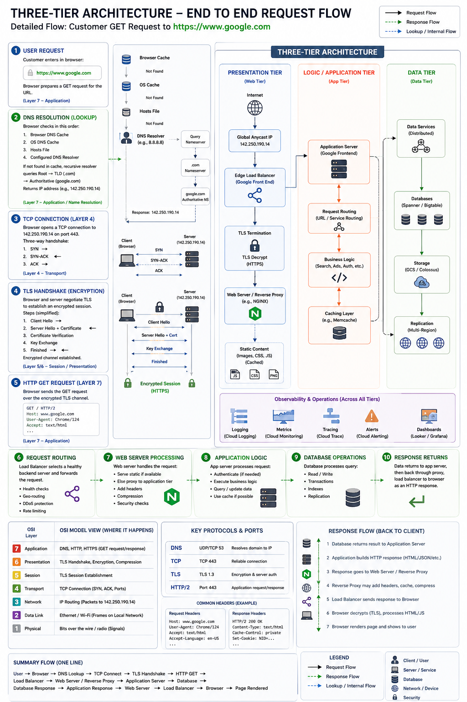

# Phase 2: Three-Tier Application

Phase 2 turns the single Flask app into a production-style three-tier architecture.

The goal is not just to add tools. The goal is to understand how a request moves through presentation, application, and data layers, and how to prove which layer failed.



## Target Architecture

Start with:

```text
Browser
   |
   v
NGINX reverse proxy
   |
   v
Flask API
   |
   v
PostgreSQL
```

Then add Redis after the database path is understood:

```text
Flask API
   |-- PostgreSQL
   `-- Redis
```

## What This Phase Teaches

This phase introduces production boundaries:

* The browser no longer talks directly to Flask.
* NGINX becomes the public entry point.
* Flask becomes the API layer.
* PostgreSQL owns durable application data.
* Redis can own one fast, temporary responsibility such as sessions or caching.

## Phase 2 Contents

```text
README.md
concepts/database-operator-concepts.md
concepts/postgresql-investigation-queries.md
labs/
solutions/
assets/
```

The database work is not optional background. Phase 2 should build enough database judgment to answer production questions about schema design, connection failures, pool exhaustion, slow queries, indexes, locks, migrations, backups, replication, and recovery.

## Core Questions

For every request, answer:

```text
Did the browser reach NGINX?
Did NGINX reach Flask?
Did Flask reach PostgreSQL?
Did Flask reach Redis?
Which component generated the final status code?
Where did request timing increase?
Which logs prove the request path?
Which database query or connection was involved?
Was latency caused by app code, waiting for a connection, query execution, or lock contention?
Could this data be cached safely, or must it come from PostgreSQL?
Which metrics would expose the failure faster next time?
```

## Labs And Solutions

Use:

```text
labs/
solutions/
```

The labs are prompts. The solutions are answer guides and completion standards. Try each lab before reading the matching solution.

## Failure Classes

This phase should make these failures easy to separate:

| Layer | Example failure | Likely symptom | Evidence |
| --- | --- | --- | --- |
| Browser to NGINX | Wrong host or TLS problem | Browser cannot connect | DevTools, `curl -v`, NGINX access logs |
| NGINX to Flask | Wrong upstream port | `502 Bad Gateway` | NGINX error log, missing Flask request log |
| Flask application | App exception | `500 Internal Server Error` | Flask error log with request ID |
| Flask to PostgreSQL | Bad DB credentials | Login or profile failure | Flask DB error, PostgreSQL logs |
| PostgreSQL | Slow query or lock | High latency or timeout | Query timing, `pg_stat_activity`, lock evidence |
| PostgreSQL | Pool exhaustion | Latency spike or timeout before query runs | Pool metrics, DB connection count |
| PostgreSQL | Bad migration | App errors after deploy | Migration logs, schema diff, app error logs |
| PostgreSQL | Replication lag | Stale reads | Replica lag metric, read/write path evidence |
| Flask to Redis | Cache unavailable | Slow fallback or auth/session issue | Flask Redis error, cache hit/miss logs |

## Completion Standard

You are ready for Phase 3 when you can explain a request like this:

```text
The browser sent the request to NGINX.
NGINX accepted it, added or forwarded the request ID, and proxied it to Flask.
Flask handled application logic and queried PostgreSQL.
Redis was used for cache or session behavior.
The response returned through Flask and NGINX to the browser.
The evidence from each layer proves where the request succeeded or failed.
```

You should also be able to answer:

```text
What table or query was involved?
Was the database the source of truth?
Was the issue connection, credentials, pool, query, lock, migration, replication, or backup/recovery?
What evidence proves that conclusion?
```
