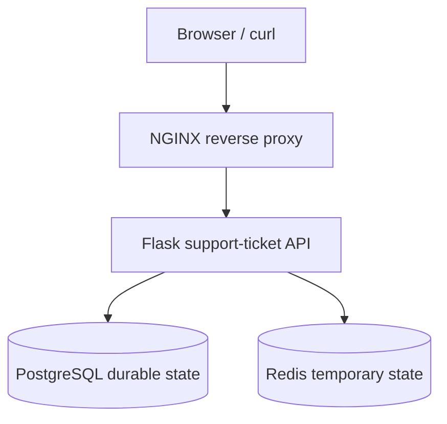

# Phase 2 Labs: Tracing Service Boundaries

## Table Of Contents

1. [Lab 01: Starting Request Path Architecture](#lab-01-starting-request-path-architecture)
2. [Lab 02: NGINX Reverse Proxy](#lab-02-nginx-reverse-proxy)
3. [Lab 03: PostgreSQL Persistence](#lab-03-postgresql-persistence)
4. [Lab 04: Redis Cache And Session Support](#lab-04-redis-cache-and-session-support)
5. [Lab 05: Support-Ticket Data Model](#lab-05-support-ticket-data-model)
6. [Lab 06: Database Operations, Performance, And Resilience](#lab-06-database-operations-performance-and-resilience)
7. [Lab 07: API Design And Authentication](#lab-07-api-design-and-authentication)
8. [Lab 08: Webhooks And Asynchronous Delivery](#lab-08-webhooks-and-asynchronous-delivery)
9. [Lab 09: Workers And Queues](#lab-09-workers-and-queues)
10. [Lab 10: WebSockets And Real-Time Updates](#lab-10-websockets-and-real-time-updates)
11. [Lab 11: Health And Readiness](#lab-11-health-and-readiness)
12. [Lab 12: Logs, Metrics, Traces, And Request IDs](#lab-12-logs-metrics-traces-and-request-ids)
13. [Lab 13: Container Foundation](#lab-13-container-foundation)
14. [Lab 14: Phase 2 Architecture And Operations Review](#lab-14-phase-2-architecture-and-operations-review)
- [Lab 05 Setup Reference](#lab-05-setup-reference)
- [Production Review Scenarios](#production-review-scenarios)
- [Challenge Scenarios](challenges/README.md)
- [Service Boundary Diagrams](architecture/service-boundaries.md)

## Lab 01: Starting Request Path Architecture

Start with the request path before writing code.

You are designing the first production-style version of the app:

```text
Browser or curl -> NGINX -> Flask API -> PostgreSQL
```

### Build

Do not install anything new yet. Create the design you are about to build.

1. Draw the architecture in two views:
   - Component view: Browser or curl, NGINX, Flask API, and PostgreSQL.
   - Request-tracing view: the path one request takes through those components and the evidence each component should leave behind.
2. Label each layer's job.
3. Define the request path for one successful login or API request.
4. Define where request IDs should appear.
5. Define what evidence each layer should produce.

### Prove

Write a short explanation for each layer:

```text
Browser or curl:
NGINX:
Flask API:
PostgreSQL:
```

### Break

Before building, predict symptoms:

```text
If NGINX cannot reach Flask, the user sees:
If Flask cannot reach PostgreSQL, the user sees:
If PostgreSQL is slow, the user sees:
If request IDs are missing, the investigation is harder because:
```

### Done When

You can explain the architecture without reading the diagram.

### Evidence To Capture

```text
Architecture diagram:
Component view:
Request path:
Layer responsibilities:
Expected logs:
Expected metrics:
Expected failure symptoms:
Explanation standard:
Retained takeaway:
```

## Lab 02: NGINX Reverse Proxy

Put NGINX in front of Flask.

The point is not just to make NGINX work. The point is to understand why a production service usually has an edge or proxy layer before the application.

### Build

1. Run Flask on an internal app port.
2. Add an NGINX config that forwards traffic to Flask.
3. Preserve useful headers:
   ```text
   Host
   X-Forwarded-For
   X-Forwarded-Proto
   X-Request-ID
   ```
4. Send traffic through NGINX instead of directly to Flask.

### Prove

Capture:

```text
curl through NGINX:
curl directly to Flask:
NGINX access log:
NGINX error log:
Flask log:
Response headers:
```

### Break

Break the upstream Flask port or stop Flask.

Answer:

```text
What status did the client receive?
Did NGINX see the request?
Did Flask see the request?
What proves where the request stopped?
```

### Done When

You can explain why `502 Bad Gateway` usually means the proxy could not get a valid response from the upstream service.

### Evidence To Capture

```text
NGINX config:
Healthy request:
NGINX access log:
Flask log:
Broken upstream symptom:
Layer that failed:
Explanation standard:
Retained takeaway:
```

## Lab 03: PostgreSQL Persistence

Add PostgreSQL as the durable data layer.

The goal is to understand what the database owns and how application behavior changes when data is no longer only in memory.

### Build

1. Start PostgreSQL locally.
2. Create a database for the app.
3. Create one simple table that supports the app.
4. Add Flask configuration for the database connection.
5. Add one read path and one write path through the app.

Keep the data model simple. This lab is about the request path and evidence, not fancy schema design.

### Prove

Capture:

```text
Database created:
Table created:
App writes data:
App reads data:
SQL query proves the stored row:
Flask log shows the request:
```

### Break

Use the wrong database password or stop PostgreSQL.

Answer:

```text
What did the user see?
What did Flask log?
Did NGINX cause the failure?
What proves PostgreSQL was the failed dependency?
```

### Done When

You can explain why PostgreSQL is the source of truth and why application logs alone are not enough to prove data was saved.

### Evidence To Capture

```text
Schema:
Connection configuration:
Write request:
Read request:
SQL evidence:
Application log:
Database failure symptom:
Explanation standard:
Retained takeaway:
```

## Lab 04: Redis Cache And Session Support

Add Redis as a supporting cache or session layer.

Redis is not the durable source of truth. In this project, PostgreSQL owns durable data. Redis should own one temporary responsibility that makes the service faster or easier to operate.

Redis can also be used as a queue backend in some architectures, but that is a different job. In this lab, Redis supports the synchronous request path as cache or session state. Workers and queues come later when the system starts doing asynchronous work outside the request/response path.

Good options:

```text
Cache one read-heavy response.
Store temporary session-like state.
Track simple rate-limit counters.
```

Pick one. Do not try to use Redis for everything.

### Mental Model

Use this comparison:

| Pattern | What it means | Example | Belongs here? |
| --- | --- | --- | --- |
| Cache | Store temporary data so future reads are faster | Cache a profile or project list | Yes |
| Session state | Store temporary user/session data | Login/session lookup | Yes |
| Queue | Store work to be processed later | Generate report, send email, process video | Later |
| Worker | Process queued work outside the web request | Background job pod | Later |
| Real-time | Push updates with very low delay | WebSocket progress updates | Later |

Async does not automatically mean real-time. Async usually means the user request can return before the work is finished. Real-time means the user receives live or near-live updates.

### Build

1. Start Redis locally.
2. Connect Flask to Redis through runtime configuration.
3. Choose one Redis responsibility.
4. Add a code path that reads from Redis.
5. Add a fallback path when Redis is empty or unavailable.

### Prove

Capture:

```text
Redis connection evidence:
Cache miss:
Cache hit:
TTL or expiry:
Fallback behavior:
PostgreSQL remains source of truth:
Why this is cache/session, not queue/worker:
```

### Break

Stop Redis or point Flask at the wrong Redis port.

Answer:

```text
What did the user see?
Did the app fail closed, fail open, or fall back?
Did PostgreSQL still work?
What evidence proves Redis was the failed dependency?
Would this failure block the whole request, degrade performance, or only disable cache/session behavior?
```

### Done When

You can explain:

```text
Redis is fast temporary state.
PostgreSQL is durable state.
The app should know what behavior is safe when Redis is unavailable.
Cache/session Redis belongs beside the app/data path.
Queue/worker Redis is only a boundary preview here; it is implemented later in Lab 09 when the architecture adds asynchronous processing.
```

### Evidence To Capture

```text
Redis responsibility:
Connection configuration:
Cache miss evidence:
Cache hit evidence:
Expiry evidence:
Fallback behavior:
Failure symptom:
Cache vs queue explanation:
Explanation standard:
Retained takeaway:
```

## Lab 05: Support-Ticket Data Model

Build the data model behind the support-ticket application.

### Why This Lab Exists

The app is no longer just a request-tracing demo. It is becoming a public-facing support-ticket system where users can register, submit technical issues or project feedback, review ticket history, and receive support responses.

This lab teaches how one submitted support issue becomes related PostgreSQL records.

### Architecture Before

```text
Browser or curl -> NGINX -> Flask -> PostgreSQL
```

The app already has a simple request path and basic PostgreSQL persistence.

### Architecture After

```text
Browser or curl
  |
  v
NGINX
  |
  v
Flask support-ticket API
  |
  v
PostgreSQL
  |-- users
  |-- tickets
  |-- ticket_messages
  `-- ticket_events
```

Redis may support sessions, cache, or queue behavior later, but tickets belong in PostgreSQL because they are durable business records.

### Key Terms

| Term | Meaning In This Lab |
| --- | --- |
| Primary key | Unique ID for one row |
| Foreign key | Relationship from one table to another |
| Constraint | Database rule that prevents invalid data |
| Index | Data structure that helps common queries run faster |
| Ownership | Rule that decides which user is allowed to access a ticket |
| Audit event | Record of an important change and the request ID that caused it |

### Relationship Model

```text
users
  |-- tickets.created_by
  |-- tickets.assigned_to
  |-- ticket_messages.author_id
  `-- ticket_events.actor_id

tickets
  |-- ticket_messages.ticket_id
  `-- ticket_events.ticket_id
```

### Must Implement Or Inspect

1. Read [sql/001_support_tickets.sql](sql/001_support_tickets.sql).
2. Apply the migration to the local PostgreSQL database.
3. Register a customer user.
4. Log in using a Flask session.
5. Create a support ticket.
6. Add a customer reply.
7. Register or log in as admin user `getty`.
8. View all tickets as admin.
9. Add an internal note as admin.
10. Confirm regular users cannot see internal notes.

### Healthy-Path Verification

Capture one successful ticket creation:

```text
Client request:
Client response:
Flask log:
PostgreSQL users row:
PostgreSQL tickets row:
PostgreSQL ticket_messages row:
PostgreSQL ticket_events row:
Request ID:
```

**Users:** who can log in and what role they have.

**Tickets:** durable support records created by customers.

**Messages:** visible conversation history for a ticket.

**Internal notes:** admin-only messages hidden from regular users.

**Events:** audit records that connect database changes to a request ID.

**Indexes:** query helpers for common lookups, such as one customer's tickets or admin triage by status and priority.

### Controlled Failures

Test at least two:

```text
Duplicate username:
Unauthenticated ticket creation:
Customer tries to view another customer's ticket:
Customer tries to use an admin endpoint:
PostgreSQL stopped or wrong DATABASE_URL:
```

### Evidence To Capture

```text
Schema:
Connection configuration:
Register request:
Login request:
Create ticket request:
Read ticket request:
Admin update request:
SQL evidence:
Application log:
Database failure symptom:
Authorization failure symptom:
Request ID in ticket_events:
Explanation standard:
Retained takeaway:
```

### Troubleshooting Checklist

```text
Which table owns each kind of data?
Which foreign keys describe ownership and relationships?
Which constraint prevented bad data?
Which index supports listing one customer's tickets?
Why can customers only see their own tickets?
Why can admins see all tickets and internal notes?
Why do ticket records belong in PostgreSQL instead of Redis?
Which SQL query proves the ticket exists?
Which logs prove the request path?
```

### Explanation Standard

Use this shape:

```text
When a customer creates a ticket, Flask authenticates the user from the server-managed session, validates the request body, inserts the ticket into PostgreSQL, inserts the initial message, and records a ticket event with the request ID. PostgreSQL is the source of truth because tickets must survive app restarts and cache expiration. Redis can support temporary sessions, cache, or queues, but it should not be the durable store for customer support history.
```

### Completion Standard

```text
The learner can explain how one submitted support issue becomes related PostgreSQL records and why specific indexes and constraints exist.
```

### Retained Takeaway

```text
The database is not just storage. It enforces relationships, protects ownership rules with data structure, and gives evidence that the application actually saved the customer's support request.
```

## Lab 06: Database Operations, Performance, And Resilience

Use the support-ticket architecture from Labs 01-05 and prove how PostgreSQL behaves as an operational dependency.

This lab is the exercise. The teaching/reference material lives here:

[Phase 2 current architecture](architecture/current-architecture.md)

Read that reference before running the commands, then capture only the evidence that proves the result.

### Starting Architecture

```text
Browser or curl -> NGINX -> Flask support-ticket API -> PostgreSQL
```

Lab 06 does not add a new runtime component. It inspects the PostgreSQL part of the current request path.

### Exercise 1: Confirm Database Connectivity

Run a direct PostgreSQL connection check.

```bash
psql request_tracing_lab -c "SELECT current_database(), current_user, inet_server_addr(), inet_server_port();"
```

If `inet_server_addr()` and `inet_server_port()` are blank, verify whether the connection used a local Unix socket:

```bash
psql request_tracing_lab -c "\conninfo"
```

Capture:

```text
Database name:
Database user:
Connection method or endpoint:
Conclusion:
```

### Exercise 2: Measure A Healthy Ticket Lookup

Run a timed customer-ticket lookup.

```bash
psql request_tracing_lab \
  -c "\timing on" \
  -c "SELECT id, ticket_number, created_by, status, priority
      FROM tickets
      WHERE created_by = 1
      ORDER BY created_at DESC;"
```

Capture:

```text
Rows returned:
Query time:
What customer workflow this supports:
Conclusion:
```

Map the output directly: count the result rows for `Rows returned`, use the `Time:` line for `Query time`, and use the `WHERE created_by = 1 ORDER BY created_at DESC` query shape to explain the customer workflow.

### Exercise 3: Inspect The Query Plan

Run `EXPLAIN` for the customer-ticket lookup.

```bash
psql request_tracing_lab -c "EXPLAIN
SELECT id, ticket_number, created_by, status, priority
FROM tickets
WHERE created_by = 1
ORDER BY created_at DESC;"
```

Then run `EXPLAIN ANALYZE` only if it is safe in your local lab.

Capture:

```text
Plan type:
Index used, if any:
Actual timing, if measured:
Conclusion:
```

### Exercise 4: Compare A Supported Lookup With An Unsupported Search

Run an admin triage query that should use an index.

```bash
psql request_tracing_lab -c "EXPLAIN
SELECT id, ticket_number, status, priority
FROM tickets
WHERE status = 'open' AND priority = 'medium'
ORDER BY id;"
```

Run a title search that is expected to scan in the current schema.

```bash
psql request_tracing_lab -c "EXPLAIN
SELECT id, ticket_number, title
FROM tickets
WHERE title ILIKE '%trace%';"
```

Capture:

```text
Supported lookup plan:
Unsupported search plan:
Why the difference matters:
Conclusion:
```

### Exercise 5: Simulate Database Latency

Use a safe sleep query to prove database-side waiting appears as query latency.

```bash
psql request_tracing_lab -c "\timing on" -c "SELECT pg_sleep(1);"
```

Capture:

```text
Measured time:
Layer where the delay happened:
What this does and does not prove:
```

### Exercise 6: Prove Rollback Behavior

Run a transaction that inserts a test ticket, verifies it exists, then rolls it back.

```sql
BEGIN;

INSERT INTO tickets (
  ticket_number,
  created_by,
  title,
  description,
  category,
  priority
)
VALUES (
  'TCK-ROLLBACK-LAB',
  1,
  'Rollback lab ticket',
  'This row should not remain after rollback.',
  'technical_question',
  'low'
);

SELECT id, ticket_number, title
FROM tickets
WHERE ticket_number = 'TCK-ROLLBACK-LAB';

ROLLBACK;

SELECT id, ticket_number, title
FROM tickets
WHERE ticket_number = 'TCK-ROLLBACK-LAB';
```

Capture:

```text
Row visible before rollback:
Row visible after rollback:
What this proves about partial writes:
```

### Exercise 7: Prove Constraint Protection

Attempt one invalid insert inside a transaction.

```sql
BEGIN;

INSERT INTO tickets (
  ticket_number,
  created_by,
  title,
  description,
  category,
  priority
)
VALUES (
  'TCK-BAD-CATEGORY-LAB',
  1,
  'Bad category lab ticket',
  'This insert should fail because category is invalid.',
  'not_a_category',
  'low'
);

COMMIT;
```

Capture:

```text
Database error:
Constraint name:
What invalid data was rejected:
Conclusion:
```

### Exercise 8: Break The Database Connection

Use a wrong PostgreSQL port and confirm the failure happens before SQL runs.

```bash
DATABASE_URL='host=127.0.0.1 port=5999 dbname=request_tracing_lab' \
venv/bin/python - <<'PY'
import os
import psycopg

try:
    psycopg.connect(os.environ["DATABASE_URL"])
except Exception as exc:
    print(type(exc).__name__)
    print(str(exc).split("\n")[0])
PY
```

Capture:

```text
Error type:
First error line:
Failed layer:
What this rules out:
```

### Exercise 9: Inspect Connections And Pooling Risk

Count current PostgreSQL connections.

```bash
psql request_tracing_lab -c "SELECT count(*) AS active_connections
FROM pg_stat_activity
WHERE datname = 'request_tracing_lab';"
```

Then write a short pool-risk note:

```text
If an app pool has 5 connections and 6 long database requests arrive, what happens to the sixth request?
```

Capture:

```text
Active connection count:
Pool-risk explanation:
Customer symptom if waiting times out:
```

### Exercise 10: Capture Backup And Recovery Evidence

Confirm backup tooling and create a schema-only local backup.

```bash
pg_dump --version
pg_dump --schema-only request_tracing_lab \
  -f /private/tmp/request_tracing_lab_schema_lab06.sql
ls -lh /private/tmp/request_tracing_lab_schema_lab06.sql
head -5 /private/tmp/request_tracing_lab_schema_lab06.sql
```

Capture:

```text
pg_dump version:
Backup file path:
Backup file size:
First lines of dump:
RPO/RTO note for support-ticket data:
Failover/reconnect note:
```

### Evidence Location

Record completed evidence in:

```text
AnswersByGetty/phase-02.md#lab-06-database-operations-performance-and-resilience
```

### Completion Standard

You are done when your answer proves:

```text
Flask can connect to PostgreSQL.
A healthy ticket lookup is fast in the local lab.
The expected indexes support common ticket lookups.
Unsupported search patterns can produce scans.
Database-side waiting appears as query latency.
Rollback prevents partial durable writes.
Constraints reject invalid data.
Connection failures happen before SQL execution.
Connection counts help reason about pooling risk.
Backups, RPO/RTO, and failover are part of database operations.
```

## Lab 07: API Design And Authentication

Use the support-ticket API to learn clear REST boundaries, validation, authentication, and authorization.

### Why This Lab Exists

APIs are where customers, browsers, scripts, and integrations touch the application. A production support-ticket app needs predictable endpoints, clear status codes, safe authentication, and ownership checks.

### Architecture Before

```text
Browser or curl -> NGINX -> Flask -> PostgreSQL
```

The app has ticket tables and basic support-ticket routes.

### Architecture After

```text
Client
  |
  v
REST API
  |-- /api/auth/*
  |-- /api/tickets
  |-- /api/tickets/<ticket_id>
  `-- /api/admin/tickets/*
        |
        v
Session auth, validation, ownership checks, PostgreSQL
```

### Key Terms

| Term | Meaning |
| --- | --- |
| Resource | Thing the API exposes, such as tickets or messages |
| GET | Read a resource |
| POST | Create a resource or trigger a create-style action |
| PATCH | Partially update a resource |
| DELETE | Remove a resource |
| Session authentication | Server-managed login state represented by a browser cookie |
| JWT | Signed token commonly used for stateless API auth examples |
| OAuth/OIDC | Standards for delegated login and identity |
| Authentication | Proving who the user is |
| Authorization | Deciding what the user can access |
| Idempotency key | Client-provided key that prevents duplicate side effects |

### Must Implement Or Inspect

1. List the support-ticket API resources.
2. Identify which routes require a session.
3. Compare session routes with the existing JWT learning routes.
4. Validate request bodies and content type behavior.
5. Confirm ownership checks for customer tickets.
6. Confirm admin-only routes require the `admin` role.
7. Add or document pagination, filtering, and sorting expectations.
8. Explain API versioning conceptually.
9. Design an idempotency-key approach for duplicate ticket submissions.

### HTTP Status Codes To Explain

| Code | Meaning In This App |
| --- | --- |
| 200 | Successful read or update |
| 201 | Created user, ticket, or message |
| 202 | Accepted for async processing |
| 204 | Success with no response body |
| 400 | Invalid request shape |
| 401 | Not logged in |
| 403 | Logged in but not allowed |
| 404 | Ticket or route not found |
| 409 | Duplicate account or conflicting request |
| 422 | Valid JSON but semantically invalid data |
| 429 | Too many requests |
| 500 | Unexpected application failure |
| 502 | Proxy could not get a valid upstream response |
| 503 | Dependency unavailable |
| 504 | Timeout waiting for upstream work |

### Exercise Setup

Run the app through the Phase 2 path:

```text
curl -> NGINX :8080 -> Flask -> PostgreSQL
```

Start dependencies if they are not already running:

```bash
brew services start postgresql@18
brew services start redis
brew services start nginx
```

Start Flask in another terminal:

```bash
venv/bin/python app.py
```

Use unique usernames so repeated lab runs do not collide with earlier data:

```bash
LAB_RUN=$(date +%Y%m%d%H%M%S)
CUSTOMER="lab07_customer_${LAB_RUN}"
OTHER_CUSTOMER="lab07_other_${LAB_RUN}"
```

### Exercise 1: Register A Customer Session

Register a customer and store the session cookie:

```bash
curl -i -c /tmp/rtl-customer.cookie \
  -H "Content-Type: application/json" \
  -H "X-Request-ID: lab07-register-customer" \
  -d "{\"username\":\"${CUSTOMER}\",\"email\":\"${CUSTOMER}@example.com\",\"password\":\"cloudpass\"}" \
  http://127.0.0.1:8080/api/auth/register
```

Capture:

```text
Register request:
Session cookie evidence:
Status code:
Response request_id:
Set-Cookie header:
PostgreSQL user row:
```

Verify the user row:

```bash
psql request_tracing_lab -c "SELECT id, username, email, role, created_at FROM users WHERE username = '${CUSTOMER}';"
```

### Exercise 2: Create A Ticket As The Customer

Create a ticket through NGINX:

```bash
curl -i -b /tmp/rtl-customer.cookie \
  -H "Content-Type: application/json" \
  -H "X-Request-ID: lab07-create-ticket" \
  -d '{"title":"Cannot trace request","description":"Need help reading request logs.","category":"technical_question","priority":"medium"}' \
  http://127.0.0.1:8080/api/tickets
```

Capture:

```text
Create ticket request:
Status code:
Response body:
Request ID:
Ticket ID or ticket number:
```

Save the latest ticket ID for the next exercises:

```bash
TICKET_ID=$(psql -At request_tracing_lab -c "SELECT t.id FROM tickets t JOIN users u ON u.id = t.created_by WHERE u.username = '${CUSTOMER}' ORDER BY t.id DESC LIMIT 1;")
echo "$TICKET_ID"
```

Verify the durable database records:

```bash
psql request_tracing_lab -c "SELECT id, ticket_number, created_by, status, priority FROM tickets WHERE id = ${TICKET_ID};"
psql request_tracing_lab -c "SELECT id, ticket_id, author_id, message_type FROM ticket_messages WHERE ticket_id = ${TICKET_ID};"
psql request_tracing_lab -c "SELECT id, ticket_id, action, request_id FROM ticket_events WHERE ticket_id = ${TICKET_ID};"
```

### Exercise 3: List Tickets With A Valid Session

```bash
curl -i -b /tmp/rtl-customer.cookie \
  -H "X-Request-ID: lab07-list-customer-tickets" \
  http://127.0.0.1:8080/api/tickets
```

Capture:

```text
API route:
HTTP method:
Status code:
Session cookie used:
Ticket count or ticket number returned:
Request ID:
```

### Exercise 4: Prove Missing Session Fails Before Ownership Logic

Call a protected route without the cookie:

```bash
curl -i \
  -H "X-Request-ID: lab07-missing-session" \
  http://127.0.0.1:8080/api/tickets
```

Capture:

```text
Status code:
Response body:
Failed layer:
What this rules out:
```

### Exercise 5: Prove Authorization Is Separate From Authentication

Register a second customer:

```bash
curl -i -c /tmp/rtl-other.cookie \
  -H "Content-Type: application/json" \
  -H "X-Request-ID: lab07-register-other-customer" \
  -d "{\"username\":\"${OTHER_CUSTOMER}\",\"email\":\"${OTHER_CUSTOMER}@example.com\",\"password\":\"cloudpass\"}" \
  http://127.0.0.1:8080/api/auth/register
```

Use the second customer's valid session to read the first customer's ticket:

```bash
curl -i -b /tmp/rtl-other.cookie \
  -H "X-Request-ID: lab07-cross-customer-ticket-read" \
  http://127.0.0.1:8080/api/tickets/${TICKET_ID}
```

Capture:

```text
Authenticated user:
Ticket owner:
Status code:
Response body:
Ownership decision:
Evidence source:
```

### Exercise 6: Prove Admin Role Changes Access

Create or log in as `getty`. In this app, username `getty` receives the `admin` role at registration.

```bash
curl -i -c /tmp/rtl-admin.cookie \
  -H "Content-Type: application/json" \
  -H "X-Request-ID: lab07-register-admin" \
  -d '{"username":"getty","email":"getty@example.com","password":"cloudpass"}' \
  http://127.0.0.1:8080/api/auth/register
```

If registration returns `409 duplicate_account`, log in instead:

```bash
curl -i -c /tmp/rtl-admin.cookie \
  -H "Content-Type: application/json" \
  -H "X-Request-ID: lab07-login-admin" \
  -d '{"username":"getty","password":"cloudpass"}' \
  http://127.0.0.1:8080/api/auth/login
```

Call the admin list route:

```bash
curl -i -b /tmp/rtl-admin.cookie \
  -H "X-Request-ID: lab07-admin-list-tickets" \
  http://127.0.0.1:8080/api/admin/tickets
```

Update ticket status as admin:

```bash
curl -i -b /tmp/rtl-admin.cookie \
  -X PATCH \
  -H "Content-Type: application/json" \
  -H "X-Request-ID: lab07-admin-status-change" \
  -d '{"status":"resolved"}' \
  http://127.0.0.1:8080/api/admin/tickets/${TICKET_ID}
```

Capture:

```text
Admin username:
Admin role evidence:
Admin list status code:
Status update code:
Changed field:
Database event:
```

Verify the status-change event:

```bash
psql request_tracing_lab -c "SELECT id, ticket_id, action, old_value, new_value, actor_id, request_id FROM ticket_events WHERE ticket_id = ${TICKET_ID} ORDER BY id;"
```

### Exercise 7: Run API Failure Checks

Missing JSON body:

```bash
curl -i -b /tmp/rtl-customer.cookie \
  -X POST \
  -H "X-Request-ID: lab07-missing-json-body" \
  http://127.0.0.1:8080/api/tickets
```

Wrong content type:

```bash
curl -i -b /tmp/rtl-customer.cookie \
  -H "Content-Type: text/plain" \
  -H "X-Request-ID: lab07-wrong-content-type" \
  -d 'not json' \
  http://127.0.0.1:8080/api/tickets
```

Customer calls admin route:

```bash
curl -i -b /tmp/rtl-customer.cookie \
  -H "X-Request-ID: lab07-customer-admin-route" \
  http://127.0.0.1:8080/api/admin/tickets
```

Duplicate account registration:

```bash
curl -i -c /tmp/rtl-duplicate.cookie \
  -H "Content-Type: application/json" \
  -H "X-Request-ID: lab07-duplicate-account" \
  -d "{\"username\":\"${CUSTOMER}\",\"email\":\"${CUSTOMER}@example.com\",\"password\":\"cloudpass\"}" \
  http://127.0.0.1:8080/api/auth/register
```

Duplicate ticket submission scenario:

```bash
curl -i -b /tmp/rtl-customer.cookie \
  -H "Content-Type: application/json" \
  -H "Idempotency-Key: lab07-duplicate-ticket-demo" \
  -H "X-Request-ID: lab07-duplicate-ticket-1" \
  -d '{"title":"Duplicate submission demo","description":"Same client request retried.","category":"technical_question","priority":"low"}' \
  http://127.0.0.1:8080/api/tickets

curl -i -b /tmp/rtl-customer.cookie \
  -H "Content-Type: application/json" \
  -H "Idempotency-Key: lab07-duplicate-ticket-demo" \
  -H "X-Request-ID: lab07-duplicate-ticket-2" \
  -d '{"title":"Duplicate submission demo","description":"Same client request retried.","category":"technical_question","priority":"low"}' \
  http://127.0.0.1:8080/api/tickets
```

Capture:

```text
Missing JSON body:
Wrong content type:
Missing session:
Customer reads another customer's ticket:
Customer calls admin route:
Duplicate account registration:
Duplicate ticket submission scenario:
```

The current app accepts the `Idempotency-Key` header as a client header but does not enforce idempotency yet. Use this check to document the risk and the design expectation.

### Evidence To Capture

```text
API route:
HTTP method:
Request body:
Response body:
Status code:
Request ID:
curl evidence:
Flask log:
PostgreSQL evidence:
Ownership decision:
Retained takeaway:
```

### Troubleshooting Checklist

```text
Use these prompts while investigating. They are not separate answer fields unless the evidence makes them relevant.

Unauthenticated or unauthorized:
Is the request missing login state, or is the logged-in user blocked from this specific object or route?

Validation before database write:
Did the API reject bad input before creating or changing database rows?

Status code fit:
Does the status code match the failure class clearly enough for support triage?

Duplicate side effects:
Could the same client retry create duplicate tickets, messages, or events?

Ownership evidence:
Which route response, Flask log, or PostgreSQL row proves object ownership was enforced?
```

### Explanation Standard

```text
The support-ticket API uses nouns for resources, sessions for the browser workflow, and explicit ownership checks before returning ticket data. Authentication proves who the user is; authorization proves whether that user can access the ticket. Status codes and request IDs make failures easier to triage.
```

### Completion Standard

```text
The learner can explain the support-ticket API boundary, how login state is represented, and why ownership checks are separate from authentication.
```

### Retained Takeaway

```text
A clear API makes support easier because each request has an expected method, body, status code, owner, and evidence trail.
```

## Lab 08: Webhooks And Asynchronous Delivery

Send support-ticket events to another system when something important happens.

### Why This Lab Exists

An API is when a client asks your app for something. A webhook is when your app tells another system that something happened.

Support-ticket systems often notify external tools when tickets are created, updated, or resolved.

### Architecture Before

```text
Client -> Flask support-ticket API -> PostgreSQL
```

The ticket request commits durable data synchronously.

### Architecture After

```text
Client
  |
  v
Flask support-ticket API
  |-- PostgreSQL ticket/event rows
  `-- webhook delivery attempt
        |
        v
Local webhook receiver
```

### Key Terms

| Term | Meaning |
| --- | --- |
| Webhook producer | The app sending the event |
| Webhook consumer | The receiver handling the callback |
| HTTP callback | Outbound HTTP request triggered by an event |
| Event payload | JSON body describing what happened |
| Event type | Name such as `ticket.created` |
| Event ID | Unique ID for deduplication |
| Signature | Proof the event came from your app |
| Shared secret | Secret used to create and verify a signature |
| Replay protection | Rejecting old or repeated events |
| Retry | Another delivery attempt after failure |
| Dead-letter thinking | Keeping failed events for later inspection |

### API Versus Webhook

```text
API:
A client requests something from the application.

Webhook:
The application sends an event to another system when something happens.
```

### Must Implement Or Inspect

1. Inspect the existing ticket audit actions in PostgreSQL.
2. Pick one outbound webhook event: `ticket.created` or `ticket.status_changed`.
3. Define a simple event payload.
4. Start a local webhook receiver.
5. Send an event after the ticket change is saved.
6. Include event ID, event type, timestamp, ticket ID, and request ID.
7. Add a shared-secret signature concept.
8. Store or log delivery status.
9. Define retry behavior and when to stop retrying.

### Inspect Existing Ticket Events

The database stores internal audit actions in `ticket_events.action`. A webhook payload can expose those actions as public event types such as `ticket.created`.

Describe the table:

```bash
psql request_tracing_lab -c "\d ticket_events"
```

List the action names currently recorded:

```bash
psql request_tracing_lab -c "SELECT DISTINCT action FROM ticket_events ORDER BY action;"
```

Inspect recent ticket events:

```bash
psql request_tracing_lab -c "SELECT id, ticket_id, action, old_value, new_value, actor_id, request_id, created_at FROM ticket_events ORDER BY created_at DESC LIMIT 10;"
```

Mapping example:

```text
Database action:
ticket_created

Outbound webhook event_type:
ticket.created
```

### Exercise 1: Choose A Durable Ticket Event

If you completed Lab 07, reuse the latest ticket event. Otherwise create one ticket first.

Find the latest ticket event:

```bash
psql request_tracing_lab -c "SELECT id, ticket_id, action, old_value, new_value, actor_id, request_id, created_at FROM ticket_events ORDER BY created_at DESC LIMIT 5;"
```

Set variables from the latest event:

```bash
TICKET_ID=$(psql -At request_tracing_lab -c "SELECT ticket_id FROM ticket_events ORDER BY created_at DESC LIMIT 1;")
DB_ACTION=$(psql -At request_tracing_lab -c "SELECT action FROM ticket_events ORDER BY created_at DESC LIMIT 1;")
REQUEST_ID=$(psql -At request_tracing_lab -c "SELECT request_id FROM ticket_events ORDER BY created_at DESC LIMIT 1;")
echo "ticket_id=${TICKET_ID} action=${DB_ACTION} request_id=${REQUEST_ID}"
```

Choose the outbound webhook event type:

```text
If DB_ACTION=ticket_created, use event_type=ticket.created.
If DB_ACTION=status_changed, use event_type=ticket.status_changed.
If DB_ACTION=message_added, use event_type=ticket.message_added.
```

Capture:

```text
Database event row:
Database action:
Chosen outbound event type:
Ticket ID:
Request ID:
```

### Exercise 2: Start A Local Webhook Receiver

Run this in a separate terminal. It starts a simple local receiver on port `9000` and prints each POST body and selected headers.

```bash
venv/bin/python - <<'PY'
from http.server import BaseHTTPRequestHandler, HTTPServer
import hashlib
import hmac
import os

SECRET = os.environ.get("WEBHOOK_SECRET", "lab08-local-secret").encode("utf-8")
SEEN_EVENT_IDS = set()

class Handler(BaseHTTPRequestHandler):
    def do_POST(self):
        length = int(self.headers.get("Content-Length", "0"))
        body = self.rfile.read(length)
        event_id = self.headers.get("X-Webhook-ID")
        provided_signature = self.headers.get("X-Webhook-Signature", "")
        expected_signature = "sha256=" + hmac.new(
            SECRET,
            body,
            hashlib.sha256
        ).hexdigest()

        print("\n--- webhook received ---")
        print("path:", self.path)
        print("event:", self.headers.get("X-Webhook-Event"))
        print("event_id:", event_id)
        print("timestamp:", self.headers.get("X-Webhook-Timestamp"))
        print("signature:", provided_signature)
        print("body:", body.decode("utf-8"))

        if not hmac.compare_digest(provided_signature, expected_signature):
            print("decision: rejected bad signature")
            self.send_response(401)
            self.end_headers()
            self.wfile.write(b"bad signature")
            return

        if event_id in SEEN_EVENT_IDS:
            print("decision: duplicate event")
            self.send_response(409)
            self.end_headers()
            self.wfile.write(b"duplicate event")
            return

        SEEN_EVENT_IDS.add(event_id)
        print("decision: accepted")
        self.send_response(200)
        self.end_headers()
        self.wfile.write(b"ok")

HTTPServer(("127.0.0.1", 9000), Handler).serve_forever()
PY
```

Capture:

```text
Receiver URL:
Receiver port:
Receiver log evidence:
```

### Exercise 3: Build A Webhook Payload From Database Evidence

Use the database event as the source and create a webhook-shaped JSON payload.

```bash
EVENT_ID="evt-${TICKET_ID}-$(date +%s)"
case "${DB_ACTION}" in
  ticket_created)
    EVENT_TYPE="ticket.created"
    ;;
  status_changed)
    EVENT_TYPE="ticket.status_changed"
    ;;
  message_added)
    EVENT_TYPE="ticket.message_added"
    ;;
  *)
    EVENT_TYPE="ticket.${DB_ACTION}"
    ;;
esac
TIMESTAMP=$(date -u +"%Y-%m-%dT%H:%M:%SZ")

cat > /tmp/lab08-ticket-event.json <<JSON
{
  "event_id": "${EVENT_ID}",
  "event_type": "${EVENT_TYPE}",
  "created_at": "${TIMESTAMP}",
  "request_id": "${REQUEST_ID}",
  "ticket": {
    "id": ${TICKET_ID}
  },
  "source": {
    "database_action": "${DB_ACTION}"
  }
}
JSON

cat /tmp/lab08-ticket-event.json
```

Capture:

```text
Payload file:
Event ID:
Event type:
Database action:
Request ID:
Ticket ID:
```

### Exercise 4: Add A Shared-Secret Signature

Generate an HMAC signature for the payload. This proves the webhook came from a sender that knows the shared secret.

```bash
WEBHOOK_SECRET="lab08-local-secret"
SIGNATURE=$(WEBHOOK_SECRET="${WEBHOOK_SECRET}" venv/bin/python - <<'PY'
import hashlib
import hmac
import os

secret = os.environ["WEBHOOK_SECRET"].encode("utf-8")
with open("/tmp/lab08-ticket-event.json", "rb") as payload:
    body = payload.read()
print(hmac.new(secret, body, hashlib.sha256).hexdigest())
PY
)
echo "sha256=${SIGNATURE}"
```

Capture:

```text
Signature algorithm:
Signature header value:
Shared secret location:
What the signature proves:
What the signature does not prove:
```

### Exercise 5: Send The Webhook

Send the payload to the local receiver:

```bash
curl -i -X POST http://127.0.0.1:9000/webhook \
  -H "Content-Type: application/json" \
  -H "X-Webhook-Event: ${EVENT_TYPE}" \
  -H "X-Webhook-ID: ${EVENT_ID}" \
  -H "X-Webhook-Timestamp: ${TIMESTAMP}" \
  -H "X-Webhook-Signature: sha256=${SIGNATURE}" \
  --data-binary @/tmp/lab08-ticket-event.json
```

Capture:

```text
Webhook URL:
HTTP status:
Receiver response:
Receiver log:
Delivery status:
Event ID:
Request ID:
```

### Exercise 6: Test Delivery Failure Modes

Wrong port / receiver unavailable:

```bash
curl -i --max-time 3 -X POST http://127.0.0.1:9999/webhook \
  -H "Content-Type: application/json" \
  --data-binary @/tmp/lab08-ticket-event.json
```

Duplicate delivery:

```bash
curl -i -X POST http://127.0.0.1:9000/webhook \
  -H "Content-Type: application/json" \
  -H "X-Webhook-Event: ${EVENT_TYPE}" \
  -H "X-Webhook-ID: ${EVENT_ID}" \
  -H "X-Webhook-Timestamp: ${TIMESTAMP}" \
  -H "X-Webhook-Signature: sha256=${SIGNATURE}" \
  --data-binary @/tmp/lab08-ticket-event.json
```

Bad signature:

```bash
curl -i -X POST http://127.0.0.1:9000/webhook \
  -H "Content-Type: application/json" \
  -H "X-Webhook-Event: ${EVENT_TYPE}" \
  -H "X-Webhook-ID: ${EVENT_ID}-bad-signature" \
  -H "X-Webhook-Timestamp: ${TIMESTAMP}" \
  -H "X-Webhook-Signature: sha256=bad-signature" \
  --data-binary @/tmp/lab08-ticket-event.json
```

Capture:

```text
Unavailable receiver symptom:
Duplicate delivery evidence:
Bad signature evidence:
Retry decision:
Duplicate-handling decision:
Customer impact:
```

### Healthy-Path Verification

Capture:

```text
Ticket action:
Database action:
Outbound event type:
Webhook payload:
Receiver log:
Delivery status:
Event ID:
Request ID:
```

### Controlled Failures

Test:

```text
Wrong shared secret:
Duplicate delivery:
Network connection refused:
```

Future hardening checks:

```text
Receiver returns 500:
Receiver times out:
Old timestamp replay:
```

### Evidence To Capture

```text
Webhook URL:
Event type:
Event ID:
Payload:
Signature header:
Receiver response:
Delivery status:
Retry behavior:
Duplicate handling:
Failure symptom:
Explanation standard:
Retained takeaway:
```

### Troubleshooting Checklist

```text
Was the ticket saved before webhook delivery failed?
Did the receiver receive the request?
Was the signature valid?
Was this a new event or a duplicate delivery?
Should the customer request fail because the webhook failed?
Where is the failed delivery recorded?
```

### Explanation Standard

```text
Webhook delivery allows the support-ticket app to notify another system after a durable ticket event is saved. The receiver must verify signatures, handle retries, and process duplicate events safely because webhooks are commonly delivered at least once.
```

### Completion Standard

```text
The learner can explain the difference between an API request and a webhook event, and why webhook consumers must be idempotent.
```

### Retained Takeaway

```text
Webhooks are outbound event delivery. They connect systems, but they introduce retries, duplicates, signatures, and delivery evidence.
```

## Lab 09: Workers And Queues

Move slow follow-up work out of the main ticket request.

### Why This Lab Exists

The customer should not wait for long-running notification or diagnostic-summary work before the ticket is saved. The app should commit the ticket synchronously, then queue background work that can finish later.

### Architecture Before

```text
Client -> Flask support-ticket API -> PostgreSQL
```

The user waits for the request response.

### Architecture After

```text
Client
  |
  v
Flask support-ticket API
  |-- PostgreSQL ticket rows
  `-- Redis queue
        |
        v
Background worker
  |
  v
Notification or diagnostic-summary job
```

### Key Terms

| Term | Meaning |
| --- | --- |
| Producer | Code that enqueues work |
| Queue | Temporary holding place for jobs |
| Job/message | Unit of background work |
| Consumer | Code that reads from the queue |
| Worker | Process that performs queued work |
| Acknowledgement | Signal that a job completed |
| Retry limit | Maximum attempts before giving up |
| Failed job | Job that could not complete |
| Dead-letter queue | Place to inspect failed jobs later |
| Queue depth | Number of jobs waiting |
| Backlog | Work piling up faster than workers process it |
| Poison message | Job that always fails |
| At-least-once delivery | Job may run more than once |

### Must Implement Or Inspect

1. Pick one background workflow: notification or diagnostic summary.
2. Ensure ticket creation commits to PostgreSQL first.
3. Enqueue a small job after the ticket is saved.
4. Run one worker process manually.
5. Complete one job.
6. Record queue depth and processing duration.
7. Stop the worker and observe backlog.
8. Fail one job and retry it.
9. Explain duplicate processing and idempotency.

Use Redis Queue or another simple Redis-backed Python worker if no queue exists yet. Do not introduce Kafka.

### Healthy-Path Verification

Capture:

```text
Ticket created:
Job enqueued:
Worker started:
Job completed:
Queue depth before:
Queue depth after:
Processing duration:
Request ID or linked event ID:
```

### Controlled Failures

Test:

```text
Worker stopped:
Queue backlog:
Job failure:
Retry:
Failed job:
Duplicate delivery:
Poison message:
```

### Evidence To Capture

```text
Producer code path:
Queue name:
Job payload:
Worker command:
Queue depth:
Worker log:
Retry evidence:
Failed job evidence:
Duplicate-processing prevention:
Explanation standard:
Retained takeaway:
```

### Troubleshooting Checklist

```text
Was the ticket saved even if the worker failed?
Is the queue growing?
Are workers processing jobs?
Which job failed?
Can the same job produce duplicate side effects?
How would you avoid duplicate email or duplicate notifications?
```

### Explanation Standard

```text
The ticket request should save durable data first and return quickly. Background workers handle slower follow-up work from a queue. Queues improve responsiveness, but they introduce backlog, retries, failed jobs, and duplicate-processing risks.
```

### Completion Standard

```text
The learner can explain producer, queue, worker, retries, queue depth, and why async work must be idempotent.
```

### Retained Takeaway

```text
Async means the user request can finish before all work is complete. It is useful, but it creates a second system path that needs its own evidence.
```

## Lab 10: WebSockets And Real-Time Updates

Let a customer viewing a ticket receive a support reply or status update without manually refreshing.

### Why This Lab Exists

Asynchronous work and real-time updates are related but not the same. A worker can process work in the background without showing live progress. A WebSocket keeps a connection open so the server can push updates to the client.

### Architecture Before

```text
Browser -> HTTP request -> Flask -> HTTP response
```

The browser asks for updates by refreshing or polling.

### Architecture After

```text
Browser
  |
  v
Persistent WebSocket connection
  |
  v
Flask real-time update path
  |
  v
Ticket room or channel
```

At larger scale, multiple Flask replicas need shared pub/sub so any replica can broadcast the update.

### Key Terms

| Term | Meaning |
| --- | --- |
| HTTP request/response | Client asks, server responds, connection can close |
| HTTP Upgrade | Switch from HTTP to WebSocket protocol |
| WebSocket | Persistent two-way connection |
| Server event | Update pushed from server to client |
| Disconnect | Client or server connection closes |
| Reconnect | Client opens a new connection after disconnect |
| Heartbeat/ping | Small signal proving connection is still alive |
| Room/channel | Group of clients authorized for the same ticket |
| Sticky session | Load balancer keeps a client on the same backend |
| Pub/sub | Shared message path across replicas |

### Must Implement Or Inspect

1. Choose one ticket update event: support reply or status change.
2. Sketch how the browser subscribes to one ticket.
3. Verify the user is authenticated.
4. Verify the user is authorized for that ticket.
5. Send one server event to the connected browser.
6. Test disconnect and reconnect behavior.
7. Document proxy timeout considerations.
8. Explain how multiple replicas would need shared pub/sub.

A minimal demonstration is enough. Do not build a complex chat system.

### Comparison

| Pattern | Best For | Tradeoff |
| --- | --- | --- |
| Polling | Simple periodic checks | Extra requests and delay |
| Server-sent events | One-way server updates | Less flexible than WebSockets |
| WebSockets | Interactive live updates | Persistent connections and scaling concerns |
| Webhooks | Server-to-server event delivery | Not for browser live UI updates |

### Healthy-Path Verification

Capture:

```text
Connection opened:
Authenticated user:
Authorized ticket:
Support reply or status update:
Browser receives update:
Server log:
Request ID or event ID:
```

### Controlled Failures

Test:

```text
Unauthenticated connection:
Unauthorized ticket room:
Client disconnect:
Server restart:
Proxy timeout:
Multiple clients viewing different tickets:
```

### Evidence To Capture

```text
Connection path:
Auth evidence:
Authorization evidence:
Update event:
Client received update:
Disconnect behavior:
Reconnect behavior:
Proxy timeout note:
Scaling note:
Explanation standard:
Retained takeaway:
```

### Troubleshooting Checklist

```text
Connection evidence:
Record the connection-open log, connection ID, user ID, ticket ID, and disconnect log.

Authorization evidence:
Record the session identity and the ticket ownership/admin check before joining the ticket room.

Server emit evidence:
Record the event type, ticket ID, event ID, and server log line for the emitted update.

Client receive evidence:
Record the browser console output or UI update that proves the event reached the client.

Proxy close evidence:
Record NGINX or load-balancer timeout/close logs if the connection drops unexpectedly.

Replica-awareness evidence:
Record whether shared pub/sub or sticky routing exists. Without one of those, another app replica may not know about the update.

Pattern decision:
Document why polling, SSE, or WebSockets fits the feature. Use WebSockets only when live bidirectional updates justify persistent connection complexity.
```

### Explanation Standard

```text
WebSockets keep a connection open so the server can push ticket updates to the browser. They are different from webhooks, which are server-to-server callbacks. WebSockets need authentication, authorization, reconnect handling, proxy timeouts, and a shared pub/sub design when the app scales beyond one replica.
```

### Completion Standard

```text
The learner can explain request/response HTTP versus persistent WebSocket connections and why real-time updates require different operational evidence.
```

### Retained Takeaway

```text
Real-time means live client updates. It adds connection state, authorization boundaries, and scaling concerns that normal HTTP requests do not have.
```

## Lab 11: Health And Readiness

Design health and readiness checks for the support-ticket application.

### Why This Lab Exists

Health checks help operators and platforms decide whether an application process is alive and whether it is safe to receive traffic. A support-ticket app can be partially available: Redis or a worker may fail while read-only ticket history still works, but PostgreSQL failure may make ticket creation unsafe.

This is an application-level health/readiness lab. It introduces the operational contract the app should expose before traffic is sent to it. Full Kubernetes probe behavior, deployment rollouts, and platform-level readiness troubleshooting belong in Phase 3.

### Architecture Before

```text
Client -> NGINX -> Flask support-ticket API -> PostgreSQL / Redis / worker
```

### Architecture After

```text
/health
  `-- process-level check

/ready
  |-- required dependency checks
  |-- degraded optional dependency checks
  `-- clear JSON response
```

### Key Terms

Health answers:

```text
Is the process alive?
```

Readiness answers:

```text
Can this instance safely receive customer traffic right now?
```

| Term | Meaning |
| --- | --- |
| Liveness | Process is alive |
| Readiness | Instance can safely receive traffic |
| Startup health | App has finished initial startup |
| Dependency health | Required dependencies are reachable |
| Critical dependency | Outage makes core operation unsafe |
| Noncritical dependency | Outage degrades behavior but may not block all traffic |
| Degraded operation | Service works with reduced capability |

### Must Implement Or Inspect

1. Add a lightweight `/health` endpoint.
2. Add a `/ready` endpoint.
3. Make `/ready` check PostgreSQL.
4. Decide whether Redis is required for readiness or allowed to fall back.
5. Return clear status codes and JSON bodies.

Example behavior:

```text
/health -> 200 when Flask is running
/ready  -> 200 when Flask can reach required dependencies
/ready  -> 503 when PostgreSQL is unavailable
```

### Healthy-Path Verification

Capture:

```text
Healthy /health response:
Healthy /ready response:
Flask log:
Database check evidence:
Redis check or fallback decision:
```

### Controlled Failures

Stop PostgreSQL and call both endpoints. Then stop Redis and repeat.

Record:

```text
PostgreSQL stopped:
/health status:
/ready status:
Reason:

Redis stopped:
/health status:
/ready status:
Readiness decision:
Reason:
```

### Evidence To Capture

```text
/health healthy response:
/ready healthy response:
/ready failed response:
Dependency checked:
Redis readiness decision:
Status codes:
Explanation standard:
Retained takeaway:
```

### Troubleshooting Checklist

```text
Process evidence:
Record the /health response that proves the Flask process is alive.

Traffic-readiness evidence:
Record the /ready response that proves whether this instance can safely receive customer traffic.

Critical dependency evidence:
Record PostgreSQL connectivity because durable ticket creation depends on it.

Degradable dependency evidence:
Record Redis behavior and decide whether cache/session degradation should remove the app from traffic.

Async dependency evidence:
Record whether webhook or worker failure blocks ticket creation or only degrades follow-up work.

Status-code evidence:
Use 200 for ready and 503 when a required dependency prevents useful request handling.
```

### Explanation Standard

```text
/health should be cheap and prove the process is alive. /ready should prove whether this instance can safely accept traffic for core operations. PostgreSQL is critical for ticket creation because it owns durable data. Redis, webhook delivery, or workers may cause degraded behavior without requiring the whole API to go offline.
```

### Completion Standard

```text
The learner can explain liveness versus readiness and decide which dependencies should block customer traffic.
```

### Retained Takeaway

```text
Health checks are operational contracts. They protect customers only when they reflect what the service can safely do right now.
```

## Lab 12: Logs, Metrics, Traces, And Request IDs

Correlate evidence across the support-ticket request path.

### Why This Lab Exists

Observability is not a dashboard collection. It is the ability to answer questions from evidence.

When a customer reports that a ticket submission failed or support replies are not updating, the investigation needs a path from symptom to request ID, logs, database rows, cache behavior, queue/worker state, webhook delivery, and real-time update evidence.

### Architecture Before

```text
Client -> NGINX -> Flask -> PostgreSQL / Redis
```

### Architecture After

```text
Customer symptom
  |
  v
Request ID or trace ID
  |
  v
NGINX or edge log
  |
  v
Flask API log
  |
  v
PostgreSQL or Redis evidence
  |
  v
Queue/worker, webhook, or WebSocket evidence
  |
  v
Conclusion
```

### Key Terms

| Term | Meaning |
| --- | --- |
| Structured log | Log with consistent fields |
| Log level | Severity such as info, warning, error |
| Request ID | Identifier for one request |
| Trace ID | Identifier for a request path across multiple spans |
| Span | One timed operation inside a trace |
| Context propagation | Passing IDs across services or async work |
| Metric | Numeric measurement over time |
| p50/p95/p99 | Latency percentiles |
| Saturation | Resource near its limit |
| Safe logging | Avoiding passwords, cookies, tokens, and sensitive content |

### Must Implement Or Inspect

1. Ensure every request has an `X-Request-ID`.
2. Make NGINX pass the request ID to Flask.
3. Make Flask include the request ID in responses.
4. Log method, path, status code, request ID, and duration.
5. Log ticket ID, user ID, job ID, or webhook event ID when relevant.
6. Identify metrics for request rate, error rate, latency, saturation, database connections, query duration, cache hit rate, queue depth, worker failures, webhook failures, and active WebSocket connections.
7. Describe traces and spans conceptually.
8. Avoid logging passwords, session cookies, access tokens, or sensitive ticket content.

### Healthy-Path Verification

Send one request and capture:

```text
Client response header:
NGINX access log:
Flask log:
Request ID match:
Request duration:
PostgreSQL evidence:
Redis evidence, if relevant:
```

### Controlled Failures

Test at least two:

```text
Slow request:
Database unavailable:
Redis unavailable:
Worker backlog:
Webhook delivery failure:
WebSocket disconnect:
Application exception:
```

### Evidence To Capture

```text
Request ID:
Trace ID:
Client evidence:
Proxy evidence:
API evidence:
PostgreSQL evidence:
Redis evidence:
Worker or queue evidence:
Webhook evidence:
WebSocket evidence:
Latency:
Error rate:
Mitigation:
RCA conclusion:
Explanation standard:
Retained takeaway:
```

### Metrics To Know

```text
Request rate:
Error rate:
Latency:
p50:
p95:
p99:
Database connections:
Query duration:
Cache hit rate:
Queue depth:
Worker failures:
Webhook delivery failures:
Active WebSocket connections:
```

### Troubleshooting Checklist

```text
Where did the request enter?
Which request ID or trace ID connects the evidence?
Did NGINX forward the request?
Did Flask handle it?
Did PostgreSQL commit data?
Was Redis a cache miss, cache hit, or unavailable?
Is the queue growing?
Did the webhook receiver respond?
Did the browser keep a real-time connection open?
What did you rule out?
What is the first mitigation?
```

### Explanation Standard

```text
Request IDs connect client evidence to proxy and application logs. Metrics show patterns such as rate, errors, latency, saturation, queue depth, and cache behavior. Traces describe parent-child timing across HTTP, database, async jobs, and webhook delivery. Good observability supports moving from symptom to evidence to mitigation without guessing.
```

### Completion Standard

```text
The learner can trace one customer symptom across client, NGINX, Flask, PostgreSQL, Redis, and any async or real-time path using request IDs, logs, metrics, and trace concepts.
```

### Retained Takeaway

```text
Evidence is useful when it is correlated. A log line without a request ID is just a clue; a correlated path can become an RCA.
```

## Lab 13: Container Foundation

Manually containerize one service so the Phase 3 platform work has a solid foundation.

### Why This Lab Exists

Phase 3 is where Docker Compose and Kubernetes become the main subject. This lab only introduces the container basics needed to understand what will be operated later.

### Architecture Before

```text
Flask runs directly on your machine.
PostgreSQL, Redis, and NGINX may also run locally.
```

### Architecture After

```text
Flask API image
  |
  v
Flask API container
  |
  v
Runtime environment variables
```

NGINX, PostgreSQL, Redis, workers, and Compose preparation can be documented here, but the complete multi-container platform belongs in Phase 3.

### Key Terms

| Term | Meaning |
| --- | --- |
| Image | Packaged filesystem and startup command |
| Container | Running instance of an image |
| Dockerfile | Instructions for building an image |
| Base image | Starting image, such as Python slim |
| Layer | Cached filesystem change in an image |
| Build context | Files sent to Docker during build |
| `.dockerignore` | File that keeps unwanted files out of context |
| `COPY` | Add files into the image |
| `RUN` | Execute build-time command |
| `CMD` | Default runtime command |
| Non-root user | Safer runtime user inside the container |

### Must Implement Or Inspect

1. Inspect [Dockerfile](../../Dockerfile).
2. Explain image versus container.
3. Identify the base image.
4. Identify dependency installation.
5. Identify which files are copied.
6. Identify the listening port.
7. Confirm logs go to stdout/stderr.
8. Confirm the container does not require secrets baked into the image.
9. Document required environment variables.
10. Note what Phase 3 will add with Compose and Kubernetes.

### Optional Codex-Assisted Improvements

Codex may help with:

```text
Improving the Dockerfile:
Adding an NGINX image/config:
Preparing PostgreSQL, Redis, and worker services for later Compose:
Documenting environment variables:
Documenting persistent data:
```

Do not build the complete Docker Compose or Kubernetes platform in this lab.

### Healthy-Path Verification

Capture:

```text
Build command:
Image tag:
Run command:
Port mapping:
Health endpoint response:
Container logs:
Environment variables:
```

### Controlled Failures

Test:

```text
Missing environment variable:
Wrong port mapping:
Missing dependency:
Container starts but app cannot reach PostgreSQL:
Health check failure:
```

### Evidence To Capture

```text
Dockerfile path:
Base image:
Build context:
Dependencies:
Runtime command:
Listening port:
Non-root user:
Health check:
Logs:
Failure symptom:
Explanation standard:
Retained takeaway:
```

### Troubleshooting Checklist

```text
Did the image build?
Did the container start?
Is the app listening inside the container?
Is the host port mapped correctly?
Are secrets injected at runtime instead of baked into the image?
What data would disappear if the container were deleted?
```

### Explanation Standard

```text
A Docker image packages the Flask API and dependencies. A container runs that image with runtime configuration. The image should not contain secrets, should run as a non-root user, should log to stdout/stderr, and should expose health behavior. Full multi-service orchestration is saved for Phase 3.
```

### Completion Standard

```text
The learner can explain each Dockerfile line and run the Flask API container without turning Phase 2 into a full orchestration lab.
```

### Retained Takeaway

```text
Containers package the service; orchestration operates the service. Learn the package before the platform.
```

## Lab 14: Phase 2 Architecture And Operations Review

Review the Phase 2 system as a checkpoint before moving the same application into containerized operation.

### Why This Lab Exists

This lab consolidates Phase 2. It is not a release approval, capacity exercise, or new failure-injection lab.

Use it to answer:

```text
What did the architecture look like before Phase 2?
What components and boundaries were added?
How does a request move through the final Phase 2 system?
Which components hold durable state versus temporary state?
Which paths are synchronous versus asynchronous?
What failure boundaries have already been explored?
What evidence is available at each boundary?
What operational gaps remain?
What concepts should carry into Phase 3?
```

### Architecture Before

At the end of Phase 1 and beginning of Phase 2, the core request path was the single-service Flask app:

```text
Client -> Flask
```

The learner had already practiced request IDs, successful and failed HTTP requests, sessions, JWT examples, logs, and local Flask behavior. The browser or curl talked directly to Flask.

### Architecture After

The core Phase 2 system adds service boundaries around the same application:



Core synchronous path:

```text
Client -> NGINX -> Flask API -> PostgreSQL
```

Temporary-state path:

```text
Flask API -> Redis
```

Optional or service-boundary paths explored conceptually or with local simulations:

```text
Flask API -> webhook receiver
Flask API -> Redis queue -> worker
Browser -> real-time update path
```

Only treat those optional paths as implemented when the repository contains working code and evidence for them. Otherwise, record them as design boundaries to carry forward.

### Architecture Evolution

```text
Phase 1 end:
Client -> Flask

Early Phase 2:
Client -> NGINX -> Flask

Then:
Client -> NGINX -> Flask -> PostgreSQL

Then:
                       -> Redis
Client -> NGINX -> Flask
                       -> PostgreSQL

Later optional service-boundary studies:
webhook delivery, queue/worker behavior, real-time update behavior
```

### Review Areas

Review what Phase 2 actually taught:

```text
Core user workflows:
Can a user register, log in, create a ticket, list tickets, and view allowed ticket data?

NGINX/reverse-proxy path:
What proves the client reached NGINX and NGINX reached Flask?

PostgreSQL durable state:
Which tables prove users, tickets, messages, and ticket events were saved?

Redis temporary state:
What behavior depends on Redis, and what happens when Redis is unavailable?

Authentication and authorization:
What proves a user is logged in, and what proves ownership or admin authorization was enforced?

Webhook behavior, if implemented or simulated:
What event was sent, what signature was used, and what happened on duplicate or failed delivery?

Worker/queue behavior, if implemented or simulated:
What job was queued, what queue depth changed, and what failed-job evidence exists?

Real-time behavior, if implemented:
What proves the connection opened, the user was authorized, and the client received the update?

Application health/readiness:
What does /health prove, and what should /ready prove about required dependencies?

Logs and request IDs:
Which request IDs connect client, Flask, database, Redis, or service-boundary evidence?

Configuration and secrets:
Which values are runtime configuration, and which should not be committed to code?

Recovery and rollback considerations:
What can be restored, rerun, retried, or rolled back based on Phase 2 evidence?

Runbook/documentation gaps:
What would a future operator still need before running this in containers?
```

### Evidence Review

Use existing evidence from earlier Phase 2 labs. Do not generate a large new evidence set.

Capture:

```text
Phase 2 starting architecture:
Phase 2 final architecture:
Core request path:
Durable dependency:
Temporary dependency:
One synchronous failure boundary:
One asynchronous failure boundary, if implemented:
One readiness/dependency example:
Most useful evidence source:
Known operational limitation:
Runbook/documentation gap:
What should be carried into Phase 3:
Retained takeaway:
```

### One RCA Review

Reuse one incident already explored during Phase 2. Choose a small example, such as a proxy routing failure, database dependency failure, authorization failure, webhook delivery failure, or queue failure simulation.

Capture:

```text
Observed symptom:
Expected request path:
First failed boundary:
Evidence:
Root cause:
Fix:
Validation:
What would make this easier to detect next time:
```

### Phase 3 Readiness Check

Decide whether the Phase 2 application is ready to be used as the basis for containerized operation.

Choose one:

```text
Ready to move into containerized operation.

Ready with known limitations:
- ...

Not ready to move forward because:
- ...
```

This is a curriculum checkpoint. It is not a deployment approval decision.

### Explanation Standard

```text
Do not finish Phase 2 by memorizing individual components in isolation. Be able to explain how the final Phase 2 architecture evolved, how requests move through it, where state lives, which boundaries can fail, what evidence proves those failures, and which operational concerns should carry into containerized operation.
```

### Completion Standard

```text
The learner can explain the Phase 2 architecture end to end, compare it with the Phase 1 starting point, trace the main request path, explain several important failure boundaries using existing evidence, identify current limitations, and describe what must be preserved when the application moves into containers.
```

### Retained Takeaway

```text
Architecture becomes easier to troubleshoot when every boundary has a clear responsibility, observable evidence, and a known failure mode.
```

## Lab 05 Setup Reference

Use this reference when you are ready to run the support-ticket data model locally. It explains the commands to apply the schema, start the app, send API requests, inspect PostgreSQL, and test one database failure.

### Initialize The Database

Apply the migration:

```bash
psql request_tracing_lab -f phases/phase-02-tracing-service-boundaries/sql/001_support_tickets.sql
```

Inspect the schema:

```bash
psql request_tracing_lab
\dt
\d users
\d tickets
\d ticket_messages
\d ticket_events
```

### Run The Application

Start dependencies:

```bash
brew services start postgresql@18
brew services start redis
brew services start nginx
```

Start Flask:

```bash
venv/bin/python app.py
```

### Sample Curl Commands

Register a customer:

```bash
curl -i -c /tmp/rtl-customer.cookie \
  -H 'Content-Type: application/json' \
  -d '{"username":"alice","email":"alice@example.com","password":"cloudpass"}' \
  http://127.0.0.1:8080/api/auth/register
```

Create a ticket:

```bash
curl -i -b /tmp/rtl-customer.cookie \
  -H 'Content-Type: application/json' \
  -d '{"title":"Cannot trace request","description":"Need help reading request logs.","category":"technical_question","priority":"medium"}' \
  http://127.0.0.1:8080/api/tickets
```

List your tickets:

```bash
curl -i -b /tmp/rtl-customer.cookie \
  http://127.0.0.1:8080/api/tickets
```

Register admin `getty`:

```bash
curl -i -c /tmp/rtl-admin.cookie \
  -H 'Content-Type: application/json' \
  -d '{"username":"getty","email":"getty@example.com","password":"cloudpass"}' \
  http://127.0.0.1:8080/api/auth/register
```

Admin list all tickets:

```bash
curl -i -b /tmp/rtl-admin.cookie \
  http://127.0.0.1:8080/api/admin/tickets
```

Admin add internal note:

```bash
curl -i -b /tmp/rtl-admin.cookie \
  -H 'Content-Type: application/json' \
  -d '{"body":"Internal note: customer included enough request evidence."}' \
  http://127.0.0.1:8080/api/admin/tickets/1/internal-notes
```

### Expected Responses

Successful registration returns `201`.

Successful login returns `200`.

Successful ticket creation returns `201`.

Unauthorized customer access returns `403`.

Duplicate account registration returns `409`.

Database unavailable returns `503`.

### Inspect PostgreSQL Records

```sql
SELECT id, username, role, created_at FROM users ORDER BY id;
SELECT id, ticket_number, created_by, status, priority FROM tickets ORDER BY id;
SELECT id, ticket_id, author_id, message_type FROM ticket_messages ORDER BY id;
SELECT id, ticket_id, action, request_id FROM ticket_events ORDER BY id;
```

### Reset Local Test Data

This deletes support-ticket lab data while keeping the schema.

```sql
TRUNCATE ticket_events, ticket_messages, tickets, users
RESTART IDENTITY CASCADE;
```

### Break The Database Dependency

Stop PostgreSQL:

```bash
brew services stop postgresql@18
```

Send a ticket request through NGINX. The expected response is `503 database unavailable`.

Restart PostgreSQL:

```bash
brew services start postgresql@18
```

## Production Review Scenarios

## 01: Production Launch Review

Scenario: management wants the service in production next week.

Review whether the system is safe to launch.

```text
Architecture:
Public traffic:
Authenticated traffic:
Data dependencies:
Cache or queue dependencies:
Health and readiness:
Security boundaries:
Capacity assumptions:
Load-test plan:
Observability plan:
Rollback plan:
Launch blockers:
Decision:
```

## 02: Slow Login Investigation

Scenario: users report that login is intermittently slow.

Investigate without assuming the failed layer.

```text
Customer symptom:
Request path:
Client evidence:
Proxy evidence:
Application evidence:
Database evidence:
Redis or session evidence:
Metrics:
Hypotheses:
What was ruled out:
Mitigation:
Customer update:
Retained takeaway:
```

## 03: Database Latency

Scenario: autoscaling works, but latency still rises and the issue correlates with the database.

Prove which database behavior is responsible.

```text
Customer symptom:
Queries involved:
Connection pool evidence:
Slow query evidence:
Lock evidence:
Index or query-plan evidence:
Replication or stale-read evidence:
What was ruled out:
Mitigation:
Prevention:
Retained takeaway:
```

## 04: 502 Bad Gateway

Scenario: the browser receives `502 Bad Gateway`.

Separate edge, proxy, upstream, container, and app failures.

```text
Customer symptom:
Request path:
Proxy access log:
Proxy error log:
Upstream target:
Application log:
Container or process health:
Last layer that saw the request:
Mitigation:
Prevention:
Retained takeaway:
```

## 05: Resource Sizing

Scenario: you need to justify replicas, CPU, memory, and database connection settings.

Use evidence rather than guessing.

```text
Traffic assumption:
User journeys:
Load-test tool:
Latency target:
Error-rate target:
CPU evidence:
Memory evidence:
Database connection evidence:
Replica decision:
What would change the decision:
Retained takeaway:
```

## Production Reviews

Production reviews are architecture and troubleshooting exercises.

They are generic, NDA-safe scenarios that practice the judgment behind production engineering: request paths, dependencies, evidence, launch blockers, mitigation, rollback, and communication.

### Reviews

| Review | Focus |
| --- | --- |
| [01](#01-production-launch-review) | Decide whether a service is safe to launch |
| [02](#02-slow-login-investigation) | Investigate slow login from symptom to evidence |
| [03](#03-database-latency) | Prove or disprove database latency as the bottleneck |
| [04](#04-502-bad-gateway) | Diagnose proxy, upstream, and app availability failures |
| [05](#05-resource-sizing) | Reason about replicas, CPU, memory, and load testing |

### Review Format

```text
Scenario:
Customer symptom:
Architecture:
Request path:
Dependencies:
Healthy behavior:
Evidence to collect:
Likely causes:
What to rule out:
Mitigation:
Rollback or roll-forward:
Customer update:
Engineering follow-up:
Retained takeaway:
```

Do not start with a list of tools. Start with the customer, the request path, the data, and the evidence.
