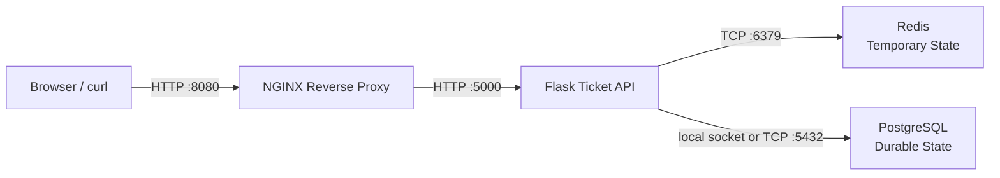

# Phase 2: Tracing Service Boundaries

Phase 2 teaches how requests move across service boundaries and how to prove where behavior changes when something fails.

The application is the lab environment. The point is not to build every possible production feature. The point is to understand the path:

```text
client -> proxy -> API -> dependency
```

## Where You Are

```text
Phase 1:
Client -> Flask

Phase 2 begins:
Client -> NGINX -> Flask

Phase 2 gradually adds:
Client -> NGINX -> Flask -> PostgreSQL

Then:
                         -> Redis
Client -> NGINX -> Flask
                         -> PostgreSQL
```

The project began with a simple presentation/application/data mental model. As additional boundaries are introduced, that model becomes less useful. From Phase 2 onward, the lab focuses on explicit request paths, service ownership, and evidence at each boundary.

## Phase 2 End-State Architecture

This is the Phase 2 end-state architecture. Not every component exists at the beginning of the phase. Each lab adds or explores one boundary.



## How The Architecture Evolves

| Step | Boundary Added | What It Teaches |
| --- | --- | --- |
| Lab 01 | Architecture before implementation | Draw the expected path before troubleshooting it |
| Lab 02 | Client -> NGINX -> Flask | Reverse proxying, upstreams, forwarded headers, 502/504 symptoms |
| Lab 03 | Flask -> PostgreSQL | Durable storage, basic reads/writes, dependency errors |
| Lab 04 | Flask -> Redis | Temporary state, cache hit/miss, expiry, fallback, connection failure |
| Lab 05 | Ticket workflow | Ownership, authorization, database evidence, request IDs |
| Lab 06 | Database dependency lens | Connection, latency, transactions, backup evidence at a practical level |
| Lab 07 | API boundary | Methods, status codes, validation, session auth, authorization |
| Labs 08-10 | Optional boundaries | Webhooks, queues/workers, and real-time communication as architecture comparisons |
| Labs 11-14 | Review and readiness | Health basics, evidence correlation, light load checks, escalation quality |

## What You Will Learn

By the end of the core path, you should be able to:

```text
Trace a request through NGINX, Flask, Redis, and PostgreSQL.
Explain why each component exists.
Identify which component initiates and accepts each connection.
Name the protocol and port at each boundary.
Use client output, NGINX logs, Flask logs, Redis evidence, PostgreSQL evidence, and request IDs.
Distinguish symptoms from failed boundaries.
Form a hypothesis from evidence instead of guessing.
Explain what was known-good, what was unknown, what failed, and how recovery was validated.
```

## How To Navigate This Phase

1. Read this README.
2. Open [LABS.md](LABS.md).
3. Complete the core labs in order.
4. Establish healthy behavior before running failure challenges.
5. Use [architecture/](architecture/) when studying request paths.
6. Use [challenges/](challenges/) after guided labs.
7. Record your own evidence in [AnswersByGetty/phase-02.md](../../AnswersByGetty/phase-02.md).

## Directory Map

```text
phase-02-tracing-service-boundaries/
|-- README.md
|-- LABS.md
|-- architecture/
|   |-- current-architecture.md
|   |-- service-boundaries.md
|   `-- microservice-reading-exercise.md
|-- challenges/
|   `-- README.md
`-- sql/
    `-- 001_support_tickets.sql
```

## Required Core Path

| Lab | Focus | Outcome |
| --- | --- | --- |
| [01](LABS.md#lab-01-starting-request-path-architecture) | Architecture and request path | Draw the starting model and evidence points |
| [02](LABS.md#lab-02-nginx-reverse-proxy) | NGINX reverse proxy | Prove client -> proxy -> upstream behavior |
| [03](LABS.md#lab-03-postgresql-persistence) | PostgreSQL dependency | Prove durable writes and database failure symptoms |
| [04](LABS.md#lab-04-redis-cache-and-session-support) | Redis dependency | Prove temporary state, cache behavior, and fallback |
| [05](LABS.md#lab-05-support-ticket-data-model) | Ticket workflow | Prove ownership, authorization, and audit evidence |
| [06](LABS.md#lab-06-database-operations-performance-and-resilience) | Database dependency troubleshooting | Investigate connection, query timing, transactions, and backup evidence |
| [07](LABS.md#lab-07-api-design-and-authentication) | API boundary | Prove session auth, authorization, status codes, and request IDs |
| [11](LABS.md#lab-11-health-and-readiness) | Application health/readiness | Decide which dependencies make the app ready or degraded |
| [12](LABS.md#lab-12-logs-metrics-traces-and-request-ids) | Evidence correlation | Connect client, NGINX, Flask, Redis, and database evidence |
| [14](LABS.md#lab-14-production-readiness-review) | Service-boundary review | Explain what is ready, risky, known-good, or still unknown |

## Optional Extensions

These are useful, but they are not the core Phase 2 path.

| Lab | Why It Is Optional |
| --- | --- |
| [08](LABS.md#lab-08-webhooks-and-asynchronous-delivery) | Webhooks are a light outbound-boundary concept here |
| [09](LABS.md#lab-09-workers-and-queues) | Workers and queues introduce async architecture without dominating Phase 2 |
| [10](LABS.md#lab-10-websockets-and-real-time-updates) | Real-time updates are a comparison topic, not the center of this phase |
| [13](LABS.md#lab-13-container-foundation) | Container foundations prepare for Phase 3; deep Docker work belongs in Phase 3 |

## Architecture References

- [Current architecture](architecture/current-architecture.md): the system implemented and studied in Phase 2.
- [Service boundaries](architecture/service-boundaries.md): how to recognize boundaries and failure propagation.
- [Microservice reading exercise](architecture/microservice-reading-exercise.md): a slightly more advanced reading exercise, not the current running system.

## Challenge Work

Use [challenges/README.md](challenges/README.md) after you have a healthy baseline. Challenges are where you practice the loop:

```text
symptom -> request path -> evidence -> failed boundary -> hypothesis -> test -> fix -> validation -> improvement
```

## Evidence Standard

For your personal notes, prefer this shape:

```text
Goal:
Request path:
Action taken:
Command or check:
Evidence captured:
Known-good boundaries:
First unknown boundary:
Hypothesis:
Test:
Root cause:
Fix:
Validation:
Improvement:
Retained takeaway:
```

## Finish Line

Phase 2 is complete when you can explain one successful and one failed request through:

```text
Client -> NGINX -> Flask -> Redis/PostgreSQL
```

and identify exactly what evidence proves where the request succeeded, where it stopped, what was ruled out, and how recovery was validated.
