# Phase 2 Current Architecture

This note shows the current Phase 2 synchronous request path and explains the boundaries used by the support-ticket app.

The request starts when a browser or `curl` sends an HTTP request to NGINX. The request stops when NGINX returns the HTTP response to the client.

This page is the reference model. Commands, logs, SQL output, and break-test proof belong in [AnswersByGetty/phase-02.md](../../../AnswersByGetty/phase-02.md).

## Current Request Path

```mermaid
flowchart LR
    Start(("1. START<br/>Browser or curl<br/>sends HTTP request"))
    NGINX["2. NGINX reverse proxy<br/>Port 8080<br/>adds/forwards X-Request-ID"]
    Flask["3. Flask support-ticket API<br/>request tracing middleware<br/>session auth + authorization"]
    Routes{"4. Route decision<br/>Which endpoint?"}

    Notes["5a. Notes path<br/>GET /notes"]
    Tickets["5b. Support-ticket path<br/>register, login, create ticket,<br/>reply, admin note, list ticket"]
    Errors["5c. Safe error path<br/>401, 403, 409, 503<br/>with request_id"]

    Redis{"6a. Redis cache<br/>temporary notes:latest"}
    Pool["6b. Database connection boundary<br/>current app: psycopg.connect per operation"]
    Postgres["7. PostgreSQL primary<br/>durable source of truth"]

    Tables["7a. Database tables<br/>users<br/>tickets<br/>ticket_messages<br/>ticket_events<br/>request_notes"]
    Events["7b. Audit evidence<br/>ticket_events.request_id"]

    DbChecks["7c. Database inspection<br/>connections<br/>transactions<br/>query timing<br/>backup concepts"]

    Finish(("8. FINISH<br/>Client receives HTTP response<br/>status + body + X-Request-ID"))

    Start -->|"HTTP request enters app"| NGINX
    NGINX -->|"proxy_pass to Flask"| Flask
    Flask -->|"choose route"| Routes

    Routes -->|"notes read"| Notes
    Routes -->|"support-ticket workflow"| Tickets
    Routes -->|"auth, validation, or DB failure"| Errors

    Notes -->|"check cache"| Redis
    Redis -->|"cache hit returns temporary data"| Notes
    Redis -->|"cache miss or unavailable"| Pool
    Notes -->|"read/write durable notes"| Pool

    Tickets -->|"SQL transaction"| Pool
    Pool -->|"database call"| Postgres
    Postgres -.->|"stores rows in"| Tables
    Tables -.->|"request_id proves change"| Events

    Postgres -.->|"database evidence"| DbChecks

    Notes -->|"JSON result"| Flask
    Tickets -->|"JSON result"| Flask
    Errors -->|"safe error JSON"| Flask
    Flask -->|"HTTP response"| NGINX
    NGINX -->|"response returns to client"| Finish
```



## How To Read The Request

Follow the numbered solid arrows as the trace request steps. Dashed arrows show evidence or inspection paths, not separate user traffic.

```text
1. Browser or curl sends an HTTP request to NGINX.
2. NGINX accepts the request and proxies it to Flask.
3. Flask chooses which route should handle the request.
4. Flask follows one path:
   4a. Notes read path for GET /notes.
   4b. Support-ticket workflow for auth, tickets, replies, admin notes, or listing tickets.
   4c. Safe error path for auth, validation, or database failure.
5. Flask reaches the data layer:
   5a. Notes can check Redis first, then fall back to PostgreSQL when cache misses or fails.
   5b. Support-ticket actions use PostgreSQL transactions for durable writes.
6. Flask builds the JSON result or safe error body.
7. Flask returns the HTTP response to NGINX.
8. NGINX returns the final response to the client with status, body, and X-Request-ID.
```

The request is synchronous because the client waits for Flask to finish the work before receiving the response. If PostgreSQL is slow during ticket creation, the client waits too.

## PostgreSQL And Redis Ownership

PostgreSQL is the durable source of truth. If Flask restarts, Redis expires, or cache is empty, PostgreSQL should still contain the real users, tickets, messages, and audit events.

Redis is temporary support infrastructure. In this phase, Redis supports cache/session behavior. Queue/worker Redis belongs to the async production architecture path later, not the durable data model.

The current Flask app opens PostgreSQL connections through `psycopg.connect(...)` when a route needs the database. It does not currently implement a real application-side connection pool, but the phase introduces pooling as an operational concept because production services need to limit and reuse database connections.

Request IDs connect the request path to the database evidence. In this project, `ticket_events.request_id` helps prove which client request caused an important database change.

## Core Database Concepts

| Concept | Plain Meaning | Project Example |
| --- | --- | --- |
| Schema | The blueprint for database structure | `users`, `tickets`, `ticket_messages`, and `ticket_events` |
| Primary key | A unique ID for one row | `users.id`, `tickets.id` |
| Foreign key | A relationship to another table's primary key | `tickets.created_by -> users.id` |
| Constraint | A database rule that protects valid data | Email must be unique, title cannot be null |
| Index | A lookup structure that helps PostgreSQL find rows faster | Find tickets by `created_by`, `status`, or `created_at` |
| Transaction | An all-or-nothing unit of database work | Create ticket, first message, and audit event together |
| Rollback | Undo uncommitted work when a transaction fails | No partial ticket if message insert fails |

## Helpful Analogies

| Topic | Analogy | Why It Helps |
| --- | --- | --- |
| Primary key | Passport number | The ID stays stable even if a name changes |
| Foreign key | Referencing the passport number | Related records point to the stable ID instead of copying full user details everywhere |
| Constraint | Boarding rule | The database refuses invalid data before it enters the system |
| Index | Textbook index | PostgreSQL can jump to likely rows instead of reading the whole table |
| Transaction | Sealed checkout receipt | Either all related changes are accepted or none are |
| Connection pool | Limited service counters | Too many requests can wait even when database CPU looks fine |
| Lock | Reserved editing slot | One transaction can make another wait for the same row or table |

An index is not the same as cache. A cache stores a temporary copy of data for speed. An index is a maintained database lookup structure that still points to the real table data.

## SQL Reading Cheat Sheet

These SQL keywords show up when reading PostgreSQL evidence. The goal is not to memorize SQL syntax deeply yet. The goal is to understand what a query is asking the database to do.

| SQL Keyword | Think Of It As | Example |
| --- | --- | --- |
| `SELECT` | Show me | Show me the tickets |
| `FROM` | From this table | From the `tickets` table |
| `WHERE` | Only if | Only tickets created by one user |
| `ORDER BY` | Sort by | Sort by newest |
| `LIMIT` | Only show the first | Show only the first 10 |
| `INSERT` | Create | Create a new ticket |
| `UPDATE` | Change | Change ticket status |
| `DELETE` | Remove | Delete a ticket |
| `JOIN` | Combine related tables | Combine `tickets` with `users` |
| `GROUP BY` | Group similar rows together | Count tickets by status |
| `COUNT()` | Count them | Count open tickets |
| `DISTINCT` | Only unique values | Show unique priorities |
| `AS` | Rename this column in the result | `COUNT(*) AS total_tickets` |

## Lab 05 Data Model

The support-ticket schema answers four questions:

```text
Who is using the system?
What ticket did they create?
What messages belong to the ticket?
What important events happened, and which request caused them?
```

In this project:

```text
users
  id: primary key
  email: unique identity
  role: customer or admin

tickets
  id: primary key
  ticket_number: human-friendly unique ticket ID
  created_by: foreign key to users.id
  status: constrained lifecycle value

ticket_messages
  id: primary key
  ticket_id: foreign key to tickets.id
  author_id: foreign key to users.id
  is_internal: protects admin-only notes

ticket_events
  id: primary key
  ticket_id: foreign key to tickets.id
  actor_id: foreign key to users.id
  request_id: evidence that connects the DB change to request tracing
```

The important design idea is ownership. A customer should see their own tickets. An admin can see all tickets and internal notes. The database stores the records, but the application enforces who is allowed to read or write each record.

## Database Latency Causes

These issues can cause database latency even when CPU and memory look healthy:

| Issue | What It Means | Evidence To Check |
| --- | --- | --- |
| Slow query | The SQL itself takes too long | Query timing, `EXPLAIN ANALYZE` |
| Missing index | PostgreSQL scans too many rows | `Seq Scan` on a large table |
| Inefficient join | Tables are combined in an expensive way | Query plan, join keys, filters, row counts |
| N+1 query | App runs many small repeated queries | Logs show repeated similar queries |
| Table scan | Database reads the table broadly | Query plan examines many rows |
| Lock contention | One transaction waits on another | Blocked queries or lock views |
| Long transaction | A transaction stays open too long | Old active transaction in DB activity |
| Too many connections | Requests wait for a database slot | Connection count near max, pool errors |
| Pool exhaustion | App pool is full even if the database is alive | Timeout waiting for connection |
| Disk I/O pressure | Storage is slow or saturated | Disk latency, IOPS, checkpoint pressure |
| Bad growth pattern | Query works with small data but slows as rows grow | Latency rises with table size |

## Security, Observability, And Supportability At This Stage

These topics matter now, but only at the level this project has reached:

```text
Security:
Do not expose PostgreSQL directly to clients.
Do not hardcode credentials in committed code.
Use app-level authorization so customers only see allowed tickets.

Observability:
Capture request IDs, Flask logs, NGINX timing, SQL evidence, and database failure symptoms.

Supportability:
Return safe errors to users, keep enough evidence for troubleshooting, and prove whether the failed layer was NGINX, Flask, Redis, or PostgreSQL.
```

## What Is Not In This Request Yet

These are not part of the current synchronous request path:

```text
Async worker:
Work accepted now and processed later by a separate worker.

Queue:
Temporary job backlog for async work.

Webhook:
Server-to-server notification sent after an event.

Real-time update:
Browser receives live progress through WebSocket, SSE, or polling.

Kubernetes:
Container orchestration and production deployment platform.
```

Short version:
```text
Synchronous = user waits for the response.
Asynchronous = work can continue after the response.
Real-time = user receives live or near-live updates.
```
