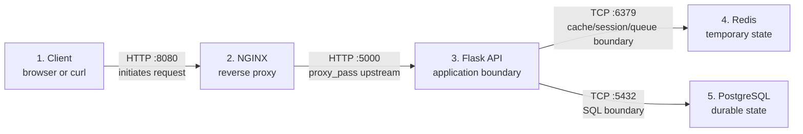
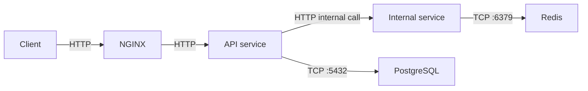

# Phase 2 Service Boundary Diagrams

Use these diagrams before running commands. The purpose is to predict the healthy path, then compare the prediction with evidence.

## Core Request Path



## What Each Boundary Proves

| Boundary | Healthy Evidence | If It Fails | What It Does Not Prove |
| --- | --- | --- | --- |
| Client -> NGINX | `curl` receives an HTTP response and NGINX access log records the request | Connection refused, TLS error, timeout, or no access log | Flask, Redis, or PostgreSQL health |
| NGINX -> Flask upstream | NGINX access log plus Flask request log with matching path/request ID | 502/504, NGINX error log, missing Flask request log | Database or Redis root cause |
| Flask -> Redis | Flask cache/session/queue log and Redis command evidence | Cache miss, connection refused, timeout, fallback path | PostgreSQL availability |
| Flask -> PostgreSQL | Flask DB log and SQL result | 503, connection error, slow query, transaction failure | NGINX routing failure |

## Small Microservice Variant



Use this variant as an architecture-reading exercise even if the local app stays small. One healthy service does not prove the entire request path is healthy.

## Explain Every Arrow

For each arrow, answer:

```text
Which component initiates the connection?
Which component accepts it?
What protocol and port are involved?
What hostname or service name is used?
What log or status proves the request reached the next boundary?
What would the client observe if this boundary failed?
What evidence would rule this boundary out?
```
