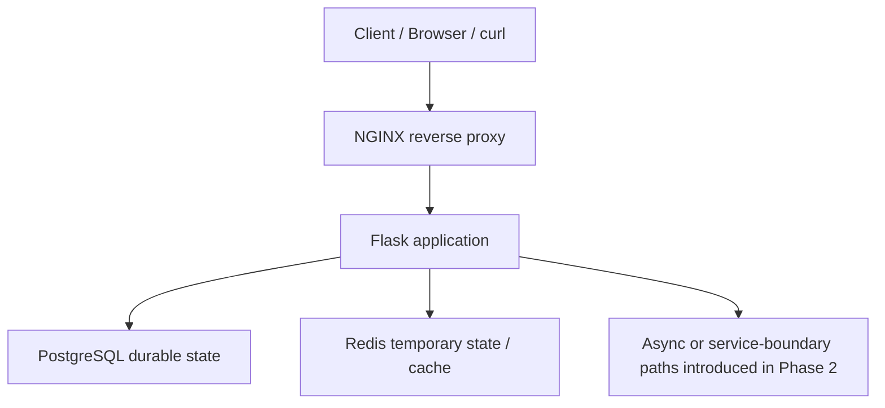

# Phase 3 — Containerized Systems & Kubernetes Troubleshooting

Phase 3 is the homepage for the containerized systems and Kubernetes troubleshooting portion of the lab.

Start here before opening individual folders. This page explains where Phase 2 left the system, what Phase 3 changes, which files belong to each lab, and where to record evidence.

## Where You Are Coming From

Phase 2 focused on tracing service boundaries. By the end of that phase, the application was no longer just a Flask process receiving direct client traffic. It had a reverse proxy, durable data, temporary/cache behavior, and service-boundary failure evidence.



By this point, the learner should understand:

- the application request path;
- reverse proxy behavior;
- durable state versus temporary state;
- dependency failures;
- application-level health/readiness;
- evidence-first troubleshooting;
- service boundaries.

Phase 3 does not replace those concepts. It places the same system inside containers and Kubernetes, which introduces new boundaries between the client and the application.

## What Changes In Phase 3

The application behavior is familiar. The new learning problem is understanding what Docker and Kubernetes add between these boundaries and what evidence those layers expose when something fails.

### Phase 2

```text
Client
  ↓
NGINX
  ↓
Application
  ↓
Dependencies
```

### Docker

```text
Client
  ↓
Host port
  ↓
NGINX container
  ↓
Docker network / DNS
  ↓
Application container
  ↓
Dependency containers
```

### Kubernetes

```text
Client
  ↓
Ingress
  ↓
Service
  ↓
EndpointSlice
  ↓
Ready Pod
  ↓
Container
  ↓
Application
  ↓
Dependency
```

Kubernetes also adds a separate management path:

```text
Deployment
  ↓
ReplicaSet
  ↓
Pod
```

A Service does not route traffic to a Deployment. A Deployment creates ReplicaSets, ReplicaSets create Pods, and a Service selects Ready Pod endpoints.

# Phase 3 Index

Use this table as the navigation map for the phase.

| Resource | Purpose | When To Use It |
| --- | --- | --- |
| [README.md](README.md) | Phase overview, architecture progression, study workflow, and navigation. | Start here. |
| [LABS.md](LABS.md) | Canonical Phase 3 exercises, requirements, failures, evidence prompts, and completion standards. | Follow labs in order. |
| [architecture/](architecture/) | Request-path and system architecture references for Docker, Kubernetes, and dependencies. | Before and during troubleshooting. |
| [docker/](docker/) | Docker notes, NGINX config, and database initialization used by container labs. | Labs 01-04. |
| [docker-compose.yml](docker-compose.yml) | Local full-stack Compose runtime for NGINX, Flask, PostgreSQL, and Redis. | Lab 04 and local full-stack validation. |
| [kubernetes/](kubernetes/) | Kubernetes manifests for namespace, config, secret example, Deployment, Service, Ingress, HPA, and NetworkPolicy. | Labs 05-07. |
| [helm/](helm/) | Helm chart and release-management materials. | Lab 08 and release troubleshooting. |
| [challenges/](challenges/) | Unknown-root-cause troubleshooting scenarios. | After guided exercises. |
| [runbooks/](runbooks/) | Repeatable troubleshooting procedures for common container/Kubernetes incidents. | During review, challenge work, or recurring failures. |
| [scripts/diagnose-service-routing.sh](scripts/diagnose-service-routing.sh) | Diagnostic helper that collects Service selector, Pods, readiness, EndpointSlices, ports, and recent events. | Lab 08 or Service-routing incidents. |
| [worksheets/](worksheets/) | Structured Kubernetes investigation worksheet. | During challenge investigations. |
| [../../AnswersByGetty/phase-03.md](../../AnswersByGetty/phase-03.md) | Execution and evidence companion for Phase 3. | Open side by side with `LABS.md`. |

## How To Study This Phase

Open `LABS.md` and `AnswersByGetty/phase-03.md` side by side.

```text
1. Read the relevant lab in LABS.md.
        ↓
2. Review its architecture/request path.
        ↓
3. Open the implementation files used by that lab.
        ↓
4. Establish the healthy baseline.
        ↓
5. Capture evidence.
        ↓
6. Introduce the guided failure.
        ↓
7. Troubleshoot from the symptom.
        ↓
8. Complete the challenge version without knowing the root cause.
        ↓
9. Compare or update AnswersByGetty/phase-03.md.
        ↓
10. Review or create the relevant runbook.
        ↓
11. Ask whether repetitive evidence collection should be automated.
```

Do not run commands as a reflex. Each command should answer a boundary question.

## LABS And AnswersByGetty

`LABS.md` is the canonical exercise specification. `AnswersByGetty/phase-03.md` is the execution and evidence companion. Their lab numbers, requirement numbers, failure sections, evidence sections, and troubleshooting sections intentionally map to each other so they can be followed side by side.

```text
LABS.md                         AnswersByGetty/phase-03.md

Lab 05                         Lab 05
Requirement 1  ──────────────> Requirement 1 walkthrough
Requirement 2  ──────────────> Requirement 2 walkthrough
Failure A      ──────────────> Failure A evidence
Checklist      ──────────────> Checklist reasoning
```

If evidence has not been captured yet, the answer file should say `Not yet captured` or `Manual validation required` rather than inventing output.

## Folder Navigation By Lab

| Lab | Primary files/resources |
| --- | --- |
| 01 | [LABS.md](LABS.md#lab-01-images-dockerfiles--buildruntime-boundaries), root [Dockerfile](../../Dockerfile), root [.dockerignore](../../.dockerignore), [docker/](docker/), [architecture/docker-request-path.md](architecture/docker-request-path.md), [AnswersByGetty/phase-03.md](../../AnswersByGetty/phase-03.md#lab-01-images-dockerfiles--buildruntime-boundaries) |
| 02 | [LABS.md](LABS.md#lab-02-runtime-configuration-ports-processes--filesystem), root [Dockerfile](../../Dockerfile), [docker/](docker/), [AnswersByGetty/phase-03.md](../../AnswersByGetty/phase-03.md#lab-02-runtime-configuration-ports-processes--filesystem) |
| 03 | [LABS.md](LABS.md#lab-03-docker-networking-dns--container-health), [docker/](docker/), [architecture/docker-request-path.md](architecture/docker-request-path.md), [challenges/](challenges/), [AnswersByGetty/phase-03.md](../../AnswersByGetty/phase-03.md#lab-03-docker-networking-dns--container-health) |
| 04 | [LABS.md](LABS.md#lab-04-docker-compose-full-stack-operations), [docker-compose.yml](docker-compose.yml), [docker/nginx.conf](docker/nginx.conf), [docker/init/002_request_notes.sql](docker/init/002_request_notes.sql), [AnswersByGetty/phase-03.md](../../AnswersByGetty/phase-03.md#lab-04-docker-compose-full-stack-operations) |
| 05 | [LABS.md](LABS.md#lab-05-kubernetes-workloads--traffic-path-troubleshooting), [kubernetes/](kubernetes/), [architecture/kubernetes-paths.md](architecture/kubernetes-paths.md), [challenges/](challenges/), [AnswersByGetty/phase-03.md](../../AnswersByGetty/phase-03.md#lab-05-kubernetes-workloads--traffic-path-troubleshooting) |
| 06 | [LABS.md](LABS.md#lab-06-readiness-dependencies-dns-config--resource-failures), [kubernetes/](kubernetes/), [architecture/dependency-path.md](architecture/dependency-path.md), [runbooks/](runbooks/), [AnswersByGetty/phase-03.md](../../AnswersByGetty/phase-03.md#lab-06-readiness-dependencies-dns-config--resource-failures) |
| 07 | [LABS.md](LABS.md#lab-07-rollouts-releases-rollback--persistent-state), [kubernetes/](kubernetes/), [runbooks/rollback-deployment.md](runbooks/rollback-deployment.md), [AnswersByGetty/phase-03.md](../../AnswersByGetty/phase-03.md#lab-07-rollouts-releases-rollback--persistent-state) |
| 08 | [LABS.md](LABS.md#lab-08-helm-complex-incident-runbook--diagnostic-automation), [helm/](helm/), [challenges/](challenges/), [runbooks/](runbooks/), [scripts/diagnose-service-routing.sh](scripts/diagnose-service-routing.sh), [AnswersByGetty/phase-03.md](../../AnswersByGetty/phase-03.md#lab-08-helm-complex-incident-runbook--diagnostic-automation) |

## Canonical Labs

| Lab | Focus | Start |
| --- | --- | --- |
| 01 | Images, Dockerfiles, and build/runtime boundaries | [Lab 01](LABS.md#lab-01-images-dockerfiles--buildruntime-boundaries) |
| 02 | Runtime configuration, ports, processes, and filesystem | [Lab 02](LABS.md#lab-02-runtime-configuration-ports-processes--filesystem) |
| 03 | Docker networking, DNS, and container health | [Lab 03](LABS.md#lab-03-docker-networking-dns--container-health) |
| 04 | Docker Compose full-stack operations | [Lab 04](LABS.md#lab-04-docker-compose-full-stack-operations) |
| 05 | Kubernetes workloads and traffic-path troubleshooting | [Lab 05](LABS.md#lab-05-kubernetes-workloads--traffic-path-troubleshooting) |
| 06 | Readiness, dependencies, DNS, config, and resource failures | [Lab 06](LABS.md#lab-06-readiness-dependencies-dns-config--resource-failures) |
| 07 | Rollouts, releases, rollback, and persistent state | [Lab 07](LABS.md#lab-07-rollouts-releases-rollback--persistent-state) |
| 08 | Helm, complex incident, runbook, and diagnostic automation | [Lab 08](LABS.md#lab-08-helm-complex-incident-runbook--diagnostic-automation) |

## Troubleshooting Method

Every major lab uses the same investigation loop:

```text
Symptom
  ↓
Expected request path
  ↓
Known-good boundaries
  ↓
First unknown boundary
  ↓
Evidence
  ↓
Hypothesis
  ↓
Test
  ↓
Root cause
  ↓
Fix / mitigation
  ↓
Validation
  ↓
Prevention / runbook / automation
```

## Phase 3 Scope

Phase 3 stays focused on local Docker, Docker Compose, Kubernetes application troubleshooting, Helm packaging, runbooks, and diagnostic evidence. Broader cloud, observability-platform, infrastructure-as-code, and capacity-planning topics are intentionally deferred to later phases.

## Completion Standard

By the end of Phase 3, the learner should be able to explain the expected request path, identify what evidence each boundary exposes, find where behavior first diverged, prove the root cause, restore service safely, and make the next investigation easier.
