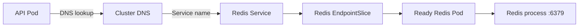

# Kubernetes Dependency Path

Application traffic and dependency traffic are related but different paths.



## Questions To Ask

```text
Can the API resolve the dependency name?
Does the Service select the expected dependency Pod?
Does the EndpointSlice contain ready endpoints?
Does the targetPort match the dependency container port?
Is the dependency process listening?
Does the application have the correct hostname, port, and credentials?
```
