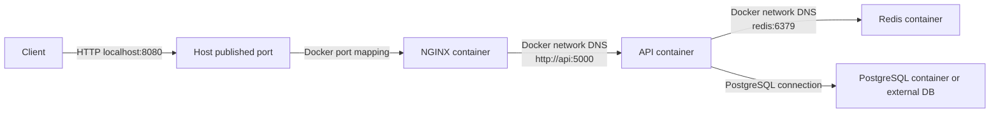

# Docker Request Path



## Boundary Questions

| Boundary | Question | Evidence |
| --- | --- | --- |
| Host -> NGINX container | Is the port published correctly? | `docker ps`, client response |
| NGINX -> API container | Does Docker DNS resolve the service name? | NGINX error log, `docker exec` connectivity |
| API container -> process | Is Flask listening on the expected interface and port? | container logs, `docker exec`, health check |
| API -> Redis | Does the dependency hostname and port work inside the network? | API logs and Redis connectivity |

## Common Failure Boundaries

```text
Container is not running.
Host port is wrong.
Internal container port is wrong.
NGINX upstream uses the wrong service name.
API binds to localhost instead of all interfaces.
Runtime environment variable is missing.
Dependency is healthy late or unhealthy.
Mounted config is stale or wrong.
```
