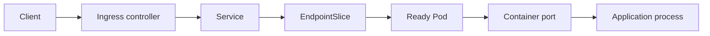
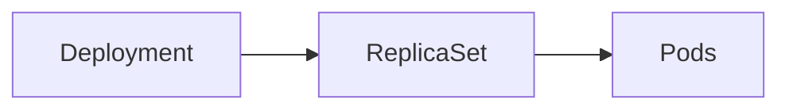

# Kubernetes Traffic Path And Management Path

These two paths answer different questions.

## Traffic Path



The traffic path answers:

```text
Can this request reach a healthy workload?
```

## Management Path



The management path answers:

```text
Why does this workload exist or not exist?
```

## Do Not Blur Them

```text
A Service does not send traffic to a Deployment.
A Service selects Pods.
A Deployment creates ReplicaSets.
ReplicaSets create Pods.
EndpointSlices show current network endpoints behind a Service.
Readiness affects whether Pods become usable endpoints.
```

## Boundary Evidence

| Boundary | Evidence |
| --- | --- |
| Ingress -> Service | Ingress rules, controller logs/events |
| Service -> EndpointSlice | Service selector, EndpointSlice addresses and ports |
| EndpointSlice -> Ready Pod | Pod labels, readiness condition |
| Pod -> container | container port, logs, probe status |
| Deployment -> ReplicaSet | rollout history, ReplicaSet ownership |
| ReplicaSet -> Pod | events, owner references, scheduling status |
